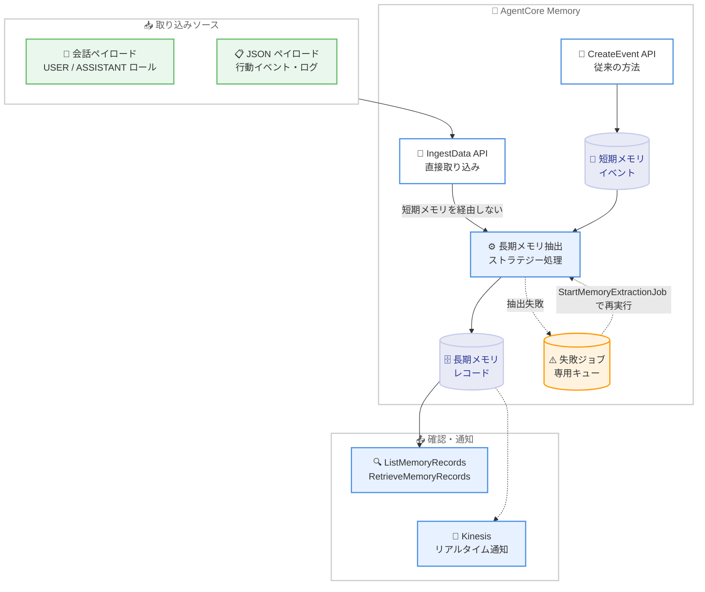

# Amazon Bedrock AgentCore Memory - 長期メモリへの直接取り込み (IngestData API)

**リリース日**: 2026 年 9 月 8 日
**サービス**: Amazon Bedrock AgentCore
**機能**: AgentCore Memory の長期メモリへの直接取り込み (Direct Ingestion to Long-Term Memory)

📊 [このアップデートのインフォグラフィックを見る](https://takech9203.github.io/aws-news-summary/20260908-agentcore-memory-direct-ingest.html)

## 概要

Amazon Bedrock AgentCore Memory に、新しい **IngestData API** が追加されました。この API により、コンテンツを短期メモリイベントとして永続化することなく、長期メモリ抽出パイプラインに直接送信できるようになります。抽出された長期メモリレコードのみが必要で、元のやり取りをそのまま保持する必要がないケースに適した機能です。

IngestData は 2 種類のペイロードをサポートします。1 つは USER / ASSISTANT などのロールを持つ会話メッセージ (Conversational)、もう 1 つは行動イベント、アクティビティログ、システムイベントなどの JSON 形式データ (JSON) です。取り込み後の抽出結果は、既存の長期メモリレコードと同様に ListMemoryRecords / RetrieveMemoryRecords / GetMemoryRecord で確認でき、Kinesis ストリームによるレコード作成のリアルタイム通知や、ListMemoryExtractionJobs / StartMemoryExtractionJob による失敗ジョブの再実行 (再ドライブ) にも対応しています。

AI エージェントを構築する開発者のうち、生の対話履歴を自前のシステムで既に保持している場合や、短期メモリのストレージオーバーヘッドを避けたい場合に特に有用なアップデートです。

**アップデート前の課題**

このアップデート以前は、長期メモリの抽出は短期メモリイベントを経由する必要がありました。

- 長期メモリレコードを生成するには、CreateEvent で必ず短期メモリイベントとして永続化する必要があった
- 抽出後に読み返すことのない生データでも短期メモリに保存され、不要なストレージオーバーヘッドが発生していた
- アプリケーション側で生のやり取りを既に保持している場合でも、AgentCore Memory 側に二重にデータを保存する必要があった
- 会話形式ではない行動イベントやシステムイベントを長期メモリ抽出に流し込む自然な手段がなかった

**アップデート後の改善**

今回のアップデートにより、短期メモリを経由しない直接取り込みが可能になりました。

- IngestData API により、短期メモリイベントを作成せずにコンテンツを長期メモリ抽出へ直接送信できるようになった
- 会話ペイロード (ロール付きテキスト) に加え、JSON ペイロード (行動イベント、アクティビティログ、システムイベント) を取り込めるようになった
- 抽出結果は ListMemoryRecords / RetrieveMemoryRecords で確認でき、Kinesis ストリームでレコード作成をリアルタイムに通知できる
- 抽出が失敗した場合は専用キューに移動され、ListMemoryExtractionJobs で確認し StartMemoryExtractionJob で再実行できる

## アーキテクチャ図



IngestData API は短期メモリイベントを作成せず、コンテンツを長期メモリ抽出ストラテジーへ直接送信します。従来の CreateEvent 経由のフローと異なり、生データが短期メモリに残らない点が特徴です。

## サービスアップデートの詳細

### 主要機能

1. **IngestData API による直接取り込み**
   - コンテンツを短期メモリイベントとして永続化せず、長期メモリ抽出に直接送信する
   - 送信されたコンテンツは GetEvent / ListEvents / ListSessions では取得できず、ブランチによる再編成もできない (短期イベントが存在しないため)
   - リクエスト成功はコンテンツが受理されたことを示し、処理完了後に長期メモリレコードが利用可能になる非同期 API
   - メモリに設定されたすべての長期メモリストラテジーにコンテンツがファンアウトされる (独自の処理ワークフローを持つセルフマネージドストラテジーを除く)

2. **2 種類のペイロードタイプ**
   - **Conversational**: ロール (USER / ASSISTANT など) とテキストコンテンツを持つ会話メッセージ
   - **JSON**: 行動イベント、アクティビティログ、システムイベントなどの JSON 形式データ
   - オプションでメタデータを付与し、抽出されるレコードを補強できる (長期メモリの構造化メタデータ)
   - 抽出レコードは namespace にスコープされ、同一の actorId / sessionId / namespace を共有するコンテンツは抽出時に関連コンテキストとして扱われる

3. **取り込み進捗の追跡と失敗時の再実行**
   - 取り込み後、メモリレコードは通常数秒から数分で出現 (コンテンツサイズとストラテジー設定に依存)
   - ListMemoryRecords / RetrieveMemoryRecords で抽出結果を確認できる
   - Kinesis ストリームを設定すると、メモリレコード作成時にリアルタイム通知を受信できる
   - 抽出失敗時はメモリリソースごとの専用キューにジョブが移動し、ListMemoryExtractionJobs で失敗ジョブを確認、根本原因対処後に StartMemoryExtractionJob で再実行 (再ドライブ) できる
   - FailedExtraction CloudWatch メトリクスによるプロアクティブな監視が可能

## 技術仕様

### IngestData API の仕様

| 項目 | 詳細 |
|------|------|
| API 名 | IngestData (データプレーン API、bedrock-agentcore) |
| 処理モデル | 非同期 (受理後にバックグラウンドで抽出処理) |
| ペイロードタイプ | Conversational (ロール + テキスト)、JSON (任意の JSON データ) |
| 主要パラメータ | memoryId、actorId、sessionId、contentTimestamp、source |
| 短期メモリへの保存 | なし (GetEvent / ListEvents / ListSessions で取得不可) |
| 抽出結果の確認 | ListMemoryRecords、RetrieveMemoryRecords、GetMemoryRecord |
| リアルタイム通知 | Kinesis ストリームによるメモリレコード作成通知 |
| 失敗時の対応 | ListMemoryExtractionJobs で確認、StartMemoryExtractionJob で再実行 |
| 監視 | FailedExtraction CloudWatch メトリクス |
| 対象外ストラテジー | セルフマネージドストラテジー (独自の処理ワークフローを持つため) |

### CreateEvent との使い分け

| 観点 | IngestData | CreateEvent |
|------|-----------|-------------|
| 短期メモリイベントの保存 | 保存しない | 保存する |
| 生のやり取りの読み返し | 不可 | GetEvent / ListEvents で可能 |
| ブランチによる再編成 | 不可 | 可能 |
| 長期メモリ抽出 | 実行される | 実行される |
| 適したケース | 抽出結果のみ必要、生データは自前で保持 | 対話履歴も AgentCore Memory で管理 |

### API 変更履歴

| 日付 | サービス | 変更内容 |
|------|----------|----------|
| 2026/08/28 | [Amazon Bedrock AgentCore](https://awsapichanges.com/archive/changes/b6cdac-bedrock-agentcore.html) | 1 new api method - AgentCore Memory now supports direct ingestion into long-term memory via IngestData API |

## 設定方法

### 前提条件

1. AgentCore Memory リソースが作成済みであること
2. メモリリソースに 1 つ以上の長期メモリストラテジー (ユーザー設定、セマンティックメモリなど) が設定されていること
3. bedrock-agentcore データプレーン API を呼び出す IAM 権限があること

### 手順

#### ステップ 1: コンテンツを直接取り込む

```python
import boto3
from datetime import datetime

# データプレーン操作用の Boto3 クライアントを初期化
data_client = boto3.client('bedrock-agentcore', region_name='us-west-2')

response = data_client.ingest_data(
    memoryId='mem-12345abcdef',
    actorId='customer-123',
    sessionId='session-456',
    contentTimestamp=datetime.now(),
    source={
        'inline': {
            'payload': [
                {
                    'conversational': {
                        'content': {'text': 'I prefer window seats on flights.'},
                        'role': 'USER'
                    }
                },
                {
                    'conversational': {
                        'content': {'text': "Noted — I'll remember your window seat preference."},
                        'role': 'ASSISTANT'
                    }
                },
                {
                    'json': {
                        'content': {
                            'customer_tier': 'gold',
                            'preferences': {'seat': 'window', 'meal': 'vegetarian'},
                            'loyalty_points': 48200
                        }
                    }
                }
            ]
        }
    }
)

# IngestData は非同期 API。レスポンスは取り込み先のセッションを返す
print(f"Ingested content into session: {response['sessionId']}")
```

会話ペイロード (USER / ASSISTANT ロール) と JSON ペイロードを 1 回の IngestData 呼び出しで同時に送信しています。短期メモリイベントは作成されず、コンテンツは長期メモリ抽出に直接渡されます。

#### ステップ 2: 抽出結果を確認する

```python
# 抽出された長期メモリレコードを一覧表示
records = data_client.list_memory_records(
    memoryId='mem-12345abcdef',
    namespace='/preferences/customer-123'
)
for record in records['memoryRecordSummaries']:
    print(record['content'])
```

取り込み後、数秒から数分でメモリレコードが出現します。ListMemoryRecords で対象 namespace のレコードを確認しています。セマンティック検索が必要な場合は RetrieveMemoryRecords を使用します。

#### ステップ 3: 失敗した抽出ジョブを確認し再実行する

```python
# 失敗した抽出ジョブを確認
failed_jobs = data_client.list_memory_extraction_jobs(
    memoryId='mem-12345abcdef'
)

# 根本原因に対処した後、ジョブを再実行
data_client.start_memory_extraction_job(
    memoryId='mem-12345abcdef',
    jobId=failed_jobs['jobs'][0]['jobId']
)
```

抽出が失敗すると、ジョブはメモリリソースごとの専用キューに移動します。ListMemoryExtractionJobs で失敗ジョブを確認し、原因に対処した後に StartMemoryExtractionJob で再ドライブしています。FailedExtraction CloudWatch メトリクスにアラームを設定すると、失敗をプロアクティブに検知できます。

## メリット

### ビジネス面

- **ストレージコストの最適化**: 読み返すことのない生データを短期メモリに保存する必要がなくなり、不要なストレージオーバーヘッドを削減できる
- **既存システムとの共存**: 対話履歴を自前のデータベースで既に管理している場合、AgentCore Memory には抽出された知見のみを持たせる構成が可能になり、二重管理を回避できる
- **パーソナライゼーションの強化**: 会話以外の行動データ (購買履歴、操作ログなど) からもユーザーの選好や傾向を長期メモリとして蓄積でき、エージェントの応答品質を向上できる

### 技術面

- **アーキテクチャの簡素化**: 長期メモリ抽出のためだけに短期イベントを作成・管理する必要がなくなり、データフローがシンプルになる
- **非会話データの取り込み**: JSON ペイロードにより、行動イベント、アクティビティログ、システムイベントなど任意の構造化データを抽出パイプラインに投入できる
- **運用性の向上**: Kinesis によるリアルタイム通知、FailedExtraction メトリクスによる監視、失敗ジョブの再ドライブ機構により、取り込みパイプラインを確実に運用できる

## デメリット・制約事項

### 制限事項

- IngestData で送信したコンテンツは短期メモリに保存されないため、GetEvent / ListEvents / ListSessions で取得できない
- 短期イベントが存在しないため、ブランチによる会話の再編成はできない
- セルフマネージドストラテジーにはファンアウトされない (独自の処理ワークフローを持つため)
- 非同期処理のため、レコードが利用可能になるまで数秒から数分のタイムラグがある (コンテンツサイズとストラテジー設定に依存)

### 考慮すべき点

- 生のやり取りを後から参照する可能性がある場合は、従来どおり CreateEvent を使用する必要がある
- 同一の actorId / sessionId / namespace を共有するコンテンツは抽出時に関連コンテキストとして扱われるため、ID 設計を事前に検討する必要がある
- 抽出失敗時の再ドライブ運用 (キューの監視と StartMemoryExtractionJob の実行) を運用フローに組み込むことが推奨される

## ユースケース

### ユースケース 1: 既存の会話ログ基盤からの知見抽出

**シナリオ**: カスタマーサポートシステムが対話履歴を自社のデータベースに保存しており、AgentCore Memory には顧客の選好や過去の問い合わせ傾向などの抽出済み知見のみを持たせたい。

**実装例**:
```python
# 自社 DB に保存済みの会話を IngestData で長期メモリ抽出のみに送信
data_client.ingest_data(
    memoryId='mem-support',
    actorId='customer-123',
    sessionId='ticket-789',
    contentTimestamp=conversation_timestamp,
    source={'inline': {'payload': conversation_messages}}
)
```

**効果**: 会話データの二重保存を回避しつつ、エージェントが顧客コンテキストを長期メモリとして活用できる。

### ユースケース 2: 行動イベントからのユーザー選好の学習

**シナリオ**: EC サイトで、ユーザーの購買履歴や閲覧行動などの非会話データからユーザーの選好を学習し、AI ショッピングアシスタントのパーソナライズに活用したい。

**実装例**:
```python
# 行動イベントを JSON ペイロードとして取り込み
data_client.ingest_data(
    memoryId='mem-shopping',
    actorId='user-456',
    sessionId='browse-session-001',
    contentTimestamp=datetime.now(),
    source={'inline': {'payload': [
        {'json': {'content': {
            'event_type': 'purchase',
            'category': 'outdoor',
            'items': ['tent', 'sleeping_bag'],
            'price_range': 'premium'
        }}}
    ]}}
)
```

**効果**: 会話が発生していない場面の行動データからも選好が長期メモリとして抽出され、アシスタントの推薦精度が向上する。

### ユースケース 3: バッチ取り込みパイプラインの信頼性確保

**シナリオ**: 大量の過去ログを長期メモリに一括投入するバッチ処理で、抽出失敗を検知して確実にリカバリしたい。

**実装例**:
```python
# CloudWatch で FailedExtraction メトリクスにアラームを設定し、
# 失敗検知後に再ドライブ
failed = data_client.list_memory_extraction_jobs(memoryId='mem-batch')
for job in failed['jobs']:
    data_client.start_memory_extraction_job(
        memoryId='mem-batch', jobId=job['jobId']
    )
```

**効果**: 抽出失敗が専用キューに隔離され、原因対処後の再実行により取り込み漏れのない信頼性の高いパイプラインを構築できる。

## 料金

IngestData API 自体の追加料金に関する個別の記載はなく、AgentCore Memory の既存の料金体系 (長期メモリの抽出・保存に基づく課金) が適用されます。短期メモリイベントを作成しないため、短期メモリ関連のストレージコストは発生しません。詳細は [Amazon Bedrock AgentCore の料金ページ](https://aws.amazon.com/bedrock/agentcore/pricing/) を参照してください。

## 利用可能リージョン

Amazon Bedrock AgentCore Memory が利用可能なすべての AWS リージョンで利用できます。

## 関連サービス・機能

- **Amazon Bedrock AgentCore Memory (短期メモリ)**: CreateEvent による従来の取り込み方法。生のやり取りをイベントとして保持し、後から参照・分岐できる
- **Amazon Kinesis**: メモリレコード作成時のリアルタイム通知先として設定可能 (Memory record streaming)
- **Amazon CloudWatch**: FailedExtraction メトリクスによる抽出失敗のプロアクティブな監視
- **AgentCore Observability**: アプリケーションログとトレースを有効化し、処理ライフサイクルの詳細を可視化

## 参考リンク

- 📊 [インフォグラフィック](https://takech9203.github.io/aws-news-summary/20260908-agentcore-memory-direct-ingest.html)
- [公式発表 (What's New)](https://aws.amazon.com/about-aws/whats-new/2026/09/agentcore-memory-direct-ingest)
- [ドキュメント: Ingest content into long-term memory](https://docs.aws.amazon.com/bedrock-agentcore/latest/devguide/long-term-ingest-data.html)
- [ドキュメント: Add memory to your Amazon Bedrock AgentCore agent](https://docs.aws.amazon.com/bedrock-agentcore/latest/devguide/memory.html)
- [料金ページ](https://aws.amazon.com/bedrock/agentcore/pricing/)

## まとめ

IngestData API の追加により、AgentCore Memory の長期メモリ抽出が短期メモリイベントの作成から切り離され、抽出結果のみを必要とするアーキテクチャや非会話データの活用が容易になりました。対話履歴を自前で管理しているシステムや、行動イベントからのパーソナライズを検討している場合は、CreateEvent との使い分けを整理した上で IngestData の採用を検討することを推奨します。あわせて、FailedExtraction メトリクスの監視と失敗ジョブの再ドライブ運用をパイプライン設計に組み込むことが重要です。
