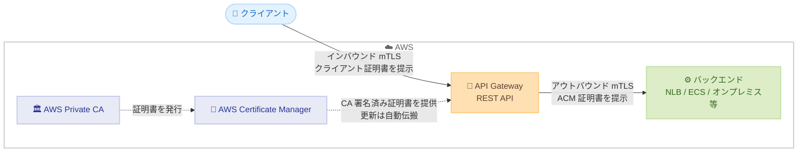

# Amazon API Gateway - バックエンド統合向け相互 TLS (mTLS) サポート

**リリース日**: 2026 年 9 月 8 日
**サービス**: Amazon API Gateway
**機能**: バックエンド統合向け相互 TLS (mTLS) サポート

📊 [このアップデートのインフォグラフィックを見る](https://takech9203.github.io/aws-news-summary/20260908-amazon-api-gateway-mutual-tls-backend.html)

## 概要

Amazon API Gateway の REST API が、バックエンド統合エンドポイントとの TLS ハンドシェイク時に AWS Certificate Manager (ACM) の証明書を提示できるようになりました。これにより、API Gateway からバックエンドへの接続 (API-to-backend) で相互 TLS (mTLS) 認証を実現できます。バックエンドは提示された証明書を検証することで、接続元が正規の API Gateway であることを確認できます。

証明書は、既存の PKI (公開鍵基盤) から ACM にインポートするか、AWS Private Certificate Authority で発行して ACM で管理するかの 2 つの方法で用意できます。証明書の更新や再インポートを行うと、API Gateway が自動的に変更を反映するため、再デプロイやダウンタイムは発生しません。

既存のインバウンド mTLS (クライアントから API への接続) と組み合わせることで、クライアントから API、API からバックエンドまでの両区間で相互認証を適用できます。金融、ヘルスケアなどの規制業界や、ゼロトラストアーキテクチャを採用する環境で特に有用なアップデートです。

**アップデート前の課題**

- 以前は、API Gateway がバックエンドに提示できるのは API Gateway 自身が生成した自己署名証明書のみだった
- 特定の企業 CA やパートナー CA による署名を必須とするバックエンドでは、自己署名証明書が拒否されるため mTLS を構成できなかった
- 社内 PKI ポリシーへの準拠や、レガシー API ゲートウェイからの移行時に、証明書要件を満たせないケースがあった

**アップデート後の改善**

- 任意の CA が署名した証明書を ACM 経由で API Gateway に設定し、バックエンドへの TLS ハンドシェイク時に提示できるようになった
- AWS Private CA で発行した証明書、または外部 CA の証明書を ACM にインポートして利用できるようになった
- 証明書の更新・再インポート時に API Gateway が自動的に変更を伝搬するため、再デプロイやダウンタイムなしで証明書ローテーションが可能になった
- インバウンド mTLS と組み合わせて、クライアントからバックエンドまでのエンドツーエンドで相互認証を構成できるようになった

## アーキテクチャ図



API Gateway は ACM に登録された CA 署名済み証明書をバックエンドへの TLS ハンドシェイク時に提示します。インバウンド mTLS と組み合わせることで、両区間で相互認証を実現できます。

## サービスアップデートの詳細

### 主要機能

1. **ACM 証明書によるアウトバウンド mTLS**
   - REST API のステージに ACM 証明書を設定すると、API Gateway がバックエンドとの TLS ハンドシェイク時にその証明書をクライアント証明書として提示する
   - バックエンド側は提示された証明書を検証し、接続元が正規の API Gateway であることを確認できる
   - 従来の自己署名生成証明書に加えて、任意の CA が署名した証明書を利用可能

2. **柔軟な証明書の調達方法**
   - 既存の PKI で発行した証明書を ACM にインポートして利用
   - AWS Private Certificate Authority で証明書を発行し、ACM で一元管理
   - 企業 CA やパートナー CA の署名要件があるバックエンドにも対応可能

3. **証明書ライフサイクルの自動管理**
   - ACM 上で証明書を更新または再インポートすると、API Gateway が自動的に変更を検知して伝搬
   - ステージの再デプロイやダウンタイムは不要
   - 伝搬は結果整合性であり、ローテーション中はバックエンドが新旧いずれかの証明書を受け取る可能性がある
   - ACM は Amazon EventBridge 経由で証明書の有効期限通知を発行できるため、アラート設定が可能

4. **エンドツーエンドの相互認証**
   - 既存のインバウンド mTLS (カスタムドメイン名でのクライアント認証) と組み合わせ可能
   - クライアントから API、API からバックエンドの両区間で相互認証を適用し、ゼロトラスト要件に対応

## 技術仕様

### 対応範囲と設定項目

| 項目 | 詳細 |
|------|------|
| 対象 API タイプ | REST API |
| 設定単位 | ステージ単位 (ClientCertificateId に ACM 証明書を関連付け) |
| 証明書ソース | ACM インポート証明書、AWS Private CA 発行証明書 |
| 証明書更新 | ACM での更新・再インポート時に自動伝搬 (再デプロイ不要) |
| 設定方法 | API Gateway コンソール、AWS CLI、AWS CloudFormation |
| バックエンド側要件 | クライアント証明書の検証設定 (例: NGINX の ssl_verify_client) |

### バックエンド側の検証設定例 (NGINX)

```nginx
server {
    listen 443 ssl;

    # サーバー証明書
    ssl_certificate     /etc/nginx/certs/server.crt;
    ssl_certificate_key /etc/nginx/certs/server.key;

    # クライアント証明書 (API Gateway が提示する証明書) の検証
    ssl_verify_client on;
    ssl_verify_depth 2;
    ssl_client_certificate /etc/nginx/certs/ca-bundle.crt;

    ssl_protocols TLSv1.2;
}
```

`ssl_verify_client on` によりクライアント証明書の提示を必須とし、`ssl_client_certificate` で指定した CA バンドル (ルート CA + 中間 CA) で API Gateway が提示する証明書を検証します。

## 設定方法

### 前提条件

1. API Gateway REST API がデプロイ済みであること
2. CA 署名済みのクライアント証明書が ACM に存在すること (インポートまたは AWS Private CA で発行)
3. バックエンドがクライアント証明書を検証するように構成されていること (対象 CA バンドルの配置など)

### 手順

#### ステップ1: 証明書を ACM に用意する

```bash
# 既存 PKI の証明書を ACM にインポートする場合
aws acm import-certificate \
  --certificate fileb://client-cert.pem \
  --private-key fileb://client-key.pem \
  --certificate-chain fileb://ca-chain.pem \
  --region ap-northeast-1
```

既存の PKI で発行したクライアント証明書、秘密鍵、証明書チェーンを ACM にインポートします。AWS Private CA を利用する場合は、`aws acm request-certificate` で Private CA の ARN を指定して発行します。

#### ステップ2: REST API のステージに ACM 証明書を関連付ける

```bash
# ステージのクライアント証明書設定を ACM 証明書に更新
aws apigateway update-stage \
  --rest-api-id abc123 \
  --stage-name prod \
  --patch-operations op=replace,path=/clientCertificateId,value=<ACM 証明書の識別子>
```

REST API のステージ設定を更新し、API Gateway がバックエンドとの TLS ハンドシェイク時に提示する証明書として ACM 証明書を指定します。コンソールの場合は、ステージの詳細画面でクライアント証明書として ACM 証明書を選択します。

#### ステップ3: バックエンド側で検証を有効化して動作確認する

```bash
# API を呼び出して mTLS ハンドシェイクの成功を確認
curl -i https://abc123.execute-api.ap-northeast-1.amazonaws.com/prod/resource
```

バックエンド側でクライアント証明書の検証を有効化した状態で API を呼び出し、HTTP 200 が返ることを確認します。証明書が提示されない、または検証に失敗する場合、バックエンドは接続を拒否します (例: NGINX では HTTP 400 "No required SSL certificate was sent")。

## メリット

### ビジネス面

- **規制要件への対応**: 金融、ヘルスケアなどの規制業界で求められる通信経路全体の相互認証を、マネージドな仕組みで実現できる
- **移行の促進**: 企業 CA の証明書要件が理由で API Gateway に移行できなかったレガシーゲートウェイからの移行が容易になる
- **運用コストの削減**: 証明書更新時の再デプロイ作業やダウンタイム調整が不要になり、運用負荷が軽減される

### 技術面

- **ゼロトラストの強化**: クライアントから API、API からバックエンドまでの全区間で相互認証を適用し、なりすまし接続を排除できる
- **証明書管理の一元化**: ACM と AWS Private CA により証明書の発行・更新・監視を AWS 上で一元管理できる
- **自動ローテーション**: ACM での証明書更新が API Gateway に自動伝搬されるため、証明書ローテーションを無停止で実施できる

## デメリット・制約事項

### 制限事項

- 対象は REST API のみ (HTTP API は対象外)
- サードパーティ CA の証明書は、事前に ACM へのインポートが必要
- 証明書の伝搬は結果整合性であり、ローテーション中はバックエンドが新旧どちらの証明書を受け取るか保証されない

### 考慮すべき点

- バックエンド側でクライアント証明書を検証する構成 (CA バンドルの配置、検証設定) は利用者側で実装する必要がある
- 証明書ローテーション時は、新旧両方の証明書を検証できるようバックエンド側の CA バンドルを事前に整備しておく必要がある
- ACM の有効期限通知 (EventBridge 経由) を活用した監視体制の整備が推奨される

## ユースケース

### ユースケース1: 金融機関におけるパートナー API 連携

**シナリオ**: 金融機関がパートナー企業のバックエンド API と連携する際、パートナー側のセキュリティポリシーにより、特定の CA が署名したクライアント証明書の提示が必須となっている。

**実装例**:
```
1. パートナー指定の CA からクライアント証明書を取得
2. 証明書と秘密鍵を ACM にインポート
3. REST API のステージに ACM 証明書を関連付け
4. パートナー側バックエンドが証明書を検証して接続を許可
```

**効果**: 従来は自己署名証明書しか提示できず実現できなかったパートナー要件を満たし、API Gateway 経由でのセキュアな連携が可能になる。

### ユースケース2: ゼロトラストアーキテクチャでのエンドツーエンド相互認証

**シナリオ**: ヘルスケア企業が、クライアントアプリからバックエンドサービスまでの全通信経路で相互認証を必須とするゼロトラストポリシーを導入している。

**実装例**:
```
1. カスタムドメイン名でインバウンド mTLS を有効化 (クライアント証明書を検証)
2. AWS Private CA でアウトバウンド用クライアント証明書を発行
3. ステージに ACM 証明書を設定してバックエンドへの mTLS を構成
4. バックエンド (NLB + ECS) で Private CA のバンドルを用いて検証
```

**効果**: クライアントから API、API からバックエンドの両区間で相互認証が適用され、通信経路全体でなりすましを防止できる。

### ユースケース3: レガシー API ゲートウェイからの移行

**シナリオ**: オンプレミスの API ゲートウェイを利用している企業が API Gateway への移行を検討しているが、既存バックエンドが社内 PKI の証明書による mTLS を必須としており、移行の障壁となっている。

**実装例**:
```
1. 社内 PKI で発行済みのクライアント証明書を ACM にインポート
2. REST API のステージに ACM 証明書を関連付け
3. バックエンド側の検証設定は変更せずにそのまま利用
4. 段階的にトラフィックを API Gateway に切り替え
```

**効果**: バックエンド側の証明書検証設定を変更することなく API Gateway へ移行でき、移行期間とリスクを削減できる。

## 料金

今回のアップデートに関する追加料金の記載は公式発表にありません。API Gateway の標準料金が適用されます。なお、AWS Private CA を利用する場合は Private CA の料金 (CA の月額料金と証明書発行料金) が別途発生します。ACM へのインポート証明書自体には料金はかかりません。

## 利用可能リージョン

API Gateway REST API が提供されているすべての AWS 商用リージョンおよび AWS GovCloud (US) リージョンで利用可能です (東京・大阪リージョンを含む)。

## 関連サービス・機能

- **AWS Certificate Manager (ACM)**: バックエンドに提示するクライアント証明書のインポート・管理・更新を担う
- **AWS Private Certificate Authority**: プライベート CA としてクライアント証明書を発行し、ACM と連携して管理できる
- **API Gateway インバウンド mTLS**: カスタムドメイン名でクライアントからの接続に相互認証を適用する既存機能。今回の機能と組み合わせてエンドツーエンドの相互認証を実現
- **Amazon EventBridge**: ACM の証明書有効期限通知を受け取り、監視・アラートに活用できる

## 参考リンク

- 📊 [インフォグラフィック](https://takech9203.github.io/aws-news-summary/20260908-amazon-api-gateway-mutual-tls-backend.html)
- [公式発表 (What's New)](https://aws.amazon.com/about-aws/whats-new/2026/09/amazon-api-gateway-mutual-tls-backend/)
- [AWS Blog: Bring your own client certificate for backend mTLS in Amazon API Gateway](https://aws.amazon.com/blogs/compute/bring-your-own-client-certificate-for-backend-mtls-in-amazon-api-gateway/)
- [ドキュメント: REST API backend authentication](https://docs.aws.amazon.com/apigateway/latest/developerguide/rest-api-backend-authentication.html)
- [料金ページ: Amazon API Gateway](https://aws.amazon.com/api-gateway/pricing/)

## まとめ

API Gateway の REST API が ACM の CA 署名済み証明書をバックエンドに提示できるようになり、API からバックエンドへの区間でも相互 TLS 認証を構成できるようになりました。証明書更新の自動伝搬により、再デプロイやダウンタイムなしで証明書ローテーションが可能です。規制業界やゼロトラスト環境で API Gateway を利用している場合、またはバックエンドの証明書要件が移行の障壁となっていた場合は、本機能の適用を検討することを推奨します。
