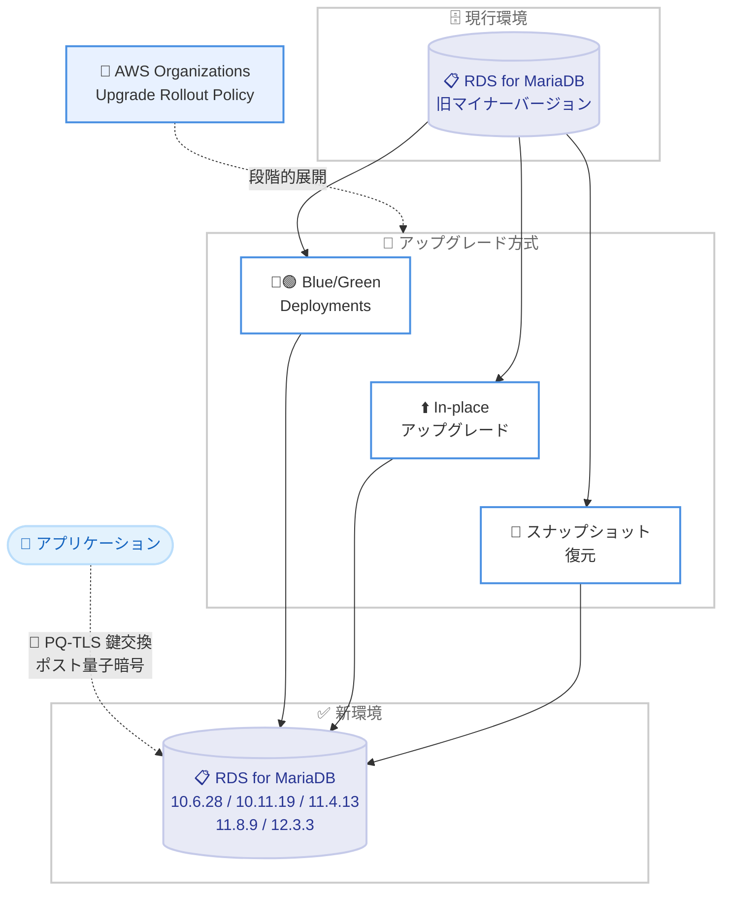

# Amazon RDS for MariaDB - コミュニティマイナーバージョン 10.6.28 / 10.11.19 / 11.4.13 / 11.8.9 / 12.3.3 のサポート

**リリース日**: 2026 年 9 月 8 日
**サービス**: Amazon RDS for MariaDB
**機能**: コミュニティ MariaDB マイナーバージョン (10.6.28、10.11.19、11.4.13、11.8.9、12.3.3) のサポート

📊 [このアップデートのインフォグラフィックを見る](https://takech9203.github.io/aws-news-summary/20260908-amazon-rds-mariadb-community-versions.html)

## 概要

Amazon RDS for MariaDB が、MariaDB コミュニティの最新マイナーバージョンである 10.6.28、10.11.19、11.4.13、11.8.9、12.3.3 のサポートを開始しました。これらのバージョンには、過去バージョンに存在した CVE (共通脆弱性識別子) の修正、コミュニティによるバグ修正、性能改善、新機能が含まれており、AWS はデータベースの安定性・可用性・セキュリティの観点からアップグレードを推奨しています。

今回のリリースにおける注目点は、ポスト量子 TLS (PQ-TLS) 鍵交換のサポートが導入されたことです。これにより、転送中データの暗号化において、将来の量子コンピュータによる攻撃 ("Harvest Now, Decrypt Later" 攻撃など) への耐性を持つポスト量子暗号のオプションを利用できるようになります。

アップグレードは、Amazon RDS Blue/Green Deployments、in-place アップグレード、スナップショットからの復元という 3 つの方法で実行できます。また、多数のインスタンスを運用している場合は、自動マイナーバージョンアップグレードの有効化や、AWS Organizations の Upgrade Rollout Policy を利用した段階的なアップグレード展開も可能です。

**アップデート前の課題**

これまでの RDS for MariaDB バージョンには、以下の課題や制限がありました。

- 以前のマイナーバージョンには、コミュニティで修正済みの CVE やバグが残存していた
- 転送中データの暗号化は従来の TLS 鍵交換アルゴリズムに依存しており、ポスト量子暗号のオプションがなかった
- コミュニティ版の最新の性能改善や新機能を RDS 上で利用できなかった

**アップデート後の改善**

今回のアップデートにより、以下が可能になりました。

- 最新マイナーバージョンへのアップグレードにより CVE 修正とバグ修正を適用できる
- PQ-TLS 鍵交換により、転送中データをポスト量子暗号で保護するオプションを利用できる
- コミュニティ版の性能改善と新機能を RDS のマネージド環境で利用できる

## アーキテクチャ図



旧バージョンの RDS for MariaDB インスタンスから、3 つのアップグレード方式のいずれかで最新マイナーバージョンへ移行するフローを示しています。移行後はアプリケーションとの接続に PQ-TLS 鍵交換によるポスト量子暗号オプションを利用できます。

## サービスアップデートの詳細

### 主要機能

1. **最新コミュニティマイナーバージョンのサポート**
   - MariaDB 10.6.28、10.11.19、11.4.13、11.8.9、12.3.3 の 5 バージョンをサポート
   - いずれも MariaDB コミュニティの各メジャー系列における最新マイナーリリース
   - コミュニティによるバグ修正、性能改善、新機能を含む

2. **ポスト量子 TLS (PQ-TLS) 鍵交換のサポート**
   - 転送中データの暗号化にポスト量子暗号のオプションを提供
   - 量子コンピュータの実用化後も安全性を維持できる鍵交換アルゴリズムを利用可能
   - 現時点で通信を記録し将来解読する攻撃への事前対策として有効

3. **CVE 修正によるセキュリティ強化**
   - 過去バージョンの MariaDB に存在した CVE への修正を含む
   - AWS はデータベースの安定性・可用性・セキュリティ維持のためアップグレードを推奨

4. **柔軟なアップグレード手段**
   - Amazon RDS Blue/Green Deployments によるダウンタイムを最小化した安全なアップグレード
   - In-place アップグレードによるシンプルな移行
   - スナップショットからの復元による新バージョン環境の作成
   - 自動マイナーバージョンアップグレードと AWS Organizations の Upgrade Rollout Policy によるフリート全体への段階的展開

## 技術仕様

### サポートバージョン

| メジャー系列 | 新規サポートバージョン |
|------|------|
| MariaDB 10.6 | 10.6.28 |
| MariaDB 10.11 | 10.11.19 |
| MariaDB 11.4 | 11.4.13 |
| MariaDB 11.8 | 11.8.9 |
| MariaDB 12.3 | 12.3.3 |

### アップグレード方式の比較

| 方式 | 特徴 | 適したケース |
|------|------|------|
| Blue/Green Deployments | 本番環境を複製した Green 環境で検証後に切り替え。切り替えは通常 1 分未満 | 本番環境で安全にアップグレードしたい場合 |
| In-place アップグレード | 既存インスタンスを直接アップグレード。ダウンタイムが発生 | 開発環境やメンテナンスウィンドウを確保できる場合 |
| スナップショット復元 | スナップショットから新バージョンのインスタンスを作成 | 検証環境の作成や移行リハーサルを行う場合 |
| 自動マイナーバージョンアップグレード | メンテナンスウィンドウ内で自動的に適用 | 多数のインスタンスを運用しパッチ適用を自動化したい場合 |

## 設定方法

### 前提条件

1. Amazon RDS for MariaDB インスタンスを運用していること
2. アップグレード操作に必要な IAM 権限 (`rds:ModifyDBInstance`、`rds:CreateBlueGreenDeployment` など) を持っていること
3. アップグレード前にアプリケーションの互換性を検証環境で確認しておくこと

### 手順

#### ステップ 1: 利用可能なアップグレードターゲットの確認

```bash
aws rds describe-db-engine-versions \
    --engine mariadb \
    --engine-version 11.4 \
    --query 'DBEngineVersions[].ValidUpgradeTarget[].EngineVersion'
```

現在利用中のエンジンバージョンからアップグレード可能なターゲットバージョンの一覧を表示します。11.4.13 などの新バージョンが含まれていることを確認します。

#### ステップ 2: Blue/Green Deployment の作成

```bash
aws rds create-blue-green-deployment \
    --blue-green-deployment-name mariadb-upgrade-11413 \
    --source arn:aws:rds:ap-northeast-1:123456789012:db:my-mariadb-instance \
    --target-engine-version 11.4.13
```

本番環境 (Blue) のコピーとして、新バージョン 11.4.13 の Green 環境を作成します。Green 環境は Blue 環境と論理レプリケーションで同期され、本番トラフィックに影響を与えずに検証できます。

#### ステップ 3: 切り替えの実行

```bash
aws rds switchover-blue-green-deployment \
    --blue-green-deployment-identifier bgd-xxxxxxxxxxxxxxxx \
    --switchover-timeout 300
```

Green 環境の検証が完了したら、切り替えを実行します。切り替えは通常 1 分未満で完了し、エンドポイント名は変更されないためアプリケーション側の接続設定変更は不要です。

#### ステップ 4 (代替): In-place アップグレードの実行

```bash
aws rds modify-db-instance \
    --db-instance-identifier my-mariadb-instance \
    --engine-version 11.4.13 \
    --apply-immediately
```

既存インスタンスを直接 11.4.13 にアップグレードします。`--apply-immediately` を指定すると即時適用され、その間ダウンタイムが発生します。メンテナンスウィンドウでの適用を希望する場合はこのオプションを省略します。

## メリット

### ビジネス面

- **セキュリティリスクの低減**: CVE 修正の適用により、既知の脆弱性を突いた攻撃のリスクを低減し、コンプライアンス要件への対応を維持できる
- **将来の暗号解読リスクへの備え**: PQ-TLS により、量子コンピュータ実用化後の暗号解読リスクに事前に対処でき、長期的なデータ保護戦略を強化できる
- **運用コストの削減**: 自動マイナーバージョンアップグレードと Upgrade Rollout Policy により、大規模フリートのパッチ適用作業を自動化・効率化できる

### 技術面

- **性能改善**: コミュニティによる最新の性能改善を RDS のマネージド環境でそのまま利用できる
- **最小ダウンタイムでの移行**: Blue/Green Deployments により、本番環境への影響を最小限に抑えたアップグレードが可能
- **段階的な展開制御**: AWS Organizations の Upgrade Rollout Policy により、組織全体のインスタンスへ段階的にアップグレードを展開できる

## デメリット・制約事項

### 制限事項

- In-place アップグレードではダウンタイムが発生する
- Blue/Green Deployments は Green 環境の稼働中、追加のインスタンス料金が発生する
- マイナーバージョンアップグレードであっても、アプリケーションの動作検証は別途必要

### 考慮すべき点

- PQ-TLS 鍵交換を利用するには、クライアント側もポスト量子暗号アルゴリズムに対応している必要がある
- 自動マイナーバージョンアップグレードを有効にしている場合、メンテナンスウィンドウ内で自動適用されるため、適用タイミングを把握しておく必要がある
- 各メジャー系列にはコミュニティのサポート期限 (EOL) があるため、系列自体の計画的なメジャーアップグレードも並行して検討する必要がある

## ユースケース

### ユースケース 1: 本番データベースのセキュリティパッチ適用

**シナリオ**: 金融系サービスの本番 MariaDB 11.4 系インスタンスに対し、CVE 修正を最小ダウンタイムで適用したい。

**実装例**:
```bash
# Blue/Green Deployment で 11.4.13 の Green 環境を作成し、検証後に切り替え
aws rds create-blue-green-deployment \
    --blue-green-deployment-name security-patch-11413 \
    --source arn:aws:rds:ap-northeast-1:123456789012:db:prod-mariadb \
    --target-engine-version 11.4.13
```

**効果**: 本番トラフィックへの影響を最小限に抑えながら、既知の脆弱性への修正を迅速に適用できる。

### ユースケース 2: ポスト量子暗号への移行準備

**シナリオ**: 長期保存が必要な機密データを扱うシステムで、"Harvest Now, Decrypt Later" 攻撃への対策として転送中データの暗号化を強化したい。

**実装例**:
```bash
# 最新バージョンへアップグレード後、PQ-TLS 対応クライアントから接続
mariadb --host prod-mariadb.xxxxxxxx.ap-northeast-1.rds.amazonaws.com \
    --ssl --ssl-verify-server-cert -u admin -p
```

**効果**: PQ-TLS 鍵交換により、将来の量子コンピュータによる暗号解読リスクに備えたデータ保護を実現できる。

### ユースケース 3: 大規模フリートへの段階的アップグレード展開

**シナリオ**: 組織内の複数アカウントに数百台の RDS for MariaDB インスタンスがあり、統制の取れた方法で新バージョンを展開したい。

**実装例**:
```bash
# 自動マイナーバージョンアップグレードを有効化
aws rds modify-db-instance \
    --db-instance-identifier my-mariadb-instance \
    --auto-minor-version-upgrade \
    --no-apply-immediately
```

AWS Organizations の Upgrade Rollout Policy と組み合わせることで、開発環境から本番環境へ段階的にアップグレードを展開できます。

**効果**: 手動作業を削減しながら、組織全体で一貫したバージョン管理とリスク管理を実現できる。

## 料金

新しいマイナーバージョンの利用自体に追加料金はなく、通常の Amazon RDS for MariaDB の料金体系が適用されます。インスタンスタイプ、ストレージ、リージョンに基づく従量課金です。

Blue/Green Deployments を利用する場合、Green 環境の稼働中はそのインスタンスとストレージに対する料金が追加で発生する点に注意してください。

詳細は [Amazon RDS for MariaDB 料金ページ](https://aws.amazon.com/rds/mariadb/pricing/) を参照してください。

## 利用可能リージョン

リージョンごとの利用可否は Amazon RDS for MariaDB 料金ページで確認できます。

## 関連サービス・機能

- **Amazon RDS Blue/Green Deployments**: 本番環境を複製した検証環境を作成し、最小ダウンタイムでアップグレードを実行する機能
- **AWS Organizations Upgrade Rollout Policy**: 組織内の複数アカウントにまたがるデータベースのアップグレードを段階的に展開するポリシー機能
- **AWS Database Migration Service (DMS)**: RDS 外の MariaDB データベースから RDS for MariaDB への移行を支援するサービス

## 参考リンク

- 📊 [インフォグラフィック](https://takech9203.github.io/aws-news-summary/20260908-amazon-rds-mariadb-community-versions.html)
- [公式発表 (What's New)](https://aws.amazon.com/about-aws/whats-new/2026/09/amazon-rds-mariadb-community-versions/)
- [Amazon RDS for MariaDB リリースノート](https://docs.aws.amazon.com/AmazonRDS/latest/MariaDBReleaseNotes/Welcome.html)
- [MariaDB DB エンジンのアップグレード (ユーザーガイド)](https://docs.aws.amazon.com/AmazonRDS/latest/UserGuide/USER_UpgradeDBInstance.MariaDB.html)
- [Blue/Green Deployments の使用](https://docs.aws.amazon.com/AmazonRDS/latest/UserGuide/blue-green-deployments.html)
- [Amazon RDS for MariaDB 料金ページ](https://aws.amazon.com/rds/mariadb/pricing/)

## まとめ

Amazon RDS for MariaDB がコミュニティ最新マイナーバージョン 5 種のサポートを開始し、CVE 修正に加えてポスト量子 TLS 鍵交換という将来を見据えたセキュリティ強化が導入されました。既知の脆弱性への対処とポスト量子暗号への備えの両面で価値があるため、Blue/Green Deployments を活用した早期のアップグレード計画を推奨します。大規模環境では自動マイナーバージョンアップグレードと Upgrade Rollout Policy の併用を検討してください。
