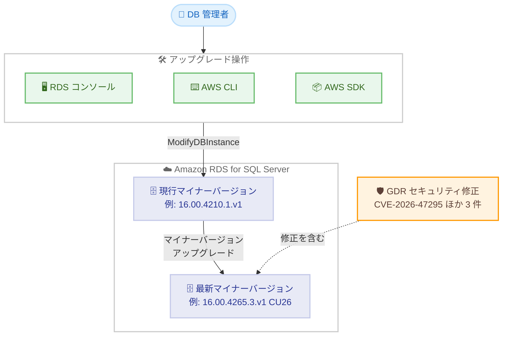

# Amazon RDS for SQL Server - 最新の CU および GDR アップデートのサポート

**リリース日**: 2026 年 9 月 8 日
**サービス**: Amazon RDS for SQL Server
**機能**: Microsoft SQL Server の最新 Cumulative Update (CU) および General Distribution Release (GDR) のサポート

📊 [このアップデートのインフォグラフィックを見る](https://takech9203.github.io/aws-news-summary/20260908-amazon-rds-supports-latest-cu-gdr-microsoft-sql-server.html)

## 概要

Amazon RDS for SQL Server が、Microsoft SQL Server の最新の Cumulative Update (CU) および General Distribution Release (GDR) をサポートしました。今回のアップデートにより、SQL Server 2016 から SQL Server 2025 までの 5 つのメジャーバージョンに対して、最新のマイナーエンジンバージョンが利用可能になります。

特に重要な点として、GDR アップデートには CVE-2026-47295、CVE-2026-47296、CVE-2026-54118、CVE-2026-55002 の 4 つの脆弱性への修正が含まれています。SQL Server をマネージドサービスとして利用しているユーザーは、これらのセキュリティ修正を迅速に適用することが推奨されます。

対象ユーザーは、Amazon RDS for SQL Server を利用しているすべてのユーザーです。既存の DB インスタンスは、Amazon RDS マネジメントコンソール、AWS SDK、または AWS CLI を使用して新しいバージョンにアップグレードできます。

**アップデート前の課題**

このアップデート以前は、以下の課題がありました。

- Microsoft がリリースした最新の CU / GDR に含まれる不具合修正やセキュリティ修正を RDS for SQL Server で適用できなかった
- CVE-2026-47295、CVE-2026-47296、CVE-2026-54118、CVE-2026-55002 の脆弱性が未修正の状態だった
- オンプレミスの SQL Server と比較して、パッチレベルに差分が生じていた

**アップデート後の改善**

今回のアップデートにより、以下が可能になりました。

- SQL Server 2016 / 2017 / 2019 / 2022 / 2025 の各バージョンで最新の CU / GDR を含むマイナーバージョンへアップグレードできるようになった
- GDR に含まれる 4 つの CVE への修正を適用し、セキュリティリスクを低減できるようになった
- コンソール、AWS SDK、AWS CLI のいずれからも簡単にアップグレードを実行できる

## アーキテクチャ図



DB 管理者がコンソール、AWS CLI、AWS SDK のいずれかを使用して既存の DB インスタンスを最新のマイナーバージョンへアップグレードする流れを示しています。最新バージョンには GDR によるセキュリティ修正が含まれます。

## サービスアップデートの詳細

### 主要機能

1. **最新 CU / GDR を含むマイナーエンジンバージョンの提供**
   - SQL Server 2016 から SQL Server 2025 までの 5 バージョンが対象
   - Microsoft の最新の不具合修正と機能改善が含まれる
   - 各修正の詳細は Microsoft の KB ドキュメントで確認可能

2. **セキュリティ脆弱性への対応**
   - GDR アップデートは CVE-2026-47295、CVE-2026-47296、CVE-2026-54118、CVE-2026-55002 に対処
   - セキュリティコンプライアンス要件への対応に有効

3. **複数のアップグレード手段**
   - Amazon RDS マネジメントコンソールからの GUI 操作
   - AWS CLI の `modify-db-instance` コマンド
   - AWS SDK によるプログラマティックな操作

## 技術仕様

### 対象バージョンとエンジンバージョン

| SQL Server バージョン | アップデート | KB 番号 | RDS エンジンバージョン |
|------|------|------|------|
| SQL Server 2016 | SP3 + GDR | KB5102340 | 13.00.6500.1.v1 |
| SQL Server 2017 | CU31 + GDR | KB5102337 | 14.00.3540.1.v1 |
| SQL Server 2019 | CU32 + GDR | KB5102335 | 15.09.4480.2.v1 |
| SQL Server 2022 | CU26 | KB5093420 | 16.00.4265.3.v1 |
| SQL Server 2025 | CU7 | KB5096981 | 17.00.4065.4.v1 |

### 対処される脆弱性

| CVE | 内容 |
|------|------|
| CVE-2026-47295 | GDR アップデートで修正される SQL Server の脆弱性 |
| CVE-2026-47296 | GDR アップデートで修正される SQL Server の脆弱性 |
| CVE-2026-54118 | GDR アップデートで修正される SQL Server の脆弱性 |
| CVE-2026-55002 | GDR アップデートで修正される SQL Server の脆弱性 |

各脆弱性の詳細は Microsoft の KB ドキュメントおよび MSRC のセキュリティ情報を参照してください。

## 設定方法

### 前提条件

1. Amazon RDS for SQL Server の DB インスタンスが稼働していること
2. アップグレード操作を実行できる IAM 権限 (`rds:ModifyDBInstance` など) があること
3. アップグレード前にスナップショットの取得を推奨

### 手順

#### ステップ 1: 利用可能なエンジンバージョンの確認

```bash
aws rds describe-db-engine-versions \
    --engine sqlserver-se \
    --query "DBEngineVersions[].EngineVersion"
```

指定したエディション (この例では Standard Edition) で利用可能なエンジンバージョンの一覧を表示します。エディションに応じて `sqlserver-ee`、`sqlserver-se`、`sqlserver-ex`、`sqlserver-web` を指定します。

#### ステップ 2: 現在のバージョンからのアップグレード先の確認

```bash
aws rds describe-db-engine-versions \
    --engine sqlserver-se \
    --engine-version 16.00.4210.1.v1 \
    --query "DBEngineVersions[].ValidUpgradeTarget[].EngineVersion"
```

現在使用中のエンジンバージョンから直接アップグレード可能なバージョンの一覧を表示します。

#### ステップ 3: DB インスタンスのアップグレード

```bash
aws rds modify-db-instance \
    --db-instance-identifier mydbinstance \
    --engine-version 16.00.4265.3.v1 \
    --no-apply-immediately
```

DB インスタンスのエンジンバージョンを最新のマイナーバージョンに変更します。`--no-apply-immediately` を指定すると次のメンテナンスウィンドウで適用され、`--apply-immediately` を指定すると即時に適用されます。アップグレード中はダウンタイムが発生するため、適用タイミングは業務影響を考慮して選択してください。

## メリット

### ビジネス面

- **セキュリティリスクの低減**: 4 つの CVE への修正を適用することで、脆弱性を悪用した攻撃のリスクを低減できる
- **コンプライアンス対応**: 最新のセキュリティパッチ適用を求める社内規程や監査要件に対応できる
- **安定稼働**: CU に含まれる不具合修正により、既知の問題による障害を回避できる

### 技術面

- **マネージドなパッチ適用**: OS やエンジンへの手動パッチ適用が不要で、バージョン指定のみでアップグレードできる
- **複数バージョンの同時サポート**: SQL Server 2016 から 2025 まで幅広いバージョンで最新パッチが提供される
- **自動マイナーバージョンアップグレードとの連携**: Auto minor version upgrade を有効にしている場合、メンテナンスウィンドウで自動適用が可能

## デメリット・制約事項

### 制限事項

- アップグレード中は DB インスタンスが一時的に利用不可となる (Multi-AZ 構成でもフェイルオーバーによる短時間の切断が発生)
- マイナーバージョンのダウングレードはサポートされない
- SQL Server 2016 は SP3 + GDR のみの提供であり、新規の CU は提供されない (メインストリームサポート終了のため)

### 考慮すべき点

- 本番環境への適用前に、検証環境で復元したスナップショットなどを使用して動作確認を行うことを推奨
- アップグレード前に手動スナップショットを取得しておくことを推奨
- メンテナンスウィンドウでの適用か即時適用かを、業務影響を踏まえて選択する必要がある

## ユースケース

### ユースケース 1: セキュリティ脆弱性への迅速な対応

**シナリオ**: セキュリティチームから CVE-2026-47295 などの脆弱性への対応を求められており、RDS for SQL Server 2019 インスタンスへ早急にパッチを適用したい。

**実装例**:
```bash
aws rds modify-db-instance \
    --db-instance-identifier prod-sqlserver-2019 \
    --engine-version 15.09.4480.2.v1 \
    --apply-immediately
```

**効果**: GDR に含まれるセキュリティ修正を即時適用し、脆弱性への露出期間を最小化できます。

### ユースケース 2: メンテナンスウィンドウでの計画的アップグレード

**シナリオ**: 業務時間中のダウンタイムを避けつつ、SQL Server 2022 インスタンスを最新の CU26 に更新したい。

**実装例**:
```bash
aws rds modify-db-instance \
    --db-instance-identifier prod-sqlserver-2022 \
    --engine-version 16.00.4265.3.v1 \
    --no-apply-immediately
```

**効果**: 次回のメンテナンスウィンドウでアップグレードが実行され、業務影響を最小限に抑えながら最新パッチを適用できます。

### ユースケース 3: 自動マイナーバージョンアップグレードによる運用省力化

**シナリオ**: 多数の SQL Server インスタンスを運用しており、マイナーバージョンのパッチ適用を自動化したい。

**実装例**:
```bash
aws rds modify-db-instance \
    --db-instance-identifier dev-sqlserver \
    --auto-minor-version-upgrade \
    --no-apply-immediately
```

**効果**: 新しいマイナーバージョンが自動アップグレード対象に指定されると、メンテナンスウィンドウで自動的に適用され、パッチ管理の運用負荷を削減できます。

## 料金

エンジンバージョンのアップグレード自体に追加料金は発生しません。通常の Amazon RDS for SQL Server の料金 (インスタンス、ストレージ、バックアップなど) が引き続き適用されます。

## 利用可能リージョン

公式発表にはリージョンに関する記載はありません。利用可能なエンジンバージョンはリージョンごとに異なる場合があるため、`describe-db-engine-versions` コマンドで対象リージョンでの提供状況を確認してください。

## 関連サービス・機能

- **Amazon RDS Multi-AZ**: アップグレード時のダウンタイムをフェイルオーバーにより短縮できる高可用性構成
- **Amazon RDS スナップショット**: アップグレード前のバックアップ取得と検証環境の作成に使用
- **AWS Systems Manager / EventBridge**: メンテナンスイベントの通知や適用スケジュールの管理に活用可能

## 参考リンク

- 📊 [インフォグラフィック](https://takech9203.github.io/aws-news-summary/20260908-amazon-rds-supports-latest-cu-gdr-microsoft-sql-server.html)
- [公式発表 (What's New)](https://aws.amazon.com/about-aws/whats-new/2026/08/amazon-rds-supports-latest-cu-gdr-microsoft-sql-server/)
- [ドキュメント: Microsoft SQL Server DB エンジンのアップグレード](https://docs.aws.amazon.com/AmazonRDS/latest/UserGuide/USER_UpgradeDBInstance.SQLServer.html)
- [ドキュメント: Amazon RDS での Microsoft SQL Server のバージョン](https://docs.aws.amazon.com/AmazonRDS/latest/UserGuide/CHAP_SQLServer.html)
- [料金ページ: Amazon RDS for SQL Server](https://aws.amazon.com/rds/sqlserver/pricing/)

## まとめ

Amazon RDS for SQL Server で、SQL Server 2016 から 2025 までの最新 CU / GDR を含むマイナーエンジンバージョンが利用可能になりました。GDR には 4 つの CVE への修正が含まれるため、セキュリティの観点から早期の適用が推奨されます。まずは検証環境で動作確認を行い、メンテナンスウィンドウを利用した計画的なアップグレードを進めてください。
