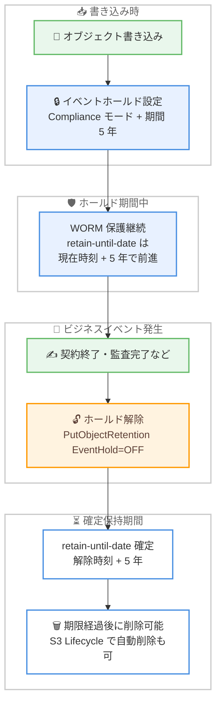

# Amazon S3 - Object Lock の可変リテンション (イベントホールド) サポート

**リリース日**: 2026年9月8日
**サービス**: Amazon Simple Storage Service (Amazon S3)
**機能**: S3 Object Lock Variable Retention with Event Holds

📊 [このアップデートのインフォグラフィックを見る](https://takech9203.github.io/aws-news-summary/20260908-amazon-s3-object-lock-variable-retention.html)

## 概要

Amazon S3 Object Lock が、イベントホールドによる可変リテンション (variable retention) をサポートしました。契約の終了や監査の完了といった、データ書き込み時点では時期が確定していない将来のビジネスイベントを起点として、保持期間を開始する WORM (Write-Once-Read-Many) 保護を実現できます。

従来の S3 Object Lock は、保持モードと retain-until-date (保持期限日) をペアで指定する固定リテンションのみをサポートしており、ロック適用時に保持期間の終了日を確定させる必要がありました。今回のアップデートにより、保持モードとイベントホールドおよび期間 (日数または年数) を組み合わせた可変リテンションが選択可能になりました。ホールドを設定した瞬間からオブジェクトは WORM 保護され、ホールドがアクティブな間は retain-until-date が時間の経過とともに前進します。ホールドを解除すると、解除時刻に設定期間を加算した日付で retain-until-date が確定します (既存の期限日がそれより後の場合は既存の日付を維持)。

金融規制対象の記録管理、契約書アーカイブ、ランサムウェア対策など、「イベント発生後 N 年間保持」という要件を持つコンプライアンス・データ保護のユーザーが主な対象です。Cohasset Associates により SEC Rule 17a-4(f)、FINRA Rule 4511、CFTC Regulation 1.31 の対象環境での利用について評価済みです。

**アップデート前の課題**

イベント起点の保持要件に対しては、以下のいずれかの回避策が必要で、それぞれにトレードオフがありました。

- **遠い将来の retain-until-date + Compliance モード**: 保持義務終了後も期限日を短縮できず、不要なストレージ料金を払い続ける必要があった
- **遠い将来の retain-until-date + Governance モード**: 早期削除は可能になるが、`s3:BypassGovernanceRetention` 権限を持つ誰もが削除できてしまう
- **retain-until-date の定期延長 (例: 30 日ごと)**: アーカイブが存続する限り、オブジェクトごと・サイクルごとに PutObjectRetention 呼び出しが必要だった
- **リーガルホールドの代用**: 解除後の保持期間がないため、retain-until-date が過ぎていればオブジェクトは即座に削除可能になってしまう

**アップデート後の改善**

- イベントホールドと期間を 1 回の呼び出しで設定するだけで、保持終了日が不明なままオブジェクトを WORM 保護できるようになった
- ホールド解除後も指定期間の WORM 保護が継続するため (リーガルホールドとの相違点)、解除即削除のリスクがなくなった
- 保持期間がイベント発生時点から正確に開始されるため、義務終了後の余分なストレージコストが不要になった
- 定期延長ジョブが不要になり、設定 1 回・解除 1 回の合計 2 回の API 呼び出しで完結するようになった

## アーキテクチャ図



可変リテンションのライフサイクルを示しています。書き込み時にイベントホールドと期間を設定すると即座に WORM 保護が開始され、ビジネスイベント発生時にホールドを解除すると、その時点から指定期間の保持が確定します。

## サービスアップデートの詳細

### 主要機能

1. **イベントホールドによる可変リテンション**
   - 保持モード (Compliance / Governance) にイベントホールドと期間 (1 日〜100 年) を組み合わせて設定
   - ホールド設定の瞬間からオブジェクトバージョンが WORM 保護され、Compliance モードでは root ユーザーを含む誰も削除や保護の緩和ができない
   - ホールドがアクティブな間、retain-until-date は「現在時刻 + 設定期間」として計算され、時間とともに前進する
   - ホールド解除時に「解除時刻 + 設定期間」で retain-until-date が確定 (既存の日付が後の場合はそちらを維持)

2. **柔軟な適用方法**
   - 個別オブジェクトへの適用: `PutObjectRetention` API で `EventHold` と `EventHoldDuration` を指定
   - バケットデフォルト: バケットの Object Lock 設定で `DefaultEventHoldDuration` を指定し、新規オブジェクトバージョンに自動適用
   - S3 Batch Operations: 既存アーカイブ全体への一括適用・一括解除が 1 ジョブで可能 (定期延長パターンからの移行にも有効)

3. **新しい IAM / バケットポリシー条件キー**
   - `s3:object-lock-event-hold`: ホールドの設定 (ON) / 解除 (OFF) の権限を分離制御
   - `s3:object-lock-event-hold-duration-days`: ホールド期間の最小値・最大値を強制
   - バケットポリシーやリソースコントロールポリシー (RCP) で、要件を満たさないリクエストを拒否可能

4. **監査・可視化の統合**
   - AWS CloudTrail: すべてのホールド操作 (設定・解除・期間変更) を記録
   - S3 Event Notifications: 明示的な `PutObjectRetention` 呼び出しで `s3:ObjectRetention:Put` 通知が発生
   - S3 Inventory: ホールドステータスと期間をレポート
   - S3 Storage Lens: Object Lock 対象のオブジェクト数・割合・バイト数をエステート全体で把握

5. **レプリケーションとの連携**
   - イベントホールドのステータスと期間はオブジェクトとともにレプリケーションされる (両バケットで Object Lock の有効化が必要)
   - ソースでホールドを解除するとレプリカにも解除が伝播し、レプリカ側はレプリケーション時刻を基準に retain-until-date を計算

## 技術仕様

### 可変リテンションの仕様

| 項目 | 詳細 |
|------|------|
| ホールド期間 | 最小 1 日、最大 100 年 (日数または年数で指定) |
| 保持モード | Compliance / Governance (Compliance では root を含め短縮・削除不可) |
| retain-until-date の挙動 | ホールド中は「現在時刻 + 期間」で前進、解除時に確定 |
| 期間の変更 | ホールド中に増減可能 (増加で期限日が延長、減少しても期限日は後退しない) |
| 明示的な期限日との併用 | 可能 (固定の最低保持 + イベント起点の延長。遅い方の日付が有効) |
| 対象バケット | 汎用バケット (Object Lock 有効化が必要) |
| 課金 | 追加料金なし (`PutObjectRetention` は S3 Standard レートの PUT リクエストとして課金) |
| コンプライアンス評価 | Cohasset Associates による SEC Rule 17a-4(f)、FINRA Rule 4511、CFTC Regulation 1.31 の評価済み |

### 固定リテンションとの比較

| 観点 | 固定リテンション | 可変リテンション (イベントホールド) | リーガルホールド |
|------|------------------|--------------------------------------|------------------|
| 保持終了日の指定 | 設定時に確定が必要 | 不要 (イベント発生時に確定) | なし |
| 解除後の保護 | - | 指定期間の WORM 保護が継続 | 即座に保護終了 |
| 過剰保持のリスク | 長めに設定すると発生 | なし (義務終了時点から正確に計測) | なし |
| 運用負荷 | 定期延長が必要な場合あり | 設定 1 回 + 解除 1 回 | 設定 1 回 + 解除 1 回 |

### API変更履歴

| 日付 | サービス | 変更内容 |
|------|----------|----------|
| 2026/09/08 | [AWS S3 Control](https://awsapichanges.com/archive/changes/dc8510-s3-control.html) | 2 updated api methods - オブジェクトレベルの `EventHold` / `EventHoldDuration` パラメータ、バケットレベルの `DefaultEventHoldDuration` パラメータを追加 |

### ホールド解除権限を分離するポリシー例

削除権限 (`s3:DeleteObjectVersion`) を持つ ID からホールド解除権限を剥奪し、二者による承認プロセスを S3 のレイヤーで強制する例です。

```json
{
  "Version": "2012-10-17",
  "Statement": [{
    "Sid": "DenyEventHoldRelease",
    "Effect": "Deny",
    "Action": "s3:PutObjectRetention",
    "Resource": "arn:aws:s3:::amzn-s3-demo-bucket1/*",
    "Condition": {"StringEquals": {"s3:object-lock-event-hold": "OFF"}}
  }]
}
```

ホールド解除と削除を別々の ID に割り当てることで、単一の ID ではデータを破壊できず、さらに解除から削除可能になるまでの待機期間を S3 自身が強制します。

## 設定方法

### 前提条件

1. Object Lock が有効化された S3 汎用バケット (バージョニング必須)
2. `s3:PutObjectRetention` 権限を持つ IAM プリンシパル
3. AWS CLI または AWS SDK の最新バージョン

### 手順

#### ステップ1: オブジェクトにイベントホールドを設定

```bash
aws s3api put-object-retention \
  --bucket amzn-s3-demo-bucket1 \
  --key my-object \
  --retention '{
    "Mode": "COMPLIANCE",
    "EventHold": "ON",
    "EventHoldDuration": {"Years": 5}
  }'
```

対象オブジェクトに Compliance モードのイベントホールドを設定し、解除後の保持期間を 5 年に指定します。この時点からオブジェクトバージョンは WORM 保護され、root ユーザーを含む誰も削除や保護の緩和ができなくなります。

#### ステップ2: ビジネスイベント発生時にホールドを解除

```bash
aws s3api put-object-retention \
  --bucket amzn-s3-demo-bucket1 \
  --key my-object \
  --retention '{"Mode":"COMPLIANCE","EventHold":"OFF"}'
```

契約終了などのイベント発生時にホールドを解除します。S3 は retain-until-date を「解除時刻 + 5 年」に確定し、その期間中は引き続き WORM 保護が継続します。より長い保持が必要な場合は、同じリクエストで明示的な retain-until-date も設定でき、S3 は遅い方の日付を採用します。

#### ステップ3: バケットデフォルトとして設定 (オプション)

S3 コンソールでバケットの [プロパティ] タブから Object Lock 設定を編集し、[デフォルトの保持] で [有効にする]、保持モードで [コンプライアンス]、保持タイプで [イベントホールド付き可変リテンション] を選択し、デフォルトのホールド期間 (例: 30 日) を入力して保存します。以降の新規オブジェクトバージョンにアプリケーションコードの変更なしで自動適用されます。

なお、バケットデフォルトはアップロード時に明示的な Object Lock パラメータが指定されると上書きされるため、強制が必要な場合はバケットポリシーまたは RCP で `s3:object-lock-event-hold` / `s3:object-lock-event-hold-duration-days` 条件キーを使用して要件を満たさないリクエストを拒否します。

#### ステップ4: 既存アーカイブへの一括適用 (オプション)

S3 Batch Operations で同じパラメータをアーカイブ全体に 1 ジョブで適用できます。retain-until-date の定期延長スケジュールを運用しているアーカイブは、オブジェクトを個別に更新することなく可変リテンションへ移行できます。

## メリット

### ビジネス面

- **保持コストの最適化**: 保持義務がイベント発生時点から正確に計測されるため、義務終了後の余分なストレージ料金が発生しない
- **コンプライアンスの厳密化**: 記録が「削除可能になるのが早すぎる」リスクと「保持しすぎる」コストの両方を排除できる
- **規制対応の裏付け**: Cohasset Associates による SEC 17a-4(f)、FINRA 4511、CFTC 1.31 の評価済みで、金融規制環境での採用判断がしやすい

### 技術面

- **運用の簡素化**: 定期延長ジョブ (オブジェクトごと・サイクルごとの PutObjectRetention) が不要になり、設定 1 回 + 解除 1 回で完結。リクエスト課金も大幅に削減
- **二者承認プロセスの実現**: ホールド解除と削除の権限を条件キーで分離し、S3 が待機期間を強制する two-person プロセスを構築可能
- **ランサムウェア対策**: バケットデフォルトで全新規バージョンに 30 日などの回復ウィンドウを付与。攻撃者がホールドを解除しても Compliance モードにより 30 日間は削除不可能で、検知・調査・ロールバックの時間を確保できる
- **メタデータのみの操作**: ホールドの設定・解除はアーカイブストレージクラスからの復元や S3 Intelligent-Tiering の中断を発生させない

## デメリット・制約事項

### 制限事項

- 汎用バケットのみ対応 (Object Lock の一般的な制約と同様)
- ホールド期間は最小 1 日、最大 100 年
- ホールド中に期間を短縮しても retain-until-date は後退しない (その位置で一時停止し、短縮後の期間が追い越した時点で再び前進)
- 保護中のオブジェクトは暗号化設定の変更や S3 アノテーションの作成・更新・削除ができない
- ホールドがアクティブな間は S3 Lifecycle による削除が行われず、ストレージ料金が継続する

### 考慮すべき点

- Compliance モードで保護されたバージョンの早期削除手段は、データを保持する AWS アカウントの解約のみ
- Governance モードでは `s3:BypassGovernanceRetention` 権限によりホールド解除・期限短縮・削除が単一 ID で可能になるため、権限分離パターンには Compliance モードが前提となる (RCP での拒否も可能だが、管理者が変更できるポリシーは Compliance モードより弱い統制)
- バケットデフォルトは強制力を持たないため、確実な適用にはバケットポリシーまたは RCP による条件キーでの強制が必要
- レプリケーション構成では、レプリカの retain-until-date がレプリケーション所要時間の分だけソースより後になる (S3 Replication Time Control で 99.99% のオブジェクトを 15 分以内に抑制可能)
- `s3:ObjectRetention:Put` 通知は明示的な PutObjectRetention 呼び出しでのみ発生し、アップロード時のデフォルト適用では `s3:ObjectCreated:*` が発生する点に注意

## ユースケース

### ユースケース1: 契約書の「契約終了後 5 年保持」

**シナリオ**: 署名済み契約書を契約終了後 5 年間保持する義務がある企業。契約は更新・早期解約・満了などがあり、署名時点では終了時期が不明。

**実装例**:
```bash
# 書き込み時: Compliance モード + イベントホールド + 5 年を設定
aws s3api put-object-retention \
  --bucket amzn-s3-demo-bucket1 --key contract-001.pdf \
  --retention '{"Mode":"COMPLIANCE","EventHold":"ON","EventHoldDuration":{"Years":5}}'

# 契約終了時: ホールドを解除 → 解除時刻 + 5 年で保持期間が確定
aws s3api put-object-retention \
  --bucket amzn-s3-demo-bucket1 --key contract-001.pdf \
  --retention '{"Mode":"COMPLIANCE","EventHold":"OFF"}'
```

**効果**: 契約が数週間で終わっても数年続いても、スケジュールジョブなしで正確に「終了 + 5 年」の保持を実現。期限経過後は削除可能になり、過剰保持のコストが発生しない。

### ユースケース2: ランサムウェア対策の回復ウィンドウ

**シナリオ**: 全新規オブジェクトバージョンに 30 日の削除猶予を設け、有効な認証情報を奪った攻撃者によるデータ破壊から保護したいシステム。

**実装例**:
```
バケットの Object Lock 設定 (コンソール):
- デフォルトの保持: 有効
- デフォルト保持モード: Compliance
- デフォルト保持タイプ: イベントホールド付き可変リテンション
- デフォルトイベントホールド期間: 30 日
```

**効果**: 攻撃者が保護されたバージョンの削除を試みても失敗し、ホールドを解除しても Compliance モードにより 30 日間は削除不可。この間に検知・調査し、既知の正常バージョンへロールバックできる。不要になったバージョンはホールド解除後 30 日で S3 Lifecycle により自動削除され、ストレージ料金を停止できる。

### ユースケース3: ホールド解除と削除の二者分離

**シナリオ**: 規制対象データの削除に、複数の担当者の関与と強制的な待機期間を必要とする金融機関。

**実装例**:
```
ID-A (削除担当): s3:DeleteObjectVersion を保持
  + DenyEventHoldRelease ポリシー (s3:object-lock-event-hold = OFF を拒否)
ID-B (解除担当): s3:PutObjectRetention のみ保持、s3:DeleteObjectVersion なし
```

**効果**: どちらの ID も単独では「保持期間の開始」と「バージョンの削除」の両方を実行できず、削除には二者の関与と S3 が強制する待機期間 (ホールド期間) が必要になる。さらに `s3:DeleteObjectVersion` を誰にも付与せず、Lifecycle ルールに削除を委ねる構成も可能。

### ユースケース4: 自動化されたホールド解除 (夜間エクスポートや Apache Iceberg)

**シナリオ**: 毎晩同じキーを上書きするデータベースエクスポートで、置き換えられた旧バージョンから回復ウィンドウを開始したい。または Apache Iceberg のスナップショット期限切れで参照されなくなったデータファイルを扱いたい。

**実装例**:
```
AWS サンプル「Automatic removal of event hold for S3」を使用:
- 削除マーカーで隠されたバージョン、上書きで置き換えられたバージョン、
  またはその両方を対象に、設定ポリシーに従って非現行バージョンの
  イベントホールドを自動解除
```

**効果**: エクスポートジョブ側は Object Lock を意識することなく、旧バージョンが置き換えられた時点から自動的に回復ウィンドウが開始され、期限後に Lifecycle で削除される。

## 料金

追加料金なしで利用できます。

- ホールドの設定・解除は `PutObjectRetention` 呼び出しであり、オブジェクトのストレージクラスにかかわらず S3 Standard レートの PUT リクエストとして課金
- オブジェクトバージョンが保持されている間は通常どおりストレージ料金が発生
- 従来の定期延長パターン (オブジェクトごと・サイクルごとの API 呼び出し) と比較して、設定 1 回 + 解除 1 回のみとなりリクエスト数を大幅に削減可能

## 利用可能リージョン

すべての AWS リージョンで利用可能 (AWS GovCloud (US) および AWS 中国リージョンを含む)。

## 関連サービス・機能

- **S3 Batch Operations**: 既存アーカイブ全体へのホールドの一括設定・一括解除。定期延長パターンからの移行を 1 ジョブで実施可能
- **AWS CloudTrail**: すべてのホールド操作 (設定・解除・期間変更) の監査ログを記録
- **S3 Inventory / S3 Storage Lens**: Inventory はバージョンごとのホールドステータスと期間を、Storage Lens はエステート全体の Object Lock カバレッジ (オブジェクト数・割合・バイト数) をレポート
- **S3 Replication**: ホールドのステータスと期間をレプリカに伝播。S3 Replication Time Control で伝播遅延を 15 分以内 (99.99%) に抑制
- **S3 Lifecycle**: retain-until-date 経過後の自動削除により、プリンシパルに削除権限を付与しない運用が可能
- **リソースコントロールポリシー (RCP)**: 条件キーと組み合わせ、バケットポリシーや管理者権限で上書きできない組織レベルの強制を実現

## 参考リンク

- 📊 [インフォグラフィック](https://takech9203.github.io/aws-news-summary/20260908-amazon-s3-object-lock-variable-retention.html)
- [公式発表 (What's New)](https://aws.amazon.com/about-aws/whats-new/2026/09/amazon-s3-object-lock-variable-retention/)
- [AWS Blog: Flexibly control Amazon S3 Object Lock retention based on real business events](https://aws.amazon.com/blogs/storage/flexibly-control-amazon-s3-object-lock-retention-based-on-real-business-events/)
- [ドキュメント: Locking objects with Object Lock](https://docs.aws.amazon.com/AmazonS3/latest/userguide/object-lock.html)
- [S3 Object Lock 機能ページ](https://aws.amazon.com/s3/features/object-lock/)
- [料金ページ](https://aws.amazon.com/s3/pricing/)

## まとめ

S3 Object Lock の可変リテンションは、「イベント発生後 N 年間保持」という現実のビジネス要件を、回避策なしにネイティブに実現する重要なアップデートです。保持終了日が不明なデータの WORM 保護、ランサムウェア回復ウィンドウ、二者承認による削除プロセスなど、コンプライアンスとデータ保護の設計を大きく簡素化します。retain-until-date の定期延長スケジュールを運用中の場合は、S3 Batch Operations による可変リテンションへの移行を検討することを推奨します。
