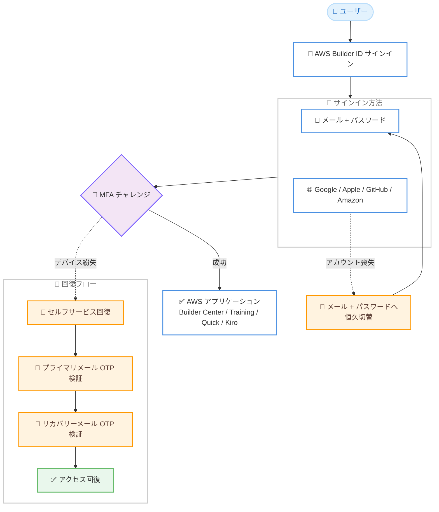

# AWS Builder ID - リカバリーオプションとサードパーティログイン向け MFA の追加

**リリース日**: 2026 年 9 月 8 日
**サービス**: AWS Builder ID (AWS Sign-In)
**機能**: リカバリーメールによるセルフサービス回復と、サードパーティログインを含む全サインイン方法での多要素認証 (MFA)

📊 [このアップデートのインフォグラフィックを見る](https://takech9203.github.io/aws-news-summary/20260908-aws-builder-id-recovery-mfa-third-party.html)

## 概要

AWS Builder ID に、リカバリーメールの登録によるセルフサービスのアカウント回復オプションと、サードパーティログイン (Google、Apple、GitHub、Amazon) を含むすべてのサインイン方法での MFA デバイス登録機能が追加されました。AWS Builder ID は、AWS Builder Center、AWS Training and Certification、Amazon Quick、Kiro などの AWS アプリケーションにアクセスするための個人プロファイルであり、AWS アカウントの認証情報とは独立して個人に紐づくものです。

今回のアップデートにより、ユーザーはリカバリーメールを第 2 の検証手段として追加できるようになり、AWS Support に問い合わせることなくセルフサービスでアカウントを回復できます。パスワードを忘れた場合はプライマリメールまたはリカバリーメールに送信されるリセットリンクで再設定でき、MFA デバイスを紛失した場合はプライマリメールとリカバリーメールの両方を検証することでアクセスを回復できます。

さらに、これまでメールアドレス + パスワードでのサインインに限定されていた MFA デバイス登録が、Google、Apple、GitHub、Amazon のサードパーティアカウントでサインインするユーザーにも拡大されました。サードパーティアカウントへのアクセスを失った場合には、サインイン方法をメールアドレス + パスワードへ恒久的に切り替えるオプションも提供されます。

**アップデート前の課題**

- 以前はプライマリメールへのアクセスを失うと、セルフサービスでアカウントを回復する手段が限られており、AWS Support への問い合わせが必要になるケースがあった
- 以前は MFA デバイスを紛失した場合の回復手段が限られていた
- 以前はサードパーティログイン (Google、Apple、GitHub、Amazon) を使用するユーザーは AWS Builder ID 側で MFA デバイスを登録できなかった
- 以前はサードパーティアカウント自体へのアクセスを失うと、AWS Builder ID にサインインできなくなるリスクがあった

**アップデート後の改善**

- リカバリーメールを第 2 の検証手段として登録でき、AWS Support に問い合わせることなくセルフサービスでアカウントを回復できるようになった
- MFA デバイス紛失時に、プライマリメールとリカバリーメールの両方の検証によりアクセスを回復できるようになった
- サードパーティログインを含むすべてのサインイン方法で MFA デバイスを登録できるようになり、ソーシャルログインプロバイダー側の 2 段階認証に加えて AWS Builder ID 側でも保護を強化できるようになった
- サードパーティアカウントへのアクセスを失った場合に、サインイン方法をメールアドレス + パスワードへ恒久的に切り替えられるようになった

## アーキテクチャ図



すべてのサインイン方法で MFA が利用可能になり、MFA デバイス紛失時はプライマリメールとリカバリーメールの 2 段階検証で回復、サードパーティアカウント喪失時はメール + パスワードへの恒久切替が可能になったことを示しています。

## サービスアップデートの詳細

### 主要機能

1. **リカバリーメールの追加**
   - AWS Builder ID プロファイルに、プライマリメールとは別のリカバリーメールを第 2 の検証手段として登録可能
   - プライマリメールの受信トレイにアクセスできない場合の代替の本人確認手段として機能する
   - MFA デバイス紛失時の回復における第 2 の検証要素としても使用される
   - MFA デバイス登録時にリカバリーメールが未設定の場合、先に追加するよう促される

2. **セルフサービスのパスワードリセット**
   - パスワードを忘れた場合、サインインページの [Trouble Signing In?] からリセットリンクを取得可能
   - リセットリンクはプライマリメールまたはリカバリーメールのいずれかに送信できる
   - AWS Support への問い合わせが不要

3. **MFA デバイス紛失時のセルフサービス回復**
   - MFA チャレンジを完了できない場合、サインインフロー内でメール検証による代替手段が提示される
   - プライマリメールに送信されるワンタイムパスワード (OTP) とリカバリーメールに送信される OTP の両方を検証することでアクセスを回復
   - 回復後は再度の MFA 設定なしでサインインでき、プロファイルの [Security] から MFA デバイスを更新できる
   - セルフサービスでの MFA 回復にはリカバリーメールの事前設定が必須

4. **サードパーティログインでの MFA デバイス登録**
   - Google、Apple、GitHub、Amazon のアカウントでサインインするユーザーも AWS Builder ID に MFA デバイスを登録可能
   - ソーシャルログインプロバイダー側で設定する 2 段階認証とは別に、AWS Builder ID サインイン時に適用される追加の保護層として機能する

5. **サインイン方法の恒久切替**
   - サードパーティアカウントへのアクセスを失った場合、[Can't sign in with my social login?] オプションからメールアドレス + パスワードへのサインイン方法に切り替え可能
   - 切替時はプライマリメール (またはリカバリーメール) に送信される OTP で本人確認を行う
   - 切替後もリカバリーメールや登録済み MFA デバイスなどの設定は保持される

## 技術仕様

### サポートされる MFA デバイスタイプ

| デバイスタイプ | 詳細 |
|------|------|
| FIDO2 ビルトイン認証器 | MacBook の TouchID、Windows Hello 対応カメラなど。指紋や顔認証を第 2 要素として使用可能 |
| FIDO2 セキュリティキー | USB、BLE、NFC 接続の外部セキュリティキー (YubiKey、Feitian など FIDO 認定製品) |
| パスキー | 同期可能なパスキーにも対応。パスワードマネージャーなどのサードパーティ FIDO 認証器も利用可能 |
| 認証アプリ | RFC 6238 準拠の TOTP アプリ (Google Authenticator、Microsoft Authenticator、Authy、Duo Mobile、1Password など)。1 ユーザーあたり 2 つまで登録可能 |

### 回復オプションと必要な検証要素

| シナリオ | 回復方法 | 必要な検証 |
|------|------|------|
| パスワード忘れ | パスワードリセットリンク | プライマリメールまたはリカバリーメールへのアクセス |
| MFA デバイス紛失 | メール検証による代替サインイン | プライマリメールとリカバリーメールの両方の OTP 検証 |
| サードパーティアカウント喪失 | メール + パスワードへの恒久切替 | プライマリメールまたはリカバリーメールの OTP 検証 |
| セルフサービス不可 | Support への問い合わせ | 本人確認情報の提供 (確認できない場合は回復不可) |

## 設定方法

### 前提条件

1. AWS Builder ID プロファイルを作成済みであること
2. プライマリメールの受信トレイにアクセスできること
3. リカバリーメールとして使用する、プライマリメールとは別のメールアドレスを用意すること

### 手順

#### ステップ 1: リカバリーメールを追加する

1. [https://profile.aws.amazon.com](https://profile.aws.amazon.com) にサインインする
2. プロファイル設定からリカバリーメールを追加する
3. リカバリーメールに送信される検証コードを入力して確認を完了する

リカバリーメールはアカウント回復の要となるため、MFA デバイス登録前に設定しておくことを推奨します。未設定の場合、MFA デバイス登録時に追加を促されます。

#### ステップ 2: MFA デバイスを登録する

1. [https://profile.aws.amazon.com](https://profile.aws.amazon.com) にサインインする (サードパーティログインでも可)
2. [Security] を選択する
3. [Register device] を選択する
4. [Authenticator app] または [Security key] を選択する
5. 画面の指示に従って QR コードのスキャンまたはセキュリティキーの操作を行い、登録を完了する

認証アプリの場合、生成されたワンタイムパスワードをすぐに入力してください。TOTP は短時間で失効するため、時間が経過するとデバイスが非同期状態になることがあります。

#### ステップ 3: 複数の MFA デバイスを登録する

1. 同じ手順で 2 つ目以降の MFA デバイスを登録する
2. 登録済みデバイスに [Rename] でわかりやすい名前を付ける

デバイス紛失に備えて、2 つ以上の MFA デバイスを登録しておくことが推奨されています。認証アプリではクラウドバックアップや同期機能の有効化も有効です。

## メリット

### ビジネス面

- **サポート問い合わせの削減**: パスワード忘れ、MFA デバイス紛失、ソーシャルアカウント喪失のいずれもセルフサービスで回復でき、AWS Support への問い合わせと待ち時間が不要になる
- **アカウント永久ロックアウトリスクの低減**: リカバリーメールの事前設定により、プライマリメールへのアクセスを失った場合でもアカウントを回復できる
- **学習・開発環境の継続性確保**: Training and Certification の学習履歴や Kiro、Amazon Quick などの利用環境へのアクセスを失うリスクが減少する

### 技術面

- **全サインイン方法での MFA 保護**: サードパーティログインユーザーも AWS Builder ID 側で FIDO2 やパスキー、TOTP による追加の保護層を適用できる
- **フィッシング耐性のある認証**: FIDO2 / WebAuthn ベースの認証器はサイト固有の公開鍵暗号を使用するため、フィッシングに対して耐性がある
- **多層的な回復設計**: MFA 回復にはプライマリメールとリカバリーメールの 2 要素検証を必須とし、回復フロー自体のセキュリティも担保されている

## デメリット・制約事項

### 制限事項

- プライマリメールにアクセスできず、かつリカバリーメールが未設定の場合、セルフサービスでも Support 経由でもパスワードリセットやサインイン方法の切替ができない
- MFA デバイス紛失時のセルフサービス回復には、プライマリメールとリカバリーメールの両方へのアクセスが必須
- サードパーティログインからメール + パスワードへの切替は恒久的であり、ソーシャルログインへ戻すことはできない
- 認証アプリは 1 ユーザーあたり 2 つまでしか登録できない

### 考慮すべき点

- リカバリーメールはプライマリメールと異なるメールプロバイダーを使用するなど、同時にアクセスを失わない構成が望ましい
- サードパーティログインの MFA は、ソーシャルログインプロバイダー側の 2 段階認証とは独立して動作するため、両方の設定状態を把握しておく必要がある
- 信頼済みデバイスとして登録したデバイスでは MFA プロンプトが省略される場合があるため、共有端末での利用時は注意が必要

## ユースケース

### ユースケース 1: サードパーティログインユーザーのセキュリティ強化

**シナリオ**: GitHub アカウントで AWS Builder Center と Kiro にサインインしている開発者が、AWS Builder ID 側でも追加の保護を適用したい。

**実装例**:
```
1. GitHub アカウントで https://profile.aws.amazon.com にサインイン
2. リカバリーメールを追加 (未設定の場合は登録時に促される)
3. [Security] > [Register device] からパスキーまたは認証アプリを登録
4. 以降のサインインでは GitHub 認証に加えて AWS Builder ID の MFA が適用される
```

**効果**: GitHub アカウントが侵害された場合でも、AWS Builder ID 側の MFA が追加の防御層として機能し、Kiro や Builder Center への不正アクセスを防止できる。

### ユースケース 2: MFA デバイス紛失からのセルフサービス回復

**シナリオ**: 認証アプリをインストールしたスマートフォンを紛失し、AWS Training and Certification にサインインできなくなった受講者が、試験前にアクセスを回復したい。

**実装例**:
```
1. 通常どおりパスワードまたはソーシャルログインでサインイン
2. MFA プロンプトで「メールアドレスの検証で代替する」オプションを選択
3. プライマリメールに届いた OTP を入力
4. リカバリーメールに届いた OTP を入力
5. アクセス回復後、[Security] から新しい MFA デバイスを登録
```

**効果**: AWS Support への問い合わせなしで即座にアクセスを回復でき、学習や認定試験のスケジュールに影響を与えない。

### ユースケース 3: ソーシャルアカウント喪失時のサインイン方法切替

**シナリオ**: Google アカウントで AWS Builder ID を作成していたユーザーが、退職により組織の Google Workspace アカウントを失い、AWS Builder ID にサインインできなくなった。

**実装例**:
```
1. サインインページで [Trouble Signing In?] を選択
2. AWS Builder ID のメールアドレスを入力し、
   [Can't sign in with my social login?] を選択
3. サインイン方法の切替を確認
4. プライマリメール (またはリカバリーメール) に届いた OTP で本人確認
5. 新しいパスワードを設定し、以降はメール + パスワードでサインイン
```

**効果**: ソーシャルアカウントへの依存を解消してアカウントの所有権を維持できる。リカバリーメールや MFA デバイスなどの既存設定は切替後も保持される。

## 料金

AWS Builder ID は無料で利用できます。今回追加されたリカバリーオプションと MFA 機能にも追加料金は発生しません。AWS アカウント内で消費する AWS リソースに対してのみ料金が発生します。

## 利用可能リージョン

AWS Builder ID は米国東部 (バージニア北部、us-east-1) リージョンでホストされています。AWS Builder ID を使用するアプリケーション自体は他のリージョンでも動作し、機能はグローバルに利用可能です。

## 関連サービス・機能

- **AWS Builder Center**: AWS Builder ID でサインインする開発者向けコミュニティポータル。今回の MFA 強化の対象アプリケーション
- **AWS Training and Certification**: 学習履歴や認定情報が AWS Builder ID に紐づくため、アカウント回復オプションの重要性が高い
- **Kiro / Amazon Quick**: AWS Builder ID でアクセスする AI 搭載開発ツール。サードパーティログインでの MFA 強化の恩恵を受ける
- **AWS IAM Identity Center**: 組織向けのワークフォースアイデンティティ管理。AWS Builder ID は個人向けであり、用途が異なる
- **AWS Sign-In**: AWS の各種サインイン方式を管理する仕組み。AWS Builder ID はその一部として提供される

## 参考リンク

- 📊 [インフォグラフィック](https://takech9203.github.io/aws-news-summary/20260908-aws-builder-id-recovery-mfa-third-party.html)
- [公式発表 (What's New)](https://aws.amazon.com/about-aws/whats-new/2026/09/aws-builder-id-recovery-mfa-third-party/)
- [ドキュメント: Sign in with AWS Builder ID](https://docs.aws.amazon.com/signin/latest/userguide/sign-in-builder-id.html)
- [ドキュメント: Recover your AWS Builder ID](https://docs.aws.amazon.com/signin/latest/userguide/recover-builder-id.html)
- [ドキュメント: Manage AWS Builder ID multi-factor authentication](https://docs.aws.amazon.com/signin/latest/userguide/mfa-builder-id.html)

## まとめ

AWS Builder ID にリカバリーメールによるセルフサービス回復と、サードパーティログインを含む全サインイン方法での MFA 登録が追加され、個人プロファイルのセキュリティと可用性が大きく向上しました。AWS Builder Center、Training and Certification、Kiro などを利用しているユーザーは、アカウントロックアウトを防ぐため、リカバリーメールの設定と複数の MFA デバイスの登録を早めに実施することを推奨します。
