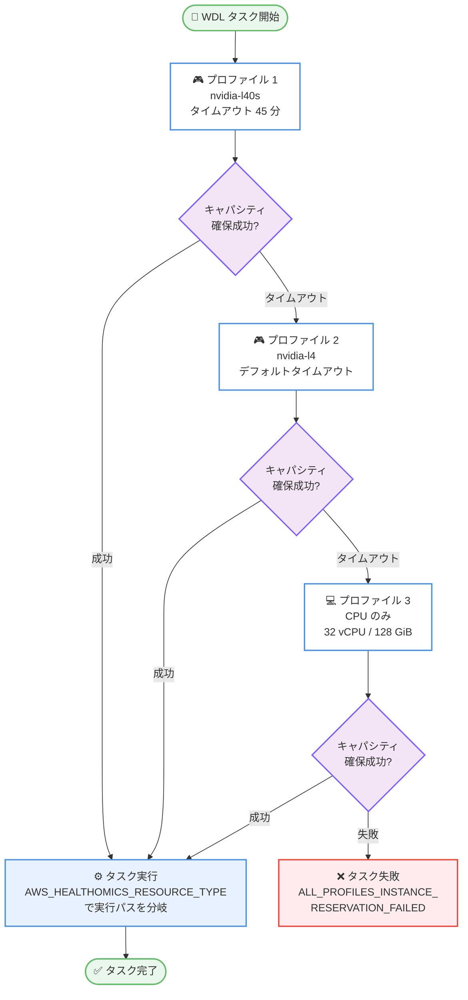

# AWS HealthOmics - WDL ワークフロー向けリソースフォールバックオーダー

**リリース日**: 2026 年 9 月 8 日
**サービス**: AWS HealthOmics
**機能**: Resource fallback order for WDL workflows (omicsResourceFallbackOrder ディレクティブ)

📊 [このアップデートのインフォグラフィックを見る](https://takech9203.github.io/aws-news-summary/20260908-aws-healthomics-resourcefallback-wdl.html)

## 概要

AWS HealthOmics が、WDL (Workflow Description Language) ワークフローのタスクに対して、優先するアクセラレータタイプの順序付きリストを定義できる `omicsResourceFallbackOrder` ディレクティブを導入しました。最優先のアクセラレータ (例: `nvidia-l40s`) のキャパシティが確保できない場合、HealthOmics はランを再サブミットすることなく、指定された代替プロファイル (別の GPU タイプや CPU インスタンス) へ自動的に移行します。

各アクセラレータプロファイルには待機タイムアウト (`omicsResourceWaitTimeoutInMin`) を個別に設定できます。タイムアウトを短く設定すればフォールバックリストを迅速に進み、長く設定すれば優先アクセラレータを確保できる可能性が高まります。ゲノム解析などで GPU キャパシティの変動に悩まされていた研究者やバイオインフォマティシャンは、キャパシティ起因の失敗調査や再実行に費やす時間を削減し、本番ワークフローを安定して稼働させることができます。

HealthOmics は HIPAA 準拠が可能なサービスであり、ヘルスケア・ライフサイエンス分野のお客様がマネージドなバイオインフォマティクスワークフローを実行するために利用できます。

**アップデート前の課題**

- タスクごとに単一の `acceleratorType` しか指定できず、指定した GPU タイプのキャパシティが確保できない場合、待機タイムアウト後にタスクが失敗していた
- キャパシティ不足によるラン失敗のたびに、原因調査とワークフローの再サブミットが必要だった
- 代替 GPU タイプや CPU での実行に切り替えるには、ワークフロー定義を書き換えて再実行する必要があった

**アップデート後の改善**

- タスクレベルで最大 10 個のリソースプロファイル (GPU / CPU) を優先順に定義でき、キャパシティ状況に応じて自動的にフォールバックされる
- 優先アクセラレータが確保できなくても、再サブミットなしで代替プロファイルに移行し、ランが継続する
- プロファイルごとに待機タイムアウトを設定でき、「高性能 GPU は長めに待つ」「フォールバック先は短めに待つ」といった柔軟な制御が可能になった
- 最後に CPU プロファイルを追加することで、インスタンス確保の成功率を最大化できる

## アーキテクチャ図



HealthOmics はフォールバックリストの先頭からキャパシティ確保を試行し、各プロファイルのタイムアウト経過後に次のプロファイルへ自動的に移行します。すべてのプロファイルで確保に失敗した場合のみタスクが失敗します。

## サービスアップデートの詳細

### 主要機能

1. **omicsResourceFallbackOrder ディレクティブ**
   - WDL タスクの `runtime` セクションで、リソースプロファイルの順序付きリストを宣言する
   - 各プロファイルは `acceleratorType`、`acceleratorCount`、`cpu`、`memory`、`omicsResourceWaitTimeoutInMin` の 5 フィールドをプロファイル単位で個別に設定可能
   - `docker` や `maxRetries` などの他の runtime フィールドは共有フィールドとしてトップレベルで 1 回だけ設定し、全プロファイルに適用される
   - このディレクティブを使用する場合、トップレベルの `acceleratorType`、`acceleratorCount`、`cpu`、`memory`、`omicsResourceWaitTimeoutInMin` は指定不可 (置き換えとなる)

2. **プロファイルごとの待機タイムアウト**
   - `omicsResourceWaitTimeoutInMin` で、各プロファイルのキャパシティ検索時間を個別に制御できる
   - デフォルトは単一 GPU アクセラレータバンドルで 20 分、マルチ GPU バンドルで 30 分 (推奨最小値でもある)
   - タイムアウト経過時はタスク失敗ではなく次のプロファイルへ進む。失敗するのは全プロファイルを使い切った場合のみ
   - CPU のみのプロファイルにはキャパシティ制約がないため、タイムアウト設定は不要

3. **CPU フォールバックと実行パスの分岐**
   - `acceleratorType` を省略したプロファイルは CPU プロファイルとして扱われる (リストの最後に配置し、1 つまで)
   - HealthOmics がタスクコンテナに環境変数 `AWS_HEALTHOMICS_RESOURCE_TYPE` を設定し、選択されたプロファイル (例: `"nvidia-l40s"`、`"cpu"`) に応じてコマンドを分岐できる
   - GPU / CPU 両方のコードパスをサポートするマルチアーキテクチャコンテナイメージが必要

4. **リトライとの連携**
   - OOM (Out of Memory) や 5xx サービスエラーによるリトライは、確保済みのアクティブなプロファイル内で実行され、次のプロファイルには進まない
   - リトライごとにタイムアウトウィンドウはリセットされ、フルの `omicsResourceWaitTimeoutInMin` が適用される
   - 全プロファイルでインスタンス確保に失敗した場合は `ALL_PROFILES_INSTANCE_RESERVATION_FAILED` でタスクとランが失敗し、このエラーコードに対してはリトライされない

## 技術仕様

### プロファイルごとのフィールド仕様

| フィールド | 型 | 省略時のデフォルト | 備考 |
|------|------|------|------|
| acceleratorType | String | 省略時は CPU プロファイル扱い | サポートされる 7 種類のアクセラレータタイプのいずれか。空文字列は不可 |
| acceleratorCount | Integer | acceleratorType 省略時は不要 | acceleratorType とセットで指定必須 |
| cpu | Integer / Float | 1 vCPU (GPU プロファイルではインスタンスタイプのデフォルト) | 最小 1 vCPU に切り上げ |
| memory | String (例: "32 GiB") | 1 GiB (GPU プロファイルではインスタンスタイプのデフォルト) | トップレベルの runtime.memory と同じ形式 |
| omicsResourceWaitTimeoutInMin | Integer | 単一 GPU: 20 分、マルチ GPU バンドル: 30 分 | 上限なし。推奨最小値未満は警告 |

省略したフィールドはドキュメント記載のデフォルト値となり、リスト内の前のプロファイルから値を引き継ぎません。

### 主な検証ルール

| 項目 | 内容 |
|------|------|
| リスト形式 | プロファイルの配列として記述し、空リストや空プロファイル `{}` は不可 |
| キーの形式 | フィールド名は引用符付き文字列が必須 (bareword キーは検証エラー) |
| プロファイル数 | 1 タスクあたり最大 10 プロファイル、CPU プロファイルは 1 つまで |
| 重複プロファイル | 許容されるが警告が出る。代わりに前方プロファイルのタイムアウト延長を推奨 |
| 検証タイミング | ワークフロー作成時に検証され、タスク実行時にも再チェックされる |

### WDL 記述例

```wdl
task align {
  command <<<
    # 割り当てられたリソースタイプに応じて実行パスを分岐
    if [ "$AWS_HEALTHOMICS_RESOURCE_TYPE" = "cpu" ]; then
      sentieon bwa mem -t 32 ~{reference} ~{fastq}
    else
      pbrun fq2bam --ref ~{reference} --in-fq ~{fastq}
    fi
  >>>

  runtime {
    docker: "my-registry/align-multi-arch:latest"
    maxRetries: 2

    omicsResourceFallbackOrder: [
      {"acceleratorType": "nvidia-l40s", "acceleratorCount": 1,
       "cpu": 8, "memory": "32 GiB",
       "omicsResourceWaitTimeoutInMin": 45},

      {"acceleratorType": "nvidia-l4", "acceleratorCount": 1,
       "cpu": 8, "memory": "32 GiB"},

      {"cpu": 32, "memory": "128 GiB"}
    ]
  }
}
```

この例では、まず `nvidia-l40s` を最大 45 分待機して確保を試み、次に `nvidia-l4` (デフォルトの待機時間)、最後に CPU のみのプロファイル (32 vCPU、128 GiB) へフォールバックします。

## 設定方法

### 前提条件

1. AWS HealthOmics のプライベートワークフロー (WDL) を利用していること
2. フォールバックリストに CPU プロファイルを含める場合、GPU と CPU 両方のコードパスに対応したコンテナイメージを用意していること
3. ワークフロー実行用の IAM ロールと ECR 上のコンテナイメージなど、通常の HealthOmics ワークフロー実行の前提条件を満たしていること

### 手順

#### ステップ 1: WDL タスクに omicsResourceFallbackOrder を定義する

```wdl
runtime {
  docker: "my-registry/align-multi-arch:latest"
  omicsResourceFallbackOrder: [
    {"acceleratorType": "nvidia-l40s", "acceleratorCount": 1, "omicsResourceWaitTimeoutInMin": 45},
    {"acceleratorType": "nvidia-l4", "acceleratorCount": 1},
    {"cpu": 32, "memory": "128 GiB"}
  ]
}
```

タスクの `runtime` セクションに優先順でプロファイルを列挙します。このディレクティブを使う場合、トップレベルの `acceleratorType` や `cpu` などの個別リソースディレクティブは削除します。

#### ステップ 2: ワークフローを作成する

```bash
aws omics create-workflow \
  --name "align-with-fallback" \
  --engine WDL \
  --definition-zip fileb://workflow.zip
```

WDL 定義を含む ZIP からワークフローを作成します。`omicsResourceFallbackOrder` の構文はワークフロー作成時に検証され、ルール違反があれば拒否されます。

#### ステップ 3: ランを開始して結果を確認する

```bash
aws omics start-run \
  --workflow-id <workflow-id> \
  --role-arn <role-arn> \
  --output-uri s3://my-bucket/outputs/ \
  --parameters file://params.json
```

ランを開始します。タスク実行時、HealthOmics はフォールバック順にキャパシティを確保し、コンテナ内では環境変数 `AWS_HEALTHOMICS_RESOURCE_TYPE` で選択されたリソースタイプを確認できます。

## メリット

### ビジネス面

- **研究のスループット向上**: GPU キャパシティ不足によるラン失敗と再実行が減り、解析結果を得るまでの時間が短縮される
- **運用負荷の削減**: キャパシティ起因の失敗のトラブルシューティングや手動再サブミットに費やす時間を削減できる
- **本番パイプラインの安定稼働**: 臨床・研究の本番ワークフローがアクセラレータの需給変動の影響を受けにくくなる

### 技術面

- **宣言的なフォールバック制御**: ワークフロー定義内でリソース戦略を完結でき、外部のリトライ機構や監視スクリプトが不要になる
- **プロファイル単位の細かな制御**: アクセラレータタイプごとに vCPU、メモリ、待機タイムアウトを独立して調整できる
- **実行時の自動分岐**: `AWS_HEALTHOMICS_RESOURCE_TYPE` により、単一のタスク定義で GPU / CPU 双方の実行パスを扱える

## デメリット・制約事項

### 制限事項

- WDL エンジンのみ対応 (GA 時点)。Nextflow および CWL のサポートは計画中
- `scatter` ブロック内では使用不可 (タスクレベルのみ)
- 1 タスクあたり最大 10 プロファイル、CPU プロファイルは 1 つまで (リストの最後に配置)
- インスタンスタイプ名 (例: `omics.g6e.4xlarge`) を直接指定することはできず、プロファイルフィールド構文を使用する必要がある
- 全プロファイルでインスタンス確保に失敗した場合の `ALL_PROFILES_INSTANCE_RESERVATION_FAILED` はリトライ対象外

### 考慮すべき点

- 複数インスタンスファミリーにまたがるマルチ GPU バンドルタイプ (例: `nvidia-t4-a10g-l4`) はフォールバックリスト内での使用が非推奨。単一ファミリーのタイプを使用する
- CPU フォールバックを含める場合、コンテナイメージが GPU / CPU 両方のツールチェーンを含む必要があり、イメージサイズやビルドの複雑さが増す
- CPU 実行は GPU 実行よりも大幅に時間がかかる場合があるため、実行時間とコストのトレードオフを評価する必要がある
- 省略したフィールドは前のプロファイルの値を引き継がずデフォルト値になるため、プロファイルごとに明示的な指定を推奨

## ユースケース

### ユースケース 1: GPU 間フォールバックによる高速アライメント

**シナリオ**: NVIDIA Parabricks を使ったゲノムアライメントで、高性能な L40S を優先しつつ、確保できない場合は L4 で処理を継続したい。ワークロードはどちらの GPU でも同じコマンドで動作する。

**実装例**:
```wdl
runtime {
  docker: "nvcr.io/nvidia/clara/clara-parabricks:latest"
  omicsResourceFallbackOrder: [
    {"acceleratorType": "nvidia-l40s", "acceleratorCount": 1, "omicsResourceWaitTimeoutInMin": 60},
    {"acceleratorType": "nvidia-l4", "acceleratorCount": 1, "omicsResourceWaitTimeoutInMin": 20}
  ]
}
```

**効果**: 優先 GPU を長めに待機しつつ、確保できない場合もコマンド変更なしで代替 GPU に自動移行し、ラン失敗を回避できる。

### ユースケース 2: GPU から CPU への最終フォールバック

**シナリオ**: 納期が決まっている本番解析パイプラインで、GPU が確保できない場合でも処理を止めたくない。CPU では時間がかかるが、失敗よりは許容できる。

**実装例**:
```wdl
command <<<
  if [ "$AWS_HEALTHOMICS_RESOURCE_TYPE" = "cpu" ]; then
    sentieon bwa mem -t 32 ~{reference} ~{fastq}
  else
    pbrun fq2bam --ref ~{reference} --in-fq ~{fastq}
  fi
>>>
runtime {
  docker: "my-registry/align-multi-arch:latest"
  omicsResourceFallbackOrder: [
    {"acceleratorType": "nvidia-l4", "acceleratorCount": 1},
    {"cpu": 32, "memory": "128 GiB"}
  ]
}
```

**効果**: GPU 不足時も CPU で確実にタスクが実行され、パイプライン全体の完了が保証されやすくなる。

### ユースケース 3: タイムアウト調整によるコストと速度の最適化

**シナリオ**: 夜間バッチでは優先 GPU を長く待ってコスト効率を優先し、緊急解析ではフォールバックを速く進めて完了時間を優先したい。

**実装例**:
```wdl
# 夜間バッチ用: 優先 GPU を 90 分待機
omicsResourceFallbackOrder: [
  {"acceleratorType": "nvidia-l40s", "acceleratorCount": 1, "omicsResourceWaitTimeoutInMin": 90},
  {"acceleratorType": "nvidia-l4", "acceleratorCount": 1}
]

# 緊急解析用: 各 20 分で素早くフォールバック
omicsResourceFallbackOrder: [
  {"acceleratorType": "nvidia-l40s", "acceleratorCount": 1, "omicsResourceWaitTimeoutInMin": 20},
  {"acceleratorType": "nvidia-l4", "acceleratorCount": 1, "omicsResourceWaitTimeoutInMin": 20},
  {"cpu": 32, "memory": "128 GiB"}
]
```

**効果**: ワークフローの用途に応じて、待機時間 (優先リソース確保の可能性) と完了時間のバランスを宣言的に調整できる。

## 料金

`omicsResourceFallbackOrder` ディレクティブ自体に追加料金はありません。HealthOmics ワークフローの通常の料金体系に従い、タスクが実際に実行されたインスタンス (GPU または CPU) のリソース使用量と実行時間に基づいて課金されます。フォールバック先によって使用するインスタンスタイプが変わるため、GPU と CPU で単価と実行時間が異なる点に注意してください。

詳細は [AWS HealthOmics 料金ページ](https://aws.amazon.com/healthomics/pricing/) を参照してください。

## 利用可能リージョン

AWS HealthOmics が利用可能なすべてのリージョンで利用できます。

- 米国東部 (バージニア北部、オハイオ)
- 米国西部 (オレゴン)
- 欧州 (フランクフルト、アイルランド、ロンドン)
- イスラエル (テルアビブ)
- アジアパシフィック (ソウル、シンガポール、東京)

## 関連サービス・機能

- **AWS HealthOmics Workflows**: 本機能の対象となるマネージドバイオインフォマティクスワークフロー実行環境。WDL、Nextflow、CWL をサポート
- **Amazon ECR**: タスクコンテナイメージの格納先。CPU フォールバックを使う場合はマルチアーキテクチャ対応イメージを格納する
- **Amazon S3 / HealthOmics ストレージ**: ワークフローの入出力データの格納先
- **Amazon EC2 アクセラレーテッドコンピューティングインスタンス**: フォールバック対象となる GPU インスタンスファミリー (G6e の L40S、G6 の L4 など) の基盤

## 参考リンク

- 📊 [インフォグラフィック](https://takech9203.github.io/aws-news-summary/20260908-aws-healthomics-resourcefallback-wdl.html)
- [公式発表 (What's New)](https://aws.amazon.com/about-aws/whats-new/2026/09/aws-healthomics-resourcefallback-wdl/)
- [ドキュメント: Advanced resource configuration](https://docs.aws.amazon.com/omics/latest/dev/advanced-resource-configuration.html)
- [ドキュメント: Task accelerators in a HealthOmics workflow definition](https://docs.aws.amazon.com/omics/latest/dev/task-accelerators.html)
- [料金ページ](https://aws.amazon.com/healthomics/pricing/)

## まとめ

`omicsResourceFallbackOrder` ディレクティブにより、WDL ワークフローのタスクが GPU キャパシティ不足で失敗するリスクを、宣言的なフォールバック定義だけで大幅に低減できるようになりました。GPU を活用するゲノム解析パイプラインを HealthOmics で運用しているチームは、優先アクセラレータと代替プロファイル (最終手段としての CPU を含む) をタスクに定義し、プロファイルごとのタイムアウトをワークロードの優先度に合わせて調整することを推奨します。Nextflow / CWL への対応は計画中のため、WDL 以外のエンジン利用者は今後のアップデートに注目してください。
