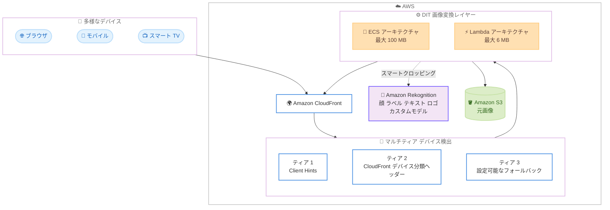

# Dynamic Image Transformation for Amazon CloudFront - 4 つの新機能を追加

**リリース日**: 2026年9月8日
**サービス**: Amazon CloudFront (AWS ソリューション: Dynamic Image Transformation for Amazon CloudFront)
**機能**: 拡張スマートクロッピング、マルチティアデバイス検出による自動画像最適化、画像変換プレイグラウンド、ECS / Lambda アーキテクチャの機能パリティ

📊 [このアップデートのインフォグラフィックを見る](https://takech9203.github.io/aws-news-summary/20260908-dynamic-image-transfromation-adds-new-features.html)

## 概要

Dynamic Image Transformation for Amazon CloudFront (DIT、旧称 Serverless Image Handler) に 4 つの新機能が追加されました。DIT は、画像の事前処理や複数バージョンの保持を不要にし、リアルタイムで画像の変換・最適化を行う AWS ソリューションです。今回のアップデートにより、より高度な画像の自動加工と、より広範なデバイスへの最適化配信が可能になります。

追加された 4 つの機能は次のとおりです。(1) カスタムラベル検出と高度な構図コントロールを備えた拡張スマートクロッピング、(2) CloudFront のマルチティアデバイス検出を活用した自動画像最適化の強化、(3) 変換のテスト・検証を行えるインタラクティブな画像変換プレイグラウンド、(4) ECS アーキテクチャと Lambda アーキテクチャ間の完全な機能パリティです。

E コマースサイトやメディアサイトなど、多様なデバイスに向けて大量の画像を配信するワークロードを持つユーザーにとって、運用コストの削減とエンドユーザー体験の向上の両面で価値のあるアップデートです。

**アップデート前の課題**

- スマートクロッピングは顔検出が中心で、商品・テキスト・ロゴ・カスタムオブジェクトを保持した構図調整を単一リクエストで組み合わせることができなかった
- 自動画像最適化はブラウザの Client Hints に依存しており、Client Hints に非対応の約 30% のトラフィック (スマート TV など多様なデバイスを含む) は最適化されないまま配信されていた
- 変換ポリシーの動作やパフォーマンスを事前に検証する手段がなく、本番配信前のテストに手間がかかっていた
- Lambda アーキテクチャと ECS アーキテクチャで利用できる機能に差があり、アーキテクチャ選択が機能要件に制約されていた

**アップデート後の改善**

- 顔、ラベル、テキスト、ロゴ、カスタム Amazon Rekognition モデルといった複数の検出方法を単一リクエストで組み合わせ、アスペクト比・パディング・グラビティ制約をビジネス要件の優先度に応じて設定できるようになった
- Client Hints の背後に CloudFront のデバイス分類ヘッダーと設定可能なフォールバックを階層化するティア型検出により、ブラウザ以外のあらゆるデバイスタイプにも適切なサイズの画像を配信できるようになった
- プレイグラウンドで変換後の画像とともに、元画像と出力画像のサイズ、フォーマット、ファイルサイズ、圧縮率、処理時間などの拡張メトリクスを確認し、変換ポリシーの性能を検証できるようになった
- ECS と Lambda の両アーキテクチャで同一の機能セットを利用でき、性能・コスト要件のみに基づいてアーキテクチャを選択できるようになった

## アーキテクチャ図



多様なデバイスからのリクエストを CloudFront が受け付け、Client Hints・CloudFront デバイス分類ヘッダー・フォールバックの 3 層でデバイスを検出し、DIT (ECS または Lambda) が S3 上の元画像を Rekognition と連携しながら変換・最適化して配信するフローを示しています。

## サービスアップデートの詳細

### 主要機能

1. **拡張スマートクロッピング (カスタムラベル検出と高度な構図コントロール)**
   - 顔、ラベル、テキスト、ロゴ、カスタム Amazon Rekognition モデルなど、複数の検出方法を単一リクエストで組み合わせ可能
   - クロップ後の画像内に商品、テキスト、ロゴ、カスタムオブジェクトを確実に保持
   - アスペクト比、パディング、グラビティ (重心位置) の制約を設定可能で、ビジネス要件に応じた優先順位付けに対応

2. **自動画像最適化の強化 (マルチティアデバイス検出)**
   - Client Hints の背後に CloudFront のデバイス分類ヘッダーと設定可能なフォールバックを階層化するティア型検出アプローチを採用
   - Client Hints 非対応により従来最適化されずに配信されていた約 30% のトラフィックのギャップを解消
   - スマートフォン、タブレットからスマート TV まで、ブラウザ以外を含むすべてのデバイスタイプに適切なサイズの画像を配信

3. **インタラクティブな画像変換プレイグラウンド**
   - 変換後の画像を表示しながら変換のテスト・検証が可能
   - 元画像と出力画像のサイズ、フォーマット、ファイルサイズ、圧縮率、処理時間などの拡張メトリクスを表示
   - 変換ポリシーのパフォーマンスを本番適用前に検証可能

4. **ECS / Lambda アーキテクチャ間の完全な機能パリティ**
   - 従来 ECS アーキテクチャのみで提供されていた機能を含め、両アーキテクチャで同一の機能セットを利用可能
   - 機能要件ではなく、画像サイズ・性能・コスト要件に基づいたアーキテクチャ選択が可能

## 技術仕様

### アーキテクチャオプションの比較

| 項目 | Lambda アーキテクチャ | ECS アーキテクチャ |
|------|----------------------|--------------------|
| 特徴 | コスト最適化されたサーバーレス処理 | 高性能な画像処理 |
| 対応画像サイズ | 最大 6 MB | 最大 100 MB |
| 機能セット | 完全な機能パリティ (今回のアップデート) | 変換ポリシー、スマートクロッピング、コンテンツモデレーション、マルチティアデバイス検出、非 S3 オリジン対応、管理インターフェイスなど |

### デバイス検出のティア構成

| ティア | 検出方法 | 説明 |
|--------|----------|------|
| 1 | Client Hints | ブラウザが送信するヒント情報に基づく最適化 |
| 2 | CloudFront デバイス分類ヘッダー | CloudFront が付与するデバイスタイプヘッダーによる分類 |
| 3 | 設定可能なフォールバック | 上記で判定できない場合のデフォルト動作を設定可能 |

### スマートクロッピングの検出方法

| 検出方法 | 内容 |
|----------|------|
| 顔検出 | 人物の顔を保持したクロッピング |
| ラベル検出 | 商品などの一般オブジェクトを保持 |
| テキスト検出 | 画像内テキストを保持 |
| ロゴ検出 | ブランドロゴを保持 |
| カスタム Rekognition モデル | Rekognition Custom Labels による独自オブジェクトの検出・保持 |

## 設定方法

### 前提条件

1. AWS アカウントと、CloudFormation スタックをデプロイできる IAM 権限
2. 元画像を格納する Amazon S3 バケット (ECS アーキテクチャでは非 S3 オリジンも利用可能)
3. スマートクロッピングでカスタムモデルを使用する場合は、Amazon Rekognition Custom Labels のトレーニング済みモデル

### 手順

#### ステップ1: CloudFormation テンプレートのデプロイ

```bash
# 実装ガイドから CloudFormation テンプレートを取得してデプロイ
aws cloudformation create-stack \
  --stack-name dynamic-image-transformation \
  --template-url <実装ガイド記載のテンプレート URL> \
  --capabilities CAPABILITY_IAM
```

AWS ソリューションとして提供される CloudFormation テンプレートをデプロイします。デプロイ時に Lambda アーキテクチャまたは ECS アーキテクチャを選択します。ソースコードは GitHub リポジトリ (aws-solutions/serverless-image-handler) から取得し、AWS CDK でのデプロイも可能です。

#### ステップ2: 画像変換の指定

```text
# URL クエリパラメータまたは事前定義の変換ポリシーで変換を指定
https://<CloudFront ドメイン>/<画像パス>?width=800&format=auto
```

画像の変換は URL クエリパラメータ、または事前定義した変換ポリシーで指定します。自動最適化を有効にすると、マルチティアデバイス検出に基づいてデバイスごとに適切なサイズ・フォーマットで配信されます。

#### ステップ3: プレイグラウンドでの検証

デプロイ後に利用できる画像変換プレイグラウンドで、変換結果の画像と拡張メトリクス (元画像・出力画像のサイズ、フォーマット、ファイルサイズ、圧縮率、処理時間) を確認し、変換ポリシーの動作とパフォーマンスを本番適用前に検証します。

## メリット

### ビジネス面

- **コンバージョン率の向上**: 商品、ロゴ、テキストを欠かさないスマートクロッピングにより、E コマースやメディアでの画像品質を維持したまま多様な表示枠に対応できる
- **配信コストの削減**: 約 30% の未最適化トラフィックにも右サイズの画像を配信できるようになり、帯域幅コストを削減できる
- **ユーザー体験の向上**: デバイスごとに最適な画像を配信することで、ページ読み込み時間が短縮される

### 技術面

- **画像パイプラインの簡素化**: 事前処理や複数バージョンの画像保持が不要になり、単一の元画像からオンデマンドで変換できる
- **検証プロセスの効率化**: プレイグラウンドの拡張メトリクスにより、変換ポリシーの効果を定量的に確認してから本番適用できる
- **アーキテクチャ選択の柔軟性**: 機能パリティの実現により、画像サイズ (6 MB / 100 MB)、性能、コストの観点だけでアーキテクチャを選択できる

## デメリット・制約事項

### 制限事項

- Lambda アーキテクチャで処理できる画像は最大 6 MB、ECS アーキテクチャでは最大 100 MB
- スマートクロッピングやコンテンツモデレーションは Amazon Rekognition を利用するため、Rekognition の利用料金が別途発生する
- カスタムラベル検出には Rekognition Custom Labels モデルの事前トレーニングが必要

### 考慮すべき点

- CloudFront はデフォルトで従量課金モデルを使用するが、トラフィック量によっては固定料金プランへの切り替えでコストを最適化できる可能性があるため、月間データ転送量とリクエスト数を事前に評価することが推奨される
- 既存の Serverless Image Handler / DIT からのアップグレード時は、アーキテクチャ間の機能差の解消による設定変更の影響を確認する必要がある

## ユースケース

### ユースケース1: E コマースサイトの商品画像配信

**シナリオ**: 商品一覧、詳細ページ、レコメンドウィジェットなど、表示枠ごとに異なるアスペクト比で商品画像を表示したい。クロップ時に商品本体やブランドロゴが切れてしまうことを防ぎたい。

**実装例**:
```text
ラベル検出 (商品) + ロゴ検出を組み合わせたスマートクロッピングを
単一リクエストで指定し、表示枠ごとのアスペクト比とパディングを設定。
グラビティ制約で商品を優先的に中央配置。
```

**効果**: 手動でのクロップ作業なしに、商品とロゴが常に収まった一貫性のある画像を全表示枠に配信できる。

### ユースケース2: スマート TV を含むマルチデバイス向けメディア配信

**シナリオ**: 動画配信サービスのサムネイル画像を、ブラウザだけでなくスマート TV やセットトップボックスのアプリにも配信している。Client Hints 非対応クライアントには最適化されていない大きな画像が配信されていた。

**実装例**:
```text
自動画像最適化を有効化し、マルチティアデバイス検出を利用。
Client Hints -> CloudFront デバイス分類ヘッダー -> フォールバックの
順で判定し、デバイスタイプごとに適切な解像度・フォーマットで配信。
```

**効果**: Client Hints 非対応の約 30% のトラフィックにも最適化が適用され、帯域幅コストの削減と表示速度の向上を実現できる。

### ユースケース3: 変換ポリシー導入前のパフォーマンス検証

**シナリオ**: 新しい画像フォーマットや圧縮設定を本番導入する前に、画質とファイルサイズ削減効果、処理時間への影響を確認したい。

**実装例**:
```text
画像変換プレイグラウンドで代表的な画像に対して変換ポリシーを適用し、
出力サイズ、フォーマット、圧縮率、処理時間のメトリクスを比較検証。
```

**効果**: 定量的なメトリクスに基づいて変換ポリシーを調整でき、本番環境への影響を最小化しながら最適な設定を導入できる。

## 料金

DIT ソリューション自体の利用に追加料金はなく、デプロイされる AWS サービス (CloudFront、Lambda または ECS、S3、Rekognition など) の利用料金が発生します。コストは選択するアーキテクチャ (Lambda / ECS) によって異なります。

CloudFront はデフォルトで従量課金モデルを使用しますが、想定トラフィックによっては CloudFront の固定料金プランに切り替えることでコストを最適化できる場合があります。デプロイ前に月間データ転送量と画像リクエスト数を評価することが推奨されます。詳細は実装ガイドの [Cost ページ](https://docs.aws.amazon.com/solutions/latest/dynamic-image-transformation-for-amazon-cloudfront/cost.html) を参照してください。

## 利用可能リージョン

すべての商用リージョンに加え、以下の 4 つのオプトインリージョンでデプロイ可能です。

- アジアパシフィック (香港)
- 中東 (バーレーン)
- アフリカ (ケープタウン)
- 欧州 (ミラノ)

## 関連サービス・機能

- **Amazon CloudFront**: 画像配信の CDN として機能し、デバイス分類ヘッダーによるマルチティアデバイス検出を提供
- **Amazon Rekognition**: スマートクロッピングの顔・ラベル・テキスト・ロゴ検出、カスタムモデル (Custom Labels)、コンテンツモデレーションを提供
- **AWS Lambda / Amazon ECS**: 画像変換処理の実行基盤。要件に応じていずれかのアーキテクチャを選択
- **Amazon S3**: 元画像の格納先 (ECS アーキテクチャでは非 S3 オリジンにも対応)

## 参考リンク

- 📊 [インフォグラフィック](https://takech9203.github.io/aws-news-summary/20260908-dynamic-image-transfromation-adds-new-features.html)
- [公式発表 (What's New)](https://aws.amazon.com/about-aws/whats-new/2026/08/dynamic-image-transfromation-adds-new-features/)
- [実装ガイド (Implementation Guide)](https://docs.aws.amazon.com/solutions/latest/dynamic-image-transformation-for-amazon-cloudfront/solution-overview.html)
- [アーキテクチャ概要](https://docs.aws.amazon.com/solutions/latest/dynamic-image-transformation-for-amazon-cloudfront/architecture-overview.html)
- [GitHub リポジトリ](https://github.com/aws-solutions/serverless-image-handler)
- [CloudFront 料金ページ](https://aws.amazon.com/cloudfront/pricing/)

## まとめ

Dynamic Image Transformation for Amazon CloudFront の今回のアップデートは、スマートクロッピングの高度化とデバイス検出の多層化により、画像配信の品質とカバレッジを大きく向上させるものです。特に Client Hints 非対応の約 30% のトラフィックへの最適化拡大は、帯域幅コストとユーザー体験の両面で効果が期待できます。既存の Serverless Image Handler / DIT 利用者は最新バージョンへのアップグレードを検討し、新規導入時はプレイグラウンドで変換ポリシーを検証した上で、画像サイズと性能要件に応じて Lambda / ECS アーキテクチャを選択することを推奨します。
