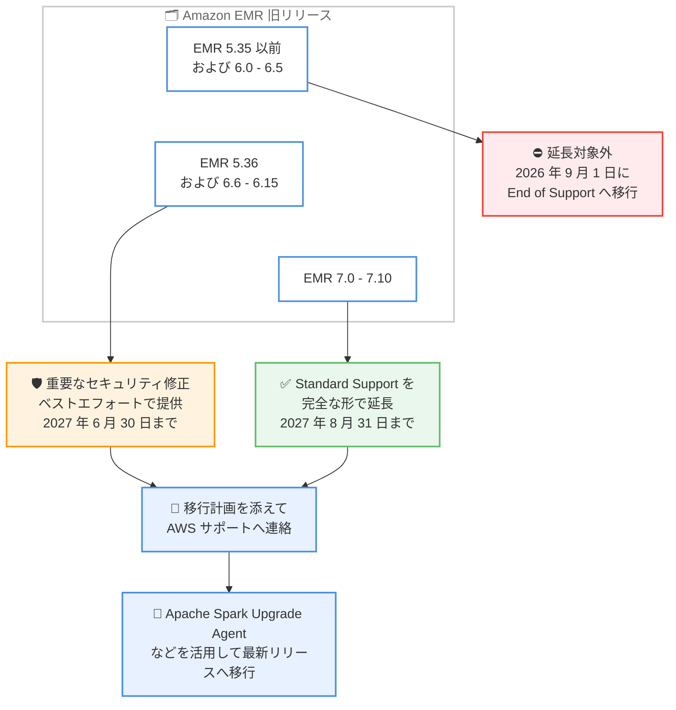

# Amazon EMR - 旧リリースからの移行に向けた追加費用なしのサポート延長

**リリース日**: 2026年9月8日
**サービス**: Amazon EMR
**機能**: Extended Support (旧リリース向けサポート延長)

📊 [このアップデートのインフォグラフィックを見る](https://takech9203.github.io/aws-news-summary/20260908-emr-extended-support-migration.html)

## 概要

Amazon EMR は、旧リリースを利用中のお客様が最新リリースへ移行するための時間を、追加費用なしで延長すると発表しました。移行作業を進めている間も対象リリースのワークロードはサポートを受け続けることができ、オプトイン手続きや追加料金は不要です。

具体的には、EMR リリース 5.36 および 6.6 から 6.15 に対しては、重要なセキュリティ修正をベストエフォートベースで 2027 年 6 月 30 日まで提供します。また、EMR リリース 7.0 から 7.10 に対しては、Standard Support を 2027 年 8 月 31 日まで完全な形で延長します。延長を受けるには、移行計画とアップグレードに必要な支援内容を添えて AWS サポートに連絡する必要があります。

このアップデートは、EMR on EC2、EMR on EKS、EMR Serverless のすべてのデプロイメントモデルに適用され、Amazon EMR が利用可能なすべての AWS リージョンで有効です。移行作業には、Apache Spark アプリケーションのアップグレードを支援する Apache Spark Upgrade Agent を活用できます。

**アップデート前の課題**

このアップデート以前は、旧リリースを利用するお客様に以下の課題がありました。

- 2024 年 7 月 25 日発表の Standard Support ポリシーにより、2022 年 7 月 24 日以前にリリースされたバージョンは End of Support と位置付けられ、Bridge Support の期限である 2026 年 8 月 31 日までに移行を完了する必要があった
- 大規模な Spark アプリケーションのバージョンアップグレードには、API 変更の分析、依存関係の解決、動作検証などで数か月単位のエンジニアリング工数が必要であり、期限内の移行が困難なケースがあった
- 期限を過ぎるとサポートケースの作成やセキュリティ修正の提供が受けられなくなり、移行途中のワークロードがリスクにさらされる懸念があった

**アップデート後の改善**

今回のアップデートにより、以下が可能になりました。

- EMR 5.36 および 6.6 から 6.15 のワークロードは、2027 年 6 月 30 日まで重要なセキュリティ修正 (ベストエフォート) を受けながら移行作業を継続できるようになった
- EMR 7.0 から 7.10 のワークロードは、2027 年 8 月 31 日まで完全な Standard Support を受けられるようになった
- 延長は追加費用なしで提供され、AWS サポートへ移行計画を提出するだけで利用できるようになった

## アーキテクチャ図



EMR リリースバージョンごとの Extended Support 適用範囲と期限、および延長を受けるための手順を示しています。5.35 以前と 6.5 以前は延長対象外である点に注意が必要です。

## サービスアップデートの詳細

### 主要機能

1. **EMR 5.36 および 6.6 - 6.15 への重要なセキュリティ修正の提供**
   - 重要なセキュリティ修正に限定して、ベストエフォートベースで提供
   - 提供期限は 2027 年 6 月 30 日まで
   - End of Support の開始は 2027 年 6 月 30 日、End of Life の開始は 2028 年 7 月 1 日に後ろ倒し

2. **EMR 7.0 - 7.10 への Standard Support の完全な延長**
   - 技術サポートケースの作成や修正の提供を含む、完全な Standard Support を延長
   - 延長期限は 2027 年 8 月 31 日まで
   - 本来 24 か月でサポートが終了するリリース (例: 7.3 は 2026 年 10 月 16 日終了予定) も 2027 年 8 月 31 日まで一律で延長

3. **オプトイン不要・追加費用なしの提供**
   - 延長そのものに追加料金は発生しない
   - 延長を受けるには、移行計画とアップグレードに必要な支援内容を添えて AWS サポートにチケットを起票する
   - 移行を積極的に進めていることが条件

4. **Apache Spark Upgrade Agent による移行支援**
   - 自然言語プロンプト、自動コード変換、データ品質検証により Spark バージョンアップグレードを加速する AI エージェント
   - EMR on EC2 および EMR Serverless 上の PySpark / Scala アプリケーションに対応
   - 追加費用なしで利用可能 (検証ジョブ実行時の EMR リソース費用のみ発生)

## 技術仕様

### リリースバージョン別のサポート期限

| リリースバージョン | 延長内容 | 延長期限 | End of Support 開始 | End of Life 開始 |
|------|------|------|------|------|
| 2.x - 5.35、6.0 - 6.5 | 延長なし (Bridge Support のみ) | なし | 2026 年 9 月 1 日 | 2027 年 9 月 1 日 |
| 5.36、6.6 - 6.15 | 重要なセキュリティ修正 (ベストエフォート) | 2027 年 6 月 30 日 | 2027 年 6 月 30 日 | 2028 年 7 月 1 日 |
| 7.0 - 7.10 | Standard Support の完全な延長 | 2027 年 8 月 31 日 | 2027 年 8 月 31 日 | 2028 年 8 月 31 日 |
| 7.11 以降 | 対象外 (通常の 24 か月サポート) | なし | リリースから 24 か月後 | End of Support から 12 か月後 |

### サポートライフサイクルの各ステージ

| ステージ | 内容 |
|------|------|
| Standard Support | リリースから 24 か月間。技術サポートケースの作成と修正の提供が可能 |
| End of Support (EoS) | 12 か月間。サポートケースの作成不可、修正・パッチの提供なし。ワークロードの実行は可能 |
| End of Life (EoL) | クラスターの実行は継続可能だが、セキュリティ上・運用上の理由により API や SDK から削除される可能性あり |

## 設定方法

### 前提条件

1. EMR 5.36、6.6 - 6.15、または 7.0 - 7.10 のいずれかのリリースでワークロードを実行していること
2. 最新リリースへの移行を積極的に進めていること
3. AWS サポートにケースを起票できること

### 手順

#### ステップ1: 利用中の EMR リリースバージョンを確認する

```bash
# EMR on EC2 クラスターのリリースバージョンを一覧表示
aws emr list-clusters --active \
  --query "Clusters[].{Id:Id,Name:Name}" --output table

# 特定クラスターのリリースラベルを確認
aws emr describe-cluster --cluster-id j-XXXXXXXXXXXXX \
  --query "Cluster.ReleaseLabel"
```

アクティブなクラスターの一覧を取得し、各クラスターが使用している EMR リリースラベル (例: emr-6.15.0) を確認します。延長対象のバージョンかどうかを判定します。

#### ステップ2: 移行計画を作成し AWS サポートに連絡する

移行対象のワークロード一覧、移行先リリース、スケジュール、必要な支援内容をまとめた移行計画を作成し、AWS サポートにチケットを起票します。これにより Extended Support の延長を受けられます。

#### ステップ3: Apache Spark Upgrade Agent で移行を実施する

MCP 互換の AI アシスタントと MCP Proxy for AWS を設定し、Amazon SageMaker Unified Studio Managed MCP Server 経由で Spark Upgrade Agent を利用します。エージェントはプロジェクト構造の分析、アップグレード計画の生成、ビルドエラーの修正、EMR 上での検証ジョブ実行とデータ品質検証を段階的に実施します。すべての変更はユーザーの承認のもとで適用されます。

## メリット

### ビジネス面

- **移行期間の確保**: 2026 年 8 月 31 日の Bridge Support 終了後も、最長で約 1 年の追加期間を確保でき、無理のない移行計画を立てられる
- **追加費用なし**: 延長サポートは無償で提供されるため、移行期間中の予算への影響がない
- **コンプライアンスリスクの低減**: 移行期間中も重要なセキュリティ修正を受けられるため、セキュリティ要件を維持しやすい

### 技術面

- **全デプロイメントモデル対応**: EMR on EC2、EMR on EKS、EMR Serverless のいずれでも同じ延長ポリシーが適用される
- **移行ツールの提供**: Apache Spark Upgrade Agent により、従来数か月かかっていた Spark アップグレードの分析・コード変換・検証を大幅に効率化できる
- **7.x 系は完全なサポート**: 7.0 - 7.10 はセキュリティ修正だけでなく技術サポートケースの作成を含む完全な Standard Support を受けられる

## デメリット・制約事項

### 制限事項

- EMR 5.35 以前および 6.0 - 6.5 は延長対象外であり、2026 年 9 月 1 日に End of Support へ移行する
- 5.36 および 6.6 - 6.15 への提供はベストエフォートかつ重要なセキュリティ修正のみで、通常の技術サポートは含まれない
- 延長を受けるには AWS サポートへの連絡と移行計画の提出が必要 (自動適用ではない)
- 7.11 以降のリリースは今回の延長の対象外で、通常の 24 か月サポートポリシーが適用される

### 考慮すべき点

- 延長はあくまで移行のための猶予であり、恒久的なサポート継続ではないため、期限から逆算した移行計画の策定が必要
- Extras コンポーネント (便宜的に提供されるライブラリ等) は Standard Support の対象外である点は従来と変わらない
- Core Engine のオープンソースコンポーネントがアップストリームで EoL に達した場合、修正の提供が保証されない場合がある

## ユースケース

### ユースケース1: EMR 6.15 上の大規模 Spark バッチ基盤の段階的移行

**シナリオ**: EMR 6.15 (Spark 3.4.1) 上で数百本の Spark バッチジョブを運用しており、2026 年 8 月末までの移行完了が困難な状況。

**実装例**:
```text
1. AWS サポートに移行計画 (対象ジョブ一覧、移行先 EMR 7.x、四半期ごとのマイルストーン) を提出
2. Apache Spark Upgrade Agent でジョブを優先度順にアップグレード
3. 2027 年 6 月 30 日までに全ジョブの移行を完了
```

**効果**: 重要なセキュリティ修正を受けながら、約 10 か月の追加期間で段階的かつ安全に移行できる。

### ユースケース2: EMR 7.3 の Standard Support 期限切れ回避

**シナリオ**: EMR 7.3 を利用中で、本来の Standard Support 終了日 (2026 年 10 月 16 日) が目前に迫っているが、検証環境の都合で最新リリースへの更新が間に合わない。

**実装例**:
```text
1. AWS サポートに連絡し、EMR 7.13 以降への移行計画を提出
2. 2027 年 8 月 31 日まで延長された完全な Standard Support のもとで検証・移行を実施
```

**効果**: サポート切れによる空白期間を作らず、技術サポートを受けながら移行を完了できる。

### ユースケース3: EMR on EKS / EMR Serverless 環境の移行計画統一

**シナリオ**: EMR on EC2、EMR on EKS、EMR Serverless が混在する環境で、デプロイメントモデルごとに異なる移行期限を管理するのが煩雑。

**実装例**:
```text
1. 全デプロイメントモデルの利用バージョンを棚卸し
2. 延長ポリシーが全モデル共通であることを前提に、統一した移行ロードマップを作成
3. AWS サポートに一括で移行計画を提出
```

**効果**: 全デプロイメントモデルで同一の延長期限を前提にできるため、移行ガバナンスを一元化できる。

## 料金

Extended Support は追加費用なしで提供されます。オプトインや追加の契約は不要で、AWS サポートへ移行計画を提出することで延長を受けられます。

Apache Spark Upgrade Agent も追加費用なしで利用でき、検証ジョブの実行時に使用する EMR リソース (EC2 インスタンスや EMR Serverless の実行時間など) の費用のみが発生します。

なお、サポート対象外の使い方をしている場合でも、その EMR 使用料金は AWS 請求に含まれ、サポート料金の計算対象となります。

## 利用可能リージョン

Amazon EMR が利用可能なすべての AWS リージョンで、すべてのデプロイメントモデル (EMR on EC2、EMR on EKS、EMR Serverless) に適用されます。

## 関連サービス・機能

- **Apache Spark Upgrade Agent**: MCP 互換の AI アシスタントから利用できる Spark アップグレード支援エージェント。コード分析、自動変換、検証を通じて最新リリースへの移行を加速する
- **Amazon SageMaker Unified Studio**: Spark Upgrade Agent のバックエンドとなる Managed MCP Server を提供する
- **AWS Support**: Extended Support の延長を受けるための窓口。移行計画の提出とアップグレード支援の依頼に使用する

## 参考リンク

- 📊 [インフォグラフィック](https://takech9203.github.io/aws-news-summary/20260908-emr-extended-support-migration.html)
- [公式発表 (What's New)](https://aws.amazon.com/about-aws/whats-new/2026/09/emr-extended-support-migration/)
- [Amazon EMR Standard Support ポリシー (リリース別サポート期限一覧)](https://docs.aws.amazon.com/emr/latest/ReleaseGuide/emr-standard-support.html)
- [Apache Spark Upgrade Agent for Amazon EMR](https://docs.aws.amazon.com/emr/latest/ReleaseGuide/spark-upgrades.html)

## まとめ

Amazon EMR の旧リリースを利用中のお客様は、追加費用なしで最長 2027 年 8 月 31 日 (7.0 - 7.10) または 2027 年 6 月 30 日 (5.36、6.6 - 6.15) までサポート延長を受けられるようになりました。延長は自動適用ではないため、対象リリースを利用中の場合は、まず利用バージョンを棚卸しし、移行計画を添えて AWS サポートに連絡することを推奨します。あわせて Apache Spark Upgrade Agent の活用により、移行工数を大幅に削減できます。
