# Kiro - ISO/IEC 27001:2022 認証範囲への追加

**リリース日**: 2026年09月08日
**サービス**: Kiro
**機能**: AWS の ISO/IEC 27001:2022 認証範囲に Kiro が含まれるようになりました

📊 [このアップデートのインフォグラフィックを見る](https://takech9203.github.io/aws-news-summary/20260908-kiro-iso-27001.html)

## 概要

AWS が提供する AI 搭載 IDE である Kiro が、AWS の ISO/IEC 27001:2022 認証の対象範囲 (defined scope) に含まれるようになりました。これにより、調達 (プロキュアメント)、セキュリティ、ベンダーリスク管理の各チームは、Kiro の採用可否を判断する際に、独立した第三者機関によって検証されたエビデンスを利用できるようになります。

Kiro はソースコード、システムアーキテクチャ、社内ドキュメントなどのプロジェクトコンテキストを扱う開発者ツールです。これらの情報には知的財産や、組織のセキュリティポリシーの対象となるデータが含まれる可能性があります。開発者ツールの導入を承認する前に、組織はそのツールの提供元が情報セキュリティリスクをどのように特定・管理・レビューしているかについて、明確なエビデンスを必要とします。今回の発表により、Kiro を対象とした情報セキュリティマネジメントシステム (ISMS) が国際標準の要求事項に照らして評価されていることが、独立した認証機関によって保証されます。

**アップデート前の課題**

Kiro が ISO/IEC 27001 認証の範囲に含まれる前は、以下の課題がありました。

- 課題1: 企業のセキュリティチームや調達チームが Kiro の導入審査を行う際に、独立した第三者による検証済みエビデンスを参照できなかった
- 課題2: ベンダーリスク評価において、Kiro を提供する組織の情報セキュリティ管理体制を客観的に確認する手段が限られていた
- 課題3: 顧客やパートナーからの開発ツールに関するセキュリティ質問に対して、国際標準に基づく認証を根拠として回答できなかった

**アップデート後の改善**

今回のアップデートにより、以下が可能になりました。

- 改善1: AWS の ISO/IEC 27001:2022 認証書と関連ドキュメントを、Kiro の調達・ベンダー承認プロセスの共通インプットとして利用できるようになった
- 改善2: Kiro のデータ保存、暗号化、データレジデンシーなどのデータ取り扱いドキュメントと合わせて、認証を情報セキュリティ評価に活用できるようになった
- 改善3: 顧客やパートナーからの開発ツールのセキュリティレビューに関する質問に、認証と Kiro のドキュメントを根拠として回答できるようになった

## アーキテクチャ図

```mermaid
flowchart TD
    subgraph Evidence["📄 レビューに利用できるエビデンス"]
        direction LR
        Cert["📜 AWS ISO/IEC 27001:2022<br/>認証書"]
        Scope["📋 AWS サービス対象範囲<br/>リスト"]
        Docs["📚 Kiro コンプライアンス検証<br/>データ保護ドキュメント"]
        Cert ~~~ Scope ~~~ Docs
    end

    subgraph Org["🏢 組織内レビュー"]
        direction LR
        Procure["🛒 調達 - ベンダー承認"]
        Sec["🔒 情報セキュリティ評価"]
        Partner["🤝 顧客 - パートナー対応"]
        Procure ~~~ Sec ~~~ Partner
    end

    Auditor(["🏛️ EY CertifyPoint<br/>独立認証機関"]) -.->|検証| Cert
    Evidence --> Org
    Org --> Decision{"✅ Kiro 採用判断"}

    classDef evidence fill:#E8F1FF,stroke:#4A90E2,stroke-width:2px,color:#333333
    classDef org fill:#E9F7EC,stroke:#66BB6A,stroke-width:2px,color:#333333
    classDef auditor fill:#E3F2FD,stroke:#BBDEFB,stroke-width:2px,color:#1565C0
    classDef decision fill:#F3E5F5,stroke:#7B61FF,stroke-width:2px,color:#333333
    classDef layer fill:none,stroke:#CCCCCC,stroke-width:2px,color:#666666

    class Cert,Scope,Docs evidence
    class Procure,Sec,Partner org
    class Auditor auditor
    class Decision decision
    class Evidence,Org layer
```



独立認証機関が検証した ISO/IEC 27001:2022 認証と Kiro のドキュメント群を、組織内の調達・セキュリティ・顧客対応の各チームが共通のエビデンスとして活用し、Kiro の採用判断につなげる流れを示しています。

## サービスアップデートの詳細

### 主要機能

1. **ISO/IEC 27001:2022 認証範囲への Kiro の追加**
   - Kiro が AWS の ISO/IEC 27001:2022 認証の定義済みスコープに含まれるようになった
   - ISO/IEC 27001 は情報セキュリティマネジメントシステム (ISMS) の要求事項を定義する国際標準
   - ISMS は、組織が情報セキュリティリスクを管理するために用いるポリシー、プロセス、責任、統制を統合したもの

2. **独立した第三者機関による検証**
   - AWS の ISO/IEC 27001:2022 認証は、オランダ認定評議会 (Dutch Accreditation Council) の認定を受けた独立認証機関である EY CertifyPoint によって検証されている
   - 定義済みスコープを対象とする AWS の ISMS が、標準の要求事項に照らして評価されていることを独立した立場から保証する
   - 認証の要求事項は一時点のレビューに限定されず、サービス・技術・リスクの変化に応じた継続的な適合が求められる

3. **調達・セキュリティレビューでの実践的な活用**
   - 調達・ベンダー承認: セキュリティ、調達、法務、ベンダーリスクの各チームが、認証書と関連ドキュメントをレビューの共通インプットとして利用可能
   - 組織内の情報セキュリティ: データ保存、暗号化、データレジデンシーなどに関する Kiro のドキュメントと合わせて認証を評価可能
   - 顧客・パートナーからの質問対応: 開発ツールのセキュリティレビューに Kiro がどう適合するかについての回答を、認証と Kiro のドキュメントで裏付け可能

## 技術仕様

### 認証の概要

| 項目 | 詳細 |
|------|------|
| 標準 | ISO/IEC 27001:2022 |
| 対象 | 情報セキュリティマネジメントシステム (ISMS) |
| 認証機関 | EY CertifyPoint |
| 認証機関の認定 | オランダ認定評議会 (Dutch Accreditation Council) |
| スコープ | AWS の ISO/IEC 27001:2022 認証の定義済みスコープに Kiro を含む |
| 標準の主な要求事項 | リスクの特定、適切な統制の選択、統制運用の責任割り当て、有効性の継続的モニタリング |

## レビューの進め方

### 前提条件

1. 組織のセキュリティポリシー、想定する利用方法、データ要件、ガバナンス統制を整理しておく
2. 開発者ツールのベンダーリスク評価プロセスを確認しておく

### 手順

#### ステップ1: 公開されている認証書の確認

[AWS ISO/IEC 27001:2022 認証書](https://d1.awsstatic.com/onedam/marketing-channels/website/aws/en_US/certification/compliance/iso_27001_global_certification.pdf) を取得し、認証の有効性と発行機関を確認します。

#### ステップ2: Kiro がスコープに含まれることの確認

[AWS のサービス対象範囲リスト](https://aws.amazon.com/compliance/iso-certified/) で、Kiro が ISO/IEC 27001 認証の対象サービスとして掲載されていることを確認します。

#### ステップ3: Kiro のコンプライアンス・データ保護ドキュメントの確認

Kiro の [コンプライアンス検証ドキュメント](https://kiro.dev/docs/privacy-and-security/compliance-validation/) と [データ保護ドキュメント](https://kiro.dev/docs/privacy-and-security/data-protection/) を確認し、データ保存、暗号化、データレジデンシーなどの取り扱いを組織の要件と照合します。必要に応じて第三者レポートも参照します。

## メリット

### ビジネス面

- **調達プロセスの迅速化**: 独立検証済みの認証をベンダー承認の共通インプットとして利用でき、開発ツール導入の審査を効率化できる
- **ベンダーリスク評価の客観性向上**: 国際標準に基づく第三者検証により、Kiro を提供する組織のセキュリティ管理体制を客観的に評価できる
- **顧客・パートナーへの説明責任**: 自社の開発ツーリングに関するセキュリティ質問へ、認証を根拠とした回答が可能になる

### 技術面

- **継続的な保証**: ISO/IEC 27001 は一時点の審査ではなく、リスクや技術の変化に応じた継続的な ISMS の運用・改善を要求するため、長期的な信頼性の裏付けとなる
- **ドキュメントとの組み合わせ評価**: 認証に加えて、Kiro のデータ保護・コンプライアンス検証ドキュメントを組み合わせた多面的な評価が可能
- **エンタープライズ環境への導入障壁の低減**: 厳格なセキュリティ要件を持つ組織でも、Kiro の導入審査を進めやすくなる

## デメリット・制約事項

### 制限事項

- 認証は Kiro を対象とするセキュリティ管理プロセスに関するエビデンスであり、個々の組織の利用方法に対する適合性を保証するものではない
- 認証の対象は AWS の ISMS の定義済みスコープであり、組織側のセキュリティ統制は各組織の責任で整備する必要がある

### 考慮すべき点

- 各組織は認証というエビデンスを、自組織のポリシー、想定する利用方法、データ要件、ガバナンス統制と合わせて評価する必要がある
- ISO/IEC 27001 認証に加えて、業界や地域固有のコンプライアンス要件 (SOC レポートなど) が必要な場合は、別途第三者レポートの確認が必要

## ユースケース

### ユースケース1: エンタープライズでの開発ツール導入審査

**シナリオ**: 大企業のセキュリティチームが、開発部門からの Kiro 導入申請を審査する。

**実装例**:
```
1. AWS ISO/IEC 27001:2022 認証書 (PDF) を取得
2. AWS サービス対象範囲リストで Kiro の掲載を確認
3. Kiro のデータ保護ドキュメントで暗号化・データレジデンシーを確認
4. 自社のセキュリティポリシーと照合して承認判断
```

**効果**: 独立検証済みのエビデンスに基づく審査により、導入承認までの期間を短縮し、判断の客観性を確保できる。

### ユースケース2: ベンダーリスク管理チームによる定期評価

**シナリオ**: ベンダーリスク管理チームが、利用中の開発ツールの年次評価を実施する。

**実装例**:
```
1. 認証の有効期限と認証機関 (EY CertifyPoint) を確認
2. Kiro のコンプライアンス検証ドキュメントの更新内容を確認
3. 評価結果をベンダーリスク台帳に記録
```

**効果**: 継続的に維持される認証を根拠として、定期評価の工数を削減しつつ評価品質を維持できる。

### ユースケース3: 顧客からのセキュリティ質問票への回答

**シナリオ**: 受託開発企業が、顧客から開発環境のセキュリティに関する質問票を受領した。

**実装例**:
```
1. 開発ツーリングの項目で Kiro の利用を明記
2. AWS ISO/IEC 27001:2022 認証と対象範囲リストを回答の根拠として添付
3. Kiro のデータ保護ドキュメントへのリンクを補足資料として提示
```

**効果**: 国際標準に基づく認証を根拠とすることで、顧客のセキュリティレビューを円滑に通過できる。

## 利用可能リージョン

Kiro はグローバルに利用可能なサービスです。今回の認証範囲への追加も特定リージョンに限定されるものではありません。

## 関連サービス・機能

- **AWS コンプライアンスプログラム**: AWS の ISO/IEC 27001 をはじめとする各種認証・監査レポートを提供する枠組みで、今回 Kiro がそのスコープに追加された
- **AWS Artifact**: AWS のコンプライアンスレポートや認証関連ドキュメントをオンデマンドで取得できるサービスで、第三者レポートの入手に利用できる
- **Kiro のプライバシー・セキュリティドキュメント**: コンプライアンス検証やデータ保護に関する Kiro 固有の情報を提供し、認証と組み合わせた評価に利用できる

## 参考リンク

- 📊 [インフォグラフィック](https://takech9203.github.io/aws-news-summary/20260908-kiro-iso-27001.html)
- [公式発表 (Kiro Blog)](https://kiro.dev/blog/iso-27001/)
- [AWS ISO/IEC 27001:2022 認証書 (PDF)](https://d1.awsstatic.com/onedam/marketing-channels/website/aws/en_US/certification/compliance/iso_27001_global_certification.pdf)
- [AWS ISO/IEC 27001 対象サービスリスト](https://aws.amazon.com/compliance/iso-certified/)
- [Kiro ドキュメント: コンプライアンス検証](https://kiro.dev/docs/privacy-and-security/compliance-validation/)
- [Kiro ドキュメント: データ保護](https://kiro.dev/docs/privacy-and-security/data-protection/)

## まとめ

Kiro が AWS の ISO/IEC 27001:2022 認証の対象範囲に含まれたことで、組織は独立した第三者機関によって検証されたエビデンスに基づいて Kiro の導入審査を進められるようになりました。厳格なセキュリティ要件を持つエンタープライズ環境でも、調達・ベンダーリスク評価の共通インプットとして認証を活用できます。Kiro の導入を検討している組織は、認証書、対象サービスリスト、Kiro のコンプライアンス・データ保護ドキュメントを組み合わせて、自組織の要件との適合性を評価することを推奨します。
