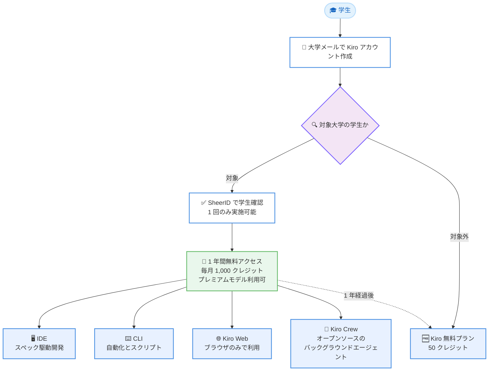

# Kiro - Kiro Students プログラムの世界展開 (16 カ国 121 大学に拡大)

**リリース日**: 2026年9月8日
**サービス**: Kiro
**機能**: Kiro Students プログラム (学生向け 1 年間無料アクセス) のグローバル拡大

📊 [このアップデートのインフォグラフィックを見る](https://takech9203.github.io/aws-news-summary/20260908-kiro-students-2026.html)

## 概要

Kiro は、学生向けプログラム「Kiro Students」を 16 カ国 121 の新たな大学に拡大したことを発表しました。対象大学に在籍する学生は、毎月 1,000 クレジットを 1 年間無料で利用でき、プレミアムモデルや Kiro Web などの有料機能にもフルアクセスできます。クレジットカードの登録は不要で、トライアル期限のカウントダウンもありません。

新学期の開始に合わせたこの拡大により、これまで 11 校に限定されていたプログラムが 121 大学へと大きく広がりました。Kiro チームは「才能は 1 つの国に集中しない。機会もそうあるべきだ」として、今後もさらに対象を拡大していく方針を示しています。

学生は IDE、CLI、Kiro Web、Kiro Crew の 4 つのサーフェスを通じて Kiro を利用でき、スペック駆動開発による課題プロジェクトの構築から、ターミナルでの日常タスクの自動化、ブラウザのみでのプロトタイピングまで、幅広い学習・開発シーンで活用できます。

**アップデート前の課題**

- Kiro Students プログラムの対象は 11 校に限定されており、多くの国の学生は無料アクセスの対象外だった
- 学生が AI エージェント搭載のプロフェッショナル向け開発ツールを利用するには、有料プラン (Pro: 月額 20 USD〜) への加入が必要だった
- 無料プラン (50 クレジット) ではプレミアムモデルへのアクセスが制限されており、本格的なプロジェクトでの学習には不十分だった

**アップデート後の改善**

- 16 カ国 121 の新たな大学の学生が、1 年間無料で毎月 1,000 クレジット (Kiro Pro 相当) を利用可能になった
- プレミアムモデルや Kiro Web を含む有料機能へフルアクセスできるようになった
- クレジットカード不要、SheerID による数分の学生確認のみで利用開始でき、長い申請プロセスや待機期間が不要になった

## アーキテクチャ図

Kiro Students プログラムのサインアップから利用開始までの流れです。学生確認後は 4 つのサーフェスすべてで Kiro を利用でき、1 年経過後は無料プランへ自動的に移行します。

## サービスアップデートの詳細

### 主要機能

1. **対象大学の大幅拡大**
   - 従来の 11 校から、16 カ国 121 の新たな大学へ拡大
   - 対象国の学生は同一の特典 (1 年間無料、毎月 1,000 クレジット) を利用可能
   - Kiro チームは今後もさらなる拡大を継続する方針を表明

2. **シンプルなサインアップフロー**
   - 大学発行のメールアドレスで Kiro アカウントを作成 (既存アカウントの場合は大学メールを関連付け)
   - 対象大学の学生にはアカウントページに「You are eligible for Kiro Students」バナーが表示される
   - SheerID による学生確認は数分で完了し、長い申請や待機期間は不要

3. **4 つのサーフェスでの利用**
   - **IDE**: スペック駆動開発により、要件・設計・タスクリストへ自動分解。Agent Focus で並列タスクをクラウドセッションとして実行可能
   - **CLI**: シェルでのスクリプトや自動化に対応。SSH 経由で大学のラボマシンやリモートクラスタでも動作し、長時間ジョブをクラウドセッションに引き継ぎ可能
   - **Kiro Web**: インストール不要でブラウザから利用可能。管理された実習室の PC や Chromebook でも動作
   - **Kiro Crew**: オープンソースのバックグラウンドエージェント。独自ツールの接続や独自エージェントの定義が可能

4. **キャンパスコミュニティの展開**
   - Kiro Student Discord Community でキャンパス訪問、ワークショップ、ハッカソンの情報を提供
   - 世界中の大学でのハッカソン共催パートナーを募集

## 技術仕様

### プログラムの条件

| 項目 | 詳細 |
|------|------|
| 特典内容 | 1 年間無料、毎月 1,000 クレジット |
| 利用可能な機能 | プレミアムモデル、Kiro Web を含む有料機能へのフルアクセス |
| 対象 | 16 カ国 121 の新たな対象大学に在籍する学生 |
| 必要なもの | 大学発行のメールアドレス (クレジットカード不要) |
| 学生確認 | SheerID による確認 (1 回のみ実施可能) |
| クレジット超過時 | 追加購入不可。翌月のサイクルまで待機 (クレジットの繰り越しなし) |
| 期間終了後 | Kiro 無料プランへ自動的にダウングレード |

## 設定方法

### 前提条件

1. 対象大学に在籍していること
2. 大学発行のメールアドレスを保有していること
3. Kiro アカウント (新規作成または既存アカウントに大学メールを関連付け)

### 手順

#### ステップ1: サインアップまたはログイン

大学発行のメールアドレスを使用して、任意のサインインオプションで Kiro アカウントを作成します。既存の Kiro アカウントがある場合は、手続きの前に大学メールがアカウントに関連付けられていることを確認します。

#### ステップ2: 学生ステータスの確認

サインイン後、対象大学の学生であればアカウントページに「You are eligible for Kiro Students」バナーが表示されます。確認ボタンをクリックし、SheerID による学生確認を完了します。確認は数分で完了します。

**注意**: 学生確認は 1 回のみ実施可能なため、入力情報が正しいことを事前に確認してください。

#### ステップ3: 利用開始

確認が完了すると、1 年間、毎月 1,000 クレジットへのアクセスが付与されます。IDE、CLI、Kiro Web、Kiro Crew のいずれのサーフェスからでも利用を開始できます。

## メリット

### ビジネス面

- **教育機会の平等化**: 16 カ国への拡大により、国や地域を問わず学生がプロフェッショナルグレードの AI 開発ツールにアクセス可能
- **コスト負担ゼロ**: Kiro Pro 相当 (月額 20 USD) の機能を 1 年間無料で利用でき、クレジットカードも不要
- **キャリア形成支援**: AI エージェントが標準的なエンジニアリングツールとなる中、在学中に実務レベルのツールを習得できる

### 技術面

- **4 サーフェスの柔軟な利用**: IDE、CLI、Kiro Web、Kiro Crew を用途に応じて使い分け可能
- **環境制約への対応**: Kiro Web によりソフトウェアをインストールできない実習室 PC や Chromebook でも利用可能。CLI は SSH 経由でラボマシンやリモートクラスタでも動作
- **クラウドセッション**: 長時間タスクをクラウドセッションに引き継ぎ、ラップトップを閉じても処理を継続可能

## デメリット・制約事項

### 制限事項

- 学生確認は 1 回のみ実施可能 (誤った情報での確認はやり直し不可)
- 月間 1,000 クレジットを使い切った場合、追加購入はできず翌月まで待機が必要
- クレジットは翌月に繰り越されない
- 1 年間の無料期間終了後は Kiro 無料プランへ自動的にダウングレードされる

### 考慮すべき点

- 対象は 16 カ国の対象大学に在籍する学生に限定される (対象大学の一覧は kiro.dev/students で確認が必要)
- 大学発行のメールアドレスが必須となるため、卒業後や大学メールが失効した場合の扱いに注意が必要

## ユースケース

### ユースケース1: 授業プロジェクトのスペック駆動開発

**シナリオ**: 学期末の大規模な課題プロジェクトに取り組む学生が、どこから手を付けるべきか分からず困っている。

**実装例**: IDE で作りたいものを自然言語で記述すると、Kiro が要件、設計、順序付けされたタスクリストに分解する。複数タスクを並行して進める場合は Agent Focus に切り替え、クラウドセッションとして実行する。

**効果**: 手強いプロジェクトが 1 つずつ進められるチェックリストに変わり、ラップトップのリソースを占有せずに複数タスクを並列実行できる。

### ユースケース2: CLI による日常タスクの自動化

**シナリオ**: 講義録画の整理、GitHub への夜間バックアップ、シラバスのカレンダー登録など、毎週の雑務に時間を取られている学生。

**実装例**: Kiro CLI に雑務を指示してスクリプト化・自動化する。コミット前のテスト実行も自動化でき、大学のラボマシンやリモートクラスタには SSH 経由で接続する。

**効果**: 週の時間を奪う雑務が自動化され、学習や開発に集中できる。長時間ジョブはクラウドセッションに引き継ぎ、ラップトップを閉じても継続する。

### ユースケース3: ハッカソンでの高速プロトタイピング

**シナリオ**: ハッカソンでソフトウェアをインストールできない共用 PC しか使えない状況で、短時間でプロトタイプを完成させたいチーム。

**実装例**: Kiro Web をブラウザから起動し、ゲームやランディングページのプロトタイプを構築する。並行して Kiro Crew のエージェント群に複数の機能開発を任せ、チームはデモの仕上げに集中する。

**効果**: インストール不要でアイデアから動くものまで最速で到達でき、授業の合間に処理を開始して後で自分のマシンで引き継ぐ運用も可能。

## 料金

Kiro Students プログラムの対象学生は、以下の内容を **1 年間無料** で利用できます。

| 項目 | 内容 |
|------|------|
| 月間クレジット | 1,000 クレジット (Kiro Pro 相当) |
| プレミアムモデル | フルアクセス |
| Kiro Web | フルアクセス |
| クレジットカード | 不要 |
| 追加クレジット購入 | 不可 (翌月サイクルまで待機) |

参考として、通常の Kiro Pro プランは月額 20 USD で 1,000 クレジットです。無料期間終了後は Kiro 無料プラン (50 クレジット) へ自動的に移行します。

## 利用可能リージョン

グローバル (プログラムの対象は 16 カ国の対象大学に在籍する学生。対象大学の詳細は [kiro.dev/students](https://kiro.dev/students) を参照)

## 関連サービス・機能

- **Kiro IDE**: スペック駆動開発に対応したエージェント型 IDE。本プログラムの中心となるサーフェス
- **Kiro CLI**: ターミナルから利用できるエージェント。スクリプトや自動化、SSH 経由のリモート利用に対応
- **Kiro Web**: ブラウザのみで利用できる Kiro。本プログラムでは有料機能としてフルアクセスが付与される
- **Kiro Crew**: オープンソースのバックグラウンドエージェントフレームワーク。独自ツールやエージェントを定義可能

## 参考リンク

- 📊 [インフォグラフィック](https://takech9203.github.io/aws-news-summary/20260908-kiro-students-2026.html)
- [公式発表 (Kiro Blog)](https://kiro.dev/blog/students-2026/)
- [Kiro Students](https://kiro.dev/students)
- [Kiro ドキュメント](https://kiro.dev/docs/)
- [料金ページ](https://kiro.dev/pricing/)

## まとめ

Kiro Students プログラムが 11 校から 16 カ国 121 の新たな大学へと大幅に拡大され、対象学生は毎月 1,000 クレジットとプレミアムモデルを含む有料機能を 1 年間無料で利用できるようになりました。AI エージェントがエンジニアリングの標準ツールとなりつつある中、在学中に実務レベルのツールを習得できる貴重な機会です。対象大学の学生は、大学メールでのサインアップと SheerID による数分の学生確認だけで利用を開始できるため、kiro.dev/students で対象状況の確認を推奨します。
