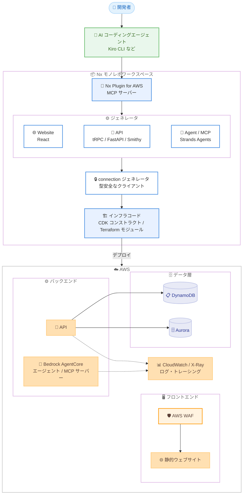

# Nx Plugin for AWS - フルスタックアプリケーションのスキャフォールディングツールキット バージョン 1.0

**リリース日**: 2026 年 9 月 8 日
**サービス**: Nx Plugin for AWS (オープンソースツールキット)
**機能**: フルスタック AWS アプリケーションのスキャフォールディング (バージョン 1.0)

📊 [このアップデートのインフォグラフィックを見る](https://takech9203.github.io/aws-news-summary/20260908-nx-plugin-for-aws.html)

## 概要

AWS は、フルスタックアプリケーションを AWS 上にスキャフォールド (雛形生成) するためのオープンソースツールキット「Nx Plugin for AWS」のバージョン 1.0 を発表しました。モノレポ向けビルドシステムである [Nx](https://nx.dev/) を拡張し、Amazon Bedrock AgentCore 上で動作する AI エージェントや MCP (Model Context Protocol) サーバー、API、ウェブサイト、データベースなどのコードジェネレータを TypeScript と Python の両方で提供します。

このツールキットは、AWS の PACE チーム (Prototyping and AI Customer Engineering) が数週間規模のプロトタイピング支援で培った知見をもとに開発されました。AI コーディングアシスタントは動くアプリケーションを短時間で作成できる一方、セキュリティ、可観測性、型安全性といった本番運用に必要な要素が欠落しがちで、修正の反復に時間がかかるという課題がありました。Nx Plugin for AWS のジェネレータは決定論的 (同じ入力に対して常に同一の出力) であるため、AI アシスタントが安心して土台にできる信頼性の高いスキャフォールディングを実現します。

生成されるインフラは AWS CDK コンストラクトまたは Terraform モジュールとして定義され、AWS WAF による保護、CloudWatch アクセスログ、AWS X-Ray トレーシングなどのベストプラクティスが最初から組み込まれています。Apache 2.0 ライセンスで提供され、追加料金なしで利用できます (アプリケーションが使用する AWS リソースの料金のみ発生)。

**アップデート前の課題**

このアップデート以前は、以下のような課題がありました。

- AI アシスタントが生成するアプリケーションは、セキュリティ、可観測性、型安全性などの本番要件を満たすまでに多くの修正サイクルが必要だった
- スターターテンプレート方式では、フォークした時点でアップストリームから乖離し、その後の修正や改善が反映されなかった
- 再利用ライブラリ方式では、必要な設定が公開されていない場合に開発者がブロックされてしまった
- フロントエンドとバックエンド間の API 契約の不整合が、本番環境でのリクエスト失敗として初めて顕在化していた

**アップデート後の改善**

今回のバージョン 1.0 リリースにより、以下が可能になりました。

- 決定論的なジェネレータにより、ベストプラクティスが組み込まれたフルスタックアプリケーションを数分でスキャフォールド可能になった
- connection ジェネレータが型安全なクライアントでプロジェクト間を接続し、API の破壊的変更が本番障害ではなくビルドエラーとして事前に検出されるようになった
- Nx のマイグレーション機能により、カスタマイズ済みのワークスペースにも将来の改善を取り込めるようになった
- 同梱の MCP サーバーにより、AI コーディングエージェントがジェネレータを直接呼び出してアプリケーションを構築できるようになった
- 生成されたコードはプラグインへのランタイム依存がなく、完全にユーザーの所有物として自由に編集できる

## アーキテクチャ図



AI コーディングエージェントが同梱の MCP サーバー経由でジェネレータを呼び出し、型安全に接続されたフルスタックアプリケーションとインフラコードを生成して AWS にデプロイする流れを示しています。

## サービスアップデートの詳細

### 主要機能

1. **多様なコンポーネントのジェネレータ (TypeScript / Python)**
   - API: tRPC、FastAPI、Smithy からフレームワークを選択し、デプロイ用インフラとあわせて生成
   - ウェブサイト: React ベース。Amazon Cognito 認証をオプションで追加でき、UI は shadcn または CloudScape を選択可能
   - データベース: Amazon DynamoDB と Amazon Aurora に対応
   - エージェント AI: Strands Agents SDK によるエージェントと MCP サーバーを生成し、Amazon Bedrock AgentCore 上にデプロイ

2. **connection ジェネレータによる型安全な接続**
   - プロジェクト間を型安全なクライアントで接続し、API の形状変更をフロントエンドの型エラーとしてデプロイ前に検出
   - 「API の破壊的変更が、本番でのリクエスト失敗ではなくビルドエラーになる」という設計思想
   - エージェントには AG-UI プロトコル経由で CopilotKit ベースのチャット UI を接続可能

3. **ベストプラクティスの組み込み**
   - AWS WAF による保護、CloudWatch アクセスログ、AWS X-Ray トレーシングを標準で構成
   - Lambda ハンドラーには AWS Lambda Powertools (構造化ログ、トレーシング、メトリクス) を組み込み
   - DynamoDB テーブルにはカスタマー管理 KMS キーによる暗号化 (ローテーション付き)、ポイントインタイムリカバリ、削除保護を設定
   - Aurora は RDS Proxy 経由の IAM 認証で構成され、Prisma (TypeScript) または SQLModel / Alembic (Python) によるマイグレーションを付属
   - エージェント / MCP サーバーには AgentCore の可観測性とセキュリティポリシーのスキャフォールディングを同梱

4. **AI アシスタント連携 (MCP サーバー同梱)**
   - 新規ワークスペースには Nx Plugin for AWS の MCP サーバーが事前構成され、Kiro CLI などのコーディングエージェントがジェネレータを直接実行可能
   - ジェネレータの出力が決定論的であるため、AI アシスタントはボイラープレートの再発明ではなくビジネスロジックに集中できる
   - Graph Builder (ビジュアルツール) でアーキテクチャを描画し、スキャフォールドコマンドをコピーすることも可能

5. **Nx マイグレーションによる継続的な更新**
   - `nx migrate` により、カスタマイズ済みワークスペースのアプリケーションコードとインフラコードの両方にアップストリームの改善を適用
   - 人間の判断が必要な変更には、コーディングエージェントを誘導するエージェント型マイグレーションをオプションで提供
   - スターターテンプレートの「フォーク後の乖離」問題を解消

## 技術仕様

### 対応技術スタック

| 項目 | 詳細 |
|------|------|
| 対応言語 | TypeScript、Python |
| API フレームワーク | tRPC、FastAPI、Smithy |
| フロントエンド | React (Vite、TanStack)、shadcn または CloudScape、Cognito 認証 (オプション) |
| データベース | Amazon DynamoDB、Amazon Aurora (RDS Proxy + IAM 認証) |
| エージェント AI | Strands Agents SDK、MCP サーバー、Amazon Bedrock AgentCore、AG-UI / A2A プロトコル |
| IaC | AWS CDK コンストラクトまたは Terraform モジュール (`--iac terraform`) |
| 可観測性 | CloudWatch アクセスログ、AWS X-Ray、Lambda Powertools、AgentCore Observability |
| ライセンス | Apache 2.0 (オープンソース、awslabs で公開) |

### ワークスペース作成コマンド

```bash
pnpm create @aws/nx-workspace my-project --no-interactive
```

## 設定方法

### 前提条件

1. Node.js とパッケージマネージャー (pnpm など) がインストールされていること
2. AWS アカウントと認証情報が設定されていること (デプロイ時)
3. Python ジェネレータを使用する場合は Python 環境 (uv) が利用可能であること

### 手順

#### ステップ 1: ワークスペースの作成

```bash
pnpm create @aws/nx-workspace my-project --no-interactive
```

Nx Plugin for AWS が事前構成された Nx モノレポワークスペースを作成します。MCP サーバーも同時にセットアップされるため、AI コーディングエージェントからジェネレータを直接呼び出せる状態になります。

#### ステップ 2: コンポーネントのスキャフォールド

```bash
# Python プロジェクトとエージェントの生成
pnpm nx g @aws/nx-plugin:py#project backend
pnpm nx g @aws/nx-plugin:py#agent --project backend --auth=cognito --protocol=ag-ui

# React ウェブサイトの生成
pnpm nx g @aws/nx-plugin:ts#website website

# プロジェクト間の型安全な接続
pnpm nx g @aws/nx-plugin:connection --source-project=website --target-project=backend

# インフラプロジェクトの生成
pnpm nx g @aws/nx-plugin:ts#infra infra
```

各ジェネレータが、動作するコンポーネントとそのデプロイ用インフラコードをワークスペースに直接書き込みます。connection ジェネレータは、ウェブサイトからバックエンドへの型安全なクライアントを生成します。AI エージェントに自然言語で指示して、これらのコマンドを実行させることも可能です。

#### ステップ 3: ローカル開発とデプロイ

```bash
# ホットリロード付きのローカル開発
pnpm dev

# 生成された CDK スタックをサンドボックスにデプロイ
pnpm nx deploy-sandbox infra
```

`pnpm dev` でスタック全体をローカル実行して動作確認し、生成された CDK コンストラクト (UserIdentity、BackendAgent、Website など) をスタックに組み込んでデプロイします。

#### ステップ 4: 継続的なアップデートの適用

```bash
pnpm nx migrate @aws/nx-plugin@latest
pnpm nx migrate --run-migrations
```

プラグインの新バージョンがリリースされた際に、カスタマイズ済みのコードにもアップストリームの改善を適用します。

## メリット

### ビジネス面

- **開発期間の大幅短縮**: 本番品質の土台を数分でスキャフォールドできるため、差別化要素の開発に集中できる。事例として、オーストラリアの Bingo Industries 社はマルチエージェントチャットボットを 3 週間未満で本番稼働させた
- **追加コストなし**: Apache 2.0 ライセンスのオープンソースで、アプリケーションが消費する AWS リソースの料金以外は不要
- **ベンダーロックインの回避**: 生成コードはプラグインへのランタイム依存がなく、完全にユーザーの所有物。IaC も CDK と Terraform から選択可能

### 技術面

- **型安全性による品質向上**: connection ジェネレータにより API 契約の不整合がビルド時に検出され、本番障害を未然に防止
- **セキュリティと可観測性の標準装備**: WAF、KMS 暗号化、CloudWatch ログ、X-Ray トレーシングなどが最初から構成され、後付けの手間を削減
- **AI 協調開発への最適化**: 決定論的なジェネレータと同梱 MCP サーバーにより、AI アシスタントが信頼できる土台の上でビジネスロジックの実装に集中できる
- **テンプレート乖離問題の解消**: Nx マイグレーションでカスタマイズ後もアップストリームの改善を継続的に取り込み可能

## デメリット・制約事項

### 制限事項

- 対応言語は TypeScript と Python に限定される
- Nx モノレポ構成が前提となるため、既存の非モノレポプロジェクトへの適用には構成変更が必要
- ジェネレータが対応するフレームワーク (tRPC / FastAPI / Smithy、React など) 以外の技術スタックには対応しない

### 考慮すべき点

- Nx のビルドシステムとモノレポ運用に関する学習コストが発生する
- 生成コードはユーザーの所有物となるため、大幅にカスタマイズした部分についてはマイグレーション適用時に人間の判断 (またはエージェント型マイグレーション) が必要になる場合がある
- AWS サポートの対象ではなくオープンソースプロジェクトとしての提供のため、問題報告は GitHub Issues やコミュニティチャネル (CDK.dev Slack の #nx-plugin-for-aws) を利用する

## ユースケース

### ユースケース 1: AI エージェント搭載のフルスタックアプリケーションの迅速な構築

**シナリオ**: 社内ナレッジを活用するチャットボットを、認証付きウェブ UI とあわせて短期間で構築したい。

**実装例**:
```bash
pnpm create @aws/nx-workspace chatbot-project --no-interactive
# AI エージェントへの指示例:
# 「shadcn と Cognito 認証を使った React サイトを作成し、
#  AG-UI 経由で TypeScript の Strands エージェントに接続して」
pnpm dev
```

**効果**: Bedrock AgentCore 上のエージェント、CopilotKit チャット UI、Cognito 認証、可観測性がすべて構成済みの状態で数分で開発を開始でき、プロトタイプから本番までの期間を大幅に短縮できる。

### ユースケース 2: マルチエージェントシステムの本番構築

**シナリオ**: 業務ドメインごとの専門エージェント (開発、DBA、DevOps など) をオーケストレータで束ねるマルチエージェントチャットボットを構築したい。

**実装例**:
```bash
pnpm nx g @aws/nx-plugin:py#project backend
pnpm nx g @aws/nx-plugin:py#agent --project backend --auth=cognito --protocol=ag-ui
# A2A プロトコルで専門エージェントを追加し、オーケストレータからルーティング
```

**効果**: Bingo Industries 社の事例では、A2A プロトコルで専門エージェントをルーティングするオーケストレータと React / Cognito フロントエンドを構築し、3 週間未満で本番稼働。オペレーターによる失敗トランザクションの診断やリアルタイムレポート生成を実現した。

### ユースケース 3: 組織標準パターンの社内展開

**シナリオ**: 組織独自のアーキテクチャパターンやコンプライアンス要件を、全開発チームに一貫して適用したい。

**実装例**:
```
ジェネレータ SDK を使用して組織独自のジェネレータを実装し、
MCP サーバー経由で各チームの AI コーディングエージェントに公開する。
```

**効果**: 組織のベストプラクティスをコード化したジェネレータを社内配布でき、チームごとのばらつきを抑えながら AI 支援開発を標準化できる。

## 料金

Nx Plugin for AWS 自体は Apache 2.0 ライセンスのオープンソースソフトウェアであり、追加料金なしで利用できます。料金は、生成されたアプリケーションが使用する AWS リソース (Lambda、DynamoDB、Aurora、Bedrock AgentCore、CloudFront、WAF など) に対してのみ発生します。

## 利用可能リージョン

オープンソースツールキットのため、リージョンの制約はありません。生成されるアプリケーションは、使用する各 AWS サービス (Amazon Bedrock AgentCore など) が利用可能なリージョンにデプロイできます。

## 関連サービス・機能

- **Amazon Bedrock AgentCore**: 生成された AI エージェントと MCP サーバーのデプロイ先。可観測性とセキュリティポリシーのスキャフォールディングも同梱
- **AWS CDK / Terraform**: インフラ定義の出力形式として選択可能。CDK コンストラクトまたは Terraform モジュールとして生成
- **AWS WAF / Amazon CloudWatch / AWS X-Ray**: 生成されるアプリケーションに標準で組み込まれる保護・ログ・トレーシング機能
- **Amazon Cognito**: ウェブサイトジェネレータのオプションとして構成できる認証基盤
- **Strands Agents SDK**: エージェントジェネレータが使用する AI エージェント開発フレームワーク
- **Kiro CLI**: 同梱 MCP サーバー経由でジェネレータを呼び出せる AI コーディングエージェントの一例

## 参考リンク

- 📊 [インフォグラフィック](https://takech9203.github.io/aws-news-summary/20260908-nx-plugin-for-aws.html)
- [公式発表 (What's New)](https://aws.amazon.com/about-aws/whats-new/2026/09/nx-plugin-for-aws/)
- [AWS Blog (launch blog)](https://aws.amazon.com/blogs/opensource/build-full-stack-aws-applications-in-minutes-with-ai-powered-scaffolding/)
- [ドキュメント](https://awslabs.github.io/nx-plugin-for-aws/)
- [Nx (モノレポビルドシステム)](https://nx.dev/)

## まとめ

Nx Plugin for AWS バージョン 1.0 は、AI コーディングアシスタント時代の開発課題である「速く作れるが本番品質に届かない」というギャップを、決定論的なジェネレータとベストプラクティスの組み込みによって埋めるオープンソースツールキットです。型安全な接続、セキュリティ・可観測性の標準装備、Nx マイグレーションによる継続的な更新が特長で、実際に 3 週間未満でマルチエージェントシステムを本番稼働させた事例もあります。フルスタックアプリケーションや AI エージェントの構築を計画しているチームは、`pnpm create @aws/nx-workspace` でワークスペースを作成し、ドキュメントのクイックスタートから試すことを推奨します。
