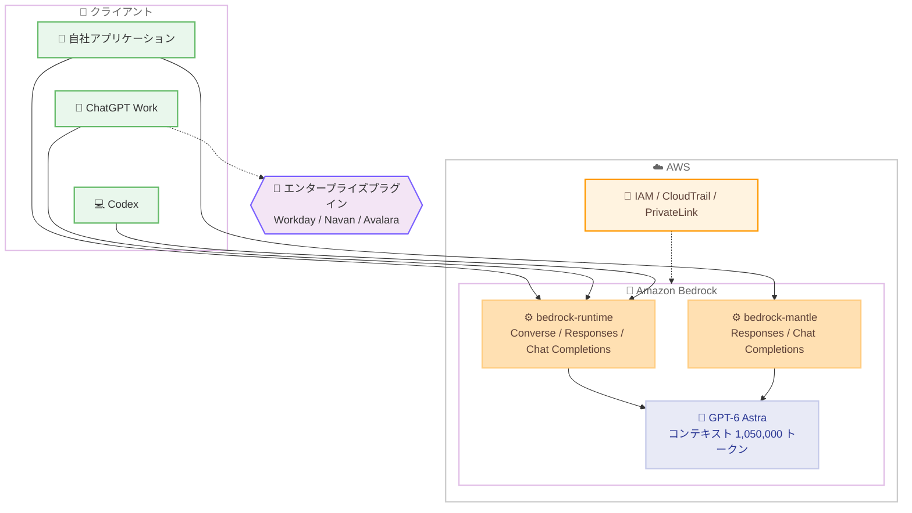

# Amazon Bedrock - OpenAI GPT-6 Astra の一般提供開始

**リリース日**: 2026 年 9 月 8 日
**サービス**: Amazon Bedrock
**機能**: OpenAI GPT-6 Astra モデルの一般提供 (GA)

📊 [このアップデートのインフォグラフィックを見る](https://takech9203.github.io/aws-news-summary/20260908-openai-gpt-6-astra-on-amazon-bedrock.html)

## 概要

OpenAI の最新かつ最も高性能なモデルである GPT-6 Astra が、Amazon Bedrock で一般提供 (GA) となりました。GPT-6 Astra は、より深い推論と判断力、プロフェッショナル品質の文章作成とデザイン、高度なコンピュータ操作およびブラウザ操作機能を備えたモデルで、最大 100 万トークン超 (1,050,000 トークン) のコンテキストウィンドウをサポートします。

Bedrock のサポート対象 API (Converse、Responses、Chat Completions) から直接呼び出せるほか、ChatGPT Work や Codex を Bedrock 上の GPT-6 Astra を使用するように構成することも可能です。これにより、AWS の本番環境グレードのセキュリティ、ガバナンス、監査機能を維持しながら、OpenAI の最先端モデルとエージェント製品を利用できます。また、OpenAI は ChatGPT Work 向けの新しいエンタープライズプラグインを発表しており、Astra のブラウザ操作機能を Workday、Navan、Avalara などの業務アプリケーションに拡張します。

自律型エージェントの構築、大量のドキュメント分析、複雑なソフトウェア問題のデバッグ、相反する入力に対する判断を必要とするアプリケーションの構築など、高度なエンドツーエンドの業務を対象としたモデルです。

**アップデート前の課題**

- OpenAI の最上位モデルを利用するには OpenAI 直接またはその他のプラットフォームを利用する必要があり、AWS の IAM、CloudTrail、PrivateLink などの既存のガバナンス基盤と統合した運用が困難だった
- Bedrock 上の既存 OpenAI モデル (GPT-5.5、GPT-5.6 ファミリーなど) では、GPT-6 世代の推論能力やコンピュータ / ブラウザ操作能力を利用できなかった
- ChatGPT Work や Codex といった OpenAI のエージェント製品を、企業の AWS 環境上のモデルと組み合わせて利用する手段が限られていた

**アップデート後の改善**

- Bedrock の Converse API、Responses API、Chat Completions API から GPT-6 Astra を直接呼び出せるようになった
- ChatGPT Work および Codex を Bedrock 上の GPT-6 Astra を使用するように構成でき、AWS 上でのモデル呼び出しの統制と監査が可能になった
- 最大 1,050,000 トークンのコンテキストウィンドウにより、数百ページ規模のドキュメント群を一度に分析できるようになった
- エンタープライズプラグインにより、API やコネクタが存在しない業務アプリケーションもブラウザ操作で自動化できるようになった

## アーキテクチャ図



自社アプリケーション、ChatGPT Work、Codex のいずれからも Bedrock のエンドポイント経由で GPT-6 Astra を呼び出せます。すべての呼び出しは IAM によるアクセス制御と CloudTrail による監査の対象となります。

## サービスアップデートの詳細

### 主要機能

1. **より深い推論と判断力**
   - 相反するデータの整合、依存関係の追跡、優先順位付けといった判断を要するタスクに対応
   - 財務分析、契約書のリスクレビュー、複雑なソフトウェア問題のデバッグなどの高度な業務に適合
   - 大規模なコードベースの調査、依存関係の推論、テストまで含めた修正の完遂が可能

2. **最大 1,050,000 トークンのコンテキストウィンドウ**
   - 数百ページに及ぶ契約書群や大量のドキュメントコレクションを一度に分析可能
   - 最大出力トークンは 128,000
   - 272K までの短コンテキストと 1.05M までの長コンテキストで料金体系が分かれる

3. **高度なコンピュータ操作 / ブラウザ操作**
   - API やコネクタが存在しないソフトウェアでも、インターフェースを直接操作して業務を遂行
   - ChatGPT Work 向けの新しいエンタープライズプラグインにより、BI ツール、Workday、Navan、Avalara などの業務アプリケーションへブラウザ操作を拡張
   - プラグインは既存のユーザーアカウントと管理者が設定した権限の範囲内で動作し、追加のアクセス権は付与されない

4. **ChatGPT Work / Codex との連携**
   - ChatGPT Work: スプレッドシート、スライド、ドキュメント、サイトを生成する生産性エージェント。Mac / Windows のデスクトップアプリで利用可能
   - Codex: ローカルファイル、リポジトリ、ターミナルを操作するソフトウェアエンジニアリングエージェント。CLI、VS Code、JetBrains IDE、Xcode に対応
   - いずれも Bedrock 上の GPT-6 Astra を使用するように構成可能
   - Agent Toolkit for AWS により、Codex を AWS のドキュメントと API にターミナルコマンド 1 つで接続可能

5. **プロンプトキャッシュのサポート**
   - 暗黙的 (implicit) および明示的 (explicit) プロンプトキャッシュをサポート (bedrock-mantle エンドポイントの Responses API のみ)
   - 明示的キャッシュではキャッシュブレークポイントを設定して、キャッシュ対象のコンテキストを制御可能
   - 繰り返し利用するコンテキストのコストとレイテンシーを削減

## 技術仕様

### モデル仕様

| 項目 | 詳細 |
|------|------|
| モデル ID | `openai.gpt-6-astra` |
| 推論プロファイル ID | `us.openai.gpt-6-astra` (US 地理的 CRIS)、`global.openai.gpt-6-astra` (グローバル CRIS) |
| コンテキストウィンドウ | 1,050,000 トークン |
| 最大出力トークン | 128,000 トークン |
| 入力モダリティ | テキスト、画像 |
| 出力モダリティ | テキスト |
| ナレッジカットオフ | 2026 年 4 月 30 日 |
| モデルライフサイクル | Active (EOL は 2027 年 9 月 8 日以降、レガシー期間は最低 6 か月) |
| サービスティア | Standard のみ (Priority / Flex / Reserved は非対応) |

### エンドポイントと API サポート

| エンドポイント | Converse | Responses | Chat Completions | Invoke | 備考 |
|----------------|----------|-----------|------------------|--------|------|
| bedrock-runtime | ✓ | ✓ | ✓ | ✗ | クロスリージョン推論プロファイルの指定が必須 |
| bedrock-mantle | ✗ | ✓ | ✓ | ✗ | us-west-2 のみ。`/openai/v1/responses` と `/openai/v1/chat/completions` で提供 |

### Bedrock 機能のサポート状況

| 機能 | サポート状況 |
|------|--------------|
| レスポンスストリーミング | ✓ |
| モデル呼び出しログ | ✓ |
| Guardrails | ✓ (Converse API のみ) |
| アプリケーション推論プロファイル | ✓ (Converse API のみ) |
| プロンプトキャッシュ (暗黙的 / 明示的) | ✓ (bedrock-mantle の Responses API のみ) |
| サーバーサイドツール呼び出し | bedrock-mantle のみ ✓ (bedrock-runtime は ✗) |
| 構造化出力 | ✗ |
| トークンカウント API | ✗ |
| インテリジェントプロンプトルーティング | ✗ |

### セキュリティとデータ保護

- OpenAI の Preparedness Framework で評価され、サイバーセキュリティ能力で Critical 分類に達した初の OpenAI モデル。範囲外の活動を一時停止または停止できる自動セーフガードを搭載
- チップレベルで強制されるゼロオペレーターアクセス、転送中および保管時の暗号化
- IAM によるアクセス制御、CloudTrail による呼び出しログ、PrivateLink 経由の VPC エンドポイント、組織レベルのデータ境界に対応
- 推論データはモデルのトレーニングに使用されない。不正利用検知でフラグされたトラフィックは最大 30 日間保持され、リクエストによりゼロデータ保持 (ZDR) も選択可能

## 設定方法

### 前提条件

1. AWS アカウントと Amazon Bedrock へのアクセス権限
2. Bedrock コンソールでのモデルアクセスの有効化
3. Bedrock API キーまたは IAM 認証情報

### 手順

#### ステップ 1: OpenAI SDK のインストール

```bash
pip install openai
```

GPT-6 Astra は OpenAI 互換エンドポイントを提供しているため、OpenAI SDK をそのまま利用できます。

#### ステップ 2: 環境変数の設定

```bash
export OPENAI_API_KEY="<Bedrock API キー>"
export OPENAI_BASE_URL="https://bedrock-runtime.us-west-2.amazonaws.com/openai/v1"
```

Bedrock コンソールで生成した長期 API キーと、bedrock-runtime エンドポイントの OpenAI 互換ベース URL を設定します。bedrock-mantle を使用する場合は `https://bedrock-mantle.us-west-2.api.aws/openai/v1` を指定します。

#### ステップ 3: 推論リクエストの実行

```python
from openai import OpenAI

client = OpenAI()

response = client.responses.create(
    model="us.openai.gpt-6-astra",
    input="Amazon Bedrock の機能を説明してください。"
)
print(response)
```

Responses API で GPT-6 Astra を呼び出します。bedrock-runtime エンドポイントではインリージョン推論が利用できないため、モデル名にはクロスリージョン推論プロファイル (`us.openai.gpt-6-astra` または `global.openai.gpt-6-astra`) を指定します。

#### ステップ 4: Converse API での呼び出し

```bash
aws bedrock-runtime converse \
  --region us-east-1 \
  --model-id us.openai.gpt-6-astra \
  --messages '[{"role": "user", "content": [{"text": "こんにちは"}]}]'
```

AWS CLI の Converse API からも呼び出せます。Guardrails やアプリケーション推論プロファイルを利用する場合は Converse API を使用します。

## メリット

### ビジネス面

- **最先端モデルの統制された利用**: OpenAI の最上位モデルを、AWS の既存のセキュリティ / ガバナンス / 監査基盤の中で利用できる
- **業務自動化の範囲拡大**: ブラウザ操作とエンタープライズプラグインにより、API が存在しないレガシーな業務アプリケーションまで自動化の対象を拡大できる
- **エージェント製品との統合**: ChatGPT Work や Codex といった完成度の高いエージェント製品を、自社の AWS 環境上のモデルと組み合わせて展開できる

### 技術面

- **大規模コンテキスト**: 1,050,000 トークンのコンテキストウィンドウにより、大量のドキュメントやコードベース全体を対象とした処理が可能
- **OpenAI SDK 互換**: OpenAI 互換エンドポイントにより、既存の OpenAI SDK ベースのコードを最小限の変更で移行可能
- **プロンプトキャッシュによるコスト削減**: キャッシュ読み取りは通常入力の 1/10 の料金で、繰り返しコンテキストのコストとレイテンシーを大幅に削減

## デメリット・制約事項

### 制限事項

- インリージョン推論は bedrock-mantle (us-west-2) のみで、bedrock-runtime ではクロスリージョン推論プロファイルの使用が必須
- 東京 / 大阪リージョンからはグローバルクロスリージョン推論 (Global CRIS) のみ利用可能で、データレジデンシー要件がある場合は注意が必要
- 構造化出力、トークンカウント API、インテリジェントプロンプトルーティングは非対応
- Guardrails とアプリケーション推論プロファイルは Converse API のみ、プロンプトキャッシュは bedrock-mantle の Responses API のみと、機能ごとに利用可能な API が異なる
- サービスティアは Standard のみで、Priority / Flex は非対応

### 考慮すべき点

- 272K トークンを超える長コンテキスト利用時は料金が入力 2 倍、出力 1.5 倍に上がるため、コンテキスト長の設計がコストに直結する
- bedrock-runtime エンドポイントのクォータは TPM (トークン / 分) で管理され、出力 1 トークンが 10 トークン分として消費される (10 倍バーンダウンレート) ため、出力量の多いワークロードはクォータ設計に注意が必要
- コンピュータ / ブラウザ操作を伴うエージェントは、管理者によるアクセス制限や操作確認の設定など、ガードレールの整備が前提となる

## ユースケース

### ユースケース 1: 大規模契約書ポートフォリオのリスクレビュー

**シナリオ**: 法務部門が数百ページに及ぶ複数の契約書を横断して、条項の矛盾やリスクを洗い出したい。

**実装例**:
```python
from openai import OpenAI

client = OpenAI()

response = client.responses.create(
    model="global.openai.gpt-6-astra",
    input=f"以下の契約書群を分析し、条項間の矛盾とリスクを重要度順に列挙してください。\n\n{contracts_text}"
)
```

**効果**: 1,050,000 トークンのコンテキストにより契約書群を一括投入でき、相反する条項の整合や優先順位付けといった判断を要するレビューを自動化できる。

### ユースケース 2: Codex による大規模コードベースの障害調査と修正

**シナリオ**: 開発チームが複雑な依存関係を持つコードベースの障害を調査し、修正からテスト、PR 作成までを自動化したい。

**実装例**:
```bash
# Codex を Bedrock 上の GPT-6 Astra を使用するように構成し、
# Agent Toolkit for AWS で AWS ドキュメントと API に接続
codex --model bedrock:global.openai.gpt-6-astra "本番環境で発生している間欠的なタイムアウトの原因を調査して修正して"
```

**効果**: 依存関係を推論しながら原因を特定し、テスト実行と PR 作成まで含めた修正フローを Bedrock のガバナンス下で完結できる。

### ユースケース 3: エンタープライズプラグインによる基幹業務の自動化

**シナリオ**: 経理・人事部門が、API 連携のない Workday や Avalara での定型業務を ChatGPT Work で自動化したい。

**実装例**:
```text
1. ChatGPT Work を Bedrock 上の GPT-6 Astra を使用するように構成
2. 管理者がアクセス可能なアプリ / Web サイトと確認必須の操作を設定
3. エンタープライズプラグインを有効化し、ブラウザ操作で Workday の申請処理を実行
```

**効果**: 既存のユーザー権限の範囲内で、コネクタが存在しない業務アプリケーションの操作を安全に自動化できる。

## 料金

トークン単位の従量課金 (Standard ティア) です。コンテキスト長 (272K 以下 / 272K 超) と推論オプションにより料金が異なります。

### 短コンテキスト (272K 以下、100 万トークンあたり)

| 推論オプション | 入力 | 入力 - キャッシュ書き込み 30 分 | 入力 - キャッシュ読み取り | 出力 |
|----------------|------|-------------------------------|--------------------------|------|
| インリージョン / Geo CRIS | $11.00 | $13.75 | $1.10 | $55.00 |
| Global CRIS | $10.00 | $12.50 | $1.00 | $50.00 |

### 長コンテキスト (1.05M まで、100 万トークンあたり)

| 推論オプション | 入力 | 入力 - キャッシュ書き込み 30 分 | 入力 - キャッシュ読み取り | 出力 |
|----------------|------|-------------------------------|--------------------------|------|
| インリージョン / Geo CRIS | $22.00 | $27.50 | $2.20 | $82.50 |
| Global CRIS | $20.00 | $25.00 | $2.00 | $75.00 |

最新の料金は [Amazon Bedrock 料金ページ](https://aws.amazon.com/bedrock/pricing/) を参照してください。

## 利用可能リージョン

- **インリージョン推論**: us-west-2 (オレゴン、bedrock-mantle エンドポイントのみ)
- **US 地理的クロスリージョン推論 (Geo CRIS)**: us-east-1 (バージニア北部)、us-east-2 (オハイオ)、us-west-1 (北カリフォルニア)、us-west-2 (オレゴン)、ca-central-1 (カナダ)
- **グローバルクロスリージョン推論 (Global CRIS)**: 上記に加え、eu-central-1 (フランクフルト)、eu-north-1 (ストックホルム)、eu-west-1 (アイルランド)、eu-west-2 (ロンドン)、eu-west-3 (パリ)、ap-northeast-1 (東京)、ap-northeast-2 (ソウル)、ap-northeast-3 (大阪)、ap-south-1 (ムンバイ)、ap-southeast-1 (シンガポール)、ap-southeast-2 (シドニー)、sa-east-1 (サンパウロ)

東京および大阪リージョンからは Global CRIS 経由で利用可能です。

## 関連サービス・機能

- **Amazon Bedrock Guardrails**: Converse API 経由で GPT-6 Astra の入出力に対するコンテンツフィルタリングを適用可能
- **Amazon Bedrock クロスリージョン推論**: Geo CRIS / Global CRIS により、リージョン間でキャパシティを活用した推論が可能
- **AWS PrivateLink**: VPC エンドポイント経由でインターネットを経由せずにモデルを呼び出し可能
- **AWS CloudTrail**: モデル呼び出しの監査ログを記録し、ガバナンス要件に対応
- **OpenAI GPT-5.6 ファミリー on Bedrock**: コストと性能のバランスに応じて Sol / Terra / Luna などの下位モデルと使い分けが可能

## 参考リンク

- 📊 [インフォグラフィック](https://takech9203.github.io/aws-news-summary/20260908-openai-gpt-6-astra-on-amazon-bedrock.html)
- [公式発表 (What's New)](https://aws.amazon.com/about-aws/whats-new/2026/09/openai-gpt-6-astra-on-amazon-bedrock/)
- [AWS Blog: Take on your most ambitious work with GPT-6 Astra on Amazon Bedrock](https://aws.amazon.com/blogs/machine-learning/take-on-your-most-ambitious-work-with-gpt-6-astra-on-amazon-bedrock/)
- [ドキュメント: GPT-6 Astra モデルカード](https://docs.aws.amazon.com/bedrock/latest/userguide/model-card-openai-gpt-6-astra.html)
- [ドキュメント: OpenAI モデル一覧](https://docs.aws.amazon.com/bedrock/latest/userguide/model-cards-openai.html)
- [ドキュメント: モデルのリージョン対応状況](https://docs.aws.amazon.com/bedrock/latest/userguide/models-region-compatibility.html)
- [料金ページ](https://aws.amazon.com/bedrock/pricing/)

## まとめ

OpenAI の最上位モデル GPT-6 Astra が Amazon Bedrock で一般提供となり、深い推論、1,050,000 トークンのコンテキスト、コンピュータ / ブラウザ操作という最先端の能力を AWS のセキュリティとガバナンスの下で利用できるようになりました。ChatGPT Work や Codex との連携により、モデル単体の利用にとどまらずエージェントベースの業務自動化まで視野に入ります。まずは us-west-2 の bedrock-mantle エンドポイントまたはクロスリージョン推論プロファイルで動作を検証し、コンテキスト長とクォータ (10 倍バーンダウンレート) を考慮したコスト・キャパシティ設計を進めることを推奨します。
