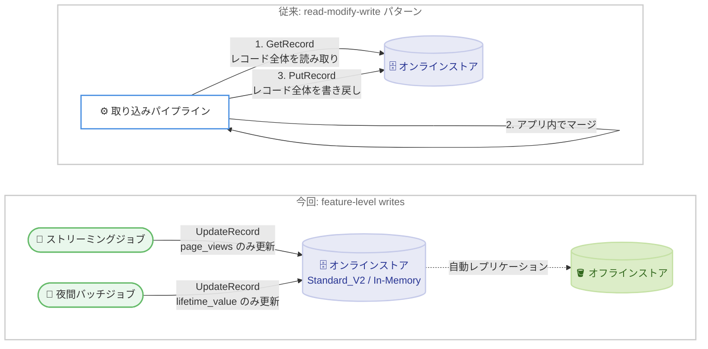

# Amazon SageMaker Feature Store - 個別フィーチャ更新 (UpdateRecord) のサポート

**リリース日**: 2026 年 9 月 8 日
**サービス**: Amazon SageMaker Feature Store
**機能**: Feature-level writes (UpdateRecord API による個別フィーチャ更新)

📊 [このアップデートのインフォグラフィックを見る](https://takech9203.github.io/aws-news-summary/20260908-sgm-feature-store-update-record.html)

## 概要

Amazon SageMaker Feature Store が feature-level writes (フィーチャレベル書き込み) をサポートしました。新しい UpdateRecord API を使用すると、レコード全体を読み書きすることなく、1 回の API 呼び出しでレコード内の 1 つ以上のフィーチャ値のみを更新できます。指定しなかったフィーチャは変更されずそのまま保持されます。

これまで、レコード内の一部のフィーチャだけを更新するには、GetRecord でレコード全体を読み取り、アプリケーションコードで値をマージし、PutRecord でレコード全体を書き戻す「read-modify-write」パターンが必要でした。今回のアップデートにより、このパターンを単一の更新呼び出しに置き換えられるため、書き込みレイテンシとコストが低減されます。ストリーミングジョブと夜間バッチジョブのような複数のパイプラインが、マージロジックを実装することなく同一レコードの異なるフィーチャを独立して更新できるようになります。

本機能は In-Memory tier では既存のフィーチャグループでそのまま利用でき、Standard tier では新しい Standard_V2 ストレージ形式へのオプトインにより利用できます。リアルタイム推論向けにオンラインストアを運用するデータサイエンティストや ML エンジニアにとって重要なアップデートです。

**アップデート前の課題**

- 一部のフィーチャだけを更新する場合でも、GetRecord → マージ → PutRecord という read-modify-write サイクルが必要で、更新ごとに余分なレイテンシが発生していた
- レコード全体の読み取りにより不要な読み取りキャパシティを消費し、コストが増大していた
- 複数のパイプラインが同一レコードの異なるフィーチャを同時に更新すると、一方の書き込みが他方を上書きする「lost-update」問題が発生する可能性があり、取り込みパイプラインに独自のマージロジックや調整機構が必要だった

**アップデート後の改善**

- 更新したいフィーチャのみを指定する単一の UpdateRecord 呼び出しで更新が完結し、書き込みレイテンシが低減された
- リクエストに含まれるフィーチャのみが更新されるため、read-modify-write パターンで必要だった読み取りコストを削減できる
- 更新は既存レコードにアトミックにマージされるため、複数のパイプラインがマージロジックなしで同一レコードを独立して更新できるようになった
- 新しい IAM 条件キーにより、プリンシパルごとに更新可能なフィーチャを制限するきめ細かなアクセス制御が可能になった

## アーキテクチャ図



従来は 3 ステップの read-modify-write が必要でしたが、今回のアップデートにより複数のパイプラインがそれぞれ担当するフィーチャのみを単一の UpdateRecord 呼び出しでアトミックに更新できます。更新はオフラインストアにも自動的にレプリケーションされます。

## サービスアップデートの詳細

### 主要機能

1. **UpdateRecord API によるフィーチャレベル書き込み**
   - 1 回の API 呼び出しで、レコード内の 1 つ以上のフィーチャ値のみを更新可能
   - 指定したフィーチャは既存レコードにアトミックにマージされ、指定しなかったフィーチャは変更されない
   - 1 回の呼び出しで最大 100 フィーチャまで更新可能
   - 厳密に「変更専用」の操作であり、upsert ではない (レコードは PutRecord で事前に作成されている必要がある)

2. **EventTime による時間的順序保証**
   - 指定した EventTime が既存の EventTime 以降の場合は更新が適用され、EventTime が進む
   - 既存より古い EventTime を指定した場合は ConflictException (HTTP 409) で拒否され、古いイベントによる上書きを防止
   - EventTime を省略した場合、フィーチャは更新されるが既存の EventTime は変更されない。異なるパイプラインが異なるフィーチャを所有するマルチパイプライン構成に適している
   - TtlDuration によるレコード単位の TTL 設定・上書きも可能 (指定時は EventTime が必須)

3. **Standard_V2 ストレージ形式**
   - Standard tier で feature-level writes を利用するための新しいシリアライゼーション形式
   - フィーチャグループ作成時に `StorageType: Standard_V2` を指定してオプトイン
   - 既存フィーチャグループは UpdateFeatureGroup でインプレース切り替えが可能 (ダウンタイムなし、ただし不可逆)
   - In-Memory tier では新しいストレージタイプは不要で、既存のフィーチャグループでそのまま動作

4. **きめ細かな IAM アクセス制御**
   - 新しい条件キー `sagemaker:IsUpdateRecord` (Bool) で部分更新と完全な PutRecord を区別可能
   - 新しい条件キー `sagemaker:UpdatableFeatures` (ArrayOfString) でプリンシパルが更新できるフィーチャ名を制限可能
   - 既存の PutRecord を拒否するポリシーは UpdateRecord も自動的にブロックするため、後方互換性のための移行作業は不要

5. **オフラインストアへの自動レプリケーション**
   - UpdateRecord による更新は PutRecord と同じレプリケーションパイプラインでオフラインストアに自動的に反映される
   - 更新ごとに完全なレコードスナップショットが出力されるため、トレーニングデータセットの正確性が保たれる

## 技術仕様

### UpdateRecord API のパラメータ

| パラメータ | 詳細 |
|------|------|
| FeatureGroupName | 対象のフィーチャグループ名 |
| RecordIdentifierValueAsString | 更新対象レコードの主キー (既存レコードが必要、変更不可) |
| Features | 更新するフィーチャ値のリスト (1 回の呼び出しで最大 100 個) |
| TtlDuration (任意) | レコード単位の TTL を設定・上書き (指定時は EventTime が必須) |

### tier ごとの対応状況

| tier | 対応方法 |
|------|------|
| Standard tier | 新しい Standard_V2 ストレージ形式へのオプトインが必要 |
| In-Memory tier | 既存のフィーチャグループでそのまま利用可能 |

### API変更履歴

| 日付 | サービス | 変更内容 |
|------|----------|----------|
| 2026/09/02 | [featurestore-runtime.sagemaker](https://awsapichanges.com/archive/changes/fba41c-featurestore-runtime.sagemaker.html) | 1 new api method - UpdateRecord の追加。Standard V2 オンラインストアタイプによる feature-level writes をサポート |
| 2026/09/02 | [api.sagemaker](https://awsapichanges.com/archive/changes/fba41c-api.sagemaker.html) | 4 updated api methods - フィーチャグループ作成時の Standard V2 選択、UpdateFeatureGroup による既存グループのストレージタイプ変更に対応 |

### リクエスト例

```json
POST /FeatureGroup/{FeatureGroupName}/Record

{
  "RecordIdentifierValueAsString": "user_123",
  "Features": [
    { "FeatureName": "risk_score", "ValueAsString": "0.87" },
    { "FeatureName": "last_login", "ValueAsString": "2026-07-21T08:15:00Z" }
  ],
  "TtlDuration": {
    "Unit": "Days",
    "Value": 30
  }
}
```

## 設定方法

### 前提条件

1. Amazon SageMaker Feature Store のオンラインストアが有効なフィーチャグループ
2. Standard tier の場合は Standard_V2 ストレージ形式 (In-Memory tier の場合は追加設定不要)
3. UpdateRecord を呼び出す IAM 権限

### 手順

#### ステップ1: Standard_V2 でフィーチャグループを作成

```python
import boto3

sm = boto3.client("sagemaker")

sm.create_feature_group(
    FeatureGroupName="user-profile-fg",
    RecordIdentifierFeatureName="user_id",
    EventTimeFeatureName="event_time",
    OnlineStoreConfig={
        "EnableOnlineStore": True,
        "StorageType": "Standard_V2"
    },
    FeatureDefinitions=[
        {"FeatureName": "user_id", "FeatureType": "String"},
        {"FeatureName": "event_time", "FeatureType": "String"},
        {"FeatureName": "risk_score", "FeatureType": "Fractional"},
        {"FeatureName": "page_views", "FeatureType": "Integral"},
    ],
)
```

`StorageType` に `Standard_V2` を指定してフィーチャグループを新規作成しています。既存の Standard tier フィーチャグループを移行する場合は、次のように UpdateFeatureGroup でインプレース切り替えができます (切り替えは不可逆である点に注意)。

```python
sm.update_feature_group(
    FeatureGroupName="my-existing-fg",
    OnlineStoreConfig={"StorageType": "Standard_V2"}
)
```

切り替え後は、PutRecord / BatchWriteRecord の呼び出し時に対象レコードが Standard_V2 形式へ変換されます。

#### ステップ2: PutRecord でレコードを作成

```python
fs_runtime = boto3.client("sagemaker-featurestore-runtime")

fs_runtime.put_record(
    FeatureGroupName="user-profile-fg",
    Record=[
        {"FeatureName": "user_id", "ValueAsString": "user_123"},
        {"FeatureName": "event_time", "ValueAsString": "2026-09-08T00:00:00Z"},
        {"FeatureName": "risk_score", "ValueAsString": "0.10"},
        {"FeatureName": "page_views", "ValueAsString": "0"},
    ],
)
```

UpdateRecord は変更専用の操作のため、まず PutRecord でレコード全体を作成しています。

#### ステップ3: UpdateRecord で個別フィーチャを更新

```python
fs_runtime.update_record(
    FeatureGroupName="user-profile-fg",
    RecordIdentifierValueAsString="user_123",
    Features=[
        {"FeatureName": "risk_score", "ValueAsString": "0.87"},
    ],
)
```

`risk_score` のみを更新しています。`page_views` など指定していないフィーチャは変更されずそのまま保持されます。

## メリット

### ビジネス面

- **コスト削減**: read-modify-write パターンで必要だった読み取りキャパシティ分のコストを削減できる。Standard tier の書き込み課金は更新後のアイテムサイズに基づく
- **リアルタイム性の向上**: 書き込みレイテンシの低減により、不正検知やレコメンデーションなど低レイテンシが求められるユースケースでフィーチャの鮮度を高められる
- **開発・運用負荷の軽減**: 取り込みパイプラインへのマージロジックやカスタムコンパクションの実装が不要になり、パイプラインの開発・保守コストを削減できる

### 技術面

- **アトミックなマージ**: 更新が既存レコードにアトミックにマージされるため、複数プロデューサー間の lost-update 問題を回避できる
- **時間的順序保証**: EventTime による順序制御で、古いイベントによる上書きを ConflictException で自動的に拒否できる
- **きめ細かなアクセス制御**: `sagemaker:UpdatableFeatures` 条件キーにより、パイプラインごとに更新可能なフィーチャを IAM で制限し、機密フィーチャの誤更新を防止できる
- **オフラインストアとの整合性**: 更新は自動的にオフラインストアへレプリケーションされ、トレーニングデータの正確性が維持される

## デメリット・制約事項

### 制限事項

- UpdateRecord は変更専用であり、レコードの新規作成 (upsert) はできない。事前に PutRecord での作成が必要
- 更新できるのはフィーチャグループのスキーマに定義済みのフィーチャのみで、スキーマ外のフィーチャは追加できない
- レコード識別子 (主キー) は UpdateRecord で変更できない
- 1 回の呼び出しで更新できるフィーチャは最大 100 個
- TtlDuration を指定する場合は EventTime も必須
- Standard tier から Standard_V2 への切り替えは不可逆

### 考慮すべき点

- UpdateFeatureGroup によるインプレース切り替えでは、書き込みが発生しないコールドレコードは触れられるまで旧形式のまま残る。完全に可逆な移行が必要な場合は、Feature Processor による新しい Standard_V2 グループへのバルク移行を検討する
- 既存の EventTime より古い EventTime を指定すると ConflictException が返るため、クライアント側でのエラーハンドリング (リトライまたはスキップの判断) を設計しておく必要がある

## ユースケース

### ユースケース1: ストリーミングとバッチによる同一レコードの独立更新

**シナリオ**: クリックストリーム処理が数秒ごとに `page_views` を更新し、夜間バッチジョブが `lifetime_value` を更新する。両者は同一のユーザーレコードを対象とするが、互いの更新を上書きしてはならない。

**実装例**:
```python
# ストリーミングジョブ: page_views のみ更新
fs_runtime.update_record(
    FeatureGroupName="user-profile-fg",
    RecordIdentifierValueAsString="user_123",
    Features=[{"FeatureName": "page_views", "ValueAsString": "42"}],
)

# 夜間バッチジョブ: lifetime_value のみ更新
fs_runtime.update_record(
    FeatureGroupName="user-profile-fg",
    RecordIdentifierValueAsString="user_123",
    Features=[{"FeatureName": "lifetime_value", "ValueAsString": "1280.50"}],
)
```

**効果**: 各パイプラインが所有するフィーチャのみを調整なしで書き込めるため、マージロジックが不要になり、lost-update 問題を回避できる。

### ユースケース2: 高頻度更新による不正検知

**シナリオ**: 不正検知システムで、カード取引が発生するたびに `transaction_velocity` フィーチャのみをリアルタイムに更新したい。レコードには他にも多数のフィーチャが含まれている。

**実装例**:
```python
fs_runtime.update_record(
    FeatureGroupName="card-fraud-fg",
    RecordIdentifierValueAsString="card_9876",
    Features=[
        {"FeatureName": "transaction_velocity", "ValueAsString": "5.2"},
    ],
)
```

**効果**: フルレコード書き込みのオーバーヘッドを排除し、取引ごとの書き込みレイテンシとコストを最小化できる。推論時には常に最新の取引速度フィーチャを参照できる。

### ユースケース3: 新フィーチャのバックフィルと大規模なエラー修正

**シナリオ**: フィーチャグループのスキーマに新しいフィーチャ `customer_segment` を追加した後、既存の 5 万件のレコードに対して新フィールドのみを設定したい。または、誤分類された値を他のフィーチャを壊さずに一括修正したい。

**実装例**:
```python
for record_id, segment in segments.items():
    fs_runtime.update_record(
        FeatureGroupName="customer-fg",
        RecordIdentifierValueAsString=record_id,
        Features=[
            {"FeatureName": "customer_segment", "ValueAsString": segment},
        ],
    )
```

**効果**: 既存のフィーチャ値を無傷のまま、対象フィールドのみを安全にバックフィル・修正できる。read-modify-write の実装やレコード全体の再構築が不要になる。

## 料金

UpdateRecord は PutRecord と同じ料金モデルで課金されます。

- Standard tier では、書き込みキャパシティの課金は更新後のアイテムサイズに基づく
- 従来の read-modify-write パターンで必要だった読み取りキャパシティ分のコストを削減できる

詳細は [Amazon SageMaker の料金ページ](https://aws.amazon.com/sagemaker/pricing/) を参照してください。

## 利用可能リージョン

Amazon SageMaker Feature Store が利用可能なすべての AWS リージョンで利用できます。対応リージョンの一覧は [AWS リージョン別サービス一覧](https://aws.amazon.com/about-aws/global-infrastructure/regional-product-services/) を参照してください。

## 関連サービス・機能

- **Amazon SageMaker AI**: Feature Store は SageMaker AI のフルマネージド機能として、モデルのトレーニングと推論のためのフィーチャの計算・保存・取得を提供する
- **Amazon DynamoDB**: Standard tier のオンラインストアのバックエンド。書き込みキャパシティの課金モデルが UpdateRecord のコストに影響する
- **Amazon ElastiCache**: In-Memory tier のオンラインストアのバックエンド。追加設定なしで feature-level writes を利用できる
- **AWS IAM**: 新しい条件キー `sagemaker:IsUpdateRecord` と `sagemaker:UpdatableFeatures` により、フィーチャ単位のきめ細かなアクセス制御が可能

## 参考リンク

- 📊 [インフォグラフィック](https://takech9203.github.io/aws-news-summary/20260908-sgm-feature-store-update-record.html)
- [公式発表 (What's New)](https://aws.amazon.com/about-aws/whats-new/2026/08/sgm-feature-store-update-record/)
- [AWS Blog: Amazon SageMaker Feature Store introduces UpdateRecord for feature-level writes](https://aws.amazon.com/blogs/machine-learning/amazon-sagemaker-feature-store-introduces-updaterecord-for-feature-level-writes/)
- [ドキュメント: Feature Store Runtime API リファレンス](https://docs.aws.amazon.com/sagemaker/latest/APIReference/API_Operations_Amazon_SageMaker_Feature_Store_Runtime.html)
- [ドキュメント: Standard V2 オンラインストア](https://docs.aws.amazon.com/sagemaker/latest/dg/feature-store-storage-configurations-online-store.html#feature-store-storage-configurations-online-store-standard-v2-tier)
- [製品ページ: Amazon SageMaker Feature Store](https://aws.amazon.com/sagemaker/ai/feature-store/)
- [料金ページ](https://aws.amazon.com/sagemaker/pricing/)

## まとめ

Amazon SageMaker Feature Store の UpdateRecord API により、レコード全体の read-modify-write を単一のフィーチャレベル更新に置き換え、書き込みレイテンシとコストを削減できるようになりました。複数のパイプラインが同一レコードを独立して更新するマルチプロデューサー構成では特に効果が大きいアップデートです。Standard tier を利用中の場合は、UpdateFeatureGroup による Standard_V2 へのインプレース切り替え (不可逆) を検証環境で確認したうえで、既存の取り込みパイプラインへの適用を検討することを推奨します。
