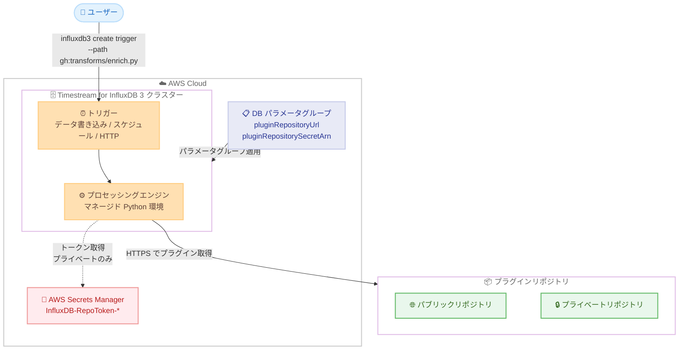

# Amazon Timestream for InfluxDB - カスタムプラグインのサポート

**リリース日**: 2026 年 9 月 8 日
**サービス**: Amazon Timestream for InfluxDB
**機能**: InfluxDB 3 プロセッシングエンジンでのカスタム Python プラグイン実行

📊 [このアップデートのインフォグラフィックを見る](https://takech9203.github.io/aws-news-summary/20260908-timestream-influxdb-custom-plugins.html)

## 概要

Amazon Timestream for InfluxDB は、マネージド版の InfluxDB 3 Core および Enterprise エディションで、ユーザー独自のカスタム Python プラグインを実行できるようになりました。プラグインコードはユーザーが管理するパブリックまたはプライベートのリポジトリにホストし、プロセッシングエンジンがトリガーに応じてコードを取得・実行します。これにより、外部に別途インフラを構築することなく、ワークロード固有のロジックをデータベース内で実装できます。

プラグインは、プロセッシングエンジンが既にサポートしているトリガータイプ (データ書き込み、スケジュール、HTTP リクエスト) で動作し、カスタムデータ変換、アラート、集計、独自サービスとの統合などをデータの近くで実行できます。プラグインは Python 標準ライブラリと Amazon が検証済みのパッケージを含むマネージド Python 環境で実行されるため、別パイプラインを運用する代わりに、ワークロード固有の処理をデータベース側に移すことができます。

利用を開始するには、DB パラメータグループにプラグインリポジトリを設定してクラスターに適用し、influxdb3 CLI または HTTP API でプラグインを参照するトリガーを作成します。プライベートリポジトリの場合は、AWS Secrets Manager に保存したトークンで認証します。

**アップデート前の課題**

- 以前はカスタムプラグインがサポートされておらず、InfluxData 認定のビルトインプラグインのみ利用可能だった
- ワークロード固有のデータ変換、アラート、集計、外部サービス統合を行うには、AWS Lambda などの外部インフラを別途構築・運用する必要があった
- データベース外の処理パイプラインは、レイテンシーの増加や運用負荷の増大につながっていた

**アップデート後の改善**

- 独自の Python プラグインをマネージド InfluxDB 3 のプロセッシングエンジン上で直接実行できるようになった
- ユーザーが管理するリポジトリ (パブリック / プライベート) にプラグインコードをホストし、エンジンが自動的に取得・実行するため、デプロイ用の外部インフラが不要になった
- `influxdb3 update trigger` によりクラスターの再起動なしでプラグインの更新を反映できるようになった

## アーキテクチャ図



DB パラメータグループでプラグインリポジトリを設定し、トリガーが発火するとプロセッシングエンジンが HTTPS 経由でリポジトリからプラグインコードを取得して実行します。プライベートリポジトリの場合は Secrets Manager のトークンで認証します。

## サービスアップデートの詳細

### 主要機能

1. **カスタム Python プラグインの実行**
   - InfluxDB 3 Core および Enterprise の両エディションのマネージドプロセッシングエンジン上で、ユーザー独自の Python コードを実行可能
   - カスタムデータ変換、アラート、集計、独自サービスとの統合などをデータベース内で実装できる
   - 従来サポートされていた InfluxData 認定プラグインに加えて、ワークロード固有のロジックを追加可能

2. **リポジトリベースのプラグイン配信**
   - プラグインコードはユーザーが管理するリポジトリ (パブリック / プライベート) にホスト
   - トリガーで `gh:` プレフィックスを使用してプラグインを参照すると、エンジンが `pluginRepositoryUrl` に対してパスを解決し、HTTPS 経由で raw ファイルを取得
   - 例: リポジトリ URL が `https://raw.githubusercontent.com/my-org/influxdb-plugins/main/` の場合、`--path "gh:transforms/enrich.py"` は `.../main/transforms/enrich.py` を取得

3. **既存トリガータイプとの統合**
   - **データ書き込み** (`table:<TABLE_NAME>` または `all_tables`): テーブルへの書き込み時に実行。データ変換、アラート、派生メトリクスに利用
   - **スケジュール** (`every:<DURATION>` または `cron:<EXPRESSION>`): 指定間隔で実行。定期集計、レポート、ヘルスチェックに利用
   - **HTTP リクエスト** (`request:<REQUEST_PATH>`): HTTP リクエスト受信時に実行。カスタム API、Webhook に利用

4. **プライベートリポジトリの認証**
   - リポジトリアクセストークンを AWS Secrets Manager のシークレット (名前は `InfluxDB-RepoToken-` で始まる必要あり) に保存
   - シークレットの ARN を `pluginRepositorySecretArn` パラメータで指定
   - カスタマーマネージド AWS KMS キー (CMK) によるシークレットの暗号化にも対応

5. **クラスター再起動不要のプラグイン更新**
   - リポジトリへの変更をプッシュ後、`influxdb3 update trigger` コマンドでプラグインを再取得し、実行中のトリガーに反映
   - クラスターの再起動やトリガーの再作成は不要

## 技術仕様

### パラメータグループ設定

| 項目 | 詳細 |
|------|------|
| `pluginRepositoryUrl` | raw プラグインファイルを配信するベース HTTPS URL。認証情報、クエリ文字列、フラグメントを含めることは不可。単一リポジトリのフルパス (推奨) またはホストのみの URL を指定可能 |
| `pluginRepositorySecretArn` | リポジトリアクセストークンを保持する Secrets Manager シークレットの ARN。プライベートリポジトリの場合のみ必須 |
| 設定先 | `InfluxDBv3Core` または `InfluxDBv3Enterprise` の下に設定 |
| URL の正規化 | GitHub リポジトリ URL (`https://github.com/<owner>/<repo>`) は raw コンテンツ形式に自動書き換え。`/tree/<branch>` や `/blob/...` 形式の Web URL は非対応 |
| 変更可否 | パラメータグループ上のリポジトリパラメータは不変 (イミュータブル)。変更するには新しいパラメータグループを作成し `update-db-cluster` で適用 |

### シークレット要件

| 項目 | 詳細 |
|------|------|
| 名前 | `InfluxDB-RepoToken-` で始まること (これ以外の名前は拒否される) |
| 配置 | パラメータグループと同一の AWS アカウントおよび AWS リージョン |
| 値 | アクセストークンをプレーン文字列で格納 (JSON 形式は不可) |
| 暗号化 | デフォルトは AWS マネージドキー (`aws/secretsmanager`)。CMK も利用可能 |
| 読み取り | サービスリンクロール `AWSServiceRoleForTimestreamInfluxDB` が使用される |

### Python 実行環境

| 項目 | 詳細 |
|------|------|
| 環境 | マネージド Python 環境 (データベースエンジン内の組み込み Python 仮想マシン) |
| 利用可能ライブラリ | Python 標準ライブラリ + Amazon 検証済みライブラリ (numpy、pandas、httpx など) |
| パッケージ追加 | Python パッケージマネージャーは無効化されており、サードパーティパッケージの追加インストールは不可 |
| インポートエラー | 環境に存在しないパッケージをインポートすると実行時にトリガーが失敗。`system.processing_engine_logs` で確認可能 |

## 設定方法

### 前提条件

1. Amazon Timestream for InfluxDB 3 クラスター (Core または Enterprise)
2. raw プラグインファイルを HTTPS で配信できるリポジトリ (パブリックまたはプライベート)
3. DB パラメータグループの作成・適用権限 (`timestream-influxdb:CreateDbParameterGroup`、`timestream-influxdb:UpdateDbCluster`)
4. トリガー作成用の InfluxDB 3 管理者トークン
5. (プライベートリポジトリのみ) 読み取り専用のリポジトリアクセストークンと Secrets Manager でのシークレット作成権限

### 手順

#### ステップ 1: (プライベートリポジトリのみ) リポジトリアクセスシークレットの作成

```bash
aws secretsmanager create-secret \
  --name InfluxDB-RepoToken-my-plugins \
  --secret-string "YOUR_REPOSITORY_ACCESS_TOKEN" \
  --region us-west-2
```

読み取り専用のリポジトリアクセストークンを Secrets Manager に保存します。シークレット名は `InfluxDB-RepoToken-` で始まる必要があります。返却された ARN を次のステップで使用します。GitHub のファイングレインドパーソナルアクセストークンのように、対象リポジトリのみに読み取り権限を限定したトークンの使用が推奨されます。

#### ステップ 2: プラグインリポジトリを設定したパラメータグループの作成

```bash
aws timestream-influxdb create-db-parameter-group \
  --name my-plugin-parameter-group \
  --description "InfluxDB 3 cluster with a custom plugin repository" \
  --region us-west-2 \
  --parameters '{
    "InfluxDBv3Core": {
      "pluginRepositoryUrl": "https://raw.githubusercontent.com/my-org/influxdb-plugins/main/",
      "pluginRepositorySecretArn": "arn:aws:secretsmanager:us-west-2:111122223333:secret:InfluxDB-RepoToken-my-plugins-AbCdEf"
    }
  }'
```

プラグインリポジトリの URL とシークレット ARN を指定して DB パラメータグループを作成します。パブリックリポジトリの場合は `pluginRepositoryUrl` のみを設定します。バージョンを予測可能にするため、URL にはブランチ (例: `.../main/`) を含めることが推奨されます。

#### ステップ 3: パラメータグループのクラスターへの適用

```bash
aws timestream-influxdb update-db-cluster \
  --db-cluster-id my-cluster-id \
  --db-parameter-group-identifier my-plugin-parameter-group \
  --region us-west-2
```

作成したパラメータグループを既存クラスターに適用します。パラメータグループの適用はクラスターのメンテナンスアクションとして実行されるため、メンテナンスウィンドウを考慮してください。クラスターが `AVAILABLE` 状態に戻ると、カスタムプラグインリポジトリが有効になります。新規クラスターの場合は `create-db-cluster` の `--db-parameter-group-identifier` で指定できます。

#### ステップ 4: カスタムプラグインを実行するトリガーの作成

```bash
# テーブルへの書き込みをトリガーとする例
influxdb3 create trigger \
  --trigger-spec "table:sensor_data" \
  --path "gh:transforms/enrich.py" \
  --database DATABASE_NAME \
  --token YOUR_ADMIN_TOKEN \
  enrich_sensor_data

# スケジュール実行の例
influxdb3 create trigger \
  --trigger-spec "every:5m" \
  --path "gh:metrics/custom_system.py" \
  --database DATABASE_NAME \
  --token YOUR_ADMIN_TOKEN \
  custom_metrics
```

クラスターの InfluxDB エンドポイントに対して influxdb3 CLI (または HTTP API) でトリガーを作成します。`gh:` プレフィックスの後のパスが `pluginRepositoryUrl` に対して解決され、プラグインコードが取得されます。`--trigger-arguments` でプラグインに設定値を渡すこともできます。

#### ステップ 5: プラグインの更新

```bash
influxdb3 update trigger \
  --database DATABASE_NAME \
  --token YOUR_ADMIN_TOKEN \
  --trigger-name enrich_sensor_data \
  --path "gh:transforms/enrich.py"
```

リポジトリに変更をプッシュした後、このコマンドでプラグインを再取得し、実行中のトリガーに変更を反映します。トリガーの再作成やクラスターの再起動は不要です。

## メリット

### ビジネス面

- **インフラコストの削減**: データ変換やアラート処理のために Lambda や外部パイプラインを別途構築・運用する必要がなくなり、インフラコストと運用負荷を削減できる
- **開発速度の向上**: リポジトリへのプッシュと `update trigger` だけでプラグインを更新でき、デプロイパイプラインの構築なしに迅速なイテレーションが可能
- **既存資産の活用**: OSS 版 InfluxDB 3 のプロセッシングエンジンと同じ仕組みであり、コミュニティや自社で開発したプラグイン資産をマネージド環境でも活用できる

### 技術面

- **データに近い処理**: 処理がデータベース内で実行されるため、データ移動に伴うレイテンシーを削減し、リアルタイム性の高い変換・アラートを実現できる
- **セキュアなコード配信**: プライベートリポジトリのトークンを Secrets Manager で管理し、CMK 暗号化やリソースポリシーによるアクセス制限も可能
- **一貫した監視**: カスタムプラグインも認定プラグインと同じ方法で監視でき、`system.processing_engine_logs` や `system.processing_engine_triggers` システムテーブルで実行状況を確認できる

## デメリット・制約事項

### 制限事項

- カスタムリポジトリからは単一ファイルのプラグインのみサポートされる (`gh:` プレフィックスは自己完結型の 1 つの .py ファイルのみ対応)
- リポジトリは HTTPS で raw ファイルを配信できる必要があり、URL に認証情報、クエリ文字列、フラグメントを含めることはできない
- Python パッケージマネージャーは無効化されており、標準ライブラリと事前インストール済みライブラリ以外のサードパーティパッケージは利用できない
- パラメータグループ上のリポジトリパラメータは不変であり、変更には新しいパラメータグループの作成と `update-db-cluster` での適用が必要
- シークレットはパラメータグループと同一アカウント・同一リージョンに配置し、名前を `InfluxDB-RepoToken-*` とする必要がある

### 考慮すべき点

- カスタムプラグインはデータベースエンジン内でユーザー提供のコードを実行するため、信頼できる管理下のリポジトリのみを使用し、本番クラスターにはレビュー済みのプラグインのみを配置すべき
- ホストのみのベース URL を使用すると、そのホストが配信する任意のリポジトリからプラグインコードをロードできてしまうため、単一リポジトリ利用時はベース URL をリポジトリとブランチまで固定 (ピン留め) することが推奨される
- HTTP リクエストトリガーのプラグインでは、リクエストボディ、ヘッダー、クエリパラメータを信頼できない入力として扱い、入力検証を行う必要がある
- パラメータグループの適用はメンテナンスアクションとなるため、メンテナンスウィンドウの計画が必要
- リポジトリアクセストークンは読み取り専用・対象リポジトリ限定でスコープし、有効期限の設定と定期的なローテーションを行うべき

## ユースケース

### ユースケース 1: IoT センサーデータのリアルタイム変換・エンリッチ

**シナリオ**: 製造ラインのセンサーデータを Timestream for InfluxDB に取り込む際、単位変換やメタデータ付与などの前処理をデータベース内で行いたい。

**実装例**:
```bash
influxdb3 create trigger \
  --trigger-spec "table:sensor_data" \
  --path "gh:transforms/enrich.py" \
  --database factory_db \
  --token YOUR_ADMIN_TOKEN \
  enrich_sensor_data
```

**効果**: 書き込み時にデータベース内で変換処理が実行されるため、外部の前処理パイプラインが不要になり、取り込みからクエリ可能になるまでの遅延を短縮できる。

### ユースケース 2: 独自の通知サービスと連携したしきい値アラート

**シナリオ**: メトリクスが独自のビジネスルールに基づくしきい値を超えた場合に、社内の通知サービスへアラートを送信したい。標準のアラートプラグインでは対応できない複雑な判定ロジックが必要。

**実装例**:
```python
# alerting/threshold.py (リポジトリにホストするプラグイン例)
# httpx などの事前インストール済みライブラリを使用して
# 社内 API へ通知を送信するロジックを実装
```

```bash
influxdb3 create trigger \
  --trigger-spec "every:1m" \
  --path "gh:alerting/threshold.py" \
  --database metrics_db \
  --token YOUR_ADMIN_TOKEN \
  custom_alert
```

**効果**: ワークロード固有の判定ロジックと独自サービス統合をデータベース内で完結でき、アラート専用の外部インフラを運用する必要がなくなる。

### ユースケース 3: InfluxData 公式プラグインと自社プラグインの併用

**シナリオ**: InfluxData のパブリックプラグインリポジトリのプラグインと、自社開発のプラグインを同一クラスターで使い分けたい。

**実装例**:
```bash
# パラメータグループでホストのみのベース URL を設定
# "pluginRepositoryUrl": "https://raw.githubusercontent.com"

# InfluxData 公式リポジトリのプラグイン
influxdb3 create trigger \
  --trigger-spec "every:5m" \
  --path "gh:influxdata/influxdb3_plugins/main/influxdata/signal_generator/signal_generator.py" \
  --database DATABASE_NAME --token YOUR_ADMIN_TOKEN influxdata_signal

# 自社リポジトリのプラグイン
influxdb3 create trigger \
  --trigger-spec "table:sensor_data" \
  --path "gh:my-org/my-plugins/main/transforms/enrich.py" \
  --database DATABASE_NAME --token YOUR_ADMIN_TOKEN my_enrich
```

**効果**: トリガーごとに異なるリポジトリからプラグインをロードでき、公式プラグインと自社プラグインを柔軟に組み合わせられる。ただしセキュリティ上、複数リポジトリが本当に必要な場合のみホストのみのベース URL を使用すること。

## 料金

カスタムプラグイン機能自体の追加料金に関する記載は公式発表にはありません。Amazon Timestream for InfluxDB の通常のインスタンス・ストレージ料金が適用されます。プライベートリポジトリを使用する場合は、AWS Secrets Manager のシークレット保存および API コールに対する料金が別途発生します。

詳細は [Amazon Timestream 料金ページ](https://aws.amazon.com/timestream/pricing/) を参照してください。

## 利用可能リージョン

Amazon Timestream for InfluxDB が利用可能なすべての AWS リージョンで利用できます。

## 関連サービス・機能

- **AWS Secrets Manager**: プライベートリポジトリのアクセストークンを保存し、サービスリンクロール経由でエンジンが読み取る
- **AWS KMS**: シークレットの暗号化にカスタマーマネージドキー (CMK) を利用可能。`kms:ViaService` 条件によるアクセス制限もサポート
- **DB パラメータグループ**: プラグインリポジトリの URL とシークレット ARN を設定する仕組み。クラスターへの適用で機能が有効化される
- **InfluxDB 3 プロセッシングエンジン**: データベース内に組み込まれた Python 仮想マシン。InfluxData 認定プラグインに加えて今回カスタムプラグインに対応

## 参考リンク

- 📊 [インフォグラフィック](https://takech9203.github.io/aws-news-summary/20260908-timestream-influxdb-custom-plugins.html)
- [公式発表 (What's New)](https://aws.amazon.com/about-aws/whats-new/2026/09/timestream-influxdb-custom-plugins/)
- [ドキュメント: Use custom plugins with the processing engine](https://docs.aws.amazon.com/timestream/latest/developerguide/influxdb3-custom-plugins.html)
- [ドキュメント: Extend Timestream for InfluxDB with processing engine plugins](https://docs.aws.amazon.com/timestream/latest/developerguide/processing-engine.html)
- [料金ページ](https://aws.amazon.com/timestream/pricing/)

## まとめ

Amazon Timestream for InfluxDB 3 のカスタムプラグイン対応により、これまで InfluxData 認定プラグインに限定されていたプロセッシングエンジンで、ワークロード固有の Python コードを実行できるようになりました。データ変換、アラート、集計、独自サービス統合をデータベース内で完結でき、外部パイプラインの構築・運用が不要になります。InfluxDB 3 クラスターを運用中で書き込み時処理や定期処理を外部で実装しているチームは、パラメータグループへのリポジトリ設定とトリガー作成だけで移行を試せるため、まずは開発環境での評価をお勧めします。
