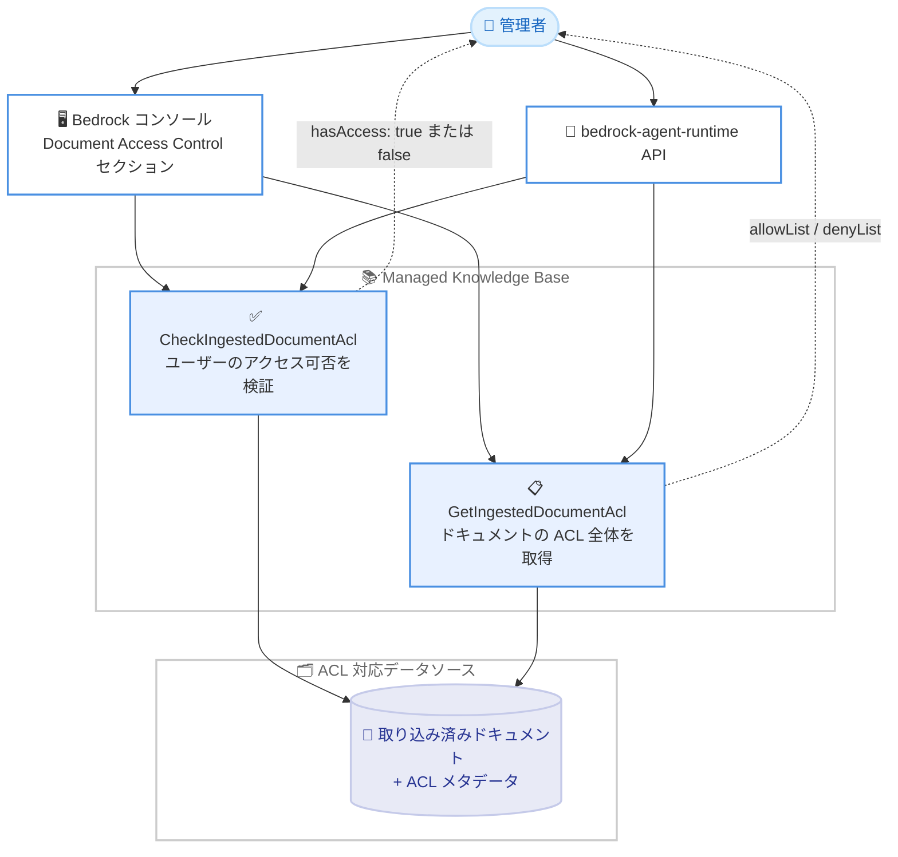

# Amazon Bedrock - Managed Knowledge Base のドキュメントレベルアクセス制御デバッグ機能

**リリース日**: 2026 年 9 月 9 日
**サービス**: Amazon Bedrock (Knowledge Bases)
**機能**: ドキュメントレベルアクセス制御のデバッグ用 API およびコンソールサポート

📊 [このアップデートのインフォグラフィックを見る](https://takech9203.github.io/aws-news-summary/20260909-amazon-bedrock-knowledge-base-debugging-document-access-control.html)

## 概要

Amazon Bedrock Managed Knowledge Base に、ドキュメントレベルのアクセス制御 (ACL) をデバッグするための 2 つの新しい API `CheckIngestedDocumentAcl` と `GetIngestedDocumentAcl`、およびコンソールサポートが追加されました。ACL 対応データソースを利用する場合に、ドキュメントへのアクセス権限の問題をセルフサービスで診断・監査できるようになります。

`CheckIngestedDocumentAcl` API は、特定のユーザーが取り込み済みの特定のドキュメントにアクセスできるかどうかを検証します。`GetIngestedDocumentAcl` API は、ドキュメントに付与された ACL 全体 (許可リストと拒否リスト) を取得し、設定された権限の監査や設定ミスの特定に利用できます。また、コンソールのデータソース詳細ページに「Document Access Control」セクションが追加され、ドキュメント ID とユーザーのメールアドレスを入力してアクセス可否を確認したり、ドキュメント ID から ACL 全体を取得したりできます。

RAG アプリケーションで「特定のユーザーの検索結果に期待したドキュメントが表示されない」という問題が発生した際、原因がアクセス制御の設定ミスなのか、それ以外なのかを切り分けることは困難でした。今回のアップデートにより、サポートケースを起票することなく、権限の問題を迅速に診断・解決できるようになります。

**アップデート前の課題**

このアップデート以前は、ACL 対応データソースのアクセス制御に起因する問題の切り分けが困難でした。

- 検索結果にドキュメントが表示されない場合、原因が ACL の設定ミスか、取り込みの失敗か、検索精度の問題かを判別する手段がなかった
- 取り込み済みドキュメントにどのような ACL が付与されているかを確認する API が存在しなかった
- 権限の問題を解決するために AWS サポートへの問い合わせが必要になるケースがあった

**アップデート後の改善**

今回のアップデートにより、以下が可能になりました。

- `CheckIngestedDocumentAcl` API により、特定のユーザーが特定のドキュメントにアクセスできるかをその場で検証できるようになった
- `GetIngestedDocumentAcl` API により、ドキュメントに付与された ACL 全体を取得し、権限設定の監査や設定ミスの特定ができるようになった
- コンソールのデータソース詳細ページからも同等の確認操作ができるようになり、サポートケースなしで問題を自己解決できるようになった

## アーキテクチャ図



管理者はコンソールまたは API を通じて、取り込み済みドキュメントに付与された ACL を照会し、特定ユーザーのアクセス可否を検証できます。

## サービスアップデートの詳細

### 主要機能

1. **CheckIngestedDocumentAcl API**
   - 特定のユーザーが特定の取り込み済みドキュメントにアクセスできるかを検証する
   - ドキュメント ID とユーザーコンテキスト (ユーザー ID、オプションでグループメンバーシップ) を指定して呼び出す
   - レスポンスとして `hasAccess` (Boolean) が返され、アクセス可否を即座に判定できる
   - 取り込み後にドキュメントレベルのアクセス制御が期待どおりに機能しているかの検証に使用する

2. **GetIngestedDocumentAcl API**
   - 特定のドキュメントに対して取り込まれた ACL 全体を取得する
   - 許可リスト (allowList) と拒否リスト (denyList) の両方が返され、ユーザー・グループ単位の条件や条件間の関係 (memberRelation) を確認できる
   - 権限設定の監査や、アクセス制御の設定ミスの特定に使用する

3. **コンソールの Document Access Control セクション**
   - データソース詳細ページに新しく追加されたセクション
   - ドキュメント ID とユーザーのメールアドレスを入力して、そのユーザーのアクセス可否を確認できる
   - ドキュメント ID のみを入力して、ドキュメントの ACL 全体を取得できる

## 技術仕様

### 新規 API の仕様

| 項目 | CheckIngestedDocumentAcl | GetIngestedDocumentAcl |
|------|--------------------------|------------------------|
| サービスエンドポイント | bedrock-agent-runtime | bedrock-agent-runtime |
| HTTP メソッド / パス | POST /knowledgebases/{knowledgeBaseId}/datasources/{dataSourceId}/check-ingested-document-acl | POST /knowledgebases/{knowledgeBaseId}/datasources/{dataSourceId}/get-ingested-document-acl |
| リクエストボディ | `documentId` (必須)、`userContext` (必須) | `documentId` (必須) |
| レスポンス | `hasAccess` (Boolean) | `documentAcl` (allowList / denyList) |
| 必要な IAM 権限 | `bedrock:CheckIngestedDocumentAcl` | `bedrock:GetIngestedDocumentAcl` |

### 主なエラータイプ

| エラー | HTTP ステータス | 説明 |
|------|------|------|
| AccessDeniedException | 403 | アクセス権限が不足している |
| ResourceNotFoundException | 404 | 指定したリソース ARN が見つからない |
| ThrottlingException | 429 | リクエスト数が制限を超過した |
| ValidationException | 400 | 入力バリデーションに失敗した |

### GetIngestedDocumentAcl のレスポンス構造

```json
{
  "documentAcl": {
    "allowList": {
      "conditions": [
        {
          "conditionOperator": "string",
          "groups": [{ "id": "string", "type": "string" }],
          "users": [{ "id": "string", "type": "string" }]
        }
      ],
      "memberRelation": "string"
    },
    "denyList": {
      "conditions": [
        {
          "conditionOperator": "string",
          "groups": [{ "id": "string", "type": "string" }],
          "users": [{ "id": "string", "type": "string" }]
        }
      ],
      "memberRelation": "string"
    }
  }
}
```

## 設定方法

### 前提条件

1. Amazon Bedrock Managed Knowledge Base が作成済みであること
2. ACL 対応データソースが接続され、ドキュメントが取り込み済みであること
3. 呼び出し元の IAM プリンシパルに `bedrock:CheckIngestedDocumentAcl` および `bedrock:GetIngestedDocumentAcl` 権限が付与されていること

### 手順

#### ステップ 1: ユーザーのアクセス可否を検証する

```bash
aws bedrock-agent-runtime check-ingested-document-acl \
  --knowledge-base-id KB12345678 \
  --data-source-id DS12345678 \
  --document-id "doc-001" \
  --user-context '{"userId": "user@example.com", "userGroups": [{"id": "engineering", "type": "KNOWLEDGE_BASE"}]}'
```

指定したナレッジベース・データソース内のドキュメント `doc-001` に対して、ユーザー `user@example.com` (グループ `engineering` に所属) がアクセスできるかを検証します。レスポンスの `hasAccess` が `true` であればアクセス可能、`false` であればアクセス不可です。

#### ステップ 2: ドキュメントの ACL 全体を取得する

```bash
aws bedrock-agent-runtime get-ingested-document-acl \
  --knowledge-base-id KB12345678 \
  --data-source-id DS12345678 \
  --document-id "doc-001"
```

ドキュメント `doc-001` に取り込まれた ACL 全体 (許可リストと拒否リスト) を取得します。ステップ 1 でアクセス不可と判定された場合に、どの条件が原因かをこの出力から特定します。

#### ステップ 3: コンソールから確認する

1. Amazon Bedrock コンソールで対象のナレッジベースを開く
2. データソース詳細ページの「Document Access Control」セクションに移動する
3. ドキュメント ID とユーザーのメールアドレスを入力してアクセス可否を確認する、またはドキュメント ID のみを入力して ACL 全体を取得する

## メリット

### ビジネス面

- **問題解決の迅速化**: サポートケースを起票せずに権限の問題をセルフサービスで診断・解決できるため、RAG アプリケーションの障害対応時間を短縮できる
- **コンプライアンス対応の強化**: ドキュメント単位で付与された権限を監査できるため、機密情報へのアクセス制御が意図どおりに機能していることを証明しやすくなる
- **運用コストの削減**: 権限トラブルの調査にかかる工数と AWS サポートとのやり取りを削減できる

### 技術面

- **原因の切り分けが容易**: 検索結果にドキュメントが出ない場合に、ACL の設定ミスか、それ以外の問題 (取り込み失敗、検索精度など) かを明確に切り分けられる
- **API とコンソールの両対応**: 自動化された監査スクリプトには API を、アドホックな調査にはコンソールを使い分けられる
- **ACL の内部状態を可視化**: 取り込み時に生成された ACL の実際の内容 (allowList / denyList) を確認できるため、ソースシステム側の権限設定との突き合わせが可能

## デメリット・制約事項

### 制限事項

- ACL 対応データソースを使用している場合にのみ有効な機能である
- 対象は取り込み済み (ingested) のドキュメントであり、取り込み前のソースシステム側の権限をリアルタイムに照会するものではない
- 発表時点では利用可能リージョンが明記されていないため、利用前に対象リージョンでの提供状況を確認する必要がある

### 考慮すべき点

- API の呼び出しには `bedrock:CheckIngestedDocumentAcl` および `bedrock:GetIngestedDocumentAcl` の IAM 権限が必要であり、ACL 情報自体が機密情報となり得るため、これらの権限の付与先は最小限にすべきである
- ソースシステム側で権限を変更した場合、次回の同期 (sync) が完了するまで取り込み済み ACL には反映されない点に注意が必要である

## ユースケース

### ユースケース 1: 検索結果にドキュメントが表示されない問題のトラブルシューティング

**シナリオ**: 社内 RAG チャットボットで、あるユーザーから「自分の部署のドキュメントが回答に反映されない」と報告があった。原因が権限設定なのか検索精度なのかを切り分けたい。

**実装例**:
```bash
# 対象ユーザーのアクセス可否を確認
aws bedrock-agent-runtime check-ingested-document-acl \
  --knowledge-base-id KB12345678 \
  --data-source-id DS12345678 \
  --document-id "dept-doc-042" \
  --user-context '{"userId": "taro@example.com"}'
```

**効果**: `hasAccess` が `false` であれば ACL の設定ミス、`true` であれば検索精度など別の原因と即座に切り分けられ、調査時間を大幅に短縮できる。

### ユースケース 2: ドキュメントレベル権限の定期監査

**シナリオ**: 機密ドキュメントを含むナレッジベースについて、意図しないユーザーやグループに権限が付与されていないかを定期的に監査したい。

**実装例**:
```bash
# 機密ドキュメントの ACL 全体を取得して監査ログに記録
aws bedrock-agent-runtime get-ingested-document-acl \
  --knowledge-base-id KB12345678 \
  --data-source-id DS12345678 \
  --document-id "confidential-doc-001" > acl_audit_$(date +%Y%m%d).json
```

**効果**: 許可リスト・拒否リストの内容を定期的に記録・レビューすることで、権限の設定ミスや不要な権限付与を早期に検出できる。

### ユースケース 3: データソース同期後の ACL 反映確認

**シナリオ**: ソースシステム側でドキュメントの共有範囲を変更した後、データソースの同期を実行した。変更が Knowledge Base 側の ACL に正しく反映されたかを確認したい。

**実装例**:
```bash
# 同期後に、新しく権限を付与したユーザーでアクセス可否を検証
aws bedrock-agent-runtime check-ingested-document-acl \
  --knowledge-base-id KB12345678 \
  --data-source-id DS12345678 \
  --document-id "shared-doc-010" \
  --user-context '{"userId": "new-member@example.com", "userGroups": [{"id": "project-a", "type": "KNOWLEDGE_BASE"}]}'
```

**効果**: 権限変更のリリース作業に検証ステップを組み込むことで、エンドユーザーからの問い合わせを未然に防止できる。

## 料金

公式発表には本機能に関する追加料金の記載はありません。Amazon Bedrock Knowledge Bases の標準料金体系が適用されます。詳細は [Amazon Bedrock 料金ページ](https://aws.amazon.com/bedrock/pricing/) を確認してください。

## 利用可能リージョン

公式発表には利用可能リージョンの明記がありません。Amazon Bedrock Managed Knowledge Base が提供されているリージョンでの利用が想定されますが、利用前に対象リージョンでの提供状況を公式ドキュメントで確認してください。

## 関連サービス・機能

- **Amazon Bedrock Knowledge Bases**: 本機能の対象となるマネージド RAG 基盤。データソースからドキュメントを取り込み、ベクトル検索を提供する
- **Amazon Bedrock Retrieve / RetrieveAndGenerate API**: ユーザーコンテキストに基づく ACL フィルタリングが適用される検索 API。本機能はこの検索結果の権限問題のデバッグに使用する
- **AWS IAM**: 新 API の呼び出しには `bedrock:CheckIngestedDocumentAcl` と `bedrock:GetIngestedDocumentAcl` 権限の付与が必要

## 参考リンク

- 📊 [インフォグラフィック](https://takech9203.github.io/aws-news-summary/20260909-amazon-bedrock-knowledge-base-debugging-document-access-control.html)
- [公式発表 (What's New)](https://aws.amazon.com/about-aws/whats-new/2026/09/amazon-bedrock-knowledge-base-debugging-document-access-control/)
- [CheckIngestedDocumentAcl API リファレンス](https://docs.aws.amazon.com/bedrock/latest/APIReference/API_agent-runtime_CheckIngestedDocumentAcl.html)
- [GetIngestedDocumentAcl API リファレンス](https://docs.aws.amazon.com/bedrock/latest/APIReference/API_agent-runtime_GetIngestedDocumentAcl.html)
- [Amazon Bedrock Knowledge Bases 製品ページ](https://aws.amazon.com/bedrock/knowledge-bases/)
- [料金ページ](https://aws.amazon.com/bedrock/pricing/)

## まとめ

Amazon Bedrock Managed Knowledge Base の ACL 対応データソースにおける権限トラブルを、サポートケースなしでセルフサービスで診断できる重要なアップデートです。ドキュメントレベルアクセス制御を利用した RAG アプリケーションを運用しているチームは、トラブルシューティング手順と定期監査プロセスに `CheckIngestedDocumentAcl` と `GetIngestedDocumentAcl` の活用を組み込むことを推奨します。
