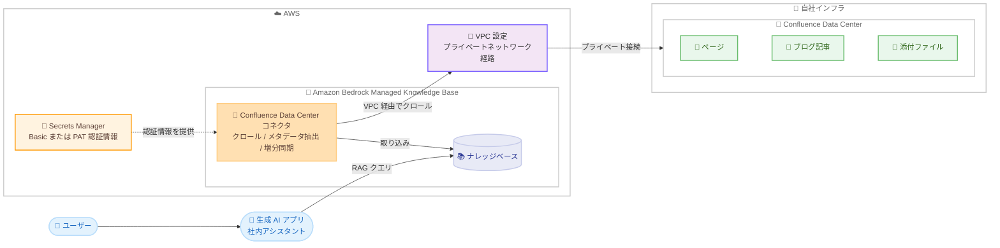

# Amazon Bedrock - Managed Knowledge Base の Confluence Data Center ネイティブデータソースコネクタ

**リリース日**: 2026 年 9 月 9 日
**サービス**: Amazon Bedrock
**機能**: Managed Knowledge Base 向け Confluence Data Center ネイティブデータソースコネクタ

📊 [このアップデートのインフォグラフィックを見る](https://takech9203.github.io/aws-news-summary/20260909-amazon-bedrock-managed-knowledge-base-confluence-data-center-native-data-source-connector.html)

## 概要

Amazon Bedrock Managed Knowledge Base が、Confluence Data Center をネイティブデータソースコネクタとしてサポートしました。Managed Knowledge Base はフルマネージド型の検索拡張生成 (RAG) サービスであり、今回のアップデートにより、自社インフラ上でセルフホストしている Confluence Server / Data Center インスタンスを接続し、Confluence スペース内のページ、ブログ記事、添付ファイルを直接ナレッジベースに取り込めるようになります。

Confluence Data Center インスタンスは自社インフラ上で稼働するため、コネクタは VPC 設定で定義したプライベートネットワーク経路を通じてインスタンスに到達します。認証情報を指定するだけで、データクローリング、メタデータ抽出、増分同期をコネクタが自動的に処理します。フィルタを使用して特定のスペースやコンテンツタイプにクロール範囲を限定できるため、ナレッジベースを目的に集中させ、コスト効率を高められます。

エンジニアリングドキュメント、ランブック、チームの Wiki など、Confluence に蓄積された組織のナレッジを AI エージェントの基盤情報として活用したい組織にとって、カスタムのインジェストパイプラインを構築することなく社内アシスタントなどの生成 AI アプリケーションを構築できる点が大きな価値です。

**アップデート前の課題**

- 以前はセルフホストの Confluence Data Center のコンテンツを Bedrock のナレッジベースに取り込むには、カスタムのインジェストパイプラインを構築・保守する必要があった
- Confluence REST API の呼び出し、メタデータの抽出、変更差分の検出などを自前で実装する必要があり、開発・運用コストが高かった
- プライベートネットワーク内にある Confluence インスタンスへの接続経路を含めて、同期処理全体を独自に設計する必要があった

**アップデート後の改善**

- 認証情報と VPC 設定を指定するだけで、Confluence スペース内のページ、ブログ記事、添付ファイルを自動的に取り込めるようになった
- 追加・更新・削除されたコンテンツを増分同期でき、フルクロールを繰り返す必要がなくなった
- スペース URL、ページ URL、MIME タイプのフィルタにより、クロール範囲を特定のスペースやコンテンツタイプに限定できるようになった

## アーキテクチャ図



Confluence Data Center コネクタが VPC 設定で定義したプライベートネットワーク経路を通じてセルフホストの Confluence インスタンスに接続し、ページ、ブログ記事、添付ファイルをクロールして Managed Knowledge Base に取り込む流れを示しています。取り込まれたコンテンツは、生成 AI アプリケーションからの RAG クエリで利用されます。

## サービスアップデートの詳細

### 主要機能

1. **ページ・ブログ記事・添付ファイルのクローリング**
   - Confluence スペース全体を対象に、ページ、ブログ記事、それぞれの添付ファイルを取り込み可能
   - タイトル、著者、作成日・更新日などの一般的なドキュメントフィールドを自動検出
   - 個人スペース (personal space) のクロール可否も設定可能

2. **増分同期**
   - 追加・更新・削除されたコンテンツを増分同期
   - フルクロールを繰り返す必要がなく、Confluence 側の変更を効率的にナレッジベースへ反映

3. **フィルタによるスコープ制御**
   - スペース URL とページ URL の包含フィルタでクロール範囲を特定のスペースやページに限定
   - MIME タイプの包含・除外フィルタで取り込むファイル種別を制御
   - maxFileSizeInMegaBytes で単一ファイルの上限サイズを指定可能

4. **Basic / Personal Access Token 認証**
   - Basic 認証 (ユーザー名とパスワード) または Personal Access Token (PAT) 認証をサポート
   - 認証情報は AWS Secrets Manager のシークレットで管理
   - UpdateDataSource で認証方式を後から変更することも可能

5. **VPC 設定によるプライベート接続**
   - VPC 設定で定義したプライベートネットワーク経路経由でセルフホストインスタンスに接続
   - デフォルト以外のパスで REST API を提供している場合はアプリケーションコンテキストパス (例: /wiki) を指定可能
   - HTTPS 接続時は TLS 証明書を Amazon S3 に配置して利用可能

## 技術仕様

### コネクタの主な設定項目

| 項目 | 詳細 |
|------|------|
| データソースタイプ | CONFLUENCEONPREM (MANAGED_KNOWLEDGE_BASE_CONNECTOR) |
| 認証方式 | Basic (BASIC) または Personal Access Token (PERSONAL_TOKEN) |
| 認証情報の保管 | AWS Secrets Manager (Basic: username / password、PAT: patToken) |
| ネットワーク | VPC 設定 (vpcConfigurationId) によるプライベート接続が必須 |
| コンテキストパス | contextPath で REST API のアプリケーションコンテキストパスを指定 (任意) |
| TLS 証明書 | certificateS3Path で S3 上の証明書を指定 (HTTPS 接続時、任意) |
| クロール対象 | ページ、ブログ記事、それぞれの添付ファイル、個人スペース |
| フィルタ | スペース URL / ページ URL の包含リスト、MIME タイプの包含・除外リスト |
| 最大ファイルサイズ | maxFileSizeInMegaBytes で単一ファイルの上限を指定 (例: "50") |
| 同期方式 | 追加・更新・削除を反映する増分同期 |

### データソース設定例 (CreateDataSource)

```json
{
    "type": "MANAGED_KNOWLEDGE_BASE_CONNECTOR",
    "managedKnowledgeBaseConnectorConfiguration": {
        "connectorParameters": {
            "type": "CONFLUENCEONPREM",
            "version": "1",
            "aclEnabled": false,
            "connectionConfiguration": {
                "authType": "BASIC",
                "secretArn": "arn:aws:secretsmanager:us-west-2:123456789012:secret:bedrock-confluence-onprem-creds",
                "contextPath": "/wiki",
                "vpcConfiguration": {
                    "vpcConfigurationId": "your-vpc-configuration-id"
                },
                "certificateS3Path": {
                    "s3BucketName": "my-cert-bucket",
                    "s3KeyName": "confluence-dc-cert.pem"
                }
            },
            "dataEntityConfiguration": {
                "crawlPage": true,
                "crawlBlog": true,
                "crawlPageAttachment": true,
                "crawlBlogAttachment": true
            },
            "filterConfiguration": {
                "inclusionSpaceUrls": ["https://confluence.example.com/spaces/ENG/"]
            }
        }
    }
}
```

## 設定方法

### 前提条件

1. Confluence Data Center インスタンスの URL を確認していること (デフォルト以外のパスでホストしている場合はアプリケーションコンテキストパスも確認)
2. 内部ロードバランサー経由など、VPC からプライベートネットワーク経路でインスタンスに到達できること
3. クロール対象のスペース、ページ、ブログ記事すべてにアクセスできる Confluence アカウントまたは PAT を用意していること
4. 認証情報を AWS Secrets Manager のシークレット (ナレッジベースと同じリージョン) に保存し、ARN を控えていること
5. HTTPS で接続する場合、インスタンスの TLS 証明書を Amazon S3 バケットに保存していること (任意)
6. ナレッジベースの IAM ロールに、データソースへの接続に必要な権限が含まれていること

### 手順

#### ステップ 1: VPC 接続を設定する

Confluence Data Center インスタンスに到達できる VPC 設定をナレッジベースに作成します。作成した VPC 設定の ID を後続のステップで使用します。詳細は公式ドキュメントの「Configure VPC connectivity for a data source」を参照してください。

#### ステップ 2: 認証情報を AWS Secrets Manager に保存する

```bash
# Basic 認証の場合
aws secretsmanager create-secret \
  --name bedrock-confluence-onprem-creds \
  --secret-string '{"username":"YOUR_CONFLUENCE_USERNAME","password":"YOUR_CONFLUENCE_PASSWORD"}'

# Personal Access Token 認証の場合
aws secretsmanager create-secret \
  --name bedrock-confluence-onprem-creds \
  --secret-string '{"patToken":"YOUR_PERSONAL_ACCESS_TOKEN"}'
```

選択した認証方式に対応するキーと値のペアを含むシークレットを Secrets Manager に作成しています。Basic 認証は username と password、PAT 認証は patToken をキーとして保存します。出力される ARN を次のステップで使用します。

#### ステップ 3: Confluence Data Center データソースを作成する

```bash
aws bedrock-agent create-data-source \
  --name "Confluence-DataCenter-connector" \
  --knowledge-base-id "your-knowledge-base-id" \
  --data-source-configuration file://confluence-onprem-connector.json
```

Managed Knowledge Base に Confluence Data Center データソースを作成しています。confluence-onprem-connector.json には前述の設定例の内容を記載します (PAT 認証を使用する場合は authType を PERSONAL_TOKEN に変更)。Managed Knowledge Base の CreateDataSource は非同期で実行され、データソースのステータスが CREATING から AVAILABLE に遷移すると作成完了です。マネジメントコンソールからも、データソースタイプに Confluence Data Center を選択して同様の設定が可能です。

#### ステップ 4: データソースを同期する

データソース作成後に同期を実行し、Confluence のコンテンツをナレッジベースに取り込みます。以降は増分同期により、追加・更新・削除が反映されます。

## メリット

### ビジネス面

- **開発コストの削減**: カスタムインジェストパイプラインの構築・保守が不要になり、生成 AI アプリケーションの開発期間を短縮できる
- **社内ナレッジの活用促進**: エンジニアリングドキュメント、ランブック、チーム Wiki など Confluence に蓄積された組織のナレッジを AI エージェントの基盤情報として活用できる
- **コスト効率の向上**: スペースやコンテンツタイプのフィルタにより必要なコンテンツのみを取り込み、ナレッジベースを目的に集中させられる

### 技術面

- **フルマネージドな同期処理**: データクローリング、メタデータ抽出、増分同期をコネクタが自動処理し、運用負荷を削減できる
- **プライベート接続**: VPC 設定によるプライベートネットワーク経路で、インターネットに公開していないセルフホストインスタンスにもセキュアに接続できる
- **柔軟な認証と証明書対応**: Basic / PAT の 2 種類の認証方式、コンテキストパス指定、S3 上の TLS 証明書指定により、多様なセルフホスト構成に対応できる

## デメリット・制約事項

### 制限事項

- ドキュメントレベルのアクセス制御リスト (ACL) をサポートしていない。ナレッジベースにクエリできる認証済みユーザーは、クロールされたすべてのコンテンツを参照できる
- Confluence Cloud コネクタと異なり、アーカイブ済みスペースおよびアーカイブ済みページのクロールはサポートしていない
- 接続には VPC 設定が必須であり、VPC から Confluence Data Center インスタンスへ到達できるネットワーク構成が前提となる

### 考慮すべき点

- ACL が適用されないため、機密性の高いコンテンツを含む場合はスペース URL やページ URL の包含フィルタで取り込み範囲を制限する設計が必要
- クロールに使用する Confluence アカウントには、対象のスペース、ページ、ブログ記事すべてへのアクセス権限が必要
- ホスト型の Confluence Cloud (SaaS) を利用している場合は、本コネクタではなく Confluence Cloud 用のコネクタを使用する
- 公式発表には利用可能リージョンの明記がないため、利用予定のリージョンで機能が提供されているかドキュメントやコンソールで確認が必要

## ユースケース

### ユースケース 1: エンジニアリングドキュメントに基づく社内アシスタント

**シナリオ**: 開発部門が設計ドキュメントや技術仕様を Confluence Data Center で管理しており、エンジニアからの技術的な質問に自動で回答するアシスタントを構築したい。

**実装例**:
```
1. エンジニアリングスペースの URL を inclusionSpaceUrls に指定
2. crawlPage と crawlPageAttachment を true に設定して設計書と添付資料を取り込み
3. Bedrock の基盤モデルと組み合わせて社内チャットアシスタントを構築
```

**効果**: エンジニアは最新の設計ドキュメントに基づく回答を即座に得られ、有識者への問い合わせやドキュメント検索の時間を削減できる。

### ユースケース 2: ランブックを活用した運用支援エージェント

**シナリオ**: 運用チームが障害対応手順やランブックを Confluence で管理しており、インシデント発生時に適切な手順を素早く参照できる AI エージェントを構築したい。

**実装例**:
```
1. 運用スペースの URL を inclusionSpaceUrls に指定してランブックのみを取り込み
2. inclusionMimeTypes で必要なファイル種別に限定
3. エージェントが「データベース接続エラーの対応手順は」といった質問に該当ランブックの内容で回答
```

**効果**: インシデント対応時の手順確認が迅速になり、平均復旧時間 (MTTR) の短縮に寄与する。増分同期により手順書の更新も自動反映される。

### ユースケース 3: 社内ブログ・ナレッジ共有の横断検索

**シナリオ**: 複数チームが Confluence のブログ機能で技術ナレッジや事例を発信しており、蓄積された記事を自然言語で横断的に検索・要約したい。

**実装例**:
```
1. crawlBlog と crawlBlogAttachment を true に設定してブログ記事を取り込み
2. 対象チームのスペース URL を inclusionSpaceUrls に指定
3. RAG クエリで過去の事例や知見を要約して提示
```

**効果**: チームをまたいだ知見の再利用が進み、同様の課題への重複した調査や検討を削減できる。

## 料金

公式発表には本コネクタに関する追加料金の記載はありません。Amazon Bedrock Knowledge Bases の料金体系に準じます。詳細は [Amazon Bedrock の料金ページ](https://aws.amazon.com/bedrock/pricing/) を参照してください。

## 利用可能リージョン

公式発表には利用可能リージョンの明記がありません。利用予定のリージョンでの提供状況は、[Amazon Bedrock のドキュメント](https://docs.aws.amazon.com/bedrock/latest/userguide/kb-managed-ds-confluence-onprem.html) およびマネジメントコンソールで確認してください。

## 関連サービス・機能

- **Amazon Bedrock Knowledge Bases**: 本コネクタが接続する RAG の基盤機能。Confluence Data Center 以外にも ServiceNow、SharePoint、OneDrive、Confluence Cloud などのデータソースコネクタを提供
- **AWS Secrets Manager**: Confluence Data Center の認証情報 (username / password または patToken) を安全に保管
- **Amazon VPC**: セルフホストの Confluence Data Center インスタンスへのプライベートネットワーク経路を提供
- **Amazon S3**: HTTPS 接続時に使用する TLS 証明書の保管場所
- **AWS IAM**: ナレッジベースがデータソースへ接続するための権限をロール / ポリシーで管理

## 参考リンク

- 📊 [インフォグラフィック](https://takech9203.github.io/aws-news-summary/20260909-amazon-bedrock-managed-knowledge-base-confluence-data-center-native-data-source-connector.html)
- [公式発表 (What's New)](https://aws.amazon.com/about-aws/whats-new/2026/09/amazon-bedrock-managed-knowledge-base-confluence-data-center-native-data-source-connector/)
- [ドキュメント: Confluence Data Center データソース](https://docs.aws.amazon.com/bedrock/latest/userguide/kb-managed-ds-confluence-onprem.html)
- [ドキュメント: Confluence Data Center データソースの接続](https://docs.aws.amazon.com/bedrock/latest/userguide/kb-managed-ds-confluence-onprem-connect.html)
- [ドキュメント: Confluence Data Center の認証設定](https://docs.aws.amazon.com/bedrock/latest/userguide/kb-managed-confluence-onprem-auth-setup.html)
- [Amazon Bedrock Knowledge Bases 製品ページ](https://aws.amazon.com/bedrock/knowledge-bases/)
- [料金ページ](https://aws.amazon.com/bedrock/pricing/)

## まとめ

Amazon Bedrock Managed Knowledge Base の Confluence Data Center ネイティブコネクタにより、カスタムパイプラインなしでセルフホストの Confluence に蓄積されたページやブログ記事を RAG アプリケーションに活用できるようになりました。Confluence Data Center を利用している組織は、エンジニアリングドキュメントやランブックに基づく社内アシスタントなどの生成 AI ユースケースの構築を検討する価値があります。導入時は ACL 非対応の制約を踏まえ、スペース URL や MIME タイプのフィルタによる取り込み範囲の設計と、VPC からインスタンスへ到達できるネットワーク構成の確認から始めることを推奨します。
