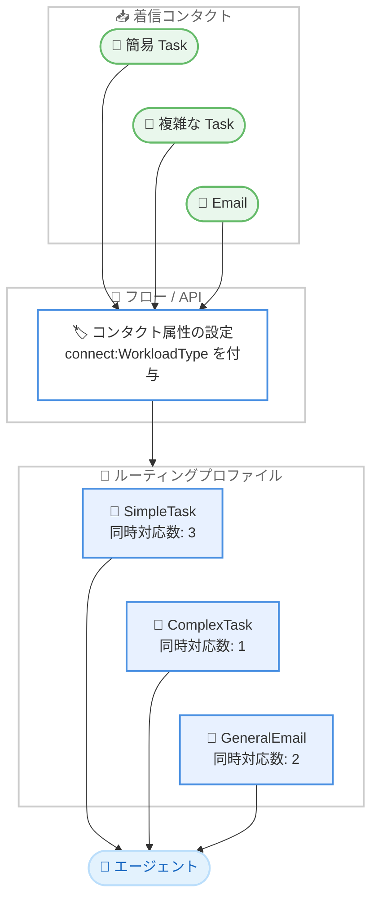

# Amazon Connect Customer - Task と Email のワークロードタイプ別キャパシティ制限

**リリース日**: 2026 年 9 月 9 日
**サービス**: Amazon Connect Customer
**機能**: ワークロードタイプ別の同時対応数 (キャパシティ) 制限

📊 [このアップデートのインフォグラフィックを見る](https://takech9203.github.io/aws-news-summary/20260909-amazon-connect-capacity-limits.html)

## 概要

Amazon Connect Customer で、コンタクトセンターマネージャーが業務の種類ごとに個別のキャパシティ制限を設定できるようになりました。Task および Email チャネルのコンタクトを、複雑さ、優先度、業務機能などに基づいて「ワークロードタイプ」に分類し、ワークロードタイプごとに同時対応数 (コンカレンシー) と割り込みルールを設定できます。

たとえば、シンプルで負荷の低い Task はエージェント 1 人あたり最大 3 件まで同時に処理させ、高い集中力を要する複雑な Task は 1 件ずつに制限する、といった設定が可能になります。ワークロードタイプはシステム定義済み属性 `connect:WorkloadType` のカスタム値として定義し、フローの「コンタクト属性の設定」ブロックまたは `UpdateContact` API でコンタクトに割り当てます。

このアップデートは、Task や Email の作業負荷が業務内容によって大きく異なるコンタクトセンターにおいて、エージェントの過負荷を防ぎつつ稼働率を最大化したい運用管理者にとって重要な機能強化です。

**アップデート前の課題**

- 以前は同時対応数の設定がチャネル単位でのみ適用され、同じチャネル内のコンタクトは複雑さや必要な労力に関係なくすべて同等に扱われた
- 簡単な Task と複雑な Task が混在する場合、複雑な Task に合わせて同時対応数を低く設定するとエージェントの稼働率が下がり、高く設定すると複雑な Task が複数割り当てられて品質低下のリスクがあった
- 業務の種類ごとに割り込み (クロスチャネル) の挙動を変えることができなかった

**アップデート後の改善**

- Task および Email のコンタクトをワークロードタイプに分類し、タイプごとに 1〜10 の範囲で同時対応数を設定できるようになった
- ワークロードタイプごとにクロスチャネル動作 (他チャネルや他ワークロードタイプの同時受け付け可否) を個別に制御できるようになった
- 業務の複雑さに応じたきめ細かなキャパシティ管理により、エージェントの生産性と対応品質の両立が可能になった

## アーキテクチャ図



コンタクトはフローまたは API でワークロードタイプが付与され、ルーティングプロファイルに定義されたワークロードタイプ別の同時対応数に基づいてエージェントに割り当てられます。

## サービスアップデートの詳細

### 主要機能

1. **ワークロードタイプによるコンタクト分類**
   - システム定義済み属性 `connect:WorkloadType` のカスタム値 (例: "Tax Filing"、"Document Review"、"VIP Callback") としてワークロードタイプを定義
   - 管理コンソールの定義済み属性でタイプの値を作成し、フローの「コンタクト属性の設定」ブロックまたは `UpdateContact` API でコンタクトに割り当てる
   - ワークロードタイプが明示的に設定されない場合、コンタクトのサブタイプがデフォルト値として使用される

2. **ワークロードタイプ単位の同時対応数設定**
   - Task および Email チャネルで、チャネル単位ではなくワークロードタイプ単位で同時対応数を設定可能
   - ルーティングプロファイルで有効化すると、各ワークロードタイプに 1〜10 の同時対応数を個別に設定できる
   - 例: "Document Review" の Task は 3 件まで、"Tax Filing" の Task は 1 件のみ同時対応

3. **ワークロードタイプ別のクロスチャネル動作**
   - 各ワークロードタイプに対して以下 3 つの割り込み動作を選択可能
     - 他のチャネルおよび他のワークロードタイプを許可しない
     - 同一チャネル内の他のワークロードタイプのみ許可
     - 他のチャネルの同時対応を許可
   - API では `ROUTE_CURRENT_CHANNEL_CURRENT_WORKLOADTYPE_ONLY`、`ROUTE_CURRENT_CHANNEL_ANY_WORKLOADTYPE_ONLY`、`ROUTE_ANY_CHANNEL_ANY_WORKLOAD_TYPE` に対応

## 技術仕様

### ワークロードタイプコンカレンシーの仕様

| 項目 | 詳細 |
|------|------|
| 対象チャネル | Task、Email |
| ワークロードタイプ数の上限 | ルーティングプロファイルごと、チャネルごとに最大 5 タイプ |
| 同時対応数の範囲 | ワークロードタイプごとに 1〜10 |
| チャネルあたりの合計上限 | Task および Email のチャネルごとの同時対応数の合計は 10 以下 |
| 設定モードの制約 | 同一チャネルでチャネル単位とワークロードタイプ単位の設定は併用不可 |
| 属性名 | 定義済み属性 `connect:WorkloadType` |
| 割り当て方法 | 「コンタクト属性の設定」フローブロック、または `UpdateContact` API |

### API変更履歴

| 日付 | サービス | 変更内容 |
|------|----------|----------|
| 2026/09/08 | [connect](https://awsapichanges.com/archive/changes/dc8510-connect.html) | 4 updated api methods - `CreateRoutingProfile`、`DescribeRoutingProfile`、`SearchRoutingProfiles`、`UpdateRoutingProfileConcurrency` に `WorkloadTypeConcurrencies` フィールドを追加 |

### API リクエスト例

`UpdateRoutingProfileConcurrency` API の `MediaConcurrencies` に、ワークロードタイプごとの設定を指定します。

```json
{
  "InstanceId": "instance-id",
  "RoutingProfileId": "routing-profile-id",
  "MediaConcurrencies": [
    {
      "Channel": "TASK",
      "Concurrency": 1,
      "WorkloadTypeConcurrencies": [
        {
          "WorkloadType": "SimpleTask",
          "Concurrency": 3,
          "CrossChannelWorkloadBehavior": {
            "ChannelWorkloadBehaviorType": "ROUTE_ANY_CHANNEL_ANY_WORKLOAD_TYPE"
          }
        },
        {
          "WorkloadType": "ComplexTask",
          "Concurrency": 1,
          "CrossChannelWorkloadBehavior": {
            "ChannelWorkloadBehaviorType": "ROUTE_CURRENT_CHANNEL_CURRENT_WORKLOADTYPE_ONLY"
          }
        }
      ]
    }
  ]
}
```

## 設定方法

### 前提条件

1. Amazon Connect Customer インスタンスが作成済みであること
2. ルーティングプロファイルを管理する権限 (セキュリティプロファイル) があること
3. Task または Email チャネルを利用していること

### 手順

#### ステップ1: 定義済み属性でワークロードタイプの値を作成

管理コンソールの定義済み属性 (Predefined attributes) で、`connect:WorkloadType` のカスタム値 (例: "SimpleTask"、"ComplexTask") を作成します。運用上意味のある分類 (複雑さ、優先度、業務機能など) に基づいて値を定義します。

#### ステップ2: フローまたは API でコンタクトにワークロードタイプを割り当てる

フローの「コンタクト属性の設定」ブロックで `connect:WorkloadType` に値を設定するか、`UpdateContact` API で割り当てます。設定しない場合はコンタクトのサブタイプがデフォルトで使用されます。

#### ステップ3: ルーティングプロファイルでワークロードタイプ別の同時対応数を設定

```bash
aws connect update-routing-profile-concurrency \
  --instance-id <instance-id> \
  --routing-profile-id <routing-profile-id> \
  --media-concurrencies '[
    {
      "Channel": "TASK",
      "Concurrency": 1,
      "WorkloadTypeConcurrencies": [
        {"WorkloadType": "SimpleTask", "Concurrency": 3,
         "CrossChannelWorkloadBehavior": {"ChannelWorkloadBehaviorType": "ROUTE_ANY_CHANNEL_ANY_WORKLOAD_TYPE"}},
        {"WorkloadType": "ComplexTask", "Concurrency": 1,
         "CrossChannelWorkloadBehavior": {"ChannelWorkloadBehaviorType": "ROUTE_CURRENT_CHANNEL_CURRENT_WORKLOADTYPE_ONLY"}}
      ]
    }
  ]'
```

このコマンドは、指定したルーティングプロファイルの Task チャネルに対して、"SimpleTask" は最大 3 件 (他チャネルとの同時対応を許可)、"ComplexTask" は 1 件のみ (他チャネル・他タイプの割り込みを許可しない) という同時対応数設定を適用します。管理コンソールのルーティングプロファイル編集画面からも同様の設定が可能です。

## メリット

### ビジネス面

- **対応品質の向上**: 高い集中力を要する複雑な業務を 1 件ずつに制限することで、エージェントの過負荷による品質低下を防止できる
- **生産性の最大化**: 簡単な業務は複数同時に処理させることで、エージェントの稼働率を高められる
- **業務特性に合わせた運用**: 複雑さ、優先度、業務機能など、組織にとって意味のある分類でキャパシティを管理できる

### 技術面

- **きめ細かなルーティング制御**: チャネル単位では実現できなかった、コンタクトの性質に応じた同時対応数と割り込みルールの設定が可能
- **既存機能との統合**: 定義済み属性、フローブロック、`UpdateContact` API という既存の仕組みを利用して実装できる
- **API による自動化**: `CreateRoutingProfile` / `UpdateRoutingProfileConcurrency` API を通じて Infrastructure as Code や自動化に組み込める

## デメリット・制約事項

### 制限事項

- 対象は Task と Email チャネルのみ (Voice、Chat はチャネル単位の設定のまま)
- ワークロードタイプはルーティングプロファイルごと、チャネルごとに最大 5 タイプまで
- チャネルごとの同時対応数の合計は 10 以下に制限される
- 同一チャネル内でチャネル単位の設定とワークロードタイプ単位の設定は併用できない (一方を有効にすると他方は無効になる)

### 考慮すべき点

- コンタクトのワークロードタイプがエージェントのルーティングプロファイルに定義されていない場合、そのコンタクトは無期限にキューに残る。フローや API で使用するすべてのワークロードタイプに対応するエントリをルーティングプロファイルに必ず設定する必要がある
- 設定モードを切り替えた場合、既存のコンタクトは切り替え前のルールで処理され、新規コンタクトのみ新しい設定に従うため、一時的に新旧ルールが共存する期間が発生する
- ワークロードタイプ未設定のコンタクトはサブタイプがデフォルト値になるため、意図しないルーティングを防ぐには属性設定の運用ルールを明確にしておく必要がある

## ユースケース

### ユースケース1: 複雑さの異なるバックオフィス Task の混在処理

**シナリオ**: 保険会社のバックオフィスで、簡単な書類確認 Task と複雑な保険金査定 Task を同じチームが処理している。従来はチャネル単位の設定しかできず、査定業務の品質を守るために同時対応数を 1 に制限した結果、書類確認の処理効率が犠牲になっていた。

**実装例**:
```
ワークロードタイプ "DocumentReview": 同時対応数 3、同一チャネル内の他タイプを許可
ワークロードタイプ "ClaimAssessment": 同時対応数 1、他チャネル・他タイプを許可しない
```

**効果**: 書類確認はまとめて効率的に処理しつつ、査定業務には集中できる環境を確保し、生産性と品質を両立できる。

### ユースケース2: VIP 顧客からの Email の優先処理

**シナリオ**: EC 事業者のサポート部門で、一般問い合わせ Email と VIP 顧客からの Email を扱っている。VIP 対応は丁寧なやり取りが求められるため、他業務との並行処理を避けたい。

**実装例**:
```
フローで顧客プロファイルを参照し、VIP の場合は connect:WorkloadType に "VIPEmail" を設定
ワークロードタイプ "GeneralEmail": 同時対応数 4、他チャネルを許可
ワークロードタイプ "VIPEmail": 同時対応数 1、他チャネル・他タイプを許可しない
```

**効果**: VIP 顧客には専任状態で丁寧に対応しながら、一般問い合わせは並行処理で効率よくさばける。

### ユースケース3: 期限付き業務と通常業務の割り込み制御

**シナリオ**: 税務サービスのコンタクトセンターで、申告期限が迫った "Tax Filing" Task と通常の "Document Review" Task を処理している。期限付き業務の処理中は他の業務による割り込みを防ぎたい。

**実装例**:
```
ワークロードタイプ "TaxFiling": 同時対応数 1、
  ChannelWorkloadBehaviorType = ROUTE_CURRENT_CHANNEL_CURRENT_WORKLOADTYPE_ONLY
ワークロードタイプ "DocumentReview": 同時対応数 3、
  ChannelWorkloadBehaviorType = ROUTE_ANY_CHANNEL_ANY_WORKLOAD_TYPE
```

**効果**: 期限付き業務の処理中は同一タイプ以外の割り込みを遮断し、期限遵守と処理ミスの防止につながる。

## 料金

ワークロードタイプ別キャパシティ制限の利用自体に追加料金の記載はありません。Amazon Connect Customer の通常の従量課金が適用され、Task および Email はそれぞれの利用量に基づいて課金されます。詳細は料金ページを参照してください。

## 利用可能リージョン

Amazon Connect Customer が提供されているすべての AWS 商用リージョンおよび AWS GovCloud (US-West) リージョンで利用可能です。

## 関連サービス・機能

- **ルーティングプロファイル**: 本機能の設定対象。エージェントが対応するチャネルと同時対応数を定義する
- **定義済み属性 (Predefined attributes)**: ワークロードタイプの値を `connect:WorkloadType` として定義する仕組み
- **Amazon Connect Tasks / Email**: 本機能の対象チャネル。エージェントの作業項目や Email 対応を管理する
- **コンタクトフロー**: 「コンタクト属性の設定」ブロックでコンタクトにワークロードタイプを割り当てる

## 参考リンク

- 📊 [インフォグラフィック](https://takech9203.github.io/aws-news-summary/20260909-amazon-connect-capacity-limits.html)
- [公式発表 (What's New)](https://aws.amazon.com/about-aws/whats-new/2026/09/amazon-connect-capacity-limits/)
- [ドキュメント: Channels and concurrency for routing contacts in Connect Customer](https://docs.aws.amazon.com/connect/latest/adminguide/channels-and-concurrency.html)
- [Amazon Connect Customer 製品ページ](https://aws.amazon.com/products/connect/customer/)
- [API 変更履歴 (awsapichanges.com)](https://awsapichanges.com/archive/changes/dc8510-connect.html)

## まとめ

Amazon Connect Customer のワークロードタイプ別キャパシティ制限により、Task と Email の同時対応数を業務の複雑さや優先度に応じてきめ細かく制御できるようになりました。チャネル単位の一律設定では両立が難しかったエージェントの生産性と対応品質を、業務分類に基づいて最適化できます。Task や Email を活用しているコンタクトセンターでは、業務の分類を整理したうえでルーティングプロファイルへのワークロードタイプ設定を検討することを推奨します。なお、フローで使用するワークロードタイプは必ずルーティングプロファイルに対応エントリを設定しないとコンタクトがキューに滞留するため、導入時は設定の網羅性に注意してください。
