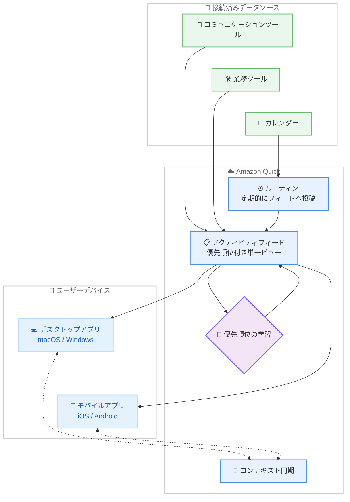

# Amazon Quick - アクティビティフィードが iOS / Android モバイルデバイスで利用可能に

**リリース日**: 2026 年 9 月 9 日
**サービス**: Amazon Quick
**機能**: モバイルアプリ (iOS / Android) でのアクティビティフィード提供

📊 [このアップデートのインフォグラフィックを見る](https://takech9203.github.io/aws-news-summary/20260909-amazon-quick-activity-feed-available-ios-android-mobile-devices.html)

## 概要

Amazon Quick のアクティビティフィードが、iOS および Android 向けの Amazon Quick モバイルアプリで利用可能になりました。これにより、外出先や移動中でも、最も重要な業務情報にどこからでもアクセスできるようになります。

アクティビティフィードは、企業内のコミュニケーションツールや業務ツール全体から「対応が必要な情報」を単一の優先順位付きビューに集約する機能です。各ツールを個別に確認する必要はなく、注意が必要な項目がフィードの上部に表示されます。アプリを切り替えることなく、Quick の中から直接アクションを実行できるため、時間的制約のある重要な情報をデスクから離れていても見逃しません。どの通知が重要でどれがノイズかはユーザー自身が決定でき、Quick は時間の経過とともにユーザーの優先順位を学習し、本当に重要な情報のみを表示するようになります。

さらに今回の発表では、デスクトップアプリとモバイルアプリの間でコンテキストが保持されるようになりました。一方のデバイスで行った作業はもう一方に引き継がれるため、デスクトップでチャットを開始したりエージェントにタスクを割り当てたりした後、モバイルデバイスから進捗を確認してチャットを継続し、デスクに戻ったときに中断した場所から作業を再開できます。モバイルアプリは既存の Amazon Quick へのアクセスに含まれており、追加費用は不要です。

**アップデート前の課題**

- アクティビティフィードはデスクトップ環境での利用が中心であり、デスクから離れると対応が必要な情報を確認しにくかった
- 移動中や外出先では、複数のコミュニケーションツールや業務ツールを個別に確認する必要があった
- デスクトップで開始した作業のコンテキストをモバイルで引き継ぐ手段がなく、デバイスをまたいだ継続的な作業が難しかった

**アップデート後の改善**

- iOS / Android のモバイルアプリからアクティビティフィードにアクセスでき、どこにいても優先順位付きの単一ビューで重要な情報を確認できるようになった
- アプリを切り替えることなく、Quick の中から直接アクションを実行できるようになった
- ルーティン機能により、接続済みのデータソースから任意の情報を定期的にフィードへ投稿するよう Quick に依頼できるようになった
- デスクトップとモバイルの間でコンテキストが保持され、チャットやエージェントへのタスク割り当てをデバイスをまたいで継続できるようになった

## アーキテクチャ図



接続済みのデータソースから集約された情報が優先順位付きのアクティビティフィードとして構成され、デスクトップとモバイルの両方に配信されます。コンテキスト同期により、デバイスをまたいだ作業の継続が可能です。

## サービスアップデートの詳細

### 主要機能

1. **モバイルアプリでのアクティビティフィード**
   - iOS / Android 向け Amazon Quick モバイルアプリでアクティビティフィードを利用可能
   - 企業内のコミュニケーションツールや業務ツール全体を横断した、優先順位付きの単一ビューを提供
   - 対応が必要な項目がフィードの上部に表示され、確認すべき情報を素早く把握できる
   - アプリを切り替えることなく、Quick の中から直接アクションを実行できる

2. **通知の優先順位付けと学習**
   - どの通知が重要でどれがノイズかをユーザー自身が決定できる
   - Quick は時間の経過とともにユーザーの優先順位を学習し、重要な情報のみを表示するようになる
   - デスクから離れていても、時間的制約のある重要な情報を見逃さない

3. **ルーティンによるフィードへの自動投稿**
   - 接続済みの任意のデータソースから情報を取得し、フィードに投稿するよう Quick に依頼できる
   - 例: 「毎朝 7:30 に、その日の顧客ミーティングと準備用の 3 つの箇条書きを教えて」といった自然言語での指示が可能

4. **デスクトップとモバイル間のコンテキスト保持**
   - 一方のデバイスで行った作業がもう一方のデバイスに引き継がれる
   - デスクトップでチャットを開始またはエージェントにタスクを割り当て、モバイルで進捗確認やチャットの継続が可能
   - デスクに戻った際に、中断した場所から作業を再開できる

## 技術仕様

### 対応プラットフォーム

| 項目 | 詳細 |
|------|------|
| iOS | Apple App Store から Amazon Quick アプリをダウンロード |
| Android | Google Play ストアから Amazon Quick アプリをダウンロード |
| デスクトップ | macOS / Windows (コンテキスト同期の対象) |
| 追加費用 | 不要 (既存の Amazon Quick アクセスに含まれる) |

## 設定方法

### 前提条件

1. Amazon Quick のアカウントを保有していること (新規ユーザーは無料でアカウントを作成可能)
2. iOS または Android のモバイルデバイスを利用していること
3. フィードに集約したいコミュニケーションツールやデータソースを Quick に接続していること

### 手順

#### ステップ 1: モバイルアプリのダウンロード

iOS の場合は [Apple App Store](https://apps.apple.com/us/app/amazon-quick/id1148226615)、Android の場合は [Google Play ストア](https://play.google.com/store/apps/details?id=com.amazonaws.quicksight.mobile&hl=en_US) から Amazon Quick アプリをダウンロードします。

#### ステップ 2: サインインとフィードの確認

既存の Amazon Quick アカウントでサインインすると、アクティビティフィードが表示されます。対応が必要な項目はフィードの上部に表示されるため、優先的に確認します。

#### ステップ 3: 通知の優先順位の調整

重要な通知とノイズとなる通知を指定します。利用を続けることで、Quick がユーザーの優先順位を学習し、重要な情報のみが表示されるようになります。

#### ステップ 4: ルーティンの設定

必要に応じて、接続済みのデータソースから定期的に情報をフィードへ投稿するルーティンを自然言語で設定します。例として「毎朝 7:30 に、その日の顧客ミーティングと準備用の 3 つの箇条書きを教えて」のように指示できます。

## メリット

### ビジネス面

- **対応漏れの防止**: 時間的制約のある重要な情報がフィード上部に表示されるため、デスクから離れていても対応漏れを防げる
- **確認作業の効率化**: 複数のツールを個別に確認する必要がなくなり、単一の優先順位付きビューで業務状況を把握できる
- **追加費用が不要**: モバイルアプリは既存の Amazon Quick アクセスに含まれており、コスト増なしで利用を開始できる

### 技術面

- **デバイス間のシームレスな連携**: コンテキストがデスクトップとモバイルの間で保持され、作業の中断と再開がスムーズに行える
- **学習による最適化**: ユーザーの操作をもとに Quick が優先順位を学習し、表示される情報の質が時間とともに向上する
- **自然言語によるルーティン設定**: プログラミング不要で、定期的な情報収集とフィードへの投稿を自動化できる

## デメリット・制約事項

### 制限事項

- モバイルアプリの利用には既存の Amazon Quick アカウントが必要
- フィードに集約できる情報は、Quick に接続済みのデータソースに依存する

### 考慮すべき点

- 組織でモバイル利用を展開する場合は、同日に発表されたモバイルデバイス管理 (MDM) 対応などのエンタープライズ管理機能と合わせた運用設計が推奨される
- 優先順位の学習にはある程度の利用期間が必要であり、初期段階では通知の重要度指定をユーザー自身が行う必要がある

## ユースケース

### ユースケース 1: 移動中の重要情報の確認と対応

**シナリオ**: 営業担当者が顧客訪問への移動中に、社内の複数ツールで発生した対応依頼を確認したい。

**実装例**:
```
1. モバイルアプリでアクティビティフィードを開く
2. フィード上部に表示される「対応が必要な項目」を確認
3. アプリを切り替えることなく、Quick の中から直接アクションを実行
```

**効果**: デスクに戻るまで対応を待つ必要がなくなり、時間的制約のある依頼にも移動中に対応できる。

### ユースケース 2: 朝のミーティング準備の自動化

**シナリオ**: 毎朝の始業前に、その日の顧客ミーティングの予定と準備ポイントを把握したい。

**実装例**:
```
Quick への指示 (自然言語):
「毎朝 7:30 に、その日の顧客ミーティングを教えて。
 あわせて準備用の 3 つの箇条書きを作成して」
```

**効果**: 毎朝決まった時間にミーティング情報と準備ポイントがフィードに投稿され、通勤中にモバイルで確認できる。

### ユースケース 3: デスクトップとモバイルをまたいだタスクの継続

**シナリオ**: 退勤前にデスクトップでエージェントに調査タスクを割り当て、帰宅後に進捗を確認したい。

**実装例**:
```
1. デスクトップアプリでエージェントに調査タスクを割り当てる
2. 帰宅後、モバイルアプリで進捗を確認し、チャットで追加の指示を行う
3. 翌朝、デスクトップで中断した場所から作業を再開する
```

**効果**: デバイスをまたいでコンテキストが保持されるため、作業の引き継ぎコストなしにタスクを継続できる。

## 料金

Amazon Quick モバイルアプリは、既存の Amazon Quick アクセスに含まれており、追加費用なしで利用できます。新規ユーザーは無料でアカウントを作成して利用を開始できます。

## 利用可能リージョン

公式発表ではリージョンに関する記載はありません。既存の Amazon Quick へのアクセスがあるユーザーは、モバイルアプリをダウンロードして利用を開始できます。

## 関連サービス・機能

- **Amazon Quick (デスクトップアプリ)**: macOS / Windows 向けのデスクトップアプリ。今回のアップデートによりモバイルアプリとのコンテキスト同期が可能になった
- **Amazon Quick の常時稼働エージェント**: 同日に発表された、クラウド上で実行されるスケジュールタスクと監視エージェント。実行結果はアクティビティフィードに配信される
- **Amazon Quick のエンタープライズ管理機能**: 同日に発表された MDM 対応やユーザー単位のカスタム権限。組織でのモバイル展開時のガバナンスを支援する

## 参考リンク

- 📊 [インフォグラフィック](https://takech9203.github.io/aws-news-summary/20260909-amazon-quick-activity-feed-available-ios-android-mobile-devices.html)
- [公式発表 (What's New)](https://aws.amazon.com/about-aws/whats-new/2026/09/amazon-quick-activity-feed-available-ios-android-mobile-devices/)
- [Amazon Quick 製品ページ](https://aws.com/quick)
- [Amazon Quick (Apple App Store)](https://apps.apple.com/us/app/amazon-quick/id1148226615)
- [Amazon Quick (Google Play ストア)](https://play.google.com/store/apps/details?id=com.amazonaws.quicksight.mobile&hl=en_US)

## まとめ

Amazon Quick のアクティビティフィードがモバイルアプリに対応したことで、企業内の複数ツールを横断した優先順位付きの情報確認とアクション実行が、場所を問わず可能になりました。デスクトップとモバイル間のコンテキスト保持により、デバイスをまたいだシームレスな業務継続も実現します。既存の Amazon Quick ユーザーは追加費用なしで利用できるため、まずはモバイルアプリをダウンロードし、通知の優先順位設定とルーティンの活用から始めることを推奨します。
