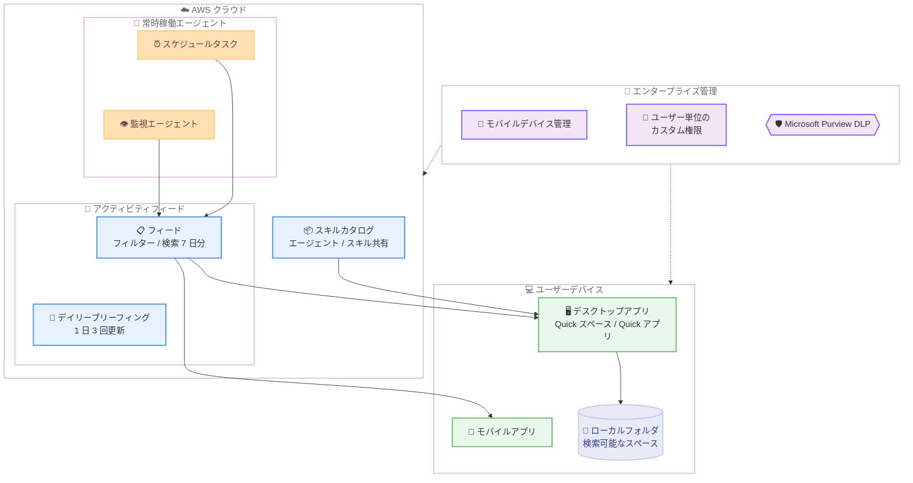

# Amazon Quick - 常時稼働エージェント、強化されたアクティビティフィード、エンタープライズ管理機能の追加

**リリース日**: 2026 年 9 月 9 日
**サービス**: Amazon Quick
**機能**: 常時稼働エージェント、アクティビティフィードの強化、エンタープライズ管理機能

📊 [このアップデートのインフォグラフィックを見る](https://takech9203.github.io/aws-news-summary/20260909-amazon-quick-always-on-agents-sharper-feed-enterprise-controls.html)

## 概要

Amazon Quick に、業務の整理、組織全体でのガバナンス、回答の信頼性向上を目的とした複数の新機能が追加されました。今回のアップデートは、デスクトップとモバイルの両方の Amazon Quick を対象とし、エンタープライズグレードの管理機能、より豊かなコラボレーション、常時稼働のインテリジェンスをチームに提供します。

最大の目玉は、エージェントがユーザーのデバイスから独立してクラウド上で実行される「常時稼働エージェント」です。スケジュールタスクや監視エージェントは、ラップトップを閉じている間もクラウドで動作し続け、結果をアクティビティフィードに配信します。また、アクティビティフィードにはトップレベルフィルター、改善されたキャッチアップビュー、1 日 3 回更新されるデイリーブリーフィング、最大 7 日分のフィードデータ検索が追加され、優先すべき情報を素早く把握できるようになりました。

管理者向けには、モバイルデバイス管理 (MDM) 対応、ユーザーごとのカスタム権限、Microsoft Purview のデータ損失防止 (DLP) 統合が提供され、組織全体での安全な展開が容易になります。さらに、全サブスクリプションプランでエージェント時間が増量され、Professional は月 4 時間から 8 時間へ、Enterprise は月 8 時間から 18 時間へ拡大し、単一のシンプルな割り当てに統合されました。

**アップデート前の課題**

- エージェントの実行はユーザーのデバイスに依存しており、ラップトップを閉じるとスケジュールタスクや監視処理が停止していた
- アクティビティフィードのフィルタリングや検索機能が限定的で、大量の通知から重要な情報を見つけるのに時間がかかっていた
- MDM や DLP といったエンタープライズ IT 部門が求める管理・統制機能が不足しており、組織全体への展開に課題があった
- エージェントやスキルを組織内で共有・配布する仕組みが限られていた
- 回答の根拠を確認する手段が限定的で、AI が生成した回答の検証に手間がかかっていた

**アップデート後の改善**

- スケジュールタスクと監視エージェントがクラウド上で実行され、デバイスの電源状態に関わらず結果がフィードに配信されるようになった
- トップレベルフィルター、キャッチアップビュー、1 日 3 回更新のデイリーブリーフィング、最大 7 日分のフィード検索により、注意が必要な項目を優先的に確認できるようになった
- MDM 対応、ユーザー単位のカスタム権限、Microsoft Purview DLP 統合により、エンタープライズレベルのガバナンスを実現できるようになった
- ファイル共有に加え、エージェントとスキルを公開して組織内で発見・インストールできるようになり、公式スキルのカタログも閲覧可能になった
- Quick スペースと Quick アプリがデスクトップでネイティブに動作し、インデックス化した任意のローカルフォルダを検索可能なスペースとして利用できるようになった
- インライン引用により、すべての回答を情報ソースと照らし合わせて検証できるようになった
- エージェント時間が増量され、Professional は月 8 時間、Enterprise は月 18 時間に拡大した

## アーキテクチャ図



常時稼働エージェントはクラウド上で実行され、デバイスの状態に関係なく結果をアクティビティフィードへ配信します。管理者はエンタープライズ管理機能によりクラウドとデバイスの両方を統制できます。

## サービスアップデートの詳細

### 主要機能

1. **常時稼働エージェント**
   - スケジュールタスクと監視エージェントがクラウド上で実行される
   - ラップトップを閉じている間もエージェントが動作を継続し、結果をフィードに配信
   - ユーザーが席を離れても業務の自動化・監視が止まらない

2. **アクティビティフィードの強化**
   - トップレベルフィルターにより、フィード内の情報を種類別に素早く絞り込み可能
   - 改善されたキャッチアップビューで、確認が必要な項目を優先的に表示
   - 1 日 3 回更新されるデイリーブリーフィングで、最新状況を定期的に要約
   - 最大 7 日分のフィードデータを検索可能

3. **エンタープライズ管理機能**
   - モバイルデバイス管理 (MDM) 対応により、組織のデバイスポリシーに準拠した展開が可能
   - ユーザーごとのカスタム権限設定により、きめ細かなアクセス制御を実現
   - Microsoft Purview のデータ損失防止 (DLP) 統合により、機密情報の漏洩リスクを低減

4. **コラボレーションとスキル共有**
   - チーム内でのファイル共有に対応
   - エージェントとスキルを公開し、他のユーザーが発見・インストール可能
   - 公式スキルのカタログを閲覧して、すぐに利用開始できる

5. **デスクトップ体験の強化**
   - Quick スペースと Quick アプリがデスクトップ上でネイティブに動作
   - インデックス化した任意のローカルフォルダを検索可能なスペースとして利用可能
   - インライン引用により、すべての回答を情報ソースと照合して検証可能

6. **エージェント時間の増量**
   - Professional プラン: 月 4 時間から 8 時間へ倍増
   - Enterprise プラン: 月 8 時間から 18 時間へ増量
   - 複数の割り当てが単一のシンプルな割り当てに統合

## 技術仕様

### エージェント時間の変更

| プラン | 変更前 | 変更後 |
|------|------|------|
| Professional | 月 4 時間 | 月 8 時間 |
| Enterprise | 月 8 時間 | 月 18 時間 |

### 主な新機能一覧

| カテゴリ | 機能 |
|------|------|
| エージェント | クラウド実行のスケジュールタスク、監視エージェント |
| フィード | トップレベルフィルター、キャッチアップビュー、デイリーブリーフィング (1 日 3 回更新)、7 日分のフィード検索 |
| 管理 | MDM 対応、ユーザー単位のカスタム権限、Microsoft Purview DLP 統合 |
| コラボレーション | ファイル共有、エージェント / スキルの公開と配布、公式スキルカタログ |
| デスクトップ | Quick スペース / Quick アプリのネイティブ動作、ローカルフォルダのスペース化、インライン引用 |

## 設定方法

### 前提条件

1. Amazon Quick のアカウント (新規ユーザーは無料で作成可能)
2. 組織向けプラン (Professional / Enterprise) の場合は AWS アカウント
3. Microsoft Purview DLP 統合を利用する場合は、Microsoft Purview の環境と設定権限

### 手順

#### ステップ 1: Amazon Quick アカウントの作成またはサインイン

Amazon Quick のダウンロードページ (https://aws.amazon.com/quick/download/) からアカウントを無料で作成し、デスクトップアプリまたはモバイルアプリをインストールします。既存ユーザーはそのままサインインすると新機能を利用できます。

#### ステップ 2: 常時稼働エージェントの設定

Quick 内でスケジュールタスクまたは監視エージェントを作成します。作成したエージェントはクラウド上で実行されるため、デバイスの電源状態に関係なく指定したスケジュールで動作し、結果はアクティビティフィードに配信されます。

#### ステップ 3: アクティビティフィードの活用

フィード上部のフィルターで表示内容を絞り込み、キャッチアップビューとデイリーブリーフィングで最新状況を確認します。過去 7 日分のフィードは検索機能で横断的に参照できます。

#### ステップ 4: 管理者による組織設定

管理者は管理画面から MDM 設定、ユーザーごとのカスタム権限、Microsoft Purview DLP 統合を構成し、組織のセキュリティポリシーに沿った利用環境を整備します。

## メリット

### ビジネス面

- **業務の継続性**: エージェントがクラウドで常時稼働するため、営業時間外や移動中でも監視・定型業務が継続され、翌朝には結果を確認できる
- **情報過多の解消**: フィルター、キャッチアップビュー、デイリーブリーフィングにより、大量の通知から本当に対応が必要な項目へ素早くたどり着ける
- **組織展開の加速**: MDM、カスタム権限、DLP 統合といったエンタープライズ管理機能により、IT 部門の統制要件を満たしながら全社展開が可能
- **コスト効率の向上**: 追加費用なしでエージェント時間が最大 2 倍以上に増量され、より多くの自動化を同じサブスクリプション費用で実行できる

### 技術面

- **クラウドネイティブなエージェント実行**: デバイス依存を排除したクラウド実行モデルにより、実行の信頼性が向上
- **回答の検証可能性**: インライン引用によりすべての回答をソースと照合でき、AI 回答の信頼性を担保
- **ローカルデータの活用**: インデックス化したローカルフォルダを検索可能なスペースにでき、クラウドとローカルの情報を横断的に活用可能
- **再利用可能な資産化**: エージェントとスキルを公開・共有する仕組みにより、優れた自動化を組織全体で再利用できる

## デメリット・制約事項

### 制限事項

- フィードデータの検索対象は最大 7 日分に限定される
- エージェント時間はプランごとの月間割り当て制であり、Professional プランでは超過利用が不可 (Enterprise プランは超過料金で利用可能)
- Microsoft Purview DLP 統合の利用には Microsoft Purview 側の環境が必要

### 考慮すべき点

- 常時稼働エージェントはクラウドで実行されるため、実行時間がエージェント時間の割り当てを消費する。監視間隔やスケジュール頻度は割り当てを考慮して設計する必要がある
- ローカルフォルダをスペース化する場合、インデックス対象のデータ範囲とストレージ容量 (プランごとのインデックス容量) を確認する必要がある
- 組織向けプランではユーザー単位のサブスクリプション費用に加えて、アカウント単位のインフラ料金が発生する

## ユースケース

### ユースケース 1: 夜間の KPI 監視と朝のブリーフィング

**シナリオ**: 営業マネージャーが、前日の売上や重要な顧客からのメールを毎朝出社前に把握したい。

**実装例**:
```text
監視エージェント: 「売上ダッシュボードの数値が前週比 10% 以上変動したらフィードに通知して」
スケジュールタスク: 「毎朝 7:30 に、当日の顧客ミーティング一覧と準備ポイント 3 点をフィードに投稿して」
```

**効果**: ラップトップを閉じている夜間もエージェントが監視を継続し、朝はデイリーブリーフィングとフィードで必要な情報だけを確認できるため、朝の情報収集時間を大幅に短縮できる。

### ユースケース 2: 全社展開時のセキュリティ統制

**シナリオ**: 情報システム部門が、機密情報の取り扱いポリシーを維持しながら Amazon Quick を全社に展開したい。

**実装例**:
```text
1. MDM で管理対象デバイスのみに Quick モバイルアプリを配布
2. ユーザーごとのカスタム権限で、部門別にアクセス可能なデータソースを制限
3. Microsoft Purview DLP 統合で、機密ラベル付きデータの取り扱いを統制
```

**効果**: 既存の Microsoft Purview ベースのデータ保護ポリシーを Quick にも適用でき、シャドー IT 化を防ぎながら安全に生成 AI 活用を全社展開できる。

### ユースケース 3: 部門横断でのエージェント・スキル共有

**シナリオ**: ある部門で作成した経費精算チェック用のエージェントを、他部門でも利用できるようにしたい。

**実装例**:
```text
1. 部門で作成したエージェントとスキルを組織内に公開
2. 他部門のユーザーはカタログからエージェントを発見してインストール
3. 公式スキルカタログから AWS 提供のスキルも併せて導入
```

**効果**: 優れた自動化資産が組織全体で再利用され、各部門が同様の仕組みを個別に作り直す重複作業を排除できる。

## 料金

今回の新機能は既存の Amazon Quick サブスクリプションに含まれ、エージェント時間の増量に追加費用は発生しません。新規ユーザーは無料でアカウントを作成できます。

### 料金プラン概要 (2026 年 9 月時点)

| プラン | 料金 | エージェント時間 |
|--------|------------------|------------------|
| Free | $0/ユーザー/月 | - |
| Plus | $20/ユーザー/月 (年払い) | - |
| Max | $100/ユーザー/月 (年払い) | - |
| Professional | $20/ユーザー/月 + インフラ料金 | 月 8 時間 (旧: 4 時間) |
| Enterprise | $40/ユーザー/月 + インフラ料金 | 月 18 時間 (旧: 8 時間) |

- 組織向けプラン (Professional / Enterprise) では、アカウントあたり月額 $250 のインフラ料金が別途発生します
- Enterprise プランではエージェント時間の超過利用が $3/時間 (秒単位で計測) で可能です
- 最新の料金は [Amazon Quick 料金ページ](https://aws.amazon.com/quick/pricing/) を参照してください

## 利用可能リージョン

公式発表にリージョン固有の記載はありません。Amazon Quick はデスクトップ (macOS / Windows) およびモバイル (iOS / Android) アプリとして提供され、新規ユーザーは無料でアカウントを作成して利用を開始できます。

## 関連サービス・機能

- **Amazon Quick モバイルアプリ**: 同日にアクティビティフィードの iOS / Android 対応が発表されており、デスクトップとモバイル間でコンテキストが維持される
- **Amazon Quick デスクトップアプリ**: macOS / Windows 向けデスクトップアプリが一般提供され、Quick スペースと Quick アプリがネイティブに動作する
- **Microsoft Purview**: DLP 統合により、Microsoft 環境のデータ保護ポリシーを Quick に適用できる
- **Amazon QuickSight**: BI 機能の基盤であり、ダッシュボードの閲覧・作成機能がプランに応じて提供される

## 参考リンク

- 📊 [インフォグラフィック](https://takech9203.github.io/aws-news-summary/20260909-amazon-quick-always-on-agents-sharper-feed-enterprise-controls.html)
- [公式発表 (What's New)](https://aws.amazon.com/about-aws/whats-new/2026/09/amazon-quick-always-on-agents-sharper-feed-enterprise-controls/)
- [Amazon Quick 製品ページ](https://aws.amazon.com/quick/)
- [Amazon Quick ダウンロードページ](https://aws.amazon.com/quick/download/)
- [Amazon Quick 料金ページ](https://aws.amazon.com/quick/pricing/)

## まとめ

今回のアップデートにより、Amazon Quick はデバイスに依存しない常時稼働エージェント、優先度ベースのアクティビティフィード、MDM / DLP を含むエンタープライズ管理機能を備え、個人の生産性ツールから組織全体で統制可能な AI ワークスペースへと進化しました。エージェント時間も追加費用なしで最大 2 倍以上に増量されており、既存ユーザーはスケジュールタスクや監視エージェントの活用範囲を広げる好機です。組織展開を検討している場合は、30 日間の無料トライアルで MDM やカスタム権限などの管理機能を検証することを推奨します。
