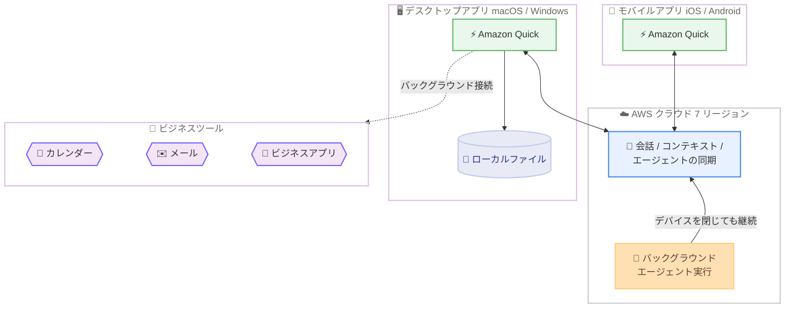

# Amazon Quick - デスクトップアプリが macOS と Windows で一般提供開始

**リリース日**: 2026 年 9 月 9 日
**サービス**: Amazon Quick
**機能**: デスクトップアプリの一般提供 (macOS / Windows)

📊 [このアップデートのインフォグラフィックを見る](https://takech9203.github.io/aws-news-summary/20260909-amazon-quick-desktop-app-generally-available-macos-windows.html)

## 概要

Amazon Quick のデスクトップアプリが、macOS と Windows で一般提供 (GA) されました。デスクトップアプリは Amazon Quick のフル機能をユーザーのコンピュータ上で提供し、ローカルファイルを直接扱いながら、カレンダー、メール、ビジネスアプリとバックグラウンドで常時接続を維持します。会話、コンテキスト、エージェントはデスクトップアプリとモバイルアプリの間で同期されるため、一方のデバイスで開始した作業をもう一方のデバイスでそのまま継続でき、場所を選ばずに業務を進められます。

また、今回のリリースにより、Amazon Quick のエージェントはコンピュータを閉じた後もバックグラウンドで継続的に実行されるようになりました。オフィスを出る前にエージェントを開始し、帰宅中の移動時間にモバイルアプリから追加の入力を行い、到着後に最終的な成果物を確認する、といったワークフローが実現します。Quick は本番環境グレードの安定性を備え、AWS の SLA コミットメントを維持し、エンタープライズ規模での展開に必要なガバナンスと管理者向けコントロールを提供します。

デスクトップアプリは、米国東部 (バージニア北部)、米国西部 (オレゴン)、アジアパシフィック (東京)、アジアパシフィック (シドニー)、欧州 (アイルランド)、欧州 (ロンドン)、欧州 (フランクフルト) の 7 リージョンで利用可能です。

**アップデート前の課題**

- デスクトップアプリはプレビュー段階であり、本番環境グレードの安定性や AWS SLA によるコミットメントが保証されていなかった
- エージェントの実行がユーザーのデバイス稼働状態に依存し、コンピュータを閉じると長時間タスクが中断されていた
- デスクトップとモバイルの間で会話やコンテキストが分断され、デバイスをまたいだ作業の継続が困難だった
- エンタープライズ規模での展開に必要なガバナンス・管理機能が十分に提供されていなかった

**アップデート後の改善**

- macOS と Windows で一般提供となり、AWS SLA コミットメントと本番環境グレードの安定性のもとで業務利用できるようになった
- エージェントがバックグラウンドで継続実行され、コンピュータを閉じても長時間タスクが進行し続けるようになった
- 会話、コンテキスト、エージェントがデスクトップとモバイルの間で同期され、デバイスをまたいでシームレスに作業を継続できるようになった
- ローカルファイルを直接扱いながら、カレンダー、メール、ビジネスアプリとバックグラウンドで常時接続できるようになった
- エンタープライズ規模の展開に対応するガバナンスと管理者向けコントロールが提供されるようになった

## アーキテクチャ図



デスクトップアプリとモバイルアプリは AWS クラウドを介して会話・コンテキスト・エージェントを同期し、エージェントはデバイスを閉じてもクラウド側で実行を継続します。デスクトップアプリはローカルファイルを直接扱い、カレンダーやメールなどのビジネスツールとバックグラウンドで接続します。

## サービスアップデートの詳細

### 主要機能

1. **macOS / Windows での一般提供**
   - Amazon Quick のフル機能をデスクトップアプリとして利用可能
   - 本番環境グレードの安定性を提供し、AWS SLA コミットメントを維持
   - エンタープライズ規模の展開に対応するガバナンスと管理者向けコントロールを提供

2. **ローカルファイルとビジネスツールとの連携**
   - ローカルファイルを直接扱った作業が可能
   - カレンダー、メール、ビジネスアプリとバックグラウンドで常時接続を維持
   - デスクトップ環境に統合された AI アシスタント体験を提供

3. **デスクトップ・モバイル間の同期**
   - 会話、コンテキスト、エージェントがデスクトップとモバイルのアプリ間で同期
   - 一方のデバイスで開始した作業をもう一方でそのまま継続可能
   - 場所やデバイスを選ばないシームレスなワークフローを実現

4. **バックグラウンドでのエージェント継続実行**
   - コンピュータを閉じた後もエージェントが継続的に実行され、長時間タスクが進行
   - デスクトップで開始したエージェントに対し、モバイルアプリから追加入力が可能
   - 移動時間や離席中も業務が止まらない働き方を支援

## 技術仕様

### 提供形態

| 項目 | 詳細 |
|------|------|
| 対応プラットフォーム | macOS、Windows |
| モバイルアプリ | iOS (Apple App Store)、Android (Google Play Store) で無料提供 |
| 同期対象 | 会話、コンテキスト、エージェント |
| エージェント実行 | デバイスを閉じてもバックグラウンドで継続実行 |
| 安定性・SLA | 本番環境グレードの安定性、AWS SLA コミットメントを維持 |
| 管理機能 | エンタープライズ規模の展開向けガバナンス・管理者コントロール |
| 提供リージョン | 7 リージョン (詳細は「利用可能リージョン」を参照) |

## 設定方法

### 前提条件

1. Amazon Quick のアカウント (新規ユーザーは無料で作成可能)
2. macOS または Windows が動作するコンピュータ
3. モバイル連携を利用する場合は iOS / Android デバイス

### 手順

#### ステップ 1: デスクトップアプリのダウンロードとインストール

Amazon Quick のダウンロードページ (https://aws.amazon.com/quick/download/) から、macOS または Windows 向けのデスクトップアプリをダウンロードしてインストールします。既存の Quick ユーザーはそのままサインインして利用を開始できます。新規ユーザーは同ページから無料でアカウントを作成できます。

#### ステップ 2: ビジネスツールとの接続

デスクトップアプリからカレンダー、メール、ビジネスアプリなどのデータソースを接続します。接続後はバックグラウンドで常時接続が維持され、ローカルファイルと合わせて Quick が業務コンテキストを把握できるようになります。

#### ステップ 3: モバイルアプリとの連携

Apple App Store または Google Play Store から Amazon Quick モバイルアプリをインストールし、同じアカウントでサインインします。会話、コンテキスト、エージェントが自動的に同期され、デバイスをまたいだ作業の継続が可能になります。

#### ステップ 4: バックグラウンドエージェントの活用

デスクトップアプリで長時間タスクをエージェントに割り当てます。コンピュータを閉じてもエージェントは実行を継続するため、移動中はモバイルアプリから進捗確認や追加入力を行い、後から最終成果物を確認できます。

## メリット

### ビジネス面

- **業務継続性の向上**: エージェントがデバイスの電源状態に依存せず実行を継続するため、離席中や移動中も長時間タスクが進行し、業務のリードタイムを短縮できる
- **場所を選ばない働き方**: デスクトップとモバイルの間でコンテキストが同期され、オフィス・移動中・自宅のどこでも作業を継続できる
- **エンタープライズ導入の安心感**: 一般提供により AWS SLA コミットメントと本番環境グレードの安定性が保証され、業務利用の判断がしやすくなる

### 技術面

- **ローカル環境との統合**: ローカルファイルを直接扱えるため、クラウドへの手動アップロードなしにデスクトップ上の資料を活用できる
- **常時接続によるコンテキスト維持**: カレンダー、メール、ビジネスアプリとバックグラウンドで接続し、常に最新の業務コンテキストに基づいた回答・処理が可能
- **クラウドベースの同期基盤**: 会話・コンテキスト・エージェントがクラウドで同期されるため、デバイス間の整合性を意識せずに利用できる

## デメリット・制約事項

### 制限事項

- 提供リージョンは 7 リージョン (バージニア北部、オレゴン、東京、シドニー、アイルランド、ロンドン、フランクフルト) に限定される
- 対応プラットフォームは macOS と Windows であり、Linux 向けの提供は公式発表に記載がない

### 考慮すべき点

- デスクトップアプリはローカルファイルやメール・カレンダーへアクセスするため、組織のセキュリティポリシーに沿ったアクセス範囲の設計が必要
- バックグラウンドで実行されるエージェントはプランごとのエージェント時間割り当てを消費するため、長時間タスクの実行頻度は割り当てを考慮して計画する必要がある
- エンタープライズ展開時は、同日に発表された MDM 対応やユーザー単位のカスタム権限などの管理機能と併せて統制設計を行うことが望ましい

## ユースケース

### ユースケース 1: 退社後も進む長時間リサーチタスク

**シナリオ**: コンサルタントが、市場調査レポートの下調べをエージェントに任せ、退社後もタスクを進行させたい。

**実装例**:
```text
1. 退社前にデスクトップアプリでエージェントに市場調査タスクを依頼
2. 帰宅中にモバイルアプリで進捗を確認し、調査対象の追加指示を入力
3. 帰宅後または翌朝、デスクトップアプリで最終レポートを確認
```

**効果**: コンピュータを閉じてもエージェントが実行を継続するため、就業時間外もタスクが進行し、成果物の完成までの時間を短縮できる。

### ユースケース 2: ローカル資料とビジネスツールを横断した会議準備

**シナリオ**: 営業担当者が、ローカルに保存した提案書とカレンダー・メールの情報を組み合わせて、翌日の顧客ミーティングの準備をしたい。

**実装例**:
```text
1. デスクトップアプリでカレンダーとメールを接続
2. ローカルフォルダ内の提案書ドラフトを Quick で直接参照
3. 「明日の A 社ミーティングに向けて、最新のメールのやり取りを踏まえて
   提案書の要点と想定質問をまとめて」と依頼
```

**効果**: ローカルファイルとクラウド上の業務データを手動で集約することなく、会議準備に必要な情報を一度に整理できる。

### ユースケース 3: デバイスをまたいだシームレスな作業継続

**シナリオ**: マネージャーが、オフィスのデスクトップで開始した資料レビューの会話を、外出先ではモバイル、帰社後は再びデスクトップで継続したい。

**実装例**:
```text
1. デスクトップアプリで資料レビューの会話を開始し、エージェントにタスクを割り当て
2. 外出先ではモバイルアプリで同じ会話を開き、レビューコメントを追加
3. 帰社後、デスクトップアプリで会話の続きからレビューを完了
```

**効果**: 会話とコンテキストがデバイス間で同期されるため、作業の引き継ぎや再説明が不要になり、細切れの時間を有効活用できる。

## 料金

デスクトップアプリ自体の追加料金は発表されておらず、既存の Amazon Quick のサブスクリプションで利用できます。モバイルアプリは Apple App Store および Google Play Store から無料でダウンロードできます。新規ユーザーは無料でアカウントを作成して利用を開始できます。

最新の料金は [Amazon Quick 料金ページ](https://aws.amazon.com/quick/pricing/) を参照してください。

## 利用可能リージョン

以下の 7 リージョンで利用可能です。

- 米国東部 (バージニア北部)
- 米国西部 (オレゴン)
- アジアパシフィック (東京)
- アジアパシフィック (シドニー)
- 欧州 (アイルランド)
- 欧州 (ロンドン)
- 欧州 (フランクフルト)

## 関連サービス・機能

- **Amazon Quick モバイルアプリ**: 同日にアクティビティフィードの iOS / Android 対応が発表されており、デスクトップアプリとの間で会話・コンテキスト・エージェントが同期される
- **Amazon Quick 常時稼働エージェント**: 同日発表のアップデートにより、スケジュールタスクや監視エージェントがクラウド上で実行され、デスクトップアプリと組み合わせて利用できる
- **Amazon QuickSight**: Amazon Quick の BI 機能の基盤であり、プランに応じてダッシュボードの閲覧・作成機能が提供される

## 参考リンク

- 📊 [インフォグラフィック](https://takech9203.github.io/aws-news-summary/20260909-amazon-quick-desktop-app-generally-available-macos-windows.html)
- [公式発表 (What's New)](https://aws.amazon.com/about-aws/whats-new/2026/09/amazon-quick-desktop-app-generally-available-macos-windows/)
- [Amazon Quick 製品ページ](https://aws.amazon.com/quick/)
- [Amazon Quick ダウンロードページ](https://aws.amazon.com/quick/download/)
- [Amazon Quick 料金ページ](https://aws.amazon.com/quick/pricing/)

## まとめ

Amazon Quick デスクトップアプリの一般提供により、ローカルファイルとビジネスツールを統合した AI ワークスペースを、AWS SLA に裏付けられた本番環境グレードの品質で利用できるようになりました。デバイスを閉じてもエージェントが実行を継続し、デスクトップとモバイルの間でコンテキストが同期されるため、場所やデバイスに縛られない働き方が実現します。東京リージョンを含む 7 リージョンで提供されているため、既存の Quick ユーザーはまずデスクトップアプリをインストールし、バックグラウンドエージェントとデバイス間同期のワークフローを試すことを推奨します。
