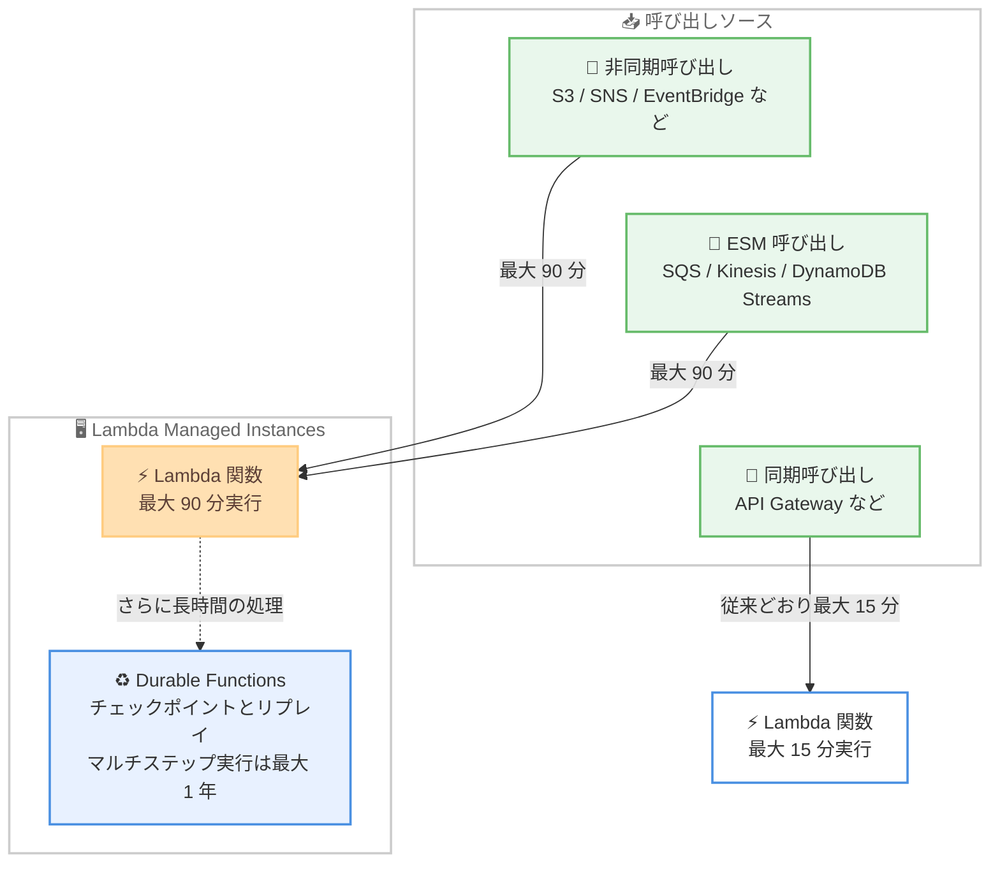

# AWS Lambda - Lambda Managed Instances での 90 分間の関数タイムアウトサポート

**リリース日**: 2026 年 9 月 9 日
**サービス**: AWS Lambda
**機能**: Lambda Managed Instances における非同期呼び出しおよびイベントソースマッピング呼び出しでの 90 分間の関数タイムアウト

📊 [このアップデートのインフォグラフィックを見る](https://takech9203.github.io/aws-news-summary/20260909-aws-lambda-90-minute-function.html)

## 概要

AWS Lambda は、Lambda Managed Instances (LMI) 上で実行される関数について、非同期呼び出しおよびイベントソースマッピング (ESM) 呼び出しにおける最大 90 分間の関数タイムアウトのサポートを発表しました。従来の 15 分間の上限から 6 倍の拡大となり、長時間の連続実行を必要とするワークロードを Lambda 上でそのまま実行できるようになります。

Lambda Managed Instances は、Lambda の運用上のシンプルさを維持しながら関数を EC2 インスタンス上で実行できる機能であり、1 つのインスタンスで複数の同時リクエストを処理するマルチコンカレンシーモデル、特化したコンピューティング構成の選択、EC2 料金によるコスト削減といった特長を持ちます。今回のタイムアウト拡大により、データ処理、メディアトランスコーディング、モンテカルロシミュレーションなどの金融計算、AI 推論、バッチワークロードといった処理時間の長いジョブを、アーキテクチャの再設計なしに実行できます。

また、チェックポイントとリプレイをサポートする Lambda durable functions もこの拡大されたタイムアウトの恩恵を受けます。非同期で呼び出されるマルチステップの durable 実行は、最大 1 年間実行できます。

**アップデート前の課題**

このアップデート以前に存在していた課題や制限は以下のとおりです。

- Lambda 関数の実行時間は最大 15 分に制限されており、それを超える処理は関数内で完結できなかった
- モンテカルロシミュレーションや AI 推論などのデータ集約型ワークロードでは、処理の分割、Step Functions によるオーケストレーション、コンテナサービスへの移行といったアーキテクチャ上の回避策が必要だった
- 長時間処理のためだけに ECS や EC2 などの別の実行基盤を構築・運用する必要があり、開発と運用の負荷が増加していた

**アップデート後の改善**

今回のアップデートにより可能になったことは以下のとおりです。

- Lambda Managed Instances 上の関数で、非同期呼び出しおよび ESM 呼び出しのタイムアウトを最大 90 分まで設定できるようになった
- 長時間実行が必要なデータ処理、メディアトランスコーディング、金融計算、AI 推論、バッチワークロードをアプリケーションの再設計なしに Lambda で実行できるようになった
- durable functions と組み合わせることで、チェックポイントとリプレイを活用した最大 1 年間のマルチステップ実行が可能になった

## アーキテクチャ図



Lambda Managed Instances 上の関数は、非同期呼び出しと ESM 呼び出しで最大 90 分のタイムアウトを設定できます。同期呼び出しは従来どおり最大 15 分であり、さらに長時間の処理には durable functions を組み合わせます。

## サービスアップデートの詳細

### 主要機能

1. **90 分間の関数タイムアウト**
   - Lambda Managed Instances 上で実行される関数のタイムアウト上限が 15 分から 90 分に拡大 (6 倍)
   - 非同期呼び出しとイベントソースマッピング (ESM) 呼び出しが対象
   - 長時間の連続実行を必要とするワークロードをアーキテクチャの再設計なしに実行可能

2. **Lambda Managed Instances の特長との組み合わせ**
   - 1 つのインスタンスで複数の同時リクエストを処理するマルチコンカレンシーモデル
   - ワークロードに合わせた特化型のコンピューティング構成を選択可能
   - EC2 料金ベースの課金によるコスト削減を、インフラストラクチャ管理なしで享受

3. **Durable functions との連携**
   - チェックポイントとリプレイをサポートする durable functions も拡大されたタイムアウトの対象
   - 非同期で呼び出されるマルチステップの durable 実行は最大 1 年間実行可能
   - 90 分を超える長時間ワークフローにも対応できる

4. **多様な設定手段**
   - Lambda コンソール、AWS CLI、Lambda API から設定可能
   - AWS CloudFormation などの Infrastructure as Code ツールに対応
   - Agent Toolkit for AWS からも設定可能

## 技術仕様

### タイムアウト上限の比較

| 呼び出しタイプ | 従来の Lambda | Lambda Managed Instances |
|------|------|------|
| 非同期呼び出し | 最大 15 分 | 最大 90 分 |
| イベントソースマッピング (ESM) 呼び出し | 最大 15 分 | 最大 90 分 |
| 同期呼び出し | 最大 15 分 | 最大 15 分 (変更なし) |
| 非同期のマルチステップ durable 実行 | - | 最大 1 年 |

### タイムアウトの設定

```bash
# Lambda 関数のタイムアウトを 90 分 (5400 秒) に設定
aws lambda update-function-configuration \
  --function-name my-long-running-function \
  --timeout 5400
```

`update-function-configuration` コマンドの `--timeout` パラメータでタイムアウトを秒単位で指定します。90 分は 5400 秒に相当します。対象の関数が Lambda Managed Instances のキャパシティプロバイダーにアタッチされている必要があります。

## 設定方法

### 前提条件

1. Lambda Managed Instances が利用可能なリージョンを使用していること
2. Lambda Managed Instances のキャパシティプロバイダーが作成済みであり、対象関数がアタッチされていること
3. 対象の関数が非同期呼び出しまたは ESM 呼び出しで実行されること (同期呼び出しは 15 分上限のまま)

### 手順

#### ステップ 1: キャパシティプロバイダーの確認または作成

```bash
aws lambda create-capacity-provider \
  --capacity-provider-name long-running-provider \
  --vpc-config SubnetIds=subnet-xxxx,SecurityGroupIds=sg-xxxx
```

Lambda Managed Instances のキャパシティプロバイダーを作成します。既存のキャパシティプロバイダーがある場合はこのステップは不要です。

#### ステップ 2: 関数タイムアウトの設定

```bash
aws lambda update-function-configuration \
  --function-name my-long-running-function \
  --timeout 5400
```

関数のタイムアウトを最大 5400 秒 (90 分) に設定します。Lambda コンソール、Infrastructure as Code ツール、Agent Toolkit for AWS からも同様に設定できます。

#### ステップ 3: 非同期呼び出しまたは ESM の構成

```bash
# 例: SQS キューをイベントソースとして設定
aws lambda create-event-source-mapping \
  --function-name my-long-running-function \
  --event-source-arn arn:aws:sqs:ap-northeast-1:123456789012:my-queue
```

イベントソースマッピングを作成するか、S3 や EventBridge などからの非同期呼び出しを構成します。90 分のタイムアウトは非同期呼び出しと ESM 呼び出しに適用されます。

## メリット

### ビジネス面

- **アーキテクチャ再設計コストの削減**: 15 分制限を回避するための処理分割や別基盤への移行が不要になり、開発コストと移行リスクを削減できる
- **運用負荷の軽減**: 長時間処理のために ECS や EC2 を自前で運用する必要がなくなり、インフラストラクチャ管理を Lambda に任せられる
- **コスト効率**: Lambda Managed Instances の EC2 料金ベースの課金により、長時間実行ワークロードをコスト効率よく処理できる

### 技術面

- **長時間ワークロードへの対応**: データ処理、メディアトランスコーディング、金融計算、AI 推論、バッチ処理など、最大 90 分の連続実行が必要な処理を関数内で完結できる
- **Durable functions との相乗効果**: チェックポイントとリプレイにより、90 分を超えるワークフローも最大 1 年のマルチステップ実行として構成できる
- **既存の開発体験を維持**: Lambda のプログラミングモデル、イベント連携、ツールチェーンをそのまま利用しながら実行時間だけを拡大できる

## デメリット・制約事項

### 制限事項

- 90 分のタイムアウトは Lambda Managed Instances 上の関数に限定され、従来の Lambda 実行モデルでは引き続き最大 15 分
- 対象となる呼び出しタイプは非同期呼び出しと ESM 呼び出しのみで、同期呼び出しは最大 15 分のまま
- Lambda Managed Instances が利用可能なリージョンに限定される

### 考慮すべき点

- Lambda Managed Instances は EC2 ベースの課金モデルであり、実行頻度が低いワークロードでは従来のリクエストベース課金の方が適する場合がある
- 長時間実行される処理では、リトライ時の重複実行に備えたべき等性の設計や、途中失敗時の再処理コストを考慮する必要がある
- 90 分を超える可能性がある処理は、durable functions によるチェックポイントとリプレイの活用を検討する

## ユースケース

### ユースケース 1: 大規模データ処理・バッチワークロード

**シナリオ**: 日次で数十 GB のデータを変換・集計するバッチ処理があり、従来は 15 分制限のために処理を細かく分割して Step Functions でオーケストレーションしていた。

**実装例**:
```bash
aws lambda update-function-configuration \
  --function-name nightly-batch-job \
  --timeout 5400
```

**効果**: 分割していたバッチ処理を 1 つの関数実行に集約でき、オーケストレーションの複雑さと中間状態の管理コストを削減できる。

### ユースケース 2: 金融計算 (モンテカルロシミュレーション)

**シナリオ**: リスク評価のためのモンテカルロシミュレーションを実行しており、試行回数を増やすと 15 分では完了しないため、EC2 上の専用基盤を運用していた。

**実装例**:
```bash
# SQS からシミュレーションジョブを受け取る ESM 構成
aws lambda create-event-source-mapping \
  --function-name monte-carlo-simulation \
  --event-source-arn arn:aws:sqs:ap-northeast-1:123456789012:simulation-jobs \
  --batch-size 1
```

**効果**: 最大 90 分の連続計算が可能になり、専用基盤の運用を廃止してインフラストラクチャ管理を Lambda に任せられる。特化したコンピューティング構成の選択により計算性能も最適化できる。

### ユースケース 3: メディアトランスコーディング・AI 推論

**シナリオ**: アップロードされた長尺動画のトランスコーディングや、大きな入力に対する AI 推論を行っており、処理時間が 15 分を超えるケースがある。

**実装例**:
```bash
# S3 イベントによる非同期呼び出しで長時間処理を実行
aws lambda update-function-configuration \
  --function-name video-transcoder \
  --timeout 5400
```

**効果**: 長尺コンテンツの処理を関数内で完結でき、処理の分割や外部サービスへのオフロードが不要になる。イベント駆動のシンプルなアーキテクチャを維持できる。

## 料金

Lambda Managed Instances は EC2 ベースの課金モデルを採用しており、基盤となる EC2 インスタンスコストに管理手数料が加算されます。90 分タイムアウトの利用自体に追加料金はありません。詳細は [AWS Lambda 料金ページ](https://aws.amazon.com/lambda/pricing/) を参照してください。

## 利用可能リージョン

Lambda Managed Instances が利用可能なすべての AWS リージョンで利用できます。最新のリージョン対応状況は [AWS リージョン別サービス一覧](https://aws.amazon.com/about-aws/global-infrastructure/regional-product-services/) を参照してください。

## 関連サービス・機能

- **Lambda Managed Instances**: 今回のアップデートの前提となる実行モデル。Lambda の運用シンプルさを維持しながら EC2 インスタンス上で関数を実行する
- **Lambda durable functions**: チェックポイントとリプレイをサポートする実行モデル。非同期のマルチステップ実行は最大 1 年間実行可能で、90 分を超えるワークフローに対応
- **Amazon SQS / Amazon Kinesis / Amazon DynamoDB Streams**: イベントソースマッピング (ESM) 呼び出しの代表的なイベントソース。90 分タイムアウトの対象
- **AWS Step Functions**: 従来 15 分制限の回避に使われてきたオーケストレーションサービス。今後も複雑なワークフロー管理には有効であり、単一の長時間処理は LMI で完結できる

## 参考リンク

- 📊 [インフォグラフィック](https://takech9203.github.io/aws-news-summary/20260909-aws-lambda-90-minute-function.html)
- [公式発表 (What's New)](https://aws.amazon.com/about-aws/whats-new/2026/09/aws-lambda-90-minute-function/)
- [Lambda Managed Instances ドキュメント](https://docs.aws.amazon.com/lambda/latest/dg/lambda-managed-instances.html)
- [非同期呼び出しドキュメント](https://docs.aws.amazon.com/lambda/latest/dg/invocation-async.html)
- [イベントソースマッピングドキュメント](https://docs.aws.amazon.com/lambda/latest/dg/invocation-eventsourcemapping.html)
- [Durable functions ドキュメント](https://docs.aws.amazon.com/lambda/latest/dg/durable-functions.html)
- [AWS Lambda 料金ページ](https://aws.amazon.com/lambda/pricing/)

## まとめ

Lambda Managed Instances 上の関数で、非同期呼び出しと ESM 呼び出しのタイムアウトが従来の 6 倍となる最大 90 分に拡大されました。15 分制限のために処理の分割や別基盤への移行を行っていたデータ処理、メディアトランスコーディング、金融計算、AI 推論、バッチワークロードは、アーキテクチャの再設計なしに Lambda で実行できるようになります。長時間処理を抱えるワークロードでは、LMI への移行と durable functions の併用を検討することを推奨します。
