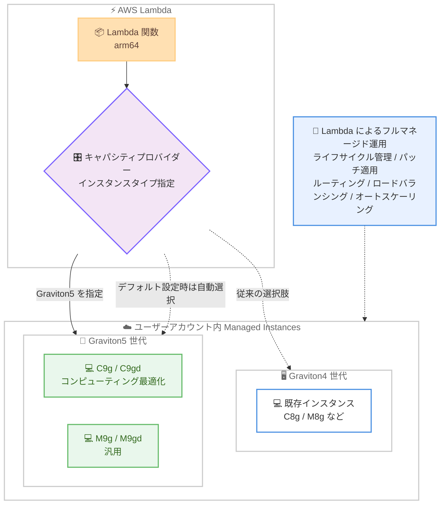

# AWS Lambda - Lambda Managed Instances での Graviton5 搭載 EC2 インスタンスサポート

**リリース日**: 2026 年 9 月 9 日
**サービス**: AWS Lambda
**機能**: Lambda Managed Instances における AWS Graviton5 搭載 EC2 インスタンス (C9g、C9gd、M9g、M9gd) のサポート

📊 [このアップデートのインフォグラフィックを見る](https://takech9203.github.io/aws-news-summary/20260909-aws-lambda-graviton5-ec2.html)

## 概要

AWS Lambda は、Lambda Managed Instances (LMI) において AWS Graviton5 プロセッサを搭載した C9g、C9gd、M9g、M9gd インスタンスのサポートを発表しました。Graviton5 搭載インスタンスは、Graviton4 搭載インスタンスと比較して最大 25% 高いコンピューティングパフォーマンスを提供します。

Lambda Managed Instances は、Lambda の運用上のシンプルさを維持しながら、Lambda 関数を EC2 インスタンス上で実行できる機能です。インスタンスのライフサイクル管理、OS とランタイムのパッチ適用、ルーティング、ロードバランシング、オートスケーリングを Lambda が完全に管理するため、ユーザーはインフラストラクチャの運用負荷なしに EC2 の最新ハードウェアと料金メリットを活用できます。

今回のアップデートにより、大量かつ予測可能なトラフィックを処理するサーバーレスワークロードや、パフォーマンスが重要なアプリケーションにおいて、最新世代の Graviton5 プロセッサの性能をそのまま利用できるようになります。キャパシティプロバイダー作成時に Graviton5 インスタンスタイプを指定するだけで利用を開始できます。

**アップデート前の課題**

このアップデート以前に存在していた課題や制限は以下のとおりです。

- Lambda Managed Instances で利用できる最新の Graviton プロセッサは Graviton4 世代までであり、Graviton5 の性能向上を Lambda 関数で活用できなかった
- コンピューティング性能を高めるには、より大きなインスタンスサイズの選択やインスタンス数の増加が必要で、コスト効率の面で最適化の余地があった
- 最新世代のプロセッサを利用するには、Lambda を離れて EC2 上で自前のアプリケーション基盤を構築・運用する必要があった

**アップデート後の改善**

今回のアップデートにより可能になったことは以下のとおりです。

- Lambda 関数を Graviton5 搭載インスタンス上で実行し、Graviton4 比で最大 25% 高いコンピューティングパフォーマンスを得られるようになった
- キャパシティプロバイダー作成時にインスタンスタイプを指定するだけで、コードの変更なしに Graviton5 へ移行できるようになった
- インスタンスタイプをデフォルト設定にした場合、関数のアーキテクチャ、メモリサイズ、メモリと vCPU の比率に基づいて Lambda が Graviton5 インスタンスを自動的に選択候補に含めるようになった

## アーキテクチャ図



Lambda 関数はキャパシティプロバイダーを通じて実行基盤となるインスタンスタイプを選択します。今回のアップデートで Graviton5 搭載の C9g、C9gd、M9g、M9gd が選択肢に加わり、インフラ運用は従来どおり Lambda が完全に管理します。

## サービスアップデートの詳細

### 主要機能

1. **Graviton5 搭載インスタンスのサポート**
   - コンピューティング最適化の C9g、C9gd と汎用の M9g、M9gd の 4 ファミリーをサポート
   - Graviton4 搭載インスタンスと比較して最大 25% 高いコンピューティングパフォーマンスを提供
   - CPU 性能が重要なワークロードの処理時間短縮とスループット向上に寄与

2. **キャパシティプロバイダーによるシンプルな指定**
   - キャパシティプロバイダー作成時に希望する Graviton5 インスタンスタイプを指定するだけで利用可能
   - インスタンスタイプをデフォルト設定にした場合、関数のアーキテクチャ、メモリサイズ、メモリと vCPU の比率に基づき、Lambda が Graviton5 インスタンスを自動的に選択候補として考慮
   - 関数コードの変更は不要

3. **Lambda によるフルマネージド運用**
   - インスタンスのライフサイクル管理、OS およびランタイムのパッチ適用を Lambda が実施
   - ルーティング、ロードバランシング、オートスケーリングが組み込みで提供される
   - EC2 の料金メリット (Savings Plans、リザーブドインスタンスなど) を活用したコスト効率の高い実行が可能

## 技術仕様

### サポート対象インスタンスタイプ

| インスタンスファミリー | 分類 | 特徴 |
|------|------|------|
| C9g | コンピューティング最適化 | Graviton5 搭載。CPU 性能が重要なワークロード向け |
| C9gd | コンピューティング最適化 | C9g にローカル NVMe SSD ストレージを追加した構成 |
| M9g | 汎用 | Graviton5 搭載。バランス型のコンピューティングとメモリ比率 |
| M9gd | 汎用 | M9g にローカル NVMe SSD ストレージを追加した構成 |

### Lambda Managed Instances の主な特性

| 項目 | 詳細 |
|------|------|
| 実行モデル | 1 つの実行環境が複数の同時呼び出しを処理するマルチコンカレンシーモデル |
| 分離方式 | ユーザーアカウント内の EC2 Nitro インスタンス上でコンテナにより分離 |
| スケーリング | CPU 使用率に基づく非同期スケーリング。コールドスタートなし |
| 課金モデル | EC2 ベースの課金に 15% の管理手数料を加算。EC2 Savings Plans やリザーブドインスタンスの割引を適用可能 |
| インスタンス管理 | Lambda が完全管理。手動でのインスタンス終了は不可で、キャパシティプロバイダーの削除により終了 |

### インスタンスタイプの指定

```bash
# キャパシティプロバイダー作成時に Graviton5 インスタンスタイプを指定するイメージ
aws lambda create-capacity-provider \
  --capacity-provider-name my-graviton5-provider \
  --vpc-config SubnetIds=subnet-xxxx,SecurityGroupIds=sg-xxxx \
  --instance-requirements InstanceTypes=m9g.xlarge
```

キャパシティプロバイダーの作成時にインスタンス要件として Graviton5 インスタンスタイプを指定します。デフォルト設定の場合は、関数の構成に基づいて Lambda が適切なインスタンスを自動選択します。実際のパラメータ仕様は公式ドキュメントを参照してください。

## 設定方法

### 前提条件

1. Lambda Managed Instances が利用可能なリージョンを使用していること
2. 対象リージョンで C9g、C9gd、M9g、M9gd インスタンスが提供されていること
3. キャパシティプロバイダー用の VPC (サブネットおよびセキュリティグループ) が構成済みであること

### 手順

#### ステップ 1: キャパシティプロバイダーの作成

```bash
aws lambda create-capacity-provider \
  --capacity-provider-name graviton5-provider \
  --vpc-config SubnetIds=subnet-xxxx,SecurityGroupIds=sg-xxxx \
  --instance-requirements InstanceTypes=c9g.2xlarge
```

Graviton5 インスタンスタイプを指定してキャパシティプロバイダーを作成します。キャパシティプロバイダーは関数の実行場所を定義し、セキュリティ境界として機能します。

#### ステップ 2: Lambda 関数のキャパシティプロバイダーへのアタッチ

```bash
aws lambda create-function \
  --function-name my-function \
  --runtime python3.13 \
  --architectures arm64 \
  --handler app.handler \
  --role arn:aws:iam::123456789012:role/lambda-role \
  --zip-file fileb://function.zip
```

通常どおり Lambda 関数を作成し、作成したキャパシティプロバイダーにアタッチします。Graviton5 は Arm アーキテクチャのため、arm64 アーキテクチャを指定します。

#### ステップ 3: 関数バージョンの発行と動作確認

```bash
aws lambda publish-version --function-name my-function
```

関数バージョンを発行すると、Lambda がユーザーアカウント内に Managed Instances を起動します。デフォルトではアベイラビリティゾーンの耐障害性のために 3 つのインスタンスが起動され、3 つの実行環境が開始された後に関数バージョンが ACTIVE になります。

## メリット

### ビジネス面

- **コスト効率の向上**: 最大 25% のパフォーマンス向上により、同等の処理をより少ないコンピューティングリソースで実行でき、コスト削減につながる
- **EC2 料金メリットの活用**: EC2 Savings Plans やリザーブドインスタンスなどの割引を Lambda ワークロードに適用できる
- **運用負荷の削減**: パッチ適用やスケーリングなどのインフラ運用を Lambda に任せることで、アプリケーション開発に集中できる

### 技術面

- **最新プロセッサの活用**: 最新世代の Graviton5 プロセッサの性能を Lambda 関数からコード変更なしで利用できる
- **柔軟なインスタンス選択**: コンピューティング最適化 (C9g/C9gd) と汎用 (M9g/M9gd) から、ワークロード特性に応じて選択できる
- **自動インスタンス選択**: デフォルト設定では、関数のアーキテクチャやメモリ構成に基づいて Lambda が最適なインスタンスを自動的に選択候補に含める

## デメリット・制約事項

### 制限事項

- Lambda Managed Instances と対象の EC2 インスタンスタイプの両方が利用可能なリージョンに限定される
- Graviton5 は Arm アーキテクチャのため、関数コードと依存ライブラリが arm64 に対応している必要がある
- Managed Instances に対する手動でのインスタンス操作 (直接の終了など) は制限されており、削除はキャパシティプロバイダーの削除を通じて行う

### 考慮すべき点

- Lambda Managed Instances は EC2 ベースの課金に 15% の管理手数料が加算されるモデルであり、トラフィックが少ないワークロードでは従来の Lambda (リクエストベース課金) の方が適する場合がある
- Lambda Managed Instances はマルチコンカレンシーモデルを採用しており、スレッドセーフティや状態管理の考慮が従来の Lambda と異なる
- 性能向上の度合いはワークロードの特性により異なるため、移行前にベンチマークによる検証を推奨する

## ユースケース

### ユースケース 1: 大量トラフィックの Web API バックエンド

**シナリオ**: 安定的に大量のリクエストを処理する Web API を Lambda で運用しており、レスポンスタイムの改善とコスト最適化を両立したい。

**実装例**:
```bash
aws lambda create-capacity-provider \
  --capacity-provider-name api-graviton5 \
  --vpc-config SubnetIds=subnet-xxxx,SecurityGroupIds=sg-xxxx \
  --instance-requirements InstanceTypes=c9g.2xlarge
```

**効果**: Graviton5 の高いコンピューティング性能によりレスポンスタイムが改善し、マルチコンカレンシーモデルと EC2 料金メリットによりコスト効率も向上する。

### ユースケース 2: CPU 集約型のデータ処理・メディア処理

**シナリオ**: 画像変換、動画のトランスコード、データ変換など CPU 負荷の高い処理を Lambda で実行しており、処理時間を短縮したい。

**実装例**:
```bash
aws lambda create-capacity-provider \
  --capacity-provider-name media-graviton5 \
  --vpc-config SubnetIds=subnet-xxxx,SecurityGroupIds=sg-xxxx \
  --instance-requirements InstanceTypes=c9gd.4xlarge
```

**効果**: Graviton4 比で最大 25% の性能向上により処理時間が短縮される。C9gd のローカル NVMe SSD ストレージにより、一時ファイルを多用する処理の I/O 性能も向上する。

### ユースケース 3: 既存 Graviton4 ベース LMI ワークロードの世代更新

**シナリオ**: すでに Lambda Managed Instances を Graviton4 インスタンスで運用しており、コード変更なしで性能を向上させたい。

**実装例**:
```bash
# 新しいキャパシティプロバイダーを Graviton5 で作成し、関数を切り替える
aws lambda create-capacity-provider \
  --capacity-provider-name upgraded-graviton5 \
  --vpc-config SubnetIds=subnet-xxxx,SecurityGroupIds=sg-xxxx \
  --instance-requirements InstanceTypes=m9g.xlarge
```

**効果**: arm64 対応済みの関数はコード変更なしで移行でき、最大 25% の性能向上を享受できる。段階的な切り替えによりリスクを抑えた世代更新が可能になる。

## 料金

Lambda Managed Instances は EC2 ベースの課金モデルを採用しており、EC2 インスタンスコストに 15% の管理手数料が加算されます。EC2 Savings Plans、リザーブドインスタンスなどの EC2 割引オプションを基盤となるインスタンスコストに適用できます (管理手数料には適用されません)。

Graviton5 インスタンスの利用料金は、対象インスタンスタイプの EC2 料金に準じます。詳細は [AWS Lambda 料金ページ](https://aws.amazon.com/lambda/pricing/) を参照してください。また、[Lambda Managed Instances 料金計算ツール](https://aws-samples.github.io/sample-aws-lambda-managed-instances/) を使用して、Lambda (デフォルト)、Lambda Managed Instances、セルフマネージド EC2 のコスト比較が可能です。

## 利用可能リージョン

Lambda Managed Instances と C9g、C9gd、M9g、M9gd インスタンスの両方が利用可能なすべての AWS リージョンで利用できます。最新のリージョン対応状況は [AWS リージョン別サービス一覧](https://aws.amazon.com/about-aws/global-infrastructure/regional-product-services/) を参照してください。

## 関連サービス・機能

- **Amazon EC2 (C9g/C9gd/M9g/M9gd)**: Lambda Managed Instances の実行基盤となる Graviton5 搭載インスタンス。ローカル NVMe SSD ストレージ付きの「d」バリアントも選択可能
- **AWS Graviton**: AWS が設計する Arm ベースプロセッサ。Graviton5 は Graviton4 比で最大 25% のコンピューティング性能向上を実現
- **EC2 Savings Plans / リザーブドインスタンス**: Lambda Managed Instances の基盤インスタンスコストに適用可能な割引オプション
- **AWS Lambda (デフォルト実行モデル)**: バースト性のあるトラフィックやゼロスケールが必要なワークロードに適した従来の実行モデル。ワークロード特性に応じて使い分けが可能

## 参考リンク

- 📊 [インフォグラフィック](https://takech9203.github.io/aws-news-summary/20260909-aws-lambda-graviton5-ec2.html)
- [公式発表 (What's New)](https://aws.amazon.com/about-aws/whats-new/2026/09/aws-lambda-graviton5-ec2/)
- [Lambda Managed Instances ドキュメント](https://docs.aws.amazon.com/lambda/latest/dg/lambda-managed-instances.html)
- [AWS Lambda 料金ページ](https://aws.amazon.com/lambda/pricing/)
- [AWS リージョン別サービス一覧](https://aws.amazon.com/about-aws/global-infrastructure/regional-product-services/)

## まとめ

Lambda Managed Instances が Graviton5 搭載の C9g、C9gd、M9g、M9gd インスタンスに対応し、Graviton4 比で最大 25% 高いコンピューティングパフォーマンスを Lambda の運用シンプルさを保ったまま利用できるようになりました。大量かつ予測可能なトラフィックを処理するワークロードや CPU 集約型の処理を LMI で運用している場合は、キャパシティプロバイダーのインスタンスタイプを Graviton5 に更新し、性能とコスト効率の改善を検証することを推奨します。
