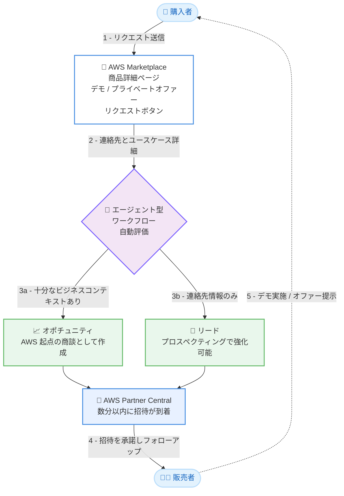

# AWS Marketplace - デモリクエストとプライベートオファーリクエストの数分以内の自動クオリフィケーション

**リリース日**: 2026 年 9 月 9 日
**サービス**: AWS Marketplace
**機能**: デモリクエストおよびプライベートオファーリクエストの自動評価と迅速な販売者への引き渡し

📊 [このアップデートのインフォグラフィックを見る](https://takech9203.github.io/aws-news-summary/20260909-aws-marketplace-demo-private-offer-requests-qualification.html)

## 概要

AWS Marketplace の出品リスティングで「デモをリクエスト」または「プライベートオファーをリクエスト」の CTA (Call-to-Action) ボタンを有効化している販売者は、顧客がリクエストを送信してから数分以内に、そのリクエストに対応できるようになりました。顧客がリクエストを送信する際にユースケースの詳細を入力すると、AWS Marketplace はエージェント型ワークフロー (agentic workflow) でその内容を評価し、販売者向けのオポチュニティ (商談) を自動的に作成します。各オポチュニティは、顧客の連絡先情報とユースケースの詳細とともに AWS Partner Central に届きます。

これまでは、すべてのリクエストについて AWS の担当者が顧客に連絡してクオリフィケーション (適格性評価) を行ってから販売者に共有していたため、数日の遅延が発生していました。今回のアップデートにより、この評価プロセスが自動化され、販売者はリード獲得から顧客へのフォローアップまでのリードタイムを大幅に短縮できます。

顧客が連絡先情報のみを提供した場合でも、販売者はその情報をリードとして受け取り、AWS のリードプロスペクティングワークフローを通じてリード情報を強化 (エンリッチ) できます。既にボタンを有効化している販売者は、リスティングやワークフローの変更なしに自動的にこの改善の恩恵を受けられます。まだボタンを有効化していない販売者は、AWS Marketplace Seller Guide の手順に従って有効化できます。

**アップデート前の課題**

- 顧客がデモやプライベートオファーをリクエストしても、AWS の担当者がすべてのリクエストについて顧客に連絡してクオリフィケーションを行う必要があり、販売者への共有まで数日の遅延が発生していた
- 顧客の購買意欲が高いタイミングを逃し、評価や調達サイクルが長期化するリスクがあった
- 人手による評価プロセスのため、リクエスト数の増加に応じたスケールが難しかった

**アップデート後の改善**

- 顧客のリクエスト送信から数分以内に、クオリフィケーション済みのオポチュニティまたはリードが AWS Partner Central に届くようになった
- エージェント型ワークフローが顧客のユースケース詳細を自動評価し、十分なビジネスコンテキストがあるリクエストをオポチュニティとして作成するようになった
- ビジネスコンテキストが不足しているリクエストもリードとして共有され、AWS のリードプロスペクティングワークフロー (リード概要、セールスプレイ、コールスクリプト、アウトリーチメールのドラフトなど) で強化できるようになった
- 既存の有効化済みリスティングは変更不要で、自動的に新しいワークフローが適用される

## アーキテクチャ図



購入者が商品詳細ページからリクエストを送信すると、エージェント型ワークフローが内容を自動評価し、数分以内にオポチュニティまたはリードとして AWS Partner Central に届きます。従来この評価は AWS 担当者による手動プロセスで、数日を要していました。

## サービスアップデートの詳細

### 主要機能

1. **エージェント型ワークフローによる自動クオリフィケーション**
   - 顧客がリクエスト送信時に入力したユースケースの詳細を、エージェント型ワークフローが自動的に評価する
   - 十分なビジネスコンテキストを含むリクエストは、AWS 起点のオポチュニティ (AWS Originated Opportunity) として作成される
   - 従来の AWS 担当者による手動クオリフィケーションで発生していた数日の遅延が、数分に短縮される

2. **AWS Partner Central へのオポチュニティ配信**
   - オポチュニティは AWS Partner Central に招待 (invitation) として届き、顧客の連絡先情報とユースケースが含まれる
   - Partner Central の「Sell > Opportunities」の「Opportunity Invitations」タブで確認でき、Project Title に「AWS Marketplace」が含まれるものをフィルタリングできる
   - オポチュニティ名は「[顧客企業名] AWS Marketplace [Request Demo | Request Private Offer]」の形式で作成される
   - 招待は 5 営業日以内に承諾しない場合、期限切れとなる
   - オポチュニティには Opportunity Quality スコアが付与され、パイプライン内での優先順位付けに活用できる

3. **リードとしての共有とエンリッチメント**
   - ビジネスコンテキストが不足しているリクエスト (連絡先情報のみなど) はリードとして共有される
   - リードは「Sell > Leads」の「Lead Invitations」タブに届き、Lead Source フィールドが「AWS Marketplace」に設定される
   - 承諾したリードは AWS のシグナルで強化でき、リード概要、セールスプレイ、コールスクリプト、アウトリーチメールのドラフトなどのプロスペクティングワークフローを実行できる

4. **既存リスティングへの自動適用**
   - 既にリクエストボタンを有効化している販売者は、リスティングやワークフローの変更なしに自動的に新しい評価フローが適用される

## 技術仕様

### リクエストの共有形式

| 項目 | オポチュニティ | リード |
|------|----------------|--------|
| 条件 | 十分なビジネスコンテキストを含むリクエスト | ビジネスコンテキストが不足するリクエスト |
| 確認場所 | Partner Central の Sell > Opportunities > Opportunity Invitations タブ | Partner Central の Sell > Leads > Lead Invitations タブ |
| 識別方法 | Project Title に「AWS Marketplace」とリクエストタイプを含む | Lead Source フィールドが「AWS Marketplace」 |
| 含まれる情報 | 顧客の連絡先、ユースケース、Opportunity Quality スコア | 顧客の連絡先、リクエストタイプのインタラクション記録 |
| 招待の有効期限 | 5 営業日 | 招待を承諾して利用 |
| 推奨フォローアップ | 受領後できるだけ早く、5 営業日以内 | 同左 |

### 対応する商品タイプ

リクエストボタンは以下の商品タイプで利用できます。

| 商品タイプ | 対応状況 |
|------------|----------|
| Amazon Machine Image (AMI) | 対応 |
| Software as a Service (SaaS) | 対応 |
| コンテナ | 対応 |
| CloudFormation テンプレート | 対応 |

## 設定方法

### 前提条件

1. APN Customer Engagements Program (ACE) に参加し、AWS からのリードとオポチュニティの紹介を受け取れる状態であること (ACE 登録後のステータス更新は 2 週間ごとに行われ、更新完了後にボタンが表示される)
2. `CreatePartnerCentralCloudAdminRole` IAM ポリシーを作成し、AWS Partner Central アカウントと AWS Marketplace アカウントをリンクしていること
3. 少なくとも 1 つの公開リスティングを保有していること (プライベートオファー発行の要件)

### 手順

#### ステップ1: 新規商品でボタンを有効化する場合

1. AWS Partner Central で AMI、SaaS、コンテナ、CloudFormation テンプレートのいずれかの商品を作成する
2. 商品作成時に「Guided demo and private offer requests」セクションで、「Enable guided demo requests for buyers」と「Enable private offer requests for buyers」の一方または両方を選択する
3. 商品を公開する (ボタンは商品公開後に商品詳細ページに表示される)

#### ステップ2: 既存商品でボタンを有効化する場合

1. AWS Partner Central の「Build」タブで対象の商品を選択する
2. 「Request changes」リストから「Update product information」を選択する
3. 「Enable guided demo requests for buyers」と「Enable private offer requests for buyers」の一方または両方を選択して保存する

#### ステップ3: リクエストの受信とフォローアップ

1. オポチュニティは「Sell > Opportunities」の「Opportunity Invitations」タブ、リードは「Sell > Leads」の「Lead Invitations」タブで確認する
2. 招待を承諾すると、それぞれ「Opportunities」タブまたは「Leads」タブに表示される
3. 顧客の連絡先情報をもとに、5 営業日以内を目安にできるだけ早くフォローアップし、デモの日程調整やオファー内容の協議を行う

なお、ボタン有効化後にリスティングの公開価格を非表示にすることで、購入者が公開オファーではなく「Request for private offer」ボタン経由で販売者に連絡するように誘導することもできます。

## メリット

### ビジネス面

- **リードタイムの大幅短縮**: 従来数日かかっていたクオリフィケーションが数分に短縮され、顧客の購買意欲が高いタイミングを逃さずに対応できる
- **調達サイクルの短縮**: 購入者は商品詳細ページから直接リクエストでき、評価から購買までのサイクルが加速する
- **パイプラインの質向上**: Opportunity Quality スコアにより、他のオポチュニティと同じ基準で優先順位付けができる

### 技術面

- **移行作業が不要**: 既にボタンを有効化済みの販売者は、リスティングやワークフローの変更なしに自動的に新フローが適用される
- **リードエンリッチメント**: 連絡先情報のみのリードでも、AWS のシグナルによる強化とプロスペクティングワークフロー (セールスプレイ、コールスクリプト、メールドラフト生成) を活用できる
- **一元管理**: オポチュニティもリードも AWS Partner Central に集約され、既存の ACE パイプライン管理と統合される

## デメリット・制約事項

### 制限事項

- APN Customer Engagements Program (ACE) への参加が必須であり、ACE 登録後のステータス更新は 2 週間ごとのため、ボタンが利用可能になるまで待機が必要な場合がある
- AWS Partner Central アカウントと AWS Marketplace アカウントのリンクが必要
- 対応商品タイプは AMI、SaaS、コンテナ、CloudFormation テンプレートに限られる
- オポチュニティの招待は 5 営業日で期限切れとなるため、迅速な承諾が必要

### 考慮すべき点

- リクエストがオポチュニティになるかリードになるかは、顧客が入力するビジネスコンテキストの充実度に依存する
- 数分でリクエストが届くようになるため、販売者側にも迅速なフォローアップ体制 (5 営業日以内、可能な限り早期) が求められる
- Partner Central のエンゲージメントタイトルは最大 40 文字のため、長い顧客企業名は短縮されて表示される

## ユースケース

### ユースケース1: SaaS 製品のデモリクエスト対応の高速化

**シナリオ**: SaaS 製品を AWS Marketplace に出品している ISV が、見込み顧客からのデモリクエストに対して営業チームが即日対応できる体制を構築したい。

**実装例**:
```
1. ACE プログラムに参加し、Partner Central と Marketplace アカウントをリンク
2. 商品リスティングで「Enable guided demo requests for buyers」を有効化
3. Partner Central の Opportunity Invitations を毎日確認する運用を整備
4. Project Title に「AWS Marketplace」を含む招待をフィルタリングして即時承諾
```

**効果**: 顧客のリクエストから数分でユースケース付きのオポチュニティが届くため、購買意欲が高いうちにデモを設定でき、成約率の向上が期待できる。

### ユースケース2: 公開価格を非表示にしたプライベートオファー主導の販売

**シナリオ**: エンタープライズ向けソフトウェアの販売者が、顧客ごとに個別の価格や条件を提示するため、プライベートオファーを起点とした商談フローを構築したい。

**実装例**:
```
1. 「Enable private offer requests for buyers」を有効化
2. リスティングの公開価格を非表示に更新 (Update pricing visibility)
3. 届いたオポチュニティのユースケースをもとにカスタム価格と EULA を設計
4. Partner Central でプライベートオファーを作成し、オファー URL を顧客に送付
```

**効果**: 顧客は商品詳細ページから直接プライベートオファーをリクエストでき、販売者は顧客のユースケースを把握した上で最適な条件を迅速に提示できる。

### ユースケース3: 連絡先のみのリードをプロスペクティングで育成

**シナリオ**: 顧客がユースケースの詳細を入力せず連絡先情報のみでリクエストを送信した場合でも、営業機会として活用したい。

**実装例**:
```
1. Partner Central の Lead Invitations タブで Lead Source が
   AWS Marketplace のリード招待を承諾
2. AWS シグナルによるリードのエンリッチメントを実行
3. リード概要、セールスプレイ、コールスクリプト、
   アウトリーチメールドラフトを生成してアプローチ
```

**効果**: 情報が少ないリードでも AWS のプロスペクティングワークフローで補強でき、営業活動の初動を効率化できる。

## 料金

このアップデート自体に追加料金はありません。デモリクエストおよびプライベートオファーリクエストのボタン機能は、AWS Marketplace 販売者向けの機能として提供されます。なお、APN Customer Engagements Program (ACE) への参加要件など、AWS パートナープログラムの条件が適用されます。

## 利用可能リージョン

公式発表にリージョンに関する記載はありません。AWS Marketplace および AWS Partner Central はグローバルに提供されるサービスであり、本機能は対象の販売者に対して適用されます。

## 関連サービス・機能

- **AWS Partner Central**: オポチュニティとリードの招待を受信し、パイプラインを管理するポータル。本機能の配信先となる
- **APN Customer Engagements Program (ACE)**: AWS からのリードとオポチュニティの紹介を受けるためのプログラム。本機能の利用に参加が必須
- **AWS Marketplace プライベートオファー**: 個別の価格、EULA、カスタム条件で製品を販売する仕組み。リクエストボタンから商談につながる
- **AWS リードプロスペクティングワークフロー**: リードのエンリッチメント、セールスプレイ、コールスクリプト、アウトリーチメールドラフトの生成を支援する機能

## 参考リンク

- 📊 [インフォグラフィック](https://takech9203.github.io/aws-news-summary/20260909-aws-marketplace-demo-private-offer-requests-qualification.html)
- [公式発表 (What's New)](https://aws.amazon.com/about-aws/whats-new/2026/09/aws-marketplace-demo-private-offer-requests-qualification)
- [ドキュメント: Adding private offer and demo request buttons (AWS Marketplace Seller Guide)](https://docs.aws.amazon.com/marketplace/latest/userguide/creating-private-offer.html#private-offer-requests-demos)
- [APN Customer Engagements Program (ACE)](https://aws.amazon.com/partners/programs/ace/)
- [AWS Partner Central アカウントリンクガイド](https://docs.aws.amazon.com/partner-central/latest/getting-started/account-linking.html)

## まとめ

AWS Marketplace のデモリクエストとプライベートオファーリクエストが、エージェント型ワークフローによる自動評価で数分以内に販売者へ届くようになり、従来数日かかっていたクオリフィケーションの遅延が解消されました。既にボタンを有効化している販売者は変更不要で恩恵を受けられるため、Opportunity Invitations と Lead Invitations の確認とフォローアップ体制の整備を推奨します。まだボタンを有効化していない販売者は、ACE 参加とアカウントリンクを完了した上で有効化を検討する価値があります。
