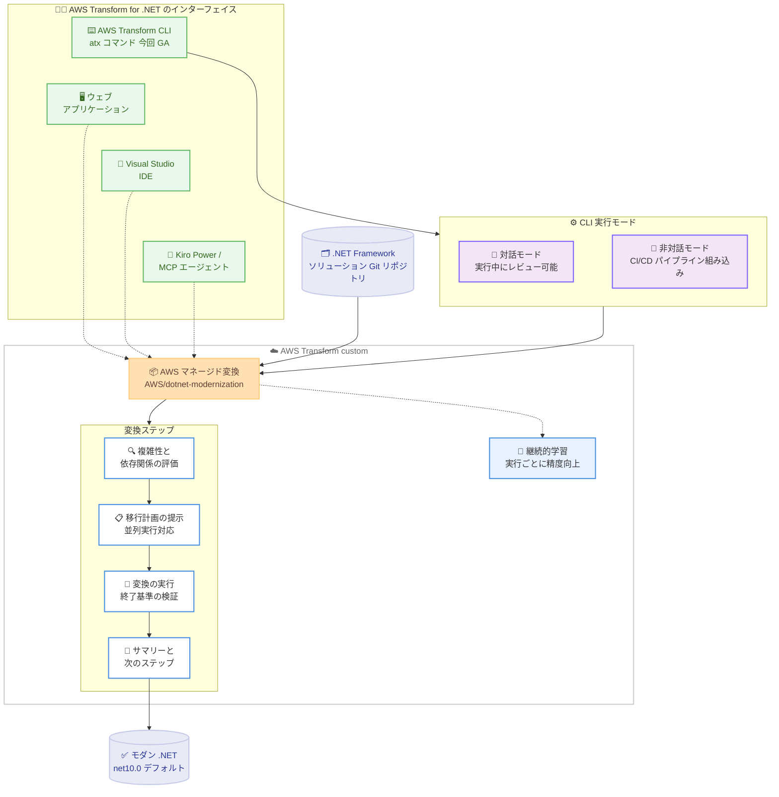

# AWS Transform - .NET モダナイゼーションが CLI 経由で一般提供開始

**リリース日**: 2026 年 9 月 9 日
**サービス**: AWS Transform
**機能**: AWS Transform custom の AWS マネージド変換 AWS/dotnet-modernization の CLI 経由での一般提供開始

📊 [このアップデートのインフォグラフィックを見る](https://takech9203.github.io/aws-news-summary/20260909-aws-transform-dotnet-cli.html)

## 概要

AWS は、AWS Transform custom における .NET モダナイゼーション用の AWS マネージド変換 (AWS/dotnet-modernization) の一般提供 (GA) を発表しました。この変換は、1 行の CLI コマンドで起動できます。対話的に実行することも、既存のパイプラインやワークフローにスクリプトとして組み込んで自律的に実行することも可能です。

この CLI エクスペリエンスは、既存の AWS Transform for .NET のインターフェイスであるウェブアプリケーション、Visual Studio IDE、Kiro Power、MCP エージェントを補完するものです。AWS Transform custom は、AWS マネージド変換とカスタム変換を使用してコードを大規模にモダナイズ・変換するための機能であり、言語バージョンのアップグレード、フレームワークの移行、パフォーマンスの最適化、コードベースの分析に対応します。これらの変換は継続的に改善され、各エンゲージメントから学習することで、より正確で効率的な結果を提供します。

公式ドキュメントによると、AWS/dotnet-modernization 変換は .NET Framework ソリューションをモダンな .NET (デフォルトは net10.0、net8.0 以降をサポート) に移行します。複雑性と依存関係を評価し、並列実行を含む移行計画を提示し、システムが強制する終了基準 (exit-criteria) の検証を伴ってプロジェクトを変換し、次のステップを含むサマリーを生成します。

**アップデート前の課題**

- AWS Transform for .NET の利用にはウェブアプリケーション、Visual Studio IDE、Kiro Power、MCP エージェントといったインターフェイスが必要であり、ターミナルから直接変換を起動する手段がなかった
- CI/CD パイプラインに .NET モダナイゼーションを組み込み、人手を介さず自律的に実行する標準的な方法がなかった
- 多数の .NET ソリューションを一括で変換するバルク実行のスクリプト化が難しかった

**アップデート後の改善**

- `atx custom def exec` による 1 行の CLI コマンドで .NET モダナイゼーション変換を起動できるようになった
- 非対話モード (`-x`) とツールの自動信頼 (`-t`) を組み合わせることで、CI/CD パイプラインへの組み込みや大量リポジトリへの一括適用など、完全に自律的な実行が可能になった
- 対話モードでは、実行の開始時・実行中・終了時にエージェントと対話し、重要な意思決定ポイントで人間がレビューできる
- `additionalPlanContext` 設定パラメータにより、組織固有の要件に合わせて AWS マネージド変換の動作をカスタマイズできる

## アーキテクチャ図



AWS Transform CLI から対話モードまたは非対話モードで AWS/dotnet-modernization 変換を起動し、評価・計画・変換・検証・サマリー生成のステップを経て .NET Framework ソリューションをモダンな .NET に移行します。

## サービスアップデートの詳細

### 主要機能

1. **1 行の CLI コマンドによる変換の起動**
   - `atx custom def exec -n AWS/dotnet-modernization -p <パス>` のような 1 行のコマンドで .NET モダナイゼーションを開始できる
   - AWS マネージド変換は AWS により検証済みで、追加のセットアップなしにすぐに利用可能
   - `atx custom def list` でレジストリ内の利用可能な変換を一覧表示できる

2. **柔軟な実行モード**
   - **対話的会話モード**: `atx` で CLI を起動し、自然言語でエージェントに変換の実行を依頼。実行の中断やフィードバックの提供が可能
   - **直接対話実行**: `atx custom def exec` で特定の変換を対話的に開始。エージェントが重要な意思決定ポイントで一時停止し、入力を求める
   - **非対話モード**: `-x` (非対話) と `-t` (全ツール信頼) フラグにより、人間の介入なしの完全自動実行。CI/CD パイプライン統合やバルク実行向け
   - **ヘッドレスモード**: `atx -x "<プロンプト>" -t` でプレーンテキストの指示により対話インターフェイスを完全にバイパスして実行

3. **AWS/dotnet-modernization 変換の内容**
   - .NET Framework ソリューションをモダンな .NET (デフォルト net10.0、net8.0 以降をサポート) に移行
   - 複雑性と依存関係を評価し、並列実行を含む移行計画を提示
   - システムが強制する終了基準の検証を伴ってプロジェクトを変換し、次のステップを含むサマリーを生成
   - 制御されたユーザーインタラクションのもとで実行される

4. **カスタマイズと継続的学習**
   - `additionalPlanContext` 設定パラメータで組織固有のガイダンスや要件を追加可能
   - 変換は実行のたびに学習し、精度と効率が継続的に向上 (`-d` フラグで学習をオプトアウト可能)
   - `--limit` オプションでセッションのエージェント分数の予算上限を設定可能

## 技術仕様

### CLI の前提条件と要件

| 項目 | 詳細 |
|------|------|
| 対応 OS | Linux、macOS、Windows (Windows Terminal + PowerShell)、WSL |
| 必要ソフトウェア | Node.js 22 以降、Git (作業ディレクトリが有効な Git リポジトリであること) |
| ネットワーク要件 | `transform-cli.awsstatic.com`、`transform-custom.<region>.api.aws`、`*.s3.amazonaws.com` へのアクセス |
| 認証 | 標準の AWS 認証情報 (環境変数、認証情報ファイル、プロファイル)。CLI の利用に IAM Identity Center は不要 |
| IAM 権限 | `AWSTransformCustomFullAccess` マネージドポリシーを推奨。より細かい制御には `AWSTransformCustomExecuteTransformations` / `AWSTransformCustomManageTransformations` を利用可能 |

### `atx custom def exec` の主なフラグ

| フラグ | 説明 |
|------|------|
| `-n` / `--transformation-name` | 実行する変換の名前 (例: AWS/dotnet-modernization) |
| `-p` / `--code-repository-path` | コードベースのパス (カレントディレクトリは ".") |
| `-c` / `--build-command` | ビルドまたは検証コマンド |
| `-x` / `--non-interactive` | 非対話モードを有効化 (ユーザープロンプトなし) |
| `-t` / `--trust-all-tools` | すべてのツールをプロンプトなしで自動信頼 |
| `-d` / `--do-not-learn` | 当該実行からのレッスン抽出を無効化 |
| `--tv` / `--transformation-version` | 変換の特定バージョンを指定 |
| `-g` / `--configuration` | 設定ファイルまたはインライン設定を指定 |
| `--limit` | セッションのエージェント分数の予算上限を設定 |

### 設定ファイルの例

```yaml
codeRepositoryPath: ./my-dotnet-solution
transformationName: AWS/dotnet-modernization
buildCommand: dotnet build
additionalPlanContext: |
  ターゲットは net8.0 とする。
  社内共通ライブラリとの互換性を維持すること。
```

`additionalPlanContext` パラメータにより、AWS マネージド変換の実行計画に組織固有の追加コンテキストを提供できます。

## 設定方法

### 前提条件

1. AWS アカウントと、AWS Transform custom がサポートされているリージョンの設定
2. Node.js 22 以降と Git のインストール (対象コードベースは Git リポジトリであること)
3. `AWSTransformCustomFullAccess` などの適切な IAM 権限を持つ AWS 認証情報

### 手順

#### ステップ 1: AWS Transform CLI のインストール

```bash
# インストールスクリプトを実行 (Linux / macOS)
curl -fsSL https://transform-cli.awsstatic.com/install.sh | bash

# インストールを確認
atx --version
```

インストールスクリプトをダウンロードして実行し、`atx --version` でインストールされた CLI のバージョンを確認します。Windows では PowerShell から `irm https://transform-cli.awsstatic.com/install.ps1 | iex` を実行します。

#### ステップ 2: 認証情報とリージョンの設定

```bash
# AWS 認証情報を設定 (プロファイルを使用する場合)
export AWS_PROFILE=your_profile_name

# サポートされているリージョンを設定 (例: 東京リージョン)
export AWS_REGION=ap-northeast-1
```

標準の AWS CLI の優先順位に従って認証情報とリージョンが解決されます。リージョンは `AWS_REGION` 環境変数が最優先され、未設定の場合は AWS config ファイルなどが参照されます。

#### ステップ 3: 変換の実行

```bash
# 対話モードで実行 (エージェントと対話しながら進める)
atx custom def exec -n AWS/dotnet-modernization -p ./my-dotnet-solution

# 非対話モードで実行 (CI/CD パイプライン向けの 1 行コマンド)
atx custom def exec -n AWS/dotnet-modernization -p ./my-dotnet-solution -x -t
```

`-n` で変換名、`-p` でコードベースのパスを指定します。`-x` と `-t` を追加すると、プロンプトなしの完全自律実行となり、パイプラインへの組み込みが可能です。

#### ステップ 4: 結果の確認

```bash
# 変換による変更を Git で確認
git status
git log
git diff <original-commit-id>
```

変換は複数のステップで実行され、中間ステップは Git にコミットされます。完了後は結果を説明するレポートが提供され、標準の Git コマンドで変更内容をレビューできます。

## メリット

### ビジネス面

- **モダナイゼーションの大規模展開**: 1 行のコマンドをスクリプト化して多数の .NET ソリューションに一括適用でき、レガシー .NET Framework 資産の移行を組織全体で加速できる
- **無料利用枠による導入の容易さ**: .NET モダナイゼーション変換には毎月 50,000 分の無料エージェント分数が含まれ、小規模から試行を開始できる
- **継続的な精度向上**: 変換はエンゲージメントごとに学習し、実行を重ねるほど正確で効率的な結果が得られる

### 技術面

- **CI/CD パイプラインへの統合**: 非対話モードにより、既存のパイプラインやワークフローに変換を組み込んで自律実行できる
- **段階的な制御**: 対話モードでは重要な意思決定ポイントでエージェントが一時停止するため、テストや調整を経てから自律実行へ移行できる
- **一貫したエクスペリエンス**: ウェブアプリケーション、Visual Studio IDE、Kiro Power、MCP エージェント、CLI のいずれからも同じ変換を利用できる
- **安全な変更管理**: 中間ステップが Git にコミットされるため、変更のレビューやロールバックが容易

## デメリット・制約事項

### 制限事項

- 対象コードベースは有効な Git リポジトリである必要がある
- CLI の実行には Node.js 22 以降が必要
- Windows ネイティブ環境では一部のコマンド (`atx ct` 系) が未サポート
- AWS マネージド変換自体は修正できない (カスタマイズは `additionalPlanContext` による追加コンテキストで行う)

### 考慮すべき点

- `-t` (全ツール信頼) フラグはほとんどのセキュリティガードレールをバイパスするため、本番環境での使用には注意が必要。`~/.aws/atx/trust-settings.yaml` の `alwaysPromptCommands` などによる制御を検討する
- 無料枠 (毎月 50,000 分のエージェント分数) を超えた利用には料金が発生するため、`--limit` オプションによる予算上限の設定を検討する
- インターネット制限環境では `transform-cli.awsstatic.com` などのエンドポイントをファイアウォールで許可する必要がある
- 変換後のコードは終了基準の検証を経るが、マージ前のコードレビューやテストのプロセスは組織側で引き続き運用する必要がある

## ユースケース

### ユースケース 1: CI/CD パイプラインでの自律的な .NET モダナイゼーション

**シナリオ**: 多数の .NET Framework アプリケーションを保有する企業が、開発者の工数をかけずにモダン .NET への移行をパイプラインで自動実行したい。

**実装例**:
```bash
# パイプラインのジョブ内で非対話モードで実行
atx custom def exec -n AWS/dotnet-modernization -p . -c "dotnet build" -x -t --limit 60
```

**効果**: 人間の介入なしに変換が実行され、エージェント分数の予算上限により実行コストも制御できる。変換結果は Git コミットとして残るため、後続のレビュープロセスに接続しやすい。

### ユースケース 2: 対話モードでの試行と段階的な自動化

**シナリオ**: 複雑な依存関係を持つ基幹系 .NET ソリューションについて、まず対話的に移行計画を確認してから自動化に進めたい。

**実装例**:
```bash
# 対話モードで実行し、移行計画をレビュー
atx custom def exec -n AWS/dotnet-modernization -p ./core-system

# エージェント分数の使用状況はセッション中に /usage で確認
```

**効果**: 評価結果と移行計画を意思決定ポイントで人間がレビューでき、リスクの高いソリューションでも安全に移行を進められる。手順が確立したら非対話モードに切り替えて横展開できる。

### ユースケース 3: 組織固有の要件を反映したカスタマイズ実行

**シナリオ**: ターゲットバージョンや社内フレームワークとの互換性など、組織固有の要件を変換に反映したい。

**実装例**:
```bash
# 設定ファイルで追加コンテキストを指定して実行
atx custom def exec --configuration file://config.yaml -x -t
```

```yaml
# config.yaml
codeRepositoryPath: ./my-dotnet-solution
transformationName: AWS/dotnet-modernization
buildCommand: dotnet build
additionalPlanContext: |
  ターゲットは net8.0 とする。
  社内認証フレームワークとの互換性を確保すること。
```

**効果**: AWS マネージド変換をそのまま利用しながら、`additionalPlanContext` により組織のポリシーや技術標準に沿った移行を実現できる。

## 料金

.NET モダナイゼーション変換には、毎月 50,000 分の無料エージェント分数 (agent minutes) が含まれます。エージェント分数はエージェントの実際の作業時間を反映し、実時間 (wall clock time) とは異なります。CLI はセッション中のエージェント分数を追跡し、`--limit` オプションで予算上限を設定できます。

料金の詳細と例については、[AWS Transform 料金ページ](https://aws.amazon.com/transform/pricing/) を参照してください。

## 利用可能リージョン

AWS Transform custom および AWS Transform for .NET は、以下の 8 つの AWS リージョンで利用可能です。

- 米国東部 (バージニア北部) - us-east-1
- アジアパシフィック (ムンバイ) - ap-south-1
- **アジアパシフィック (東京) - ap-northeast-1**
- アジアパシフィック (ソウル) - ap-northeast-2
- アジアパシフィック (シドニー) - ap-southeast-2
- カナダ (中部) - ca-central-1
- 欧州 (フランクフルト) - eu-central-1
- 欧州 (ロンドン) - eu-west-2

## 関連サービス・機能

- **AWS Transform for .NET**: .NET Framework からモダン .NET への移行を支援するエージェント。今回の CLI に加え、ウェブアプリケーション、Visual Studio IDE、Kiro Power、MCP エージェントから利用可能
- **AWS Transform custom**: AWS マネージド変換とカスタム変換によりコードを大規模に変換する機能。Java、Python、Node.js のバージョンアップグレードや SDK 移行など多数の変換カタログを提供
- **Kiro**: AWS の AI 搭載 IDE。AWS Transform Kiro Power をインストールすると、Kiro Chat から会話形式で変換ワークフローを操作できる
- **AWS IAM**: CLI の実行には `AWSTransformCustomFullAccess` などのマネージドポリシーによる権限付与が必要。変換定義は ARN を持つ AWS リソースであり、タグによるアクセス制御も可能

## 参考リンク

- 📊 [インフォグラフィック](https://takech9203.github.io/aws-news-summary/20260909-aws-transform-dotnet-cli.html)
- [公式発表 (What's New)](https://aws.amazon.com/about-aws/whats-new/2026/09/aws-transform-dotnet-cli)
- [ドキュメント: AWS-Managed Transformations](https://docs.aws.amazon.com/transform/latest/userguide/transform-aws-customs.html)
- [ドキュメント: AWS Transform custom - Getting Started](https://docs.aws.amazon.com/transform/latest/userguide/custom-get-started.html)
- [ドキュメント: AWS Transform custom - Workflows](https://docs.aws.amazon.com/transform/latest/userguide/custom-workflows.html)
- [ドキュメント: AWS Transform for .NET](https://docs.aws.amazon.com/transform/latest/userguide/dotnet.html)
- [料金ページ](https://aws.amazon.com/transform/pricing/)

## まとめ

AWS Transform custom の .NET モダナイゼーション変換が GA となり、1 行の CLI コマンドで .NET Framework ソリューションのモダン .NET への移行を起動できるようになりました。対話モードでの段階的なレビューから、非対話モードによる CI/CD パイプラインでの完全自律実行まで、組織の成熟度に応じた使い分けが可能です。毎月 50,000 分の無料エージェント分数が含まれるため、まず小規模なソリューションで `atx custom def exec` を対話モードで試し、移行計画の品質を確認してから自動化への展開を検討することを推奨します。
