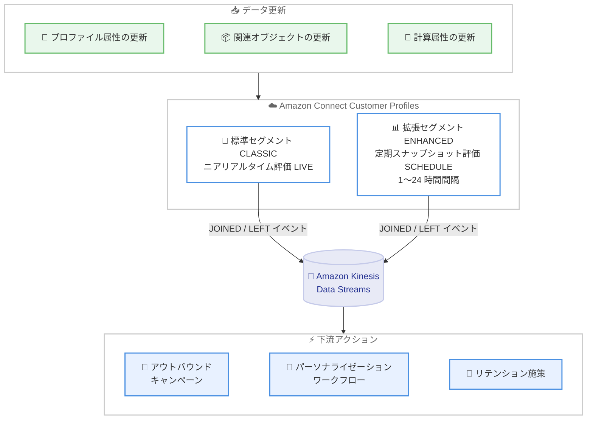

# Amazon Connect Customer Profiles - セグメントメンバーシップイベント

**リリース日**: 2026 年 9 月 9 日
**サービス**: Amazon Connect Customer Profiles
**機能**: セグメントメンバーシップイベント (Segment Membership Events)

📊 [このアップデートのインフォグラフィックを見る](https://takech9203.github.io/aws-news-summary/20260909-connect-customer-profiles-segment-events.html)

## 概要

Amazon Connect Customer Profiles が、顧客プロファイルがセグメントに参加 (JOINED) または離脱 (LEFT) した際に、イベントを Amazon Kinesis Data Streams に自動配信する「セグメントメンバーシップイベント」機能を発表しました。「高価値顧客」や「満足度の低い顧客」といったセグメントのメンバーシップ変化を、ニアリアルタイムまたはスケジュールベースで検知し、下流のシステムに通知できます。

標準条件で構築されたセグメント (CLASSIC) では、プロファイル属性の更新に応じてニアリアルタイム (LIVE) で変化が検知されます。Spark SQL を使用する拡張セグメント (ENHANCED) では、設定可能な間隔 (1〜24 時間) の定期スナップショットでメンバーシップが評価され、変化が通知されます (SCHEDULE)。各イベントにはプロファイル ID、セグメント名、操作タイプ、検知方法が含まれるため、アウトバウンドキャンペーン、パーソナライゼーションワークフロー、リテンション施策を数時間ではなく数秒で起動できます。

コンタクトセンターを運用し、顧客データを活用したプロアクティブな顧客対応やマーケティング連携を行いたい組織にとって、有用なアップデートです。

**アップデート前の課題**

- セグメントへの参加・離脱を検知するには、セグメント全体を定期的にエクスポートし、カスタムスクリプトで差分を特定する必要があった
- 手動の差分検出プロセスはリソースを消費し、エラーの原因となっていた
- 顧客がセグメントの条件を満たしてから下流システムが対応するまでに、数時間の遅延が発生していた

**アップデート後の改善**

- Customer Profiles がメンバーシップ変化を自動評価し、Kinesis Data Streams に直接ストリーミングするため、エクスポートや差分スクリプトが不要になった
- 標準条件のセグメントでは、プロファイル属性の更新に応じてニアリアルタイムで変化を検知できるようになった
- イベントに含まれる情報 (プロファイル ID、セグメント名、操作タイプ、検知方法) だけで、数秒以内に下流アクションを起動できるようになった

## アーキテクチャ図



プロファイルの更新をトリガーに Customer Profiles がセグメントメンバーシップを評価し、参加・離脱イベントを Kinesis Data Streams へ配信、下流システムが数秒以内にアクションを起動できる構成です。

## サービスアップデートの詳細

### 主要機能

1. **ニアリアルタイムのメンバーシップ変化検知 (LIVE イベント)**
   - プロファイル属性、関連オブジェクト、計算属性の変更が発生すると、影響を受けたプロファイルのメンバーシップを即時に評価
   - 標準条件で構築されたセグメント (CLASSIC タイプ) が対象
   - 変化があった場合のみ、スケジュール実行とは独立してニアリアルタイムに通知を送信

2. **スケジュールベースの評価 (SCHEDULE イベント)**
   - Spark SQL で定義された拡張セグメント (ENHANCED タイプ) や、時間ベースの条件を含むセグメントに対応
   - 定期実行のたびに新しいスナップショットを取得し、前回のスナップショットと比較して変化を検出
   - 実行間隔は 1 時間〜24 時間で設定可能 (API 経由のサブスクリプションはデフォルト 24 時間、Amazon Connect 管理者 Web サイトからはデフォルト 1 時間)
   - スケジュール実行はベストエフォートであり、前回の実行が完了していない場合などには遅延・スキップされる可能性がある

3. **Kinesis Data Streams への自動配信**
   - ドメイン設定 (データエクスポートタブ) でストリーミングを有効化し、配信先の Kinesis データストリームと IAM ロールを指定
   - 同一ドメイン内のすべてのサブスクライブ済みセグメントで同じ Kinesis データストリームを共有
   - サブスクリプション作成時に初期スナップショットを取得し、既存プロファイルの現在のメンバーシップ状態を保存 (この間サブスクリプションは STARTING 状態)

4. **CloudWatch メトリクスによるモニタリング**
   - `ProfilesJoined`: セグメントに参加したプロファイル数
   - `ProfilesLeft`: セグメントから離脱したプロファイル数
   - `NotificationsFailed`: 送信に失敗した通知イベント数
   - `ScheduledRunsSucceeded`: 成功したスケジュール実行数

## 技術仕様

### イベントペイロード

Kinesis データストリームに配信されるイベントの例は以下のとおりです。

```json
{
    "AccountId": "123456789012",
    "DomainName": "cp-domain-prod",
    "SegmentDefinitionName": "PeopleInSeattle",
    "SegmentType": "CLASSIC",
    "ProfileId": "0d25b61368c64fb786347d7e7314c6f1",
    "OperationType": "JOINED",
    "MembershipCalculatedAt": 1773967675,
    "PreviousMembershipChangedAt": 1773965432,
    "EventType": "LIVE"
}
```

| フィールド | 説明 |
|------|------|
| `AccountId` | イベントを受信する AWS アカウント ID |
| `DomainName` | セグメントが定義されている Customer Profiles ドメイン名 |
| `SegmentDefinitionName` | メンバーシップが変化したセグメント名 |
| `SegmentType` | `CLASSIC` (オーディエンスグループとフィルターで構築) または `ENHANCED` (SQL で定義) |
| `ProfileId` | メンバーシップが変化したプロファイルの一意な識別子 |
| `OperationType` | `JOINED` (参加) または `LEFT` (離脱) |
| `MembershipCalculatedAt` | メンバーシップが評価された時刻 |
| `PreviousMembershipChangedAt` | 前回のメンバーシップ変化が特定された時刻 |
| `EventType` | `LIVE` (ニアリアルタイム評価) または `SCHEDULE` (スケジュール実行時の評価) |

### IAM ロールの設定

Customer Profiles が Kinesis データストリームに書き込むために引き受ける IAM ロールには、以下の信頼ポリシーと権限が必要です。

**信頼ポリシー:**

```json
{
    "Version": "2012-10-17",
    "Statement": [
        {
            "Effect": "Allow",
            "Principal": {
                "Service": "profile.amazonaws.com"
            },
            "Action": "sts:AssumeRole"
        }
    ]
}
```

**Kinesis への書き込み権限:**

```json
{
    "Version": "2012-10-17",
    "Statement": [
        {
            "Effect": "Allow",
            "Action": [
                "kinesis:PutRecord",
                "kinesis:PutRecords",
                "kinesis:DescribeStreamSummary"
            ],
            "Resource": "arn:aws:kinesis:us-west-2:123456789012:stream/my-segment-events-stream"
        }
    ]
}
```

また、ストリーミングを有効化する IAM プリンシパルには、このロールを Customer Profiles サービス (`profile.amazonaws.com`) に渡すための `iam:PassRole` 権限が必要です。Kinesis データストリームがカスタマーマネージド AWS KMS キーで暗号化されている場合は、ロールに `kms:GenerateDataKey` および `kms:Decrypt` 権限も付与します。

## 設定方法

### 前提条件

1. Amazon Connect Customer Profiles ドメインが作成済みであること
2. 配信先の Amazon Kinesis データストリームが作成済みであること (設定中に新規作成も可能)
3. Customer Profiles が Kinesis に書き込むための IAM ロールが用意されていること
4. セグメンテーションビルダーを利用するための適切なセキュリティプロファイル権限が設定されていること

### 手順

#### ステップ 1: セグメントメンバーシップストリーミングの有効化

1. Amazon Connect Customer Profiles コンソールを開く
2. [Data export] タブを選択し、[Enable event streaming] を選択
3. [Segment membership changes] で [Enable data streaming] を選択し、既存の Kinesis データストリームをドロップダウンから選択するか、新規作成する
4. [Role name] で Customer Profiles に Kinesis への書き込みを許可する IAM ロールを指定する
5. [Enable data streaming] を選択して設定を保存する

この設定はドメインごとに管理者が 1 回だけ行うものです。ストリーミングを有効化しただけではイベントは送信されず、個々のセグメントのサブスクライブが別途必要です。

#### ステップ 2: セグメントのメンバーシップ変化トラッキングを有効化

1. セグメントの作成後、Amazon Connect 管理者 Web サイトで対象セグメントを開く
2. [Track membership changes] を選択してサブスクリプションを有効化する

有効化すると初期スナップショットが取得され、完了後にメンバーシップ変化の検知と通知が開始されます。ストリームが未設定の場合は、先にストリーミングの有効化を促すメッセージが表示されます。

#### ステップ 3: イベントの確認とモニタリング

1. 初期スナップショット完了後、同じセクションでストリーミングイベントを確認できるほか、個々のプロファイルでメンバーシップイベントの詳細を確認できる
2. CloudWatch メトリクス (`ProfilesJoined`、`ProfilesLeft`、`NotificationsFailed`、`ScheduledRunsSucceeded`) でドメインおよびセグメント単位のイベント状況をモニタリングする
3. 通知が不要になった場合は [Stop tracking changes] を選択してトラッキングを停止する

## メリット

### ビジネス面

- **対応スピードの向上**: 顧客がセグメント条件を満たしてから数秒以内にキャンペーンやリテンション施策を起動でき、機会損失を削減できる
- **運用コストの削減**: セグメント全体のエクスポートと差分検出スクリプトの開発・運用が不要になり、リソースを本来の業務に集中できる
- **顧客体験の向上**: 満足度の低下した顧客をリアルタイムに検知し、プロアクティブなフォローアップにつなげられる

### 技術面

- **イベント駆動アーキテクチャとの統合**: Kinesis Data Streams への配信により、AWS Lambda や Amazon Data Firehose などと組み合わせた柔軟なイベント処理パイプラインを構築できる
- **豊富なイベント情報**: プロファイル ID、セグメント名、操作タイプ、評価方法がイベントに含まれ、追加のルックアップなしで下流処理を実装できる
- **モニタリングの標準化**: CloudWatch メトリクスが標準で提供され、通知の失敗やスケジュール実行の成否を可視化できる

## デメリット・制約事項

### 制限事項

- セグメントサブスクリプションはドメインあたり最大 10 個まで
- サブスクリプションはセグメント作成後にのみ作成可能
- スケジュール実行の間隔は最小 1 時間、最大 24 時間
- 拡張セグメント (Spark SQL ベース) はニアリアルタイム検知に対応せず、スケジュールベースの評価のみ

### 考慮すべき点

- スケジュール実行はベストエフォートであり、間隔は目標値のため、前回の実行が完了していない場合などに遅延・スキップされる可能性がある
- メンバーシップ変化の発生からストリーミングイベント一覧への表示までに遅延が生じる場合がある
- 同一ドメイン内のすべてのサブスクライブ済みセグメントが 1 つの Kinesis データストリームを共有するため、ストリームのシャード数やスループットの設計に注意が必要
- Kinesis Data Streams の利用料金が別途発生する

## ユースケース

### ユースケース 1: 高価値顧客への優先対応

**シナリオ**: 累計購入金額が閾値を超えた顧客を「高価値顧客」セグメントとして定義し、参加を検知したら即座に専任チームによるフォローアップやアウトバウンドコールを開始したい。

**実装例**:

```text
1. 標準条件で「高価値顧客」セグメントを作成 (CLASSIC)
2. セグメントの Track membership changes を有効化
3. Kinesis データストリームを AWS Lambda で処理し、
   OperationType が JOINED のイベントを検知
4. Amazon Connect のアウトバウンドキャンペーンや
   タスク作成 API を呼び出して専任チームに割り当て
```

**効果**: 顧客が条件を満たしてから数秒でフォローアップを開始でき、顧客ロイヤルティの向上と売上機会の最大化につながる。

### ユースケース 2: 低満足度顧客のリテンション施策

**シナリオ**: 直近のアンケートスコアや問い合わせ履歴から「満足度の低い顧客」セグメントを定義し、参加した顧客に対して解約防止のリテンションワークフローを自動起動したい。

**実装例**:

```text
1. 計算属性 (例: 平均満足度スコア) を条件にセグメントを作成
2. セグメントメンバーシップイベントを Kinesis 経由で受信
3. JOINED イベントをトリガーに、パーソナライズした
   クーポン送付やスーパーバイザーへのエスカレーションを実行
4. LEFT イベントで施策の効果を測定し、ワークフローを終了
```

**効果**: 解約リスクの検知から対応までのリードタイムを数時間から数秒に短縮し、解約率の低減に寄与する。JOINED と LEFT の両イベントを活用することで施策の効果測定も自動化できる。

### ユースケース 3: 外部マーケティングシステムとのリアルタイム連携

**シナリオ**: Spark SQL で定義した複雑な条件の拡張セグメント (例: 過去 30 日間の購買行動に基づくクロスセル対象顧客) を、外部のマーケティングオートメーションツールと定期同期したい。

**実装例**:

```text
1. Spark SQL で拡張セグメント (ENHANCED) を作成
2. スケジュール間隔を 1 時間に設定してサブスクライブ
3. Kinesis Data Streams から Amazon Data Firehose 経由で
   イベントを集約し、外部システムの API に連携
4. JOINED / LEFT の差分のみを送信し、全件同期を廃止
```

**効果**: 従来の全件エクスポートと差分検出スクリプトが不要になり、差分イベントのみの効率的な連携により、データ転送量と処理コストを削減できる。

## 料金

セグメントメンバーシップイベント機能自体の追加料金に関する個別の記載はありませんが、Amazon Connect Customer Profiles の利用料金と、イベント配信先である Amazon Kinesis Data Streams の利用料金 (シャード時間、PUT ペイロードユニットなど) が発生します。詳細は各サービスの料金ページを確認してください。

- [Amazon Connect Customer Profiles 料金](https://aws.amazon.com/connect/pricing/)
- [Amazon Kinesis Data Streams 料金](https://aws.amazon.com/kinesis/data-streams/pricing/)

## 利用可能リージョン

Amazon Connect Customer Profiles が利用可能なすべての AWS リージョンで利用できます。日本では東京リージョン (ap-northeast-1) を含みます。

## 関連サービス・機能

- **Amazon Kinesis Data Streams**: セグメントメンバーシップイベントの配信先。下流のイベント処理パイプラインの起点となる
- **AWS Lambda**: Kinesis データストリームをトリガーに、イベントに応じたキャンペーン起動やワークフロー実行を実装できる
- **Amazon Connect Outbound Campaigns**: JOINED イベントを契機としたアウトバウンドコールや SMS 送信などのプロアクティブなアウトリーチに活用できる
- **Amazon CloudWatch**: `ProfilesJoined` などのメトリクスによるイベント配信状況のモニタリングとアラーム設定に使用する
- **AWS KMS**: Kinesis データストリームの暗号化に使用。カスタマーマネージドキー利用時は IAM ロールへの権限付与が必要

## 参考リンク

- 📊 [インフォグラフィック](https://takech9203.github.io/aws-news-summary/20260909-connect-customer-profiles-segment-events.html)
- [公式発表 (What's New)](https://aws.amazon.com/about-aws/whats-new/2026/09/connect-customer-profiles-segment-events/)
- [ドキュメント: Track segment membership changes (管理者ガイド)](https://docs.aws.amazon.com/connect/latest/adminguide/customer-segments-membership-events.html)
- [Amazon Connect Customer Profiles 製品ページ](https://aws.amazon.com/connect/customer-profiles/)
- [料金ページ](https://aws.amazon.com/connect/pricing/)

## まとめ

Amazon Connect Customer Profiles のセグメントメンバーシップイベントにより、これまで数時間の遅延と手動の差分検出を要していたセグメント変化の検知が、Kinesis Data Streams への自動配信によって数秒で実現できるようになりました。顧客のセグメント参加・離脱をトリガーとしたキャンペーンやリテンション施策の自動化を検討している場合は、まずドメインのデータエクスポート設定でストリーミングを有効化し、重要度の高いセグメントからサブスクリプションを試すことを推奨します。
