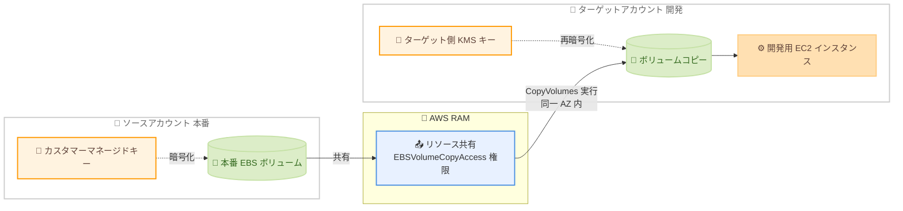

# Amazon EBS - Volume Clones のクロスアカウントコピー対応

**リリース日**: 2026 年 9 月 9 日
**サービス**: Amazon Elastic Block Store (Amazon EBS)
**機能**: Amazon EBS Volume Clones のクロスアカウントコピー (再暗号化対応)

📊 [このアップデートのインフォグラフィックを見る](https://takech9203.github.io/aws-news-summary/20260909-ebs-volume-clones-cross-account-copy.html)

## 概要

Amazon EBS Volume Clones が、AWS アカウントをまたいだ EBS ボリュームのコピーに対応しました。コピー時にターゲットアカウントの AWS Key Management Service (AWS KMS) キーで再暗号化できるため、本番環境と開発環境をアカウント単位で分離している組織が、アカウント境界を越えて安全にデータをコピーできます。

このアップデートにより、本番データベースのボリュームを分離された開発アカウントにクローンし、開発者が本番データの新しいコピーを安全に使って検証やテストを行えるようになります。また、本番アカウントと非本番アカウントで別々の KMS キーを維持するといった、環境ごとの暗号化キー分離の要件にも対応します。クロスアカウントコピーは、非暗号化ボリュームおよびカスタマーマネージドキーで暗号化されたボリュームを含む、すべてのボリュームタイプでサポートされます。

利用の流れは 2 ステップです。まずソースアカウントが AWS Resource Access Manager (AWS RAM) を使用してボリュームをターゲットアカウントに共有し、次にターゲットアカウントが同じアベイラビリティーゾーン内で共有ボリュームのコピーを作成します。AWS Management Console、AWS CLI、AWS SDK から利用できます。

**アップデート前の課題**

- Volume Clones (CopyVolumes API) は同一アカウント内のコピーに限定されており、アカウント間でボリュームのデータを受け渡すには、スナップショットを作成して共有し、そこからボリュームを復元するという多段階の手順が必要だった
- 本番アカウントの最新データを開発アカウントに展開するまでに時間と運用負荷がかかっていた
- 環境ごとに KMS キーを分離する組織では、アカウント間のデータコピーとキーの付け替えを組み合わせたワークフローを独自に構築する必要があった

**アップデート後の改善**

- AWS RAM でボリュームを共有するだけで、ターゲットアカウントから直接 `CopyVolumes` によるボリュームコピーを作成できるようになった
- コピー時にターゲットアカウント側の KMS キーを指定して再暗号化できるため、本番と非本番でのキー分離を維持したままデータを受け渡せるようになった
- コピーしたボリュームは作成後すぐに `available` 状態となり、初期化中でもシングルミリ秒レイテンシーで即座にアクセスできる

## アーキテクチャ図



ソースアカウントが AWS RAM でボリュームを共有し、ターゲットアカウントが同一アベイラビリティーゾーン内にコピーを作成、ターゲット側の KMS キーで再暗号化する流れを示しています。

## サービスアップデートの詳細

### 主要機能

1. **AWS RAM によるボリューム共有**
   - EBS ボリュームを AWS RAM のリソース共有に追加し、個別のアカウント ID、組織単位 (OU)、または AWS Organizations の組織全体に共有できる
   - AWS マネージド権限として、メタデータの参照のみを許可する `AWSRAMDefaultPermissionEBSVolume` (デフォルト) と、参照に加えてコピー作成を許可する `AWSRAMPermissionEBSVolumeCopyAccess` の 2 種類が提供される
   - `ec2:Volume` リソースタイプに対するカスタマーマネージド権限の作成にも対応
   - 共有先アカウントができる操作はメタデータの参照とコピー作成のみで、共有ボリュームのアタッチ、変更、削除、スナップショット作成はできない

2. **再暗号化を伴うクロスアカウントコピー**
   - ターゲットアカウントは共有ボリュームに対して `CopyVolumes` API (CLI: `copy-volumes`) を実行し、同一アベイラビリティーゾーン内にコピーを作成する
   - クロスアカウントコピーでは、デフォルトでターゲットアカウントの Amazon EBS デフォルト暗号化キーが使用され、`KmsKeyId` パラメータで任意のカスタマーマネージドキーも指定可能
   - ソースアカウントの KMS キーが共有されていれば、そのキーでの暗号化も選択できる (デフォルトでソース側キーが再利用されることはない)
   - コピー時にボリュームタイプ、サイズ、IOPS、スループットの変更も可能

3. **即時アクセスとバックグラウンド初期化**
   - ボリュームコピーはクラッシュコンシステントなポイントインタイムコピーで、作成後すぐに `available` 状態となり EC2 インスタンスにアタッチ可能
   - データブロックはバックグラウンドでコピーされ、初期化中もシングルミリ秒レイテンシーでアクセスできる
   - 初期化中は、3,000 IOPS / 125 MiB/s、ソースボリュームのプロビジョンド性能、コピーのプロビジョンド性能のうち最小値がベースライン性能となる
   - コピー操作はソースボリュームの性能に影響を与えない

4. **モニタリング**
   - 初期化の進捗は `describe-volume-status` コマンドまたは Amazon EventBridge で監視できる
   - クロスアカウントコピー完了時には、ボリューム所有者と共有先アカウントの両方に `sharedVolumeCopy` イベントが配信される
   - `CopyVolumes` API 呼び出しは、コピー実行アカウントとボリューム所有者アカウントの両方の AWS CloudTrail に記録される

## 技術仕様

### クロスアカウントコピーの暗号化の挙動

| ソースボリューム | KMS キー指定 | コピーの結果 |
|------|------|------|
| 非暗号化 (デフォルト暗号化無効) | なし | 非暗号化 |
| 非暗号化 (デフォルト暗号化無効) | あり | 指定したキーで暗号化 |
| 非暗号化 (デフォルト暗号化有効) | なし | アカウントのデフォルト EBS 暗号化キーで暗号化 |
| 暗号化済み (クロスアカウント) | なし | ターゲットアカウントのデフォルト EBS 暗号化キーで暗号化 |
| 暗号化済み (クロスアカウント) | あり | 指定したキーで暗号化 |

### 共有と暗号化キーの要件

| 項目 | 詳細 |
|------|------|
| 共有可能なボリューム | 非暗号化ボリューム、カスタマーマネージドキーで暗号化されたボリューム |
| 共有不可のボリューム | AWS マネージドキー (aws/ebs) で暗号化されたボリューム |
| ソース側の権限 | デフォルト EBS 暗号化キーに対する `kms:DescribeKey` (非暗号化ボリュームの共有時も必要) |
| ターゲット側の KMS 権限 | 暗号化済み共有ボリュームのコピーには `kms:CreateGrant`、`kms:GenerateDataKey`、`kms:GenerateDataKeyWithoutPlaintext`、`kms:ReEncrypt*`、`kms:Decrypt` が必要 |
| カスタマーマネージドキーの共有 | ソースボリュームがカスタマーマネージドキーで暗号化されている場合、キーポリシーでターゲットアカウントにキーを共有する必要がある |

### 初期化時間の目安

| 書き込み済みデータサイズ | 初期化時間の目安 |
|------|------|
| 最初の 1 TiB | 最大 6 時間 |
| 1 TiB 超 16 TiB まで | 1 TiB あたり 1.2 時間を加算 |
| 16 TiB 超 | 24 時間 |

## 設定方法

### 前提条件

1. ソースボリュームが非暗号化、またはカスタマーマネージドキーで暗号化されていること (AWS マネージドキー aws/ebs で暗号化されたボリュームは共有不可)
2. カスタマーマネージドキーで暗号化されている場合、キーポリシーでターゲットアカウントにキーを共有していること
3. ターゲットアカウントがソースボリュームと同じアベイラビリティーゾーン (AZ ID で確認) にコピーを作成できること

### 手順

#### ステップ 1: ソースアカウントでボリュームを共有する

```bash
aws ram create-resource-share \
  --name prod-volume-share \
  --resource-arns arn:aws:ec2:us-east-1:111111111111:volume/vol-1234567890abcdef0 \
  --principals 222222222222 \
  --permission-arns arn:aws:ram::aws:permission/AWSRAMPermissionEBSVolumeCopyAccess \
  --region us-east-1
```

AWS RAM のリソース共有を作成し、ボリュームをターゲットアカウント (222222222222) に共有します。コピー作成を許可するには `AWSRAMPermissionEBSVolumeCopyAccess` マネージド権限の指定が必要です。組織外のアカウントに共有した場合、ターゲットアカウントは招待を承諾する必要があります。

#### ステップ 2: ターゲットアカウントで共有ボリュームを確認する

```bash
aws ec2 describe-volumes \
  --filters Name=owner-id,Values=111111111111 \
  --region us-east-1
```

ターゲットアカウントで、ソースアカウント (111111111111) から共有されたボリュームを一覧表示します。コンソールでは [Volumes] 画面の [Shared with me] フィルターでも確認できます。

#### ステップ 3: ターゲットアカウントでボリュームをコピーする

```bash
aws ec2 copy-volumes \
  --source-volume-id vol-1234567890abcdef0 \
  --volume-type gp3 \
  --kms-key-id arn:aws:kms:us-east-1:222222222222:key/abcd1234-a123-456a-a12b-a123b4cd56ef \
  --region us-east-1
```

共有ボリュームを指定してコピーを作成し、ターゲットアカウント自身の KMS キーで再暗号化します。`--kms-key-id` を省略した場合は、ターゲットアカウントのデフォルト EBS 暗号化キーが使用されます。コピーは短時間で `available` 状態になり、同一 AZ 内の EC2 インスタンスにアタッチできます。

#### ステップ 4: 初期化の進捗を監視する

```bash
aws ec2 describe-volume-status \
  --volume-ids vol-0abcdef1234567890 \
  --region us-east-1
```

コピーしたボリュームの初期化ステータスを確認します。EventBridge の `EBS Volume Notification` イベント (イベント名 `sharedVolumeCopy`) を使用すると、コピー完了や失敗を自動検知できます。

## メリット

### ビジネス面

- **開発サイクルの高速化**: 本番データの新しいコピーを開発アカウントに数ステップで展開でき、テスト環境のデータリフレッシュが迅速になる
- **アカウント分離によるガバナンス維持**: 本番と開発をアカウント単位で分離するマルチアカウント戦略を崩さずに、必要なデータだけを安全に受け渡せる
- **コンプライアンス要件への対応**: 環境ごとの KMS キー分離要件を満たしながらデータコピーが可能で、CloudTrail による双方向の監査証跡も残る

### 技術面

- **スナップショット経由の手順が不要**: スナップショット作成、共有、復元という多段階のワークフローを、共有とコピーの 2 ステップに簡素化できる
- **即時アクセス**: コピーは初期化完了を待たずにアタッチでき、シングルミリ秒レイテンシーでアクセス可能
- **ソースへの影響なし**: コピー操作はソースボリュームの性能に影響せず、本番ワークロードを稼働させたままコピーできる
- **柔軟な構成変更**: コピー時にボリュームタイプ、サイズ、IOPS、スループットを変更できるため、開発環境向けにコストを最適化した構成にできる

## デメリット・制約事項

### 制限事項

- コピーはソースボリュームと同じアベイラビリティーゾーンに作成する必要がある (クロス AZ、クロスリージョンのコピーは不可)
- AWS マネージドキー (aws/ebs) で暗号化されたボリュームは共有・クロスアカウントコピーができない
- 共有ボリュームに対する進行中のコピー操作は、共有先アカウント全体で同時に 1 つまで
- 1 つのソースボリュームから同時に作成できるコピーは 1 つで、リージョンあたりの進行中コピーは最大 5 つ (クォータ引き上げ申請可能)
- Outposts 上のボリュームおよび Wavelength Zones のボリュームはコピーできない
- ソースボリュームのタグはコピーに引き継がれない
- 共有先アカウントは共有ボリュームのアタッチ、変更、削除、スナップショット作成ができない

### 考慮すべき点

- ボリュームコピーはクラッシュコンシステントであり、アプリケーションコンシステントなコピーが必要な場合は、コピー前に書き込みの一時停止や I/O のフリーズ (Linux の `fsfreeze`、Windows の VSS など) が必要
- アベイラビリティーゾーン名 (us-east-1a など) はアカウントごとに異なる物理ロケーションにマッピングされるため、アカウント間では AZ ID (use1-az1 など) で同一ロケーションを確認する必要がある
- 初期化中のベースライン性能は最小で 3,000 IOPS / 125 MiB/s となるため、初期化中に高い性能が必要な場合はソースとコピー両方のプロビジョンド性能を考慮する
- リソース共有からボリュームを削除しても、進行中のコピー操作はキャンセルされない
- 本番データを開発アカウントにコピーする際は、個人情報のマスキングなどデータ取り扱いポリシーへの準拠を別途検討する必要がある

## ユースケース

### ユースケース 1: 本番データベースの開発環境への展開

**シナリオ**: 本番アカウントで稼働する PostgreSQL データベースの EBS ボリュームを、分離された開発アカウントにコピーし、開発者が最新の本番相当データでテストを行う。

**実装例**:
```bash
# ソースアカウント: DB ボリュームを開発アカウントに共有
aws ram create-resource-share \
  --name db-volume-share \
  --resource-arns arn:aws:ec2:ap-northeast-1:111111111111:volume/vol-0db0123456789abcd \
  --principals 222222222222 \
  --permission-arns arn:aws:ram::aws:permission/AWSRAMPermissionEBSVolumeCopyAccess

# ターゲットアカウント: 開発用 KMS キーで再暗号化してコピー
aws ec2 copy-volumes \
  --source-volume-id vol-0db0123456789abcd \
  --kms-key-id alias/dev-ebs-key
```

**効果**: スナップショットの作成・共有・復元を経由せずに、本番データの新しいコピーを開発アカウントに展開できる。コピーは即座にアタッチ可能なため、テスト開始までの待ち時間を短縮できる。

### ユースケース 2: 環境ごとの暗号化キー分離の徹底

**シナリオ**: セキュリティポリシーで本番用と非本番用の KMS キーの分離が義務付けられており、データを非本番環境へ持ち出す際は必ず非本番キーで再暗号化する必要がある。

**実装例**:
```bash
# ターゲットアカウントで非本番用カスタマーマネージドキーを指定してコピー
aws ec2 copy-volumes \
  --source-volume-id vol-0prod123456789abc \
  --kms-key-id arn:aws:kms:ap-northeast-1:222222222222:key/nonprod-key-id
```

**効果**: クロスアカウントコピーではソースアカウントのキーがデフォルトで再利用されないため、キー分離ポリシーを自然に強制できる。本番キーへのアクセス権を非本番アカウントに広く付与する必要がなくなる。

### ユースケース 3: コピー完了を起点とした環境構築の自動化

**シナリオ**: 毎週の開発環境リフレッシュで、ボリュームコピーの完了を検知して自動的に EC2 インスタンスへのアタッチとアプリケーション起動を行う。

**実装例**:
```json
{
  "source": ["aws.ec2"],
  "detail-type": ["EBS Volume Notification"],
  "detail": {
    "event": ["sharedVolumeCopy"],
    "result": ["completed"]
  }
}
```

**効果**: EventBridge ルールで `sharedVolumeCopy` イベントを捕捉し、Lambda 関数などで後続処理を自動化できる。イベントはボリューム所有者と共有先の両アカウントに配信されるため、双方で完了を追跡できる。

## 料金

ボリュームコピーの作成時には、コピー作成時点でソースボリュームに書き込まれていたデータブロックのサイズに基づくコピー操作料金が発生します。作成されたボリューム自体は、通常の Amazon EBS ボリュームと同様の料金体系で課金されます。AWS RAM によるボリューム共有自体に追加料金はかかりません。クロスアカウントコピーの場合、コピー操作料金と新しいボリュームの料金は、コピーを作成したターゲットアカウントに課金されます。

詳細は [Amazon EBS 料金ページ](https://aws.amazon.com/ebs/pricing/) を参照してください。

## 利用可能リージョン

Amazon EBS Volume Clones をサポートするすべての AWS リージョンで利用可能です。すべての商用リージョン、AWS GovCloud (US) リージョン、AWS 中国リージョン、およびサポートされている Local Zones が含まれます。

## 関連サービス・機能

- **AWS Resource Access Manager (AWS RAM)**: ボリュームをアカウント間で共有するための基盤。マネージド権限 `AWSRAMPermissionEBSVolumeCopyAccess` でコピー作成を許可する
- **AWS Key Management Service (AWS KMS)**: コピー時の再暗号化に使用。クロスアカウントでのキー共有やターゲット側キーの指定に関わる
- **Amazon EBS スナップショット**: 従来のクロスアカウントデータ共有手段。クロスリージョンコピーや長期保管が必要な場合は引き続きスナップショットが適する
- **Amazon EventBridge / AWS CloudTrail**: コピー完了イベントの通知と API 呼び出しの監査に使用

## 参考リンク

- 📊 [インフォグラフィック](https://takech9203.github.io/aws-news-summary/20260909-ebs-volume-clones-cross-account-copy.html)
- [公式発表 (What's New)](https://aws.amazon.com/about-aws/whats-new/2026/09/ebs-volume-clones-cross-account-copy/)
- [ドキュメント: Copy an Amazon EBS volume](https://docs.aws.amazon.com/ebs/latest/userguide/ebs-copying-volume.html)
- [ドキュメント: Share a volume](https://docs.aws.amazon.com/ebs/latest/userguide/share-volume.html)
- [料金ページ](https://aws.amazon.com/ebs/pricing/)

## まとめ

Amazon EBS Volume Clones のクロスアカウントコピー対応により、スナップショットを経由せずに本番アカウントから開発アカウントへボリュームを直接コピーし、ターゲット側の KMS キーで再暗号化できるようになりました。マルチアカウント戦略でのテストデータ展開やキー分離要件を持つ組織にとって、運用を大きく簡素化するアップデートです。まずは AWS RAM でのボリューム共有と `copy-volumes` コマンドを開発環境で試し、同一 AZ 制約や AZ ID のマッピングを確認した上でワークフローへの組み込みを検討することを推奨します。
