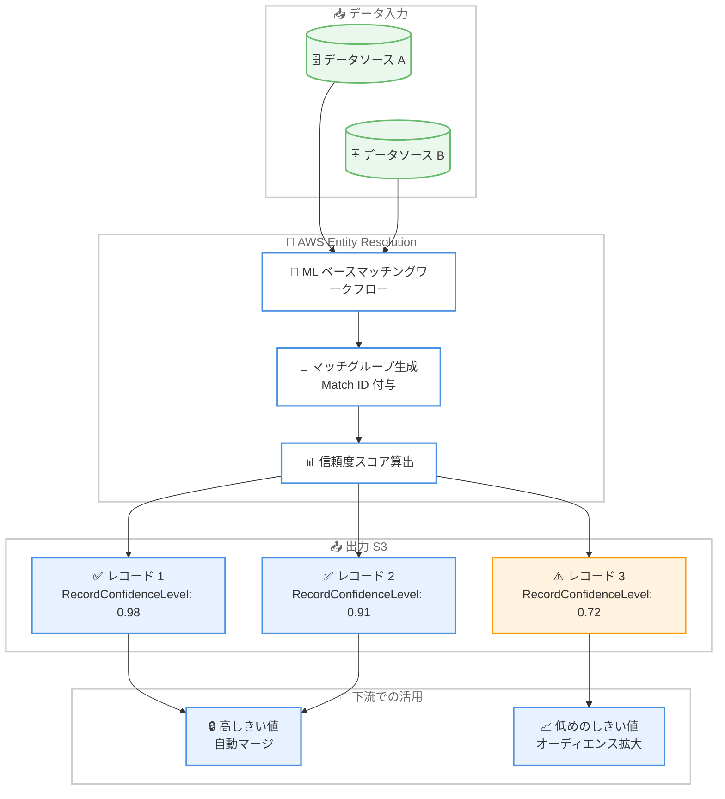

# AWS Entity Resolution - ML マッチングのレコードレベル信頼度スコア

**リリース日**: 2026 年 9 月 9 日
**サービス**: AWS Entity Resolution
**機能**: Record-level confidence scores for ML matching (ML マッチングにおけるレコードレベル信頼度スコア)

📊 [このアップデートのインフォグラフィックを見る](https://takech9203.github.io/aws-news-summary/20260909-entity-resolution-record-confidence.html)

## 概要

AWS Entity Resolution が、機械学習 (ML) ベースのマッチングワークフローにおいて、レコードレベルの信頼度スコアを提供するようになりました。これにより、個々の ID マッチ (同一エンティティ判定) に対して、モデルがどの程度確信を持っているかをレコード単位で把握できます。

AWS Entity Resolution は、複数のデータソースにまたがる顧客レコードなどを照合し、同一のエンティティ (人物や組織など) を特定・名寄せするサービスです。ML ベースマッチングでは、不完全なデータや表記ゆれのあるデータ間でも幅広いマッチを検出でき、マッチしたレコードセットごとに Match ID と信頼度が付与されます。今回のアップデートにより、マッチグループ単位ではなくレコード単位での品質評価が可能になり、マーケティングのオーディエンス拡大やコンプライアンス対応の監査証跡など、下流での活用の幅が広がります。

主な対象ユーザーは、顧客データ基盤 (CDP) の構築、広告オーディエンスの名寄せ、リード管理などで ML ベースの ID 解決を利用しているエンタープライズや開発者です。

**アップデート前の課題**

- 以前は、マッチグループ内のすべてのレコードに同一のグループレベル信頼度スコアが適用され、実際のマッチ品質に関係なく一律の値となっていた
- ほぼ確実なマッチと境界線上のマッチ (ボーダーラインのマッチ) を区別できなかった
- すべてのレコードに単一の信頼度しきい値を適用するしかなく、下流で活用 (アクティベーション) できる解決済み ID の数が制限されていた

**アップデート後の改善**

- 解決された各レコードが、実際のマッチ品質を反映した固有の信頼度スコアを持つようになった
- しきい値を用途別に使い分けられるようになった。高い信頼度は自動マージに、低めのしきい値は品質基準を満たす追加レコードの取り込みに利用できる
- アクティベーション可能なオーディエンスの拡大とリードコンバージョンの向上が期待でき、同時に各解決済みレコードに対する監査可能な証跡により、コンプライアンス水準のマッチ透明性を維持できる
- インクリメンタル ML ワークフローでは、既存の `RecordConfidenceLevel` 列がレコードごとの実際のスコアを反映するようになり、スキーマ変更は不要

## アーキテクチャ図



ML ベースマッチングワークフローが各レコードに固有の信頼度スコアを付与し、下流ではしきい値を使い分けることで、自動マージとオーディエンス拡大の両立が可能になる流れを示しています。

## サービスアップデートの詳細

### 主要機能

1. **レコードレベル信頼度スコア**
   - ML ベースマッチングで解決された各レコードに、そのレコード固有のマッチ品質を反映した信頼度スコアが付与される
   - 従来のグループレベル信頼度 (`ConfidenceLevel`) に加えて、レコード単位の粒度で品質を判断できる
   - ほぼ確実なマッチと境界線上のマッチをレコード単位で区別可能

2. **差別化されたしきい値の適用**
   - 用途に応じて複数の信頼度しきい値を使い分けられる
   - 高い信頼度のレコードのみを自動マージに使用し、低めのしきい値で品質基準を満たす追加レコードをオーディエンスに含めるといった運用が可能
   - 結果として、アクティベーション可能なレコード数を増やしつつ品質を管理できる

3. **監査対応のマッチ透明性**
   - 各解決済みレコードに対して監査可能な証跡 (レコードごとのスコア) が残る
   - コンプライアンス水準のマッチ透明性を維持しながらオーディエンスを拡大できる

4. **スキーマ変更不要の移行**
   - インクリメンタル ML ワークフローでは、既存の `RecordConfidenceLevel` 列がレコードごとの実際のスコアを反映するようになる
   - 出力スキーマの変更が不要なため、既存の下流パイプラインをそのまま利用できる

## 技術仕様

### 信頼度スコアの比較

| 項目 | ConfidenceLevel | RecordConfidenceLevel |
|------|----------------|----------------------|
| 粒度 | マッチグループ単位 | レコード単位 |
| 対象 | ML ベースマッチング | ML ベースのインクリメンタルマッチング |
| 意味 | ML がマッチしたレコードセットを特定した際にグループへ適用される信頼度 | ML がマッチしたレコードセットを特定した際に各レコードへ適用される信頼度 |
| 出力 | マッチングワークフローメタデータとして出力に含まれる | マッチングワークフローメタデータとして出力に含まれる |
| 今回の変更 | 変更なし | グループ一律の値から、レコードごとの実際のマッチ品質を反映した値に |

### ML ベースマッチングワークフローの関連仕様

| 項目 | 詳細 |
|------|------|
| マッチング方式 | ML モデルによるクリアテキストデータの比較 (ハッシュ化データは非対応) |
| データ入力 | AWS Glue テーブル (最大 20 個) とスキーママッピング |
| 正規化対象 | Name、Phone、Email (ML ベースマッチングの場合) |
| 処理形態 | Manual (バッチ、全件処理) / Automatic (インクリメンタル、増分処理) |
| 出力先 | Amazon S3 (正規化データまたはオリジナルデータ) |
| 出力メタデータ | MatchID、ConfidenceLevel、RecordConfidenceLevel、InputSourceARN など |

## 設定方法

### 前提条件

1. 入力データが AWS Glue テーブルとして定義されていること
2. スキーママッピングが作成済みであること
3. AWS Entity Resolution が S3 や Glue にアクセスするためのサービスアクセスロールが設定されていること

### 手順

#### ステップ 1: ML ベースマッチングワークフローの作成

```bash
aws entityresolution create-matching-workflow \
  --workflow-name "ml-matching-with-record-confidence" \
  --input-source-config '[{
    "inputSourceARN": "arn:aws:glue:ap-northeast-1:123456789012:table/customer_db/customers",
    "schemaName": "customer-schema",
    "applyNormalization": true
  }]' \
  --resolution-techniques '{"resolutionType": "ML_MATCHING"}' \
  --output-source-config '[{
    "outputS3Path": "s3://my-bucket/entity-resolution-output/",
    "output": [{"name": "email"}, {"name": "name"}, {"name": "phone"}]
  }]' \
  --role-arn "arn:aws:iam::123456789012:role/EntityResolutionServiceRole"
```

ML ベースマッチング (`ML_MATCHING`) を解決手法として指定したマッチングワークフローを作成しています。入力として Glue テーブルとスキーママッピングを指定し、出力先の S3 パスと出力フィールドを定義しています。コンソールの場合は「Step 2: Choose matching technique」で「Machine learning-based matching」を選択します。

#### ステップ 2: ワークフローの実行

```bash
aws entityresolution start-matching-job \
  --workflow-name "ml-matching-with-record-confidence"
```

作成したマッチングワークフローのジョブを開始しています。処理が完了すると、指定した S3 パスにマッチ結果 (MatchID、信頼度スコアを含む) が出力されます。

#### ステップ 3: 出力の確認としきい値の適用

出力データの `RecordConfidenceLevel` 列を確認し、下流の処理でしきい値を適用します。例えば Amazon Athena で以下のように高信頼度のレコードと追加候補のレコードを分類できます。

```sql
SELECT
  MatchID,
  RecordConfidenceLevel,
  CASE
    WHEN RecordConfidenceLevel >= 0.95 THEN 'auto_merge'
    WHEN RecordConfidenceLevel >= 0.80 THEN 'audience_expansion'
    ELSE 'review'
  END AS activation_tier
FROM entity_resolution_output;
```

レコードごとの信頼度スコアに応じて、自動マージ、オーディエンス拡大、レビュー対象の 3 段階に分類しています。しきい値は自社の品質基準に合わせて調整します。

## メリット

### ビジネス面

- **アクティベーション可能なオーディエンスの拡大**: 一律のしきい値では除外されていた「品質基準は満たすが信頼度がやや低い」レコードを取り込めるようになり、リーチ可能なオーディエンスが拡大する
- **リードコンバージョンの向上**: より多くの解決済み ID を下流のマーケティング施策に活用でき、コンバージョン機会が増加する
- **コンプライアンス対応の強化**: 各解決済みレコードに監査可能な証跡が残るため、規制の厳しい業界でもマッチ品質を説明できる

### 技術面

- **レコード単位の品質可視化**: マッチグループ内でも品質のばらつきを検出でき、境界線上のマッチを特定して個別に扱える
- **既存パイプラインへの影響なし**: インクリメンタル ML ワークフローでは既存の `RecordConfidenceLevel` 列がそのまま利用され、スキーマ変更が不要
- **柔軟なしきい値設計**: 自動マージ用の高しきい値と拡大用の低しきい値など、ユースケースごとに複数のしきい値を設計できる

## デメリット・制約事項

### 制限事項

- レコードレベル信頼度スコア (`RecordConfidenceLevel`) は ML ベースマッチングが対象であり、ルールベースマッチングには信頼度スコアの概念がない (ルール番号が出力される)
- ML ベースマッチングはクリアテキストデータのみ対応しており、ハッシュ化されたデータの比較はサポートされない
- ドキュメント上、レコードレベル信頼度は ML ベースのインクリメンタルマッチングに関するメタデータとして定義されている

### 考慮すべき点

- しきい値の設計は自社のデータ品質とユースケースに依存するため、実データでスコア分布を確認してから決定する必要がある
- 低めのしきい値でオーディエンスを拡大する場合、誤マッチ (偽陽性) の混入リスクとのトレードオフを評価する必要がある
- 既存ワークフローで一律のグループレベルスコアを前提としたロジックがある場合、レコードごとにスコアが異なるようになった影響を確認する必要がある

## ユースケース

### ユースケース 1: マーケティングオーディエンスの拡大

**シナリオ**: 広告主が複数のデータソース (EC サイト、店舗 POS、メール配信システム) の顧客レコードを名寄せし、広告配信用のオーディエンスを構築している。従来は一律の高しきい値により、活用できる ID が限られていた。

**実装例**:
```sql
-- 高信頼度は自動マージ、中信頼度もオーディエンスに含める
SELECT MatchID, email
FROM entity_resolution_output
WHERE RecordConfidenceLevel >= 0.80;
```

**効果**: 品質基準を満たす中信頼度のレコードもオーディエンスに含めることで、アドレサブルなオーディエンスが拡大し、キャンペーンのリーチとコンバージョンが向上する。

### ユースケース 2: CDP における自動マージとレビューの振り分け

**シナリオ**: 顧客データ基盤 (CDP) で顧客プロファイルの統合を自動化したいが、誤マージによる顧客体験の毀損は避けたい。

**実装例**:
```
- RecordConfidenceLevel >= 0.95: プロファイルを自動マージ
- 0.80 <= RecordConfidenceLevel < 0.95: マージ候補としてデータスチュワードのレビューキューへ
- RecordConfidenceLevel < 0.80: マージせず個別プロファイルとして維持
```

**効果**: 高信頼度のレコードのみを自動マージすることで誤マージのリスクを抑えつつ、境界線上のレコードは人手のレビューで救済でき、統合率と品質を両立できる。

### ユースケース 3: 規制業界における監査対応の ID 解決

**シナリオ**: 金融機関が KYC やマーケティング同意管理のために顧客レコードを名寄せしており、監査時に「なぜこの 2 レコードを同一顧客と判定したか」の説明が求められる。

**実装例**:
```
- 出力の MatchID、ConfidenceLevel、RecordConfidenceLevel を監査ログとして保全
- レコードごとのスコアを判定根拠として監査レポートに添付
- しきい値ポリシー (自動マージ 0.95 以上など) を社内規程として文書化
```

**効果**: 解決済みレコードごとに監査可能な証跡が残るため、コンプライアンス水準のマッチ透明性を維持しながら ID 解決を運用できる。

## 料金

レコードレベル信頼度スコア自体に追加料金はなく、AWS Entity Resolution の既存の料金体系が適用されます。

ML ベースマッチング (およびルールベースマッチング) は、処理されたレコード 1,000 件あたり 0.25 USD が課金されます。マッチの成否にかかわらず、処理されたすべてのレコードが課金対象です。料金は全リージョンで共通で、AWS 無料利用枠の対象外です。

### 料金例

| 使用量 | 月額料金 (概算) |
|--------|------------------|
| 10 万レコードを ML マッチングで処理 | 25 USD |
| 30 万レコードを ML マッチングで処理 | 75 USD |
| 100 万レコードを ML マッチングで処理 | 250 USD |

## 利用可能リージョン

AWS Entity Resolution が利用可能なすべての AWS リージョンで利用できます。対象リージョンの一覧は [AWS Entity Resolution FAQ](https://aws.amazon.com/entity-resolution/faqs/) を参照してください。

## 関連サービス・機能

- **AWS Glue**: 入力データは AWS Glue テーブルとして定義し、スキーママッピングで Entity Resolution に読み込ませる
- **Amazon S3**: マッチングワークフローの出力先。MatchID や信頼度スコアを含む結果が出力される
- **Amazon Athena**: S3 に出力された結果に対して、信頼度スコアによるしきい値分類などの SQL 分析を実行できる
- **AWS Clean Rooms**: ID マッピングテーブルを用いたコラボレーション分析で Entity Resolution と連携する
- **Amazon Connect Customer Profiles**: マッチングワークフローの出力先として指定でき、顧客プロファイルの統合に活用できる

## 参考リンク

- 📊 [インフォグラフィック](https://takech9203.github.io/aws-news-summary/20260909-entity-resolution-record-confidence.html)
- [公式発表 (What's New)](https://aws.amazon.com/about-aws/whats-new/2026/09/entity-resolution-record-confidence/)
- [ドキュメント: Creating a machine learning-based matching workflow](https://docs.aws.amazon.com/entityresolution/latest/userguide/create-matching-workflow-ml.html)
- [ドキュメント: AWS Entity Resolution Glossary](https://docs.aws.amazon.com/entityresolution/latest/userguide/glossary.html)
- [AWS Entity Resolution 製品ページ](https://aws.amazon.com/entity-resolution/)
- [料金ページ](https://aws.amazon.com/entity-resolution/pricing/)

## まとめ

AWS Entity Resolution の ML ベースマッチングにレコードレベルの信頼度スコアが追加され、マッチグループ一律だった品質評価をレコード単位で行えるようになりました。しきい値を用途別に使い分けることで、誤マージリスクを抑えながらアクティベーション可能なオーディエンスを拡大でき、監査証跡も強化されます。ML ベースマッチングを利用中の場合は、まず出力の `RecordConfidenceLevel` のスコア分布を確認し、自動マージ用・拡大用のしきい値ポリシーの見直しを検討することを推奨します。
