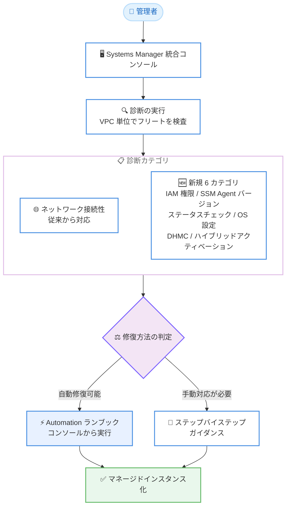

# AWS Systems Manager - 非管理状態の EC2 インスタンスに対する診断機能の拡張

**リリース日**: 2026 年 9 月 9 日
**サービス**: AWS Systems Manager
**機能**: 非管理状態の EC2 インスタンスおよびハイブリッドノードの原因診断機能の拡張

📊 [このアップデートのインフォグラフィックを見る](https://takech9203.github.io/aws-news-summary/20260909-systems-manager-diagnoses-ec2-unmanaged.html)

## 概要

AWS Systems Manager は、EC2 インスタンスやハイブリッドアクティベーションで登録したノードが管理対象 (マネージド) にならない原因を診断する機能を拡張しました。従来はネットワーク接続性の問題のみを診断できましたが、今回のアップデートにより、IAM 権限、SSM Agent バージョン、インスタンスステータスチェック、オペレーティングシステム設定、Default Host Management Configuration (DHMC)、ハイブリッドアクティベーションの 6 つのカテゴリの問題を新たに診断できるようになりました。

インスタンスが Systems Manager の管理対象になっていることは、パッチ適用、コマンド実行、Session Manager によるアクセス、インベントリ収集などの運用機能を利用するための前提条件です。今回の拡張により、これまで「原因不明」と表示されていたケースの多くで、具体的で対処可能な原因が特定されるようになります。

診断は Systems Manager 統合コンソールからフリート全体に対して実行でき、特定されたすべての問題にはステップバイステップの解決ガイダンスが付属します。一部の問題については、コンソールから Automation ランブックを起動して直接修復することも可能です。

**アップデート前の課題**

- 診断機能はネットワーク接続性 (セキュリティグループ、DNS、VPC エンドポイント、ネットワーク ACL) の問題のみを対象としており、それ以外が原因の場合は「原因不明」という結果になっていた
- IAM 権限の不足や SSM Agent の古いバージョンなどが原因の場合、管理者が手動でトラブルシューティングドキュメントを参照しながら原因を切り分ける必要があった
- ハイブリッドアクティベーションの期限切れや登録数上限などのハイブリッド環境固有の問題は、診断機能でカバーされていなかった

**アップデート後の改善**

- ネットワーク接続性に加えて 6 カテゴリ (IAM 権限、SSM Agent バージョン、インスタンスステータスチェック、OS 設定、DHMC、ハイブリッドアクティベーション) の問題を自動診断できるようになった
- より多くのインスタンスで「原因不明」ではなく、具体的で対処可能な原因が返されるようになった
- 診断されたすべての問題にステップバイステップのガイダンスが付属し、一部はコンソールから Automation ランブックで即時修復できるようになった

## アーキテクチャ図



Systems Manager 統合コンソールから診断を実行すると、VPC 単位でインスタンスグループが検査され、問題のカテゴリに応じて Automation ランブックによる自動修復、または手動対応のためのガイダンスが提供されます。

## サービスアップデートの詳細

### 主要機能

1. **IAM ロールと権限の診断**
   - インスタンスプロファイルが EC2 インスタンスにアタッチされていない問題を検出
   - IAM ロールに `AmazonSSMManagedInstanceCore` 管理ポリシーまたは同等の権限が含まれていない問題を検出
   - Systems Manager との通信に最低限必要なアクション (`ssm:UpdateInstanceInformation`、`ssmmessages:CreateControlChannel`、`ssmmessages:CreateDataChannel`、`ec2messages:GetMessages`) の不足を検出

2. **SSM Agent バージョンの診断**
   - Systems Manager への接続に必要な最小サポートバージョンより古い SSM Agent を検出
   - Systems Manager サービスが使用する通信プロトコルに対応していないバージョンを検出

3. **インスタンスステータスチェックの診断**
   - システムステータスチェックの失敗 (基盤となるホストインフラの問題) を検出
   - インスタンスステータスチェックの失敗 (OS やネットワーク設定の応答不良) を検出

4. **オペレーティングシステム設定の診断**
   - インスタンスのコンソール出力を分析し、SSM Agent サービスの停止・クラッシュ、ブートエラー (カーネルパニックやファイルシステム破損など)、ホストベースファイアウォール (iptables や Windows Firewall) による HTTPS 通信のブロック、ディスク容量の枯渇を検出
   - OS レベルの問題は自動修復の対象外であり、手動解決のためのガイダンスが提供される

5. **Default Host Management Configuration (DHMC) の診断**
   - アカウントとリージョンで DHMC が有効化されていない問題を検出
   - DHMC 用の IAM ロールに必要なポリシーが不足している問題を検出
   - DHMC 用の IAM ロールの信頼ポリシーが正しく設定されていない問題を検出

6. **ハイブリッドアクティベーションの診断**
   - アクティベーションの期限切れを検出
   - アクティベーションの登録数上限への到達を検出
   - VM のクローンなどに起因するエージェント登録の競合を検出
   - ハイブリッドノードから Systems Manager エンドポイントへの接続性の問題を検出

## 技術仕様

### 診断カテゴリと修復方法

| 問題カテゴリ | 診断 | 自動修復 (ランブック) |
|------|------|------|
| セキュリティグループ設定と HTTPS 通信 | ✓ | ✓ (一部は手動) |
| DNS / DNS ホスト名設定 | ✓ | ✓ |
| VPC エンドポイント設定 | ✓ | ✓ (一部は手動) |
| ネットワーク ACL 設定 | ✓ | 手動対応 |
| IAM ロールと権限 (新規) | ✓ | ガイダンス提供 |
| SSM Agent バージョン (新規) | ✓ | ガイダンス提供 |
| インスタンスステータスチェック (新規) | ✓ | ガイダンス提供 |
| オペレーティングシステム設定 (新規) | ✓ | 手動対応 (コンソール出力分析による診断) |
| DHMC 設定 (新規) | ✓ | ガイダンス提供 |
| ハイブリッドアクティベーション (新規) | ✓ | ガイダンス提供 |

### 診断の動作

| 項目 | 詳細 |
|------|------|
| 診断の単位 | VPC ごとにインスタンスグループを一括検査 |
| 実行場所 | Systems Manager 統合コンソール |
| 修復手段 | Automation ランブックの実行、または手動対応のためのステップバイステップガイダンス |
| 対象ノード | EC2 インスタンス、ハイブリッドアクティベーションで登録したノード (オンプレミスサーバーや他クラウドの VM) |

### IAM 権限診断で確認される最小権限の例

```json
{
  "Version": "2012-10-17",
  "Statement": [
    {
      "Effect": "Allow",
      "Action": [
        "ssm:UpdateInstanceInformation",
        "ssmmessages:CreateControlChannel",
        "ssmmessages:CreateDataChannel",
        "ec2messages:GetMessages"
      ],
      "Resource": "*"
    }
  ]
}
```

## 設定方法

### 前提条件

1. Systems Manager 統合コンソール (unified console) が有効化されていること
2. 診断および Automation ランブックを実行するための IAM 権限を持っていること
3. 診断対象の EC2 インスタンスまたはハイブリッドノードが存在すること

### 手順

#### ステップ 1: Systems Manager 統合コンソールを開く

AWS マネジメントコンソールから Systems Manager を開き、統合コンソールのダッシュボードで管理対象外 (unmanaged) のインスタンス数を確認します。

#### ステップ 2: 診断を実行する

コンソールから診断 (Diagnose) を実行します。診断プロセスは、VPC ごとにインスタンスグループを一括で検査し、ネットワーク接続性、IAM 権限、SSM Agent バージョン、ステータスチェック、OS 設定、DHMC、ハイブリッドアクティベーションの各カテゴリの問題を特定します。

#### ステップ 3: 診断結果を確認し修復する

診断結果に表示された各問題について、以下のいずれかで対応します。

- **自動修復可能な問題**: コンソールから Automation ランブックを実行して修復します (例: セキュリティグループのルール更新、VPC の DNS 属性の有効化、VPC エンドポイントの作成)
- **手動対応が必要な問題**: 提供されるステップバイステップのガイダンスに従って設定を修正します (例: インスタンスプロファイルのアタッチ、SSM Agent の更新、DHMC の有効化)

#### ステップ 4: 修復後の状態を確認する

修復後、インスタンスがマネージドインスタンスとして表示されることを確認します。マネージド化されると、パッチ適用、Run Command、Session Manager、インベントリ収集などの機能が利用可能になります。

## メリット

### ビジネス面

- **運用工数の削減**: 非管理状態の原因を手動で切り分ける作業が不要になり、トラブルシューティングにかかる時間を大幅に短縮できる
- **ガバナンスの向上**: フリート全体の管理カバレッジを高めることで、パッチ適用やインベントリ収集などのコンプライアンス要件を満たしやすくなる
- **追加コストなしで利用可能**: 診断機能自体は統合コンソールの一部として提供され、Automation ランブック実行分の標準料金のみで利用できる

### 技術面

- **診断範囲の大幅な拡大**: ネットワーク接続性のみだった診断対象が、IAM 権限、エージェントバージョン、OS 設定など 6 カテゴリ追加され、原因不明のケースが減少する
- **コンソール出力に基づく OS 診断**: インスタンスのコンソール出力を分析することで、SSM Agent が動作していない状態でも OS レベルの問題 (ブートエラー、ディスク枯渇など) を特定できる
- **ハイブリッド環境への対応**: オンプレミスサーバーや他クラウドの VM など、ハイブリッドアクティベーションで登録したノード固有の問題も診断できる

## デメリット・制約事項

### 制限事項

- すべての問題が自動修復できるわけではなく、OS 設定やネットワーク ACL などの問題は手動対応が必要
- OS レベルの問題は、インスタンスの OS への直接アクセスが必要なため、自動修復は提供されない (コンソール出力の分析による診断のみ)
- VPC エンドポイントの一部の設定不備 (サブネットとの関連付け不足など) は、診断は可能だが修復用ランブックが提供されていない

### 考慮すべき点

- 診断は VPC 単位でインスタンスグループを検査するため、大規模環境では VPC ごとの実行計画を検討する必要がある
- 修復に Automation ランブックを使用する場合、Systems Manager Automation の標準料金が適用される
- 自動修復ランブックはセキュリティグループや VPC 設定を変更する可能性があるため、本番環境では変更内容を事前に確認することが望ましい

## ユースケース

### ユースケース 1: 新規アカウントで EC2 インスタンスが管理対象にならない原因の特定

**シナリオ**: 新しく作成した AWS アカウントで EC2 インスタンスを起動したが、Systems Manager のマネージドインスタンスとして表示されない。インスタンスプロファイルの設定や DHMC の有効化状態が不明。

**実装例**:
```
1. Systems Manager 統合コンソールで診断を実行
2. 「DHMC が有効化されていない」「インスタンスプロファイルが未アタッチ」といった問題が特定される
3. ガイダンスに従って DHMC を有効化、または AmazonSSMManagedInstanceCore を含む
   インスタンスプロファイルをアタッチ
```

**効果**: IAM や DHMC の設定不備を推測ではなく診断結果に基づいて特定でき、セットアップ時間を短縮できる。

### ユースケース 2: 古い SSM Agent が原因で管理対象から外れたインスタンスの検出

**シナリオ**: 長期間稼働しているインスタンス群の一部が、いつの間にか Systems Manager の管理対象から外れていた。原因が古い SSM Agent バージョンなのか、ネットワーク変更なのか不明。

**実装例**:
```
1. 統合コンソールで対象 VPC の診断を実行
2. 「SSM Agent バージョンが最小サポートバージョンより古い」問題が特定される
3. ガイダンスに従い SSM Agent を更新し、以後は自動更新
   (AWS-UpdateSSMAgent の定期実行) を構成
```

**効果**: 原因の切り分け作業なしでエージェントの問題を特定でき、再発防止策 (自動更新) の導入につなげられる。

### ユースケース 3: ハイブリッド環境でのアクティベーション問題の診断

**シナリオ**: オンプレミスの VM をハイブリッドアクティベーションで Systems Manager に登録して運用しているが、VM をクローンして追加したノードが管理対象にならない。

**実装例**:
```
1. 統合コンソールで診断を実行
2. 「エージェント登録の競合」(クローン元の登録情報が残存) や
   「アクティベーションの登録数上限到達」が特定される
3. ガイダンスに従い、競合する登録を解除して再登録、
   または登録上限を増やした新しいアクティベーションを作成
```

**効果**: ハイブリッド環境固有の登録問題を体系的に診断でき、オンプレミスノードの管理カバレッジを維持できる。

## 料金

診断機能自体に追加料金はありません。修復に Automation ランブックを実行した場合、AWS Systems Manager Automation の標準料金が適用されます。

詳細は [AWS Systems Manager 料金ページ](https://aws.amazon.com/systems-manager/pricing/) を参照してください。

## 利用可能リージョン

Systems Manager 統合コンソールが提供されているすべての AWS リージョンで利用可能です。

## 関連サービス・機能

- **AWS Systems Manager Automation**: 診断で特定された問題の一部を自動修復するランブックの実行基盤
- **Default Host Management Configuration (DHMC)**: インスタンスプロファイルなしで EC2 インスタンスを管理対象にする機能。今回の診断カテゴリに追加された
- **AWS Systems Manager Session Manager / Patch Manager / Run Command**: インスタンスがマネージド状態になることで利用可能になる主要な運用機能
- **Amazon EC2 ステータスチェック**: インスタンスの基盤・OS レベルの健全性を確認する機能。診断カテゴリの 1 つとして統合された

## 参考リンク

- 📊 [インフォグラフィック](https://takech9203.github.io/aws-news-summary/20260909-systems-manager-diagnoses-ec2-unmanaged.html)
- [公式発表 (What's New)](https://aws.amazon.com/about-aws/whats-new/2026/09/systems-manager-diagnoses-ec2-unmanaged/)
- [ドキュメント: 診断可能な非管理 EC2 インスタンス問題のカテゴリ](https://docs.aws.amazon.com/systems-manager/latest/userguide/diagnosing-ec2-category-types.html)
- [ドキュメント: SSM Agent のトラブルシューティング](https://docs.aws.amazon.com/systems-manager/latest/userguide/troubleshooting-ssm-agent.html)
- [ドキュメント: Default Host Management Configuration](https://docs.aws.amazon.com/systems-manager/latest/userguide/fleet-manager-default-host-management-configuration.html)
- [料金ページ](https://aws.amazon.com/systems-manager/pricing/)

## まとめ

Systems Manager の診断機能がネットワーク接続性に加えて IAM 権限、SSM Agent バージョン、ステータスチェック、OS 設定、DHMC、ハイブリッドアクティベーションの 6 カテゴリに拡張され、非管理状態のインスタンスの原因特定が大幅に容易になりました。フリート内に管理対象外のインスタンスが存在する場合は、統合コンソールから診断を実行し、提供されるガイダンスやランブックで管理カバレッジを高めることを推奨します。
