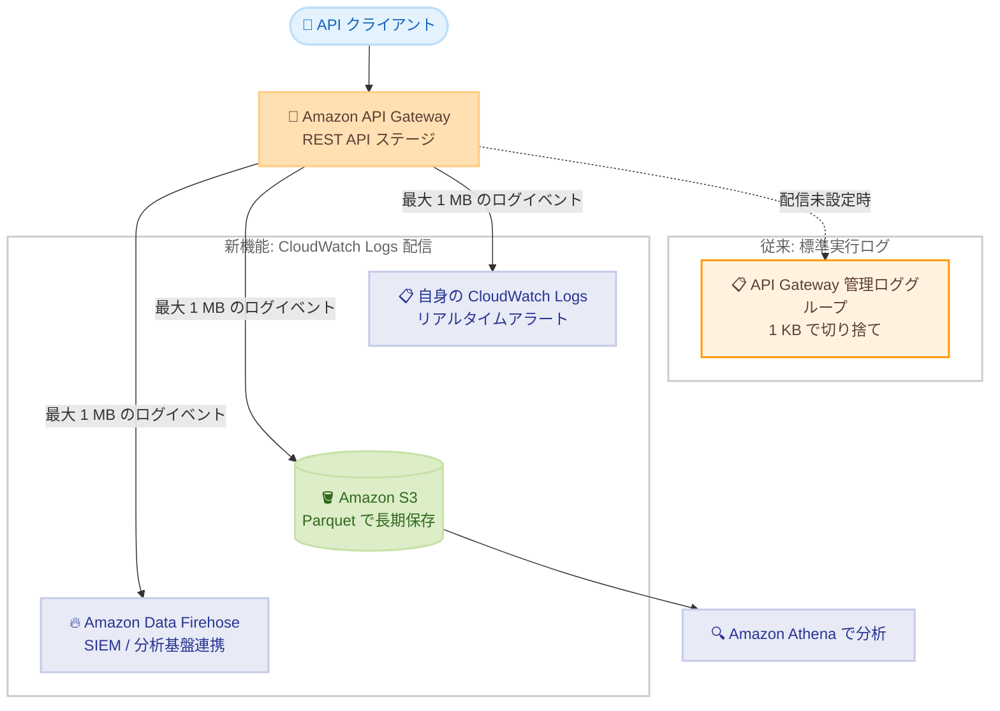

# Amazon API Gateway - 実行ログの 1 MB 対応と配信先のカスタマイズ

**リリース日**: 2026 年 9 月 10 日
**サービス**: Amazon API Gateway
**機能**: REST API 実行ログの 1 MB 対応と設定可能な配信先 (CloudWatch Logs 配信)

📊 [このアップデートのインフォグラフィックを見る](https://takech9203.github.io/aws-news-summary/20260910-amazon-api-gateway-1-mb-execution-logs.html)

## 概要

Amazon API Gateway が、REST API の実行ログ (execution logs) について、設定可能な配信先と最大 1 MB のログイベントをサポートしました。実行ログは、エラー、実行トレース、リクエスト/レスポンスのパラメータ値やペイロード、Lambda オーソライザーが使用するデータなど、API Gateway がリクエストを処理する過程を記録するログです。

これまで実行ログは、API Gateway が管理する単一の CloudWatch Logs ロググループにのみ配信され、ログイベントは 1 KB で切り捨てられていました。今回のアップデートにより、最大 1 MB のログイベントを、ユーザー自身が所有する CloudWatch Logs ロググループ、Amazon S3 バケット、Amazon Data Firehose ストリームにルーティングできるようになり、複数の配信先への同時配信も可能になりました。たとえば、Apache Parquet 形式で Amazon S3 に配信して Amazon Athena によるコスト効率の高い長期保存・分析を行いながら、同時に構造化 JSON ログを CloudWatch Logs に配信してリアルタイムのアラートに活用する、といった構成が実現できます。

API のデバッグやトラブルシューティングで大きなペイロードの可視性が必要な開発者、コンプライアンス要件でログの長期保存が必要な組織、SIEM 連携やログ分析基盤を運用するチームにとって有用なアップデートです。

**アップデート前の課題**

- 実行ログは API Gateway 管理の固定ロググループ (`API-Gateway-Execution-Logs_{rest-api-id}/{stage_name}`) にのみ配信され、ロググループ名や保存先を選択できなかった
- ログイベントが 1 KB で切り捨てられ、リクエスト/レスポンスデータの可視性が制限されていた
- S3 への長期保存や Firehose 経由の SIEM 連携を行うには、サブスクリプションフィルターや Lambda フォワーダーなどの追加の仕組みを自前で構築・運用する必要があった

**アップデート後の改善**

- 最大 1 MB のログイベントを記録でき、より完全なリクエスト/レスポンスデータを取得できるようになった
- 自身が所有する CloudWatch Logs ロググループ、Amazon S3 バケット、Amazon Data Firehose ストリームを配信先として選択できるようになった
- 複数の配信先への同時配信が可能になり、リアルタイムアラート用と長期保存用など用途別のログルーティングを追加インフラなしで実現できるようになった
- 配信先ごとに出力形式 (JSON、plain、S3 では Parquet や W3C も) とレコードフィールドを選択できるようになった

## アーキテクチャ図



REST API ステージの実行ログを、自身が所有する複数の配信先に同時ルーティングできます。配信を設定すると API Gateway 管理のロググループへの書き込みは停止し、配信を削除すると自動的に元のロググループへの配信が再開されます。

## サービスアップデートの詳細

### 主要機能

1. **最大 1 MB のログイベント**
   - 従来の 1 KB から 1 MB に拡大し、より完全なリクエスト/レスポンスデータを記録可能
   - 1 MB を超えるペイロードは引き続き切り捨てられる
   - ログの内容自体は従来どおりステージの `loggingLevel` (ERROR / INFO) と `dataTraceEnabled` で制御

2. **設定可能な配信先**
   - 自身の CloudWatch Logs ロググループ: 保持期間、メトリクスフィルター、サブスクリプションフィルターを直接制御可能
   - Amazon S3 バケット: Parquet 形式での低コスト長期保存、Athena や AWS Glue との連携
   - Amazon Data Firehose ストリーム: サブスクリプションフィルターや Lambda フォワーダーなしでリアルタイム分析や SIEM 連携が可能
   - クロスアカウント配信にも対応 (AWS CLI での設定が必要)

3. **複数配信先への同時配信**
   - 同一の配信ソースに対して複数の配信を作成することで、1 つのステージから複数の宛先へファンアウト可能
   - 例: アラート用に CloudWatch Logs、コンプライアンス用に S3、SIEM 用に Firehose を同時利用

4. **構造化フィールドと出力形式のカスタマイズ**
   - `resource_arn`、`event_timestamp`、`api_id`、`stage`、`resource_path`、`http_method`、`payload` のフィールドを配信先ごとに選択可能
   - 出力形式は CloudWatch Logs / Firehose が json と plain、S3 は json、plain、w3c、parquet に対応

## 技術仕様

### 標準実行ログとの比較

| 項目 | 標準実行ログ | CloudWatch Logs 配信 (新機能) |
|------|------------|------------------------------|
| 最大ログイベントサイズ | 1 KB | 1 MB |
| 配信先 | API Gateway 管理のロググループのみ | 自身の CloudWatch Logs、Amazon S3、Firehose |
| 複数配信先 | 不可 | 可能 |
| ロググループ名 | API Gateway が固定 | ユーザーが選択 |
| 出力形式 | 固定 | json / plain (S3 は w3c / parquet も) |
| 前提条件 | `loggingLevel` を ERROR または INFO に設定 | 同左 + CloudWatch Logs 配信の作成 |
| 料金 | CloudWatch Logs 標準料金 | Vended Logs 料金 |

### 配信設定で使用する値

| 項目 | 値 |
|------|----|
| リソース ARN | `arn:aws:apigateway:{region}:{account-id}:/restapis/{rest-api-id}/stages/{stage-name}` |
| ログタイプ | `EXECUTION_LOGS` |
| 設定方法 | API Gateway コンソール、AWS CLI (CloudWatch Logs 配信 API)、AWS CloudFormation |

### CloudFormation リソース例

```yaml
DeliverySource:
  Type: AWS::Logs::DeliverySource
  Properties:
    Name: my-apigw-source
    LogType: EXECUTION_LOGS
    ResourceArn: !Sub "arn:${AWS::Partition}:apigateway:${AWS::Region}:${AWS::AccountId}:/restapis/${MyApi}/stages/${MyStageName}"
```

## 設定方法

### 前提条件

1. REST API がステージにデプロイされており、ステージの `loggingLevel` が `ERROR` または `INFO` に設定されていること (未設定の場合、配信ソースの作成に失敗する)
2. 配信先リソース (自身の CloudWatch Logs ロググループ、Amazon S3 バケット、または Firehose ストリーム) が作成済みであること
3. CloudWatch Logs 配信 API を呼び出す IAM 権限があること

### 手順

#### ステップ 1: 配信ソースの作成

```bash
aws logs put-delivery-source \
    --name my-apigw-source \
    --log-type EXECUTION_LOGS \
    --resource-arn arn:aws:apigateway:ap-northeast-1:123456789012:/restapis/abc123/stages/prod
```

REST API のステージを配信ソースとして登録します。ログタイプには `EXECUTION_LOGS` を指定します。

#### ステップ 2: 配信先の作成

```bash
aws logs put-delivery-destination \
    --name my-log-destination \
    --delivery-destination-configuration "destinationResourceArn=arn:aws:logs:ap-northeast-1:123456789012:log-group:my-execution-logs"
```

自身のロググループを配信先として登録します。Amazon S3 や Firehose に配信する場合は、それぞれのリソース ARN を `destinationResourceArn` に指定します。`--output-format` で出力形式も指定できます。

#### ステップ 3: 配信の作成

```bash
aws logs create-delivery \
    --delivery-source-name my-apigw-source \
    --delivery-destination-arn arn:aws:logs:ap-northeast-1:123456789012:delivery-destination:my-log-destination
```

配信ソースと配信先をリンクして配信を作成します。複数の配信先に送る場合は、同じ配信ソースに対して異なる配信先で追加の配信を作成します。`--record-fields` で含めるフィールドを選択できます。作成後は `aws logs describe-deliveries` で確認できます。

なお、API Gateway コンソールからも、ステージ詳細ページの [Logs and tracing] セクションにある [Log delivery destinations] から [Add destination] を選択して設定できます。

## メリット

### ビジネス面

- **コスト効率の高いログ保存**: Parquet 形式での S3 配信により、長期保存コストを削減しつつ Athena での分析が可能
- **コンプライアンス対応の強化**: ログの保持期間や保存先を自身で制御でき、監査やコンプライアンス要件に合わせたログ管理が可能
- **運用負荷の削減**: SIEM 連携のためのサブスクリプションフィルターや Lambda フォワーダーなどの中間インフラの構築・運用が不要

### 技術面

- **トラブルシューティングの向上**: 1 KB から 1 MB への拡大により、大きなリクエスト/レスポンスペイロードも切り捨てられずに記録され、デバッグの精度が向上
- **柔軟なログルーティング**: 1 つのステージから複数の配信先へ同時配信でき、用途別 (アラート、長期保存、分析) にログを振り分け可能
- **構造化ログの活用**: `api_id` や `resource_path` などの構造化フィールドと JSON 形式により、ログのフィルタリングや分析が容易

## デメリット・制約事項

### 制限事項

- 1 MB を超えるペイロードは引き続き切り捨てられる
- CloudWatch Logs 配信は標準実行ログを置き換える動作となり、配信を設定すると API Gateway 管理のロググループへの書き込みは停止する (同一ステージで両方を併用することは不可)
- S3 バケットは API と同一リージョンに存在する必要がある
- ログ配信はベストエフォートであり、まれにログイベントが配信されない場合がある (監査上クリティカルな記録のシステムオブレコードとしての利用は非推奨)
- クロスアカウント配信の設定はコンソールでは行えず、AWS CLI が必要

### 考慮すべき点

- 配信を有効化する前に、既存の API Gateway 管理ロググループ (`API-Gateway-Execution-Logs_{rest-api-id}/{stage_name}`) を参照しているダッシュボード、アラーム、サブスクリプションフィルターを更新する必要がある
- 1 MB のペイロードにはより多くのデータが含まれるため、データトレースを有効にすると PII などの機密データが記録される可能性がある。アクセス制御、暗号化、マスキングを適用し、データトレースは選択的に有効化することが推奨される
- 配信されたログには CloudWatch の Vended Logs 料金が適用されるため、ログ量に応じたコストを事前に見積もることが望ましい
- `loggingLevel` を `OFF` にすると、配信先の設定は残るがログは生成・配信されない

## ユースケース

### ユースケース 1: 大きなペイロードを扱う API のデバッグ

**シナリオ**: JSON ボディが数百 KB になる API で、従来は実行ログが 1 KB で切り捨てられ、リクエスト内容の全体を確認できずデバッグに時間がかかっていた。

**実装例**:
```bash
# ステージの loggingLevel を INFO、データトレースを有効化した上で
# 自身のロググループへの配信を作成 (JSON 形式)
aws logs put-delivery-destination \
    --name debug-destination \
    --output-format "json" \
    --delivery-destination-configuration "destinationResourceArn=arn:aws:logs:ap-northeast-1:123456789012:log-group:apigw-debug-logs"
```

**効果**: 最大 1 MB までのリクエスト/レスポンスデータが記録され、切り捨てによる情報欠落なしに問題の再現・特定が可能になる。

### ユースケース 2: S3 + Athena によるコスト効率の高い長期ログ分析

**シナリオ**: コンプライアンス要件により API 実行ログを数年間保存する必要があるが、CloudWatch Logs での長期保存はコストが高い。

**実装例**:
```bash
# Parquet 形式で S3 に配信
aws logs put-delivery-destination \
    --name s3-archive-destination \
    --output-format "parquet" \
    --delivery-destination-configuration "destinationResourceArn=arn:aws:s3:::my-apigw-log-archive"
```

**効果**: Parquet 形式により保存コストとスキャンコストを抑えつつ、Amazon Athena で必要なときに SQL で分析できる。S3 ライフサイクルポリシーによる階層化も可能。

### ユースケース 3: マルチ配信によるアラートと SIEM 連携の両立

**シナリオ**: セキュリティチームは SIEM への実行ログ取り込みを求めており、運用チームは CloudWatch でのリアルタイムアラートを継続したい。

**実装例**:
```bash
# 同じ配信ソースに対して 2 つの配信を作成
aws logs create-delivery \
    --delivery-source-name my-apigw-source \
    --delivery-destination-arn arn:aws:logs:ap-northeast-1:123456789012:delivery-destination:cwl-alerting

aws logs create-delivery \
    --delivery-source-name my-apigw-source \
    --delivery-destination-arn arn:aws:logs:ap-northeast-1:123456789012:delivery-destination:firehose-siem
```

**効果**: 追加のフォワーダーやサブスクリプションフィルターなしで、CloudWatch Logs でのアラートと Firehose 経由の SIEM 取り込みを同時に実現できる。

## 料金

この機能を通じて配信される実行ログには、CloudWatch の Vended Logs 料金が適用されます。標準の CloudWatch Logs 取り込み料金とは異なる料金体系で、配信先 (CloudWatch Logs、S3、Firehose) ごとに料金が設定されています。詳細は [Amazon CloudWatch 料金ページ](https://aws.amazon.com/cloudwatch/pricing/) を参照してください。

## 利用可能リージョン

API Gateway REST API が利用可能なすべての AWS リージョンで利用できます (AWS GovCloud (US) リージョンを含む)。

## 関連サービス・機能

- **Amazon CloudWatch Logs**: 配信の仕組み (配信ソース、配信先、配信) 自体は CloudWatch Logs の Vended Logs 配信機能を使用。ロググループへの配信でメトリクスフィルターやアラームと連携
- **Amazon S3 / Amazon Athena**: Parquet 形式での長期保存と SQL 分析
- **Amazon Data Firehose**: SIEM やサードパーティ分析基盤へのストリーミング配信
- **API Gateway アクセスログ**: 実行ログとは別の機能で、今回のアップデートの影響を受けない。アクセスログは以前からカスタム配信先をサポート

## 参考リンク

- 📊 [インフォグラフィック](https://takech9203.github.io/aws-news-summary/20260910-amazon-api-gateway-1-mb-execution-logs.html)
- [公式発表 (What's New)](https://aws.amazon.com/about-aws/whats-new/2026/09/amazon-api-gateway-1-mb-execution-logs/)
- [AWS Blog: Customize Amazon API Gateway destinations for execution logs](https://aws.amazon.com/blogs/compute/customize-amazon-api-gateway-destinations-for-execution-logs/)
- [ドキュメント: Execution logging for REST APIs](https://docs.aws.amazon.com/apigateway/latest/developerguide/rest-api-execution-logging.html)
- [ドキュメント: Create a log delivery for REST API execution logs](https://docs.aws.amazon.com/apigateway/latest/developerguide/rest-api-create-log-delivery.html)
- [料金ページ: Amazon CloudWatch Pricing](https://aws.amazon.com/cloudwatch/pricing/)

## まとめ

API Gateway REST API の実行ログが 1 KB から 1 MB に拡大され、自身が所有する CloudWatch Logs、S3、Firehose への柔軟なルーティングが可能になりました。ログの可視性向上、長期保存コストの削減、SIEM 連携の簡素化を同時に実現できる実用性の高いアップデートです。導入時は、既存の管理ロググループを参照するアラームやダッシュボードの移行と、Vended Logs 料金への影響を事前に確認することを推奨します。
