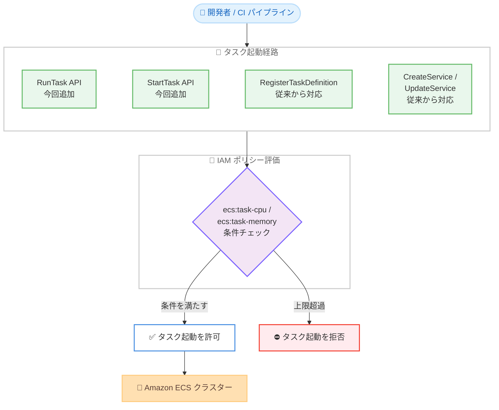

# Amazon ECS - RunTask および StartTask API での IAM 条件キーサポート拡大

**リリース日**: 2026 年 9 月 10 日
**サービス**: Amazon Elastic Container Service (Amazon ECS)
**機能**: RunTask / StartTask API における ecs:task-cpu および ecs:task-memory 条件キーのサポート

📊 [このアップデートのインフォグラフィックを見る](https://takech9203.github.io/aws-news-summary/20260910-amazon-ecs-expands-condition-key-support.html)

## 概要

Amazon ECS は、タスクの CPU およびメモリリソースに対する IAM 条件キー `ecs:task-cpu` と `ecs:task-memory` を、RunTask API と StartTask API でもサポートするようになりました。管理者はこれらの条件キーを使用して、ECS タスクを起動するすべての方法に対して一貫した CPU / メモリの上限を強制できます。

これまで、これらの条件キーは RegisterTaskDefinition、CreateService、UpdateService の各 API でのみ利用可能でした。今回のアップデートにより、RunTask および StartTask を通じてタスクを起動する際にも、これらの条件キーを参照する IAM ポリシーが評価されるようになり、ECS 環境全体のリソース割り当てを単一の統一されたメカニズムで制御できます。予期しないコスト超過を防止し、ワークロードを組織のリソースポリシーに準拠させたい組織にとって有用なアップデートです。

**アップデート前の課題**

- `ecs:task-cpu` および `ecs:task-memory` 条件キーは RegisterTaskDefinition、CreateService、UpdateService の各 API でのみ評価され、RunTask / StartTask によるタスク起動時には評価されなかった
- タスク定義の登録時点で制御しても、RunTask のオーバーライド機能などタスク起動経路によってはリソース制限を統一的に適用できなかった
- タスクの起動方法ごとに制御方法が異なり、組織全体で一貫したリソースガバナンスを実現するには追加の仕組みが必要だった

**アップデート後の改善**

- RunTask および StartTask によるタスク起動時にも `ecs:task-cpu` / `ecs:task-memory` 条件キーを参照する IAM ポリシーが評価されるようになった
- タスク定義の登録、サービスの作成・更新、タスクの直接起動という、すべてのタスク起動経路に対して単一の統一されたメカニズムでリソース割り当てを制御できるようになった
- 過大な CPU / メモリを指定したタスクの起動を IAM レベルで拒否できるため、予期しないコスト超過を予防できるようになった

## アーキテクチャ図



今回のアップデートにより、RunTask / StartTask を含むすべてのタスク起動経路で CPU / メモリの条件キーが評価され、上限を超えるタスクの起動を IAM レベルで統一的に拒否できます。

## サービスアップデートの詳細

### 主要機能

1. **RunTask / StartTask API での条件キー評価**
   - `ecs:task-cpu` および `ecs:task-memory` 条件キーが RunTask と StartTask の呼び出し時にも評価されるようになった
   - 開発者や CI/CD パイプラインがタスクを直接起動する場合でも、IAM ポリシーで定義した CPU / メモリの上限を強制できる
   - Service Control Policy (SCP) と組み合わせることで、組織単位でのガバナンスにも活用できる

2. **すべての起動経路にわたる統一的なリソース制御**
   - RegisterTaskDefinition、CreateService、UpdateService に加えて RunTask、StartTask もカバーされ、タスク起動のすべての経路で単一のメカニズムによる制御が可能になった
   - 起動方法ごとに個別の制御を実装する必要がなくなり、ポリシー管理がシンプルになる

3. **コスト超過の予防**
   - 過大な CPU / メモリを指定したタスクの起動を事前に拒否できるため、意図しない大型タスクの起動による予期しないコスト増加を防止できる
   - 事後的なモニタリングではなく、起動時点での予防的コントロールを実現できる

## 技術仕様

### 条件キーの仕様

| 条件キー | 形式 | 評価タイプ |
|------|------|------|
| `ecs:task-cpu` | `"ecs:task-cpu":"{task-cpu}"` — タスクの CPU 値。1024 = 1 vCPU の整数 | Integer |
| `ecs:task-memory` | `"ecs:task-memory":"{task-memory}"` — タスクのメモリ値。MiB 単位の整数 | Integer |

### 対応 API

| API | 条件キーのサポート |
|------|------|
| RegisterTaskDefinition | 従来から対応 |
| CreateService | 従来から対応 |
| UpdateService | 従来から対応 |
| RunTask | **今回追加** |
| StartTask | **今回追加** |

### IAM ポリシー例

以下は、4 vCPU (4096) を超える CPU、または 8 GiB (8192 MiB) を超えるメモリを指定したタスクの起動を拒否するポリシー例です。

```json
{
  "Version": "2012-10-17",
  "Statement": [
    {
      "Sid": "DenyLargeTasks",
      "Effect": "Deny",
      "Action": [
        "ecs:RunTask",
        "ecs:StartTask",
        "ecs:RegisterTaskDefinition",
        "ecs:CreateService",
        "ecs:UpdateService"
      ],
      "Resource": "*",
      "Condition": {
        "NumericGreaterThan": {
          "ecs:task-cpu": "4096",
          "ecs:task-memory": "8192"
        }
      }
    }
  ]
}
```

## 設定方法

### 前提条件

1. Amazon ECS を利用中の AWS アカウント
2. IAM ポリシーを作成・更新できる権限
3. 組織のリソースポリシーとして許容する CPU / メモリ上限の定義

### 手順

#### ステップ1: 上限を強制する IAM ポリシーを作成

```bash
aws iam create-policy \
  --policy-name ecs-task-resource-limit \
  --policy-document file://ecs-task-resource-limit.json
```

前述のポリシー例のような JSON ファイルを用意し、IAM ポリシーとして作成します。`NumericGreaterThan` 演算子を使用して、上限を超える CPU / メモリ指定を拒否します。

#### ステップ2: ポリシーを対象のロールにアタッチ

```bash
aws iam attach-role-policy \
  --role-name developer-role \
  --policy-arn arn:aws:iam::123456789012:policy/ecs-task-resource-limit
```

タスクを起動する開発者や CI/CD パイプラインが使用する IAM ロールにポリシーをアタッチします。これにより、当該ロールからのタスク起動時に条件キーが評価されます。

#### ステップ3: 動作確認

```bash
# 上限内のタスク起動 - 成功する
aws ecs run-task \
  --cluster my-cluster \
  --task-definition small-task:1 \
  --launch-type FARGATE \
  --network-configuration "awsvpcConfiguration={subnets=[subnet-xxxx]}"

# 上限を超えるタスク起動 - AccessDenied となる
aws ecs run-task \
  --cluster my-cluster \
  --task-definition large-task:1 \
  --launch-type FARGATE \
  --network-configuration "awsvpcConfiguration={subnets=[subnet-xxxx]}"
```

上限内の CPU / メモリを持つタスク定義では起動が成功し、上限を超えるタスク定義では起動が拒否されることを確認します。

## メリット

### ビジネス面

- **コスト超過の予防**: 過大なリソースを指定したタスクの起動を事前に拒否できるため、意図しないコスト増加を防止できる
- **ガバナンスの強化**: 組織のリソースポリシーを IAM レベルで強制でき、チームごとのばらつきをなくせる
- **追加コストなし**: 本機能は追加料金なしで利用できる

### 技術面

- **統一されたコントロールポイント**: タスク定義の登録、サービスの作成・更新、タスクの直接起動という、すべての起動経路を単一の IAM 条件キーで制御できる
- **予防的コントロール**: 事後検出ではなく起動時点で制御するため、違反状態が発生しない
- **既存ポリシーの拡張が容易**: すでに RegisterTaskDefinition などで条件キーを使用している場合、Action に RunTask / StartTask を追加するだけで適用範囲を拡大できる

## デメリット・制約事項

### 制限事項

- 条件キーで制御できるのはタスクレベルの CPU / メモリであり、コンテナレベルの細かなリソース設定の制御には対応していない
- IAM ポリシーによる制御であるため、ポリシーがアタッチされていないプリンシパルからの起動には適用されない

### 考慮すべき点

- 既存の IAM ポリシーで `ecs:task-cpu` / `ecs:task-memory` を参照する Deny 条件がある場合、今回のアップデートにより RunTask / StartTask でも評価されるようになるため、既存のタスク起動ワークフローへの影響を事前に確認することを推奨
- 条件キーは数値評価であるため、`NumericGreaterThan` や `NumericLessThanEquals` などの数値条件演算子を使用する必要がある
- タスク定義でタスクレベルの CPU / メモリを指定していない EC2 起動タイプのタスクでは、条件キーの評価対象となる値の有無に注意が必要

## ユースケース

### ユースケース1: 開発環境でのタスクサイズ上限の強制

**シナリオ**: 開発チームが検証用に ECS タスクを自由に起動できる環境で、誤って大型タスクを起動してコストが膨らむことを防止したい。

**実装例**:
```json
{
  "Effect": "Deny",
  "Action": ["ecs:RunTask", "ecs:StartTask"],
  "Resource": "*",
  "Condition": {
    "NumericGreaterThan": {
      "ecs:task-cpu": "2048"
    }
  }
}
```

**効果**: 開発者は 2 vCPU 以下のタスクのみ起動でき、大型タスクの誤起動によるコスト超過を予防できる。

### ユースケース2: 組織全体でのリソースポリシー統一

**シナリオ**: 複数のアカウントとチームで ECS を利用しており、AWS Organizations の SCP で全社共通のタスクサイズ上限を強制したい。

**実装例**:
```json
{
  "Effect": "Deny",
  "Action": [
    "ecs:RunTask",
    "ecs:StartTask",
    "ecs:RegisterTaskDefinition",
    "ecs:CreateService",
    "ecs:UpdateService"
  ],
  "Resource": "*",
  "Condition": {
    "NumericGreaterThan": {
      "ecs:task-memory": "16384"
    }
  }
}
```

**効果**: すべてのタスク起動経路で 16 GiB を超えるメモリ指定が拒否され、組織全体で一貫したリソースガバナンスを実現できる。

### ユースケース3: CI/CD パイプラインからのタスク起動制御

**シナリオ**: CI/CD パイプラインがバッチ処理やテストタスクを RunTask で起動しており、パイプラインの設定ミスによる過大なタスク起動を防ぎたい。

**実装例**:
```json
{
  "Effect": "Allow",
  "Action": "ecs:RunTask",
  "Resource": "arn:aws:ecs:ap-northeast-1:123456789012:task-definition/ci-*",
  "Condition": {
    "NumericLessThanEquals": {
      "ecs:task-cpu": "1024",
      "ecs:task-memory": "2048"
    }
  }
}
```

**効果**: パイプライン用ロールは 1 vCPU / 2 GiB 以下のタスクのみ起動でき、設定ミスによる想定外のリソース消費を防止できる。

## 料金

本機能は追加料金なしで利用できます。IAM 条件キーの利用自体に料金は発生せず、通常の Amazon ECS の料金 (Fargate または EC2 の利用料金) のみが適用されます。

## 利用可能リージョン

Amazon ECS が利用可能なすべての AWS リージョンで利用できます。

## 関連サービス・機能

- **AWS IAM**: 条件キーを使用した IAM ポリシーにより、タスク起動時のリソース制御を実現する
- **AWS Organizations (SCP)**: Service Control Policy と組み合わせることで、組織全体でのタスクサイズ上限の強制が可能
- **AWS Fargate**: タスクレベルの CPU / メモリ指定が必須であるため、本条件キーによる制御と特に相性が良い
- **AWS CloudTrail**: 拒否された RunTask / StartTask の呼び出しを記録し、ポリシー違反の試行を監査できる

## 参考リンク

- 📊 [インフォグラフィック](https://takech9203.github.io/aws-news-summary/20260910-amazon-ecs-expands-condition-key-support.html)
- [公式発表 (What's New)](https://aws.amazon.com/about-aws/whats-new/2026/09/amazon-ecs-expands-condition-key-support/)
- [Service Authorization Reference - Amazon ECS](https://docs.aws.amazon.com/service-authorization/latest/reference/list_amazonelasticcontainerservice.html)
- [Amazon ECS と IAM の連携 (開発者ガイド)](https://docs.aws.amazon.com/AmazonECS/latest/developerguide/security_iam_service-with-iam.html)

## まとめ

`ecs:task-cpu` / `ecs:task-memory` 条件キーが RunTask および StartTask API でも評価されるようになり、ECS タスクのリソース割り当てをすべての起動経路にわたって IAM レベルで統一的に制御できるようになりました。コストガバナンスを強化したい組織は、既存の IAM ポリシーや SCP の Action に RunTask / StartTask を追加し、タスクサイズ上限の適用範囲を拡大することを推奨します。
