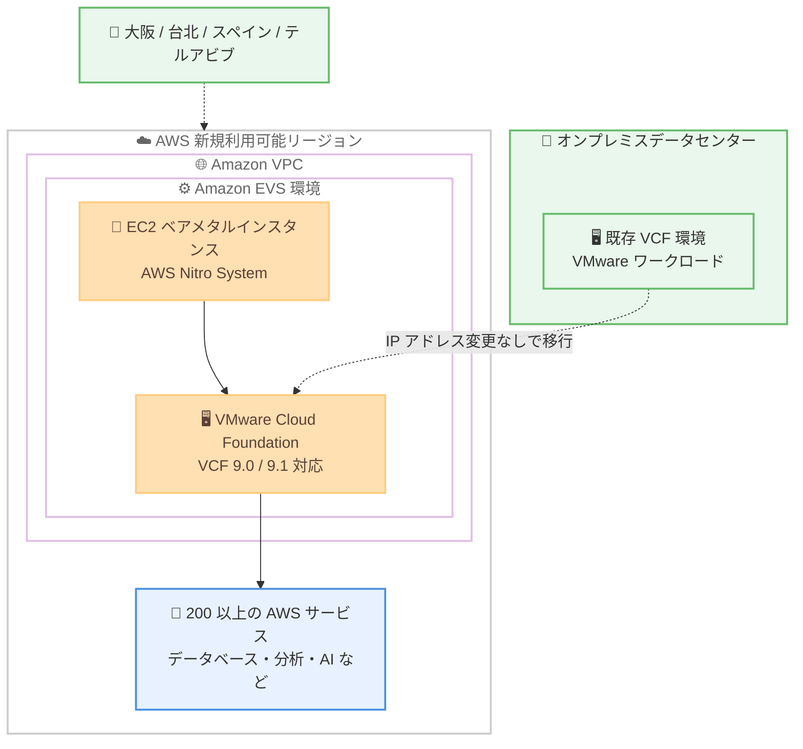

# Amazon EVS - 大阪、台北、スペイン、テルアビブの各リージョンで利用可能に

**リリース日**: 2026 年 9 月 10 日
**サービス**: Amazon Elastic VMware Service (Amazon EVS)
**機能**: 利用可能リージョンの拡大 (アジアパシフィック (大阪)、アジアパシフィック (台北)、欧州 (スペイン)、イスラエル (テルアビブ))

📊 [このアップデートのインフォグラフィックを見る](https://takech9203.github.io/aws-news-summary/20260910-amazon-evs-available-in-additional-regions.html)

## 概要

Amazon Elastic VMware Service (Amazon EVS) が、新たにアジアパシフィック (大阪)、アジアパシフィック (台北)、欧州 (スペイン)、イスラエル (テルアビブ) の 4 リージョンで利用可能になりました。Amazon EVS は、VMware Cloud Foundation (VCF) を Amazon VPC 内の EC2 ベアメタルインスタンス上で直接実行できるサービスで、AWS Nitro System を基盤としています。

Amazon EVS を使用すると、完全な VCF 環境を数時間でセットアップでき、ワークロードを AWS に迅速に移行できます。これにより、老朽化したインフラストラクチャの廃止、運用リスクの低減、データセンター撤退の期限遵守を支援します。今回のリージョン拡大では、VCF 9.0 および 9.1 のサポート (メモリティアリングなどの最新 VMware 機能を含む) をはじめとする既存のすべての Amazon EVS 機能が利用できます。

特に日本のユーザーにとっては、東京リージョンに続き大阪リージョンでも Amazon EVS が利用可能になったことで、国内でのマルチリージョン構成による高可用性や災害対策 (DR) の選択肢が広がる重要なアップデートです。

**アップデート前の課題**

以前は、対象の 4 リージョンで Amazon EVS を利用できませんでした。

- 大阪、台北、スペイン、テルアビブの各リージョンでは VMware ワークロードを Amazon EVS で実行できなかった
- 日本国内では東京リージョンのみの提供であり、国内完結のマルチリージョン DR 構成を Amazon EVS で組めなかった
- データレジデンシーや主権要件により、特定の国や地域にデータを保持する必要がある場合、Amazon EVS を採用できないケースがあった

**アップデート後の改善**

今回のアップデートにより、以下が可能になりました。

- 大阪、台北、スペイン、テルアビブの各リージョンで VCF 環境をデプロイし、VMware ワークロードを実行できるようになった
- エンドユーザーに近いリージョンを選択することで、より低いレイテンシーでワークロードを提供できるようになった
- データレジデンシーやデータ主権の要件に対応しやすくなった
- 東京と大阪の 2 リージョン構成など、冗長性を高めた高可用性・DR 戦略の選択肢が増えた

## アーキテクチャ図



オンプレミスの VCF 環境を、新たに利用可能になった 4 リージョンの Amazon EVS 環境へ移行する構成を示しています。VCF は VPC 内の EC2 ベアメタルインスタンス上で直接動作し、AWS の各種サービスとの連携も可能です。

## サービスアップデートの詳細

### 主要機能

1. **4 つの新規リージョンでの提供開始**
   - アジアパシフィック (大阪)、アジアパシフィック (台北)、欧州 (スペイン)、イスラエル (テルアビブ) で Amazon EVS が利用可能に
   - 既存の Amazon EVS 機能をすべてサポート
   - VCF 9.0 および 9.1 のサポートを含み、メモリティアリングなどの最新 VMware 機能を活用可能

2. **VPC 内での VCF 直接実行**
   - VCF を Amazon VPC 内の EC2 ベアメタルインスタンス上で直接実行
   - AWS Nitro System を基盤とした高いパフォーマンスとセキュリティ
   - 完全な VCF 環境を数時間でセットアップ可能

3. **移行の簡素化**
   - IP アドレスの変更、スタッフの再教育、運用手順書の書き換えなしにワークロードを移行可能
   - VCF ライセンスポータビリティによるサブスクリプションの持ち込み (BYOL)
   - セルフマネージド、または AWS パートナーによるマネージド運用を選択可能

## 技術仕様

### Amazon EVS の主な構成要素

| 項目 | 詳細 |
|------|------|
| 実行基盤 | Amazon VPC 内の EC2 ベアメタルインスタンス (AWS Nitro System) |
| 対応インスタンスタイプの例 | i4i.metal、i7i.metal-24xl |
| 対応 VCF バージョン | VCF 9.0 / 9.1 (メモリティアリング対応) を含む |
| ライセンス | VCF ライセンスポータビリティによる持ち込み (Broadcom または認定リセラーから購入) |
| ストレージ拡張 | Amazon FSx for NetApp ONTAP (オプション) |
| 管理インターフェイス | Amazon EVS コンソール、AWS CLI、AWS CloudFormation (`AWS::EVS::Environment`) |

### API 変更履歴

今回のアップデートはリージョン拡大であり、新規の API 変更はありません。

## 設定方法

### 前提条件

1. AWS アカウントと Amazon EVS を利用するための IAM 権限
2. Broadcom または認定 VCF リセラーから購入した VCF ライセンス (ライセンスポータビリティを利用)
3. VLAN サブネット用の CIDR 範囲を確保した Amazon VPC の設計

### 手順

#### ステップ 1: リージョンの選択と環境の作成

```bash
# 大阪リージョンで EVS 環境を作成する例
aws evs create-environment \
  --region ap-northeast-3 \
  --environment-name my-vcf-environment \
  --vcf-version VCF-9.0 \
  ...
```

新たに利用可能になったリージョン (大阪: ap-northeast-3 など) を指定して Amazon EVS 環境を作成します。環境作成時に、指定した CIDR 範囲を使用して必要な VLAN サブネットが作成され、ホストが環境に追加されます。

#### ステップ 2: VCF のカスタマイズ

vSphere ユーザーインターフェイスで、ログイン、ポリシー、モニタリングなどの設定を要件に応じて構成します。

#### ステップ 3: 接続と移行

オンプレミスのデータセンターと環境を接続し、VCF ワークロードを Amazon EVS に移行します。オンプレミスネットワークを拡張することで、IP アドレスを変更せずに移行できます。

## メリット

### ビジネス面

- **データレジデンシー要件への対応**: 日本 (大阪)、台湾、スペイン、イスラエルにデータを保持する要件のあるワークロードでも Amazon EVS を採用可能
- **データセンター撤退の加速**: 数時間で VCF 環境を構築できるため、老朽化インフラの廃止や撤退期限の遵守を支援
- **運用継続性の確保**: 既存の VMware スキルセットや運用手順書をそのまま活用でき、再教育コストを削減

### 技術面

- **低レイテンシー**: エンドユーザーに近いリージョンでワークロードを実行することでレイテンシーを低減
- **高可用性・DR の強化**: 東京・大阪の国内 2 リージョン構成など、冗長性を高めた構成が可能に
- **AWS サービスとの連携**: VPC 内で動作するため、マネージドデータベース、分析、生成 AI など 200 以上の AWS サービスと容易に統合可能

## デメリット・制約事項

### 制限事項

- VCF ライセンスは AWS からは販売されず、Broadcom または認定 VCF リセラーから購入して持ち込む必要がある
- 利用できるインスタンスタイプはリージョンにより異なる場合があるため、事前確認が必要
- 環境ごとに VPC Route Server エンドポイントが 2 つ必要

### 考慮すべき点

- EC2 ベアメタルインスタンスの料金に加え、EVS コントロールプレーン料金が発生するため、総コストを事前に試算することを推奨
- セルフマネージドモデルの場合、VCF 環境の運用 (パッチ適用や構成管理など) はユーザー側の責任となる

## ユースケース

### ユースケース 1: 国内 2 リージョンでの DR 構成

**シナリオ**: 日本国内でデータを保持する要件があり、東京リージョンで稼働する VMware ワークロードの災害対策サイトを国内に構築したい。

**実装例**:
```
1. 東京リージョンでプライマリの Amazon EVS 環境を運用
2. 大阪リージョンにセカンダリの Amazon EVS 環境を構築
3. VMware のレプリケーションツールで環境間のデータを同期
4. 障害発生時に大阪リージョンへフェイルオーバー
```

**効果**: データを国内に保持したまま、リージョン障害に耐えられる DR 構成を実現できます。

### ユースケース 2: データセンター撤退に伴う VMware ワークロードの移行

**シナリオ**: 台湾やスペインの拠点でオンプレミスデータセンターの契約期限が迫っており、VMware ワークロードを短期間でクラウドに移行する必要がある。

**実装例**:
```
1. 台北またはスペインリージョンで Amazon EVS 環境を数時間で構築
2. オンプレミスネットワークを AWS に拡張
3. IP アドレスを変更せずにワークロードを移行
4. 既存の運用手順書とスキルセットをそのまま継続利用
```

**効果**: アプリケーションの改修や再設計なしに、撤退期限内での移行を実現できます。

### ユースケース 3: 低レイテンシーが求められるアプリケーションの地域展開

**シナリオ**: イスラエルのエンドユーザー向けに VMware 上で稼働する業務アプリケーションを提供しており、レイテンシーを改善したい。

**実装例**:
```
1. テルアビブリージョンに Amazon EVS 環境を構築
2. ユーザーに近いリージョンへワークロードを配置
3. 必要に応じて AWS のマネージドサービスと統合して機能を拡張
```

**効果**: エンドユーザーへの近接性によりレイテンシーが低減し、ユーザー体験が向上します。

## 料金

Amazon EVS の料金は主に以下の要素で構成されます。最低料金や前払いコミットメントはありません。

- **EC2 ベアメタルインスタンス**: 標準の EC2 料金で課金 (オンデマンドのほか、Savings Plans による削減が可能)
- **VPC Route Server エンドポイント**: 環境ごとに 2 つ必要 (標準料金から 73% 割引で課金)
- **EVS コントロールプレーン**: インスタンスごとの時間課金 (インスタンスタイプによらず一律。例: 米国東部 (オハイオ) で 0.92 USD/インスタンス時間)
- **オプション**: Amazon FSx for NetApp ONTAP (従量課金)、Windows Server ライセンス (0.046 USD/vCPU 時間)

VCF ライセンスは AWS からは販売されず、ライセンスポータビリティにより持ち込む形式です。最新の料金は [Amazon EVS 料金ページ](https://aws.amazon.com/evs/pricing/) を参照してください。

## 利用可能リージョン

今回のアップデートにより、以下の 4 リージョンが追加されました。

- アジアパシフィック (大阪)
- アジアパシフィック (台北)
- 欧州 (スペイン)
- イスラエル (テルアビブ)

既存の提供リージョン (米国東部 (オハイオ)、アジアパシフィック (東京)、欧州 (アイルランド) など) の最新情報は、[AWS リージョン別サービス一覧](https://aws.amazon.com/about-aws/global-infrastructure/regional-product-services/) を参照してください。

## 関連サービス・機能

- **Amazon EC2 ベアメタルインスタンス**: Amazon EVS の実行基盤。i4i.metal などのベアメタルインスタンス上で VCF が直接動作
- **Amazon VPC**: VCF 環境がデプロイされるネットワーク基盤。VLAN サブネットの CIDR 範囲を指定して構成
- **Amazon FSx for NetApp ONTAP**: Amazon EVS 環境の外部ストレージとして利用可能なマネージドストレージサービス
- **AWS Nitro System**: ベアメタルインスタンスのセキュリティとパフォーマンスを支える基盤技術

## 参考リンク

- 📊 [インフォグラフィック](https://takech9203.github.io/aws-news-summary/20260910-amazon-evs-available-in-additional-regions.html)
- [公式発表 (What's New)](https://aws.amazon.com/about-aws/whats-new/2026/09/amazon-evs-available-in-additional-regions/)
- [Amazon EVS 製品ページ](https://aws.amazon.com/evs/)
- [Amazon EVS ユーザーガイド](https://docs.aws.amazon.com/evs/latest/userguide/what-is-evs.html)
- [Amazon EVS 料金ページ](https://aws.amazon.com/evs/pricing/)
- [VCF 9.0 / 9.1 サポートの発表 (What's New)](https://aws.amazon.com/about-aws/whats-new/2026/07/amazon-evs-vcf9/)

## まとめ

Amazon EVS が大阪、台北、スペイン、テルアビブの 4 リージョンに拡大し、VMware ワークロードをクラウドで実行する際のリージョン選択肢が大きく広がりました。特に大阪リージョンの追加により、日本国内で完結するマルチリージョン DR 構成が可能になった点は国内ユーザーにとって重要です。データレジデンシー要件やデータセンター撤退を検討している場合は、Amazon EVS 製品ページとユーザーガイドを確認し、対象リージョンでの環境構築を検討することをお勧めします。
