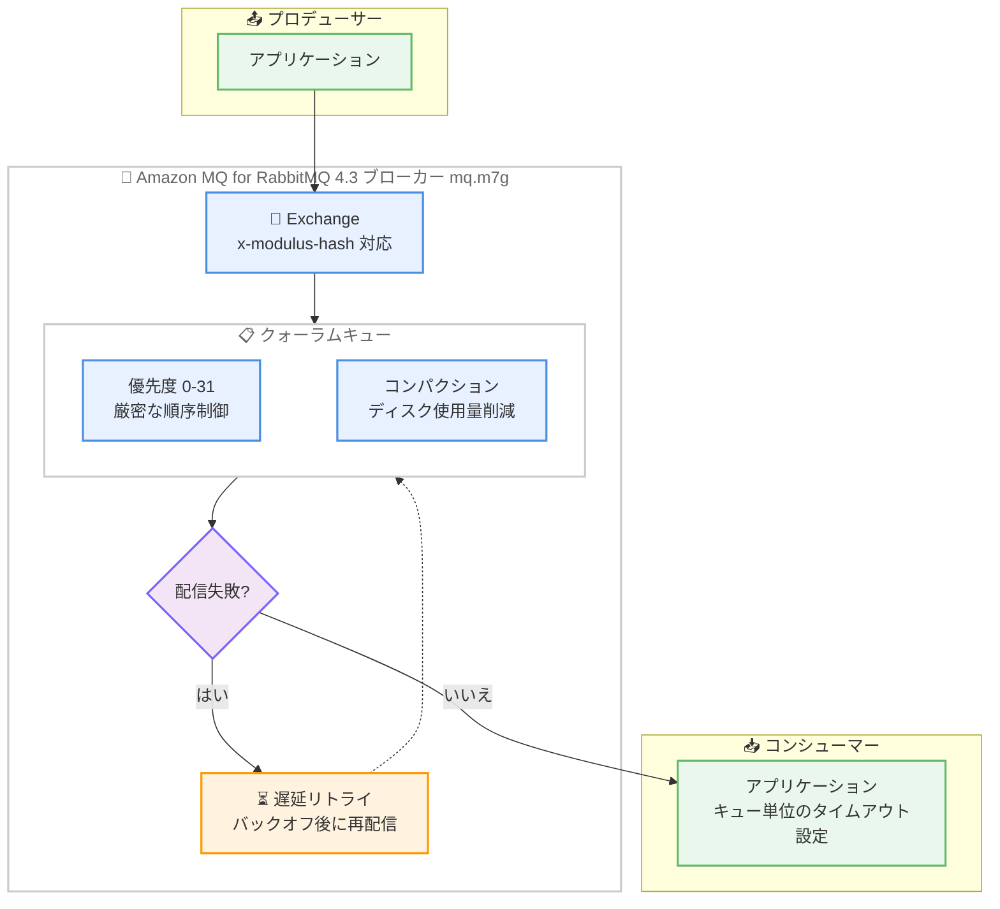

# Amazon MQ - RabbitMQ 4.3 サポート

**リリース日**: 2026 年 9 月 10 日
**サービス**: Amazon MQ
**機能**: RabbitMQ 4.3 のサポート

📊 [このアップデートのインフォグラフィックを見る](https://takech9203.github.io/aws-news-summary/20260910-amazon-mq-rabbitmq-43.html)

## 概要

Amazon MQ が RabbitMQ バージョン 4.3 をサポートしました。RabbitMQ 4.3 では、クォーラムキューの機能強化が中心となっており、ディスク使用量を削減するコンパクション、最大 32 レベルの厳密な優先度制御、ネイティブの遅延リトライ、きめ細かなコンシューマータイムアウト設定が追加されています。また、consistent hash exchange (x-modulus-hash) がコア機能として組み込まれ、メモリ管理に関する各種バグ修正とパフォーマンス改善も含まれています。

一方で、RabbitMQ 4.x 系で非推奨とされていた機能の削除が完了しており、一時的 (transient) な非排他キュー、グローバル QoS、クラシックキュー v1 ストレージはサポートされなくなりました。アップグレード前に既存アプリケーションへの影響を確認する必要があります。

RabbitMQ 4.3 は mq.m7g インスタンスタイプの全サイズで利用でき、メッセージングの信頼性と優先度制御を必要とするワークロードを運用するユーザーにとって重要なアップデートです。

**アップデート前の課題**

- クォーラムキューの優先度は RabbitMQ 4.2 で導入された相対的な 2 レベル (2:1 の比率ベース配信) のみで、細かな優先度制御ができなかった
- 失敗したメッセージの遅延リトライを実現するには、デッドレターエクスチェンジと TTL を組み合わせた独自実装が必要だった
- コンシューマータイムアウトはブローカー全体の `consumer_timeout` 設定のみで、キューやコンシューマー単位での調整ができなかった
- クォーラムキューの配信制限 (delivery limit) の変更にはキューの再宣言が必要だった
- consistent hash exchange はプラグインとして提供されており、コア機能ではなかった

**アップデート後の改善**

- クォーラムキューで最大 32 レベル (0-31) の厳密な優先度制御が `x-max-priority` キュー引数で利用可能になった
- クォーラムキューのネイティブ遅延リトライにより、失敗したメッセージを自動的に退避し、設定したバックオフ後に再配信できるようになった
- コンシューマータイムアウトをコンシューマー単位、キュー単位、またはポリシーで設定できるようになった
- 配信制限をポリシーで変更できるようになり、キューの再宣言が不要になった
- コンパクションによりクォーラムキューのディスク使用量が削減された
- `x-modulus-hash` エクスチェンジタイプがコア機能となり、クライアント側のロジックなしでワークロードのシャーディングが可能になった

## アーキテクチャ図



RabbitMQ 4.3 のクォーラムキューにおけるメッセージフローの概要です。配信に失敗したメッセージは自動的に退避され、設定したクールダウン時間の経過後に再配信されます。

## サービスアップデートの詳細

### 主要機能

1. **クォーラムキューの厳密な優先度制御 (最大 32 レベル)**
   - `x-max-priority` キュー引数で有効化し、0 から 31 までの優先度レベルを利用可能
   - 高優先度のメッセージが常に低優先度のメッセージより先に配信される厳密な順序制御
   - RabbitMQ 4.2 で導入された 2 レベルの比率ベース (2:1) 配信を置き換える機能

2. **クォーラムキューのネイティブ遅延リトライ**
   - 失敗したメッセージを自動的に退避し、設定したクールダウン時間の経過後に再配信
   - キュー引数またはポリシーキー (`delayed-retry-type`、`delayed-retry-min`、`delayed-retry-max`) で増加型バックオフを設定可能
   - 従来必要だったデッドレターエクスチェンジ + TTL による独自実装が不要に

3. **きめ細かなコンシューマータイムアウト**
   - コンシューマータイムアウトがグローバルなプロトコルチャネル設定からクォーラムキューへ移動
   - コンシューマー単位、キュー単位、またはポリシーでの設定が可能
   - プロトコルごとの設定にも対応し、従来のブローカー全体設定よりも柔軟な制御を実現

4. **コンパクションによるディスク使用量の削減**
   - クォーラムキューがコンパクションを実行し、ディスク使用量を削減
   - メモリ管理に関する各種バグ修正とパフォーマンス改善も同時に提供

5. **consistent hash exchange のコア機能化**
   - `x-modulus-hash` エクスチェンジタイプが RabbitMQ コアに組み込み
   - ルーティングキーのコンシステントハッシュによりメッセージをバインドされたキューへ分散
   - クライアント側のロジックなしでワークロードのシャーディングが可能

6. **ポリシーによる配信制限の変更**
   - クォーラムキューの delivery limit をポリシーで更新可能
   - キューの再宣言が不要になり、運用中の調整が容易に

## 技術仕様

### バージョン要件と提供形態

| 項目 | 詳細 |
|------|------|
| バージョン | RabbitMQ 4.3 (RabbitMQ 4 リリースシリーズ) |
| インスタンスタイプ | mq.m7g (全インスタンスサイズ) |
| アップグレードパス | RabbitMQ 4.2 からのみアップグレード可能 |
| RabbitMQ 3.13 からの移行 | 直接不可。まず 4.2 へアップグレード後、4.3 へ |
| パッチバージョン管理 | Amazon MQ が自動管理 (major.minor のみ指定) |
| 優先度レベル | 0-31 の 32 レベル (厳密な順序制御) |

### RabbitMQ 4.3 で削除された機能 (破壊的変更)

| 削除された機能 | 影響と代替手段 |
|----------------|----------------|
| 一時的な非排他キュー | 非永続かつ非排他のキュー宣言はエラーに。永続キュー、排他キュー、またはキュー TTL 付き永続キューを使用 |
| グローバル QoS | `basic.qos` の `global=true` はチャネルエラーに。コンシューマー単位のプリフェッチ (`global=false`) を使用 |
| クラシックキュー v1 ストレージ | `x-queue-version=1` の宣言はエラーに。Amazon MQ は 3.12 以降 v2 を強制しているため既存キューへの影響なし |
| クラシックキューのコンシューマータイムアウト | クラシックキューではタイムアウトが評価されない。クォーラムキューへの移行またはアプリケーションレベルのハートビートを検討 |

### ポリシーによる遅延リトライ設定

```json
{
  "delayed-retry-type": "exponential",
  "delayed-retry-min": "1000",
  "delayed-retry-max": "60000"
}
```

## 設定方法

### 前提条件

1. mq.m7g インスタンスタイプが利用可能なリージョンであること
2. 既存ブローカーをアップグレードする場合は、RabbitMQ 4.2 で稼働していること
3. 削除された機能 (一時的な非排他キュー、グローバル QoS、クラシックキュー v1) を使用していないことを確認済みであること

### 手順

#### ステップ 1: 新規ブローカーの作成

```bash
aws mq create-broker \
  --broker-name my-rabbitmq-43-broker \
  --engine-type RABBITMQ \
  --engine-version "4.3" \
  --host-instance-type mq.m7g.large \
  --deployment-mode CLUSTER_MULTI_AZ \
  --publicly-accessible false \
  --users Username=admin,Password=<パスワード>
```

RabbitMQ 4.3 を指定して mq.m7g インスタンスタイプの新規ブローカーを作成します。パッチバージョンは Amazon MQ が自動管理するため、`major.minor` 形式 (4.3) のみを指定します。

#### ステップ 2: 既存ブローカーのアップグレード

```bash
aws mq update-broker \
  --broker-id <ブローカー ID> \
  --engine-version "4.3"
```

RabbitMQ 4.2 で稼働している既存ブローカーを 4.3 へアップグレードします。RabbitMQ 3.13 からの直接アップグレードはできないため、その場合はまず 4.2 へのアップグレードが必要です。

#### ステップ 3: 優先度付きクォーラムキューの宣言

```python
import pika

connection = pika.BlockingConnection(pika.ConnectionParameters(host="<ブローカーエンドポイント>"))
channel = connection.channel()

# 32 レベルの優先度を持つクォーラムキューを宣言
channel.queue_declare(
    queue="priority-tasks",
    durable=True,
    arguments={
        "x-queue-type": "quorum",
        "x-max-priority": 31
    }
)
```

`x-max-priority` 引数で最大優先度レベルを指定し、厳密な優先度制御が有効なクォーラムキューを宣言します。高優先度のメッセージが常に先に配信されます。

## メリット

### ビジネス面

- **運用コストの削減**: 遅延リトライやタイムアウト制御がネイティブ機能となり、独自実装の開発・保守コストが不要になる
- **ストレージコストの最適化**: コンパクションによりクォーラムキューのディスク使用量が削減され、EBS ストレージの効率が向上する
- **サービス品質の向上**: 32 レベルの厳密な優先度制御により、重要な業務メッセージを確実に優先処理できる

### 技術面

- **信頼性の高いリトライ処理**: 増加型バックオフ付きの遅延リトライにより、一時的な障害に対する耐性が向上する
- **柔軟なタイムアウト制御**: コンシューマー単位・キュー単位のタイムアウト設定により、処理時間の異なるワークロードを同一ブローカーで運用しやすくなる
- **シャーディングの簡素化**: コア機能となった `x-modulus-hash` エクスチェンジにより、クライアント側ロジックなしで負荷分散が可能になる
- **運用中の設定変更**: 配信制限をポリシーで変更できるため、キューの再宣言なしにチューニングできる

## デメリット・制約事項

### 制限事項

- mq.m7g インスタンスタイプでのみ利用可能 (m5 などの旧世代インスタンスタイプでは利用不可)
- RabbitMQ 4.2 からのみアップグレード可能で、3.13 からの直接アップグレードはできない
- 一時的な非排他キュー、グローバル QoS、クラシックキュー v1 ストレージは削除済みで、宣言・呼び出しはエラーになる
- コンシューマータイムアウトはクラシックキューには適用されない

### 考慮すべき点

- RabbitMQ 4.2 からのアップグレード時、優先度付きメッセージの配信動作が変わる。4.2 では 2:1 の比率ベース配信で低優先度メッセージの処理も保証されていたが、4.3 の厳密な順序制御では高優先度メッセージが残っている間、低優先度メッセージが配信されない (スタベーションが発生し得る)
- クラシックキューでコンシューマータイムアウトに依存していたアプリケーションは、クォーラムキューへの移行またはアプリケーションレベルのハートビート実装を検討する必要がある
- アップグレード前に、削除された機能を使用していないかクライアントアプリケーションの確認が必要

## ユースケース

### ユースケース 1: 業務優先度に応じたタスク処理

**シナリオ**: EC サイトで、決済処理・在庫更新・メール通知など重要度の異なる非同期タスクを単一のキューで処理し、重要なタスクを常に優先したい。

**実装例**:
```python
# 決済処理は最高優先度で発行
channel.basic_publish(
    exchange="",
    routing_key="priority-tasks",
    body=payment_message,
    properties=pika.BasicProperties(priority=31, delivery_mode=2)
)

# メール通知は低優先度で発行
channel.basic_publish(
    exchange="",
    routing_key="priority-tasks",
    body=notification_message,
    properties=pika.BasicProperties(priority=1, delivery_mode=2)
)
```

**効果**: 32 レベルの厳密な優先度制御により、決済などのクリティカルな処理が通知系タスクより常に先に処理され、ビジネス上重要な処理の遅延を防止できる。

### ユースケース 2: 外部 API 連携の自動リトライ

**シナリオ**: 外部 API を呼び出すコンシューマーで、API 側の一時的な障害やレート制限によりメッセージ処理が失敗する。従来はデッドレターエクスチェンジと TTL を組み合わせた複雑なリトライ機構を自前で構築していた。

**実装例**:
```bash
# RabbitMQ ポリシーで遅延リトライを設定
rabbitmqctl set_policy delayed-retry "^external-api-.*" \
  '{"delayed-retry-type":"exponential","delayed-retry-min":"5000","delayed-retry-max":"300000"}' \
  --apply-to quorum_queues
```

**効果**: 失敗したメッセージが自動的に退避され、5 秒から最大 5 分の増加型バックオフで再配信される。独自のリトライ実装が不要になり、コードの簡素化と運用負荷の軽減を実現できる。

### ユースケース 3: コンシステントハッシュによるワークロードシャーディング

**シナリオ**: 大量のイベントストリームを複数のコンシューマーで並列処理しつつ、同一エンティティ (顧客 ID など) のイベントは常に同じキューで順序を保って処理したい。

**実装例**:
```python
# x-modulus-hash エクスチェンジを宣言し、複数キューをバインド
channel.exchange_declare(exchange="events-sharded", exchange_type="x-modulus-hash")
for i in range(4):
    queue = f"events-shard-{i}"
    channel.queue_declare(queue=queue, durable=True, arguments={"x-queue-type": "quorum"})
    channel.queue_bind(exchange="events-sharded", queue=queue, routing_key="1")

# 顧客 ID をルーティングキーにして発行
channel.basic_publish(exchange="events-sharded", routing_key=customer_id, body=event)
```

**効果**: ルーティングキーのハッシュによりメッセージが 4 つのキューへ分散され、クライアント側のシャーディングロジックなしでスループットのスケールと順序保証を両立できる。

## 料金

RabbitMQ 4.3 の利用自体に追加料金はありません。Amazon MQ の料金は、ブローカーインスタンスの稼働時間 (インスタンスタイプ・デプロイモードごとの時間料金) とストレージ使用量に基づく従量課金です。mq.m7g インスタンスタイプの料金は [Amazon MQ 料金ページ](https://aws.amazon.com/amazon-mq/pricing/) を参照してください。

## 利用可能リージョン

Amazon MQ の mq.m7g タイプインスタンスが利用可能なすべての AWS リージョンで利用できます。最新のリージョン対応状況は [AWS リージョン別サービス一覧](https://aws.amazon.com/about-aws/global-infrastructure/regional-product-services/) を参照してください。

## 関連サービス・機能

- **Amazon SQS**: フルマネージドなメッセージキューサービス。RabbitMQ のような高度なルーティングや優先度制御が不要な場合の選択肢
- **Amazon SNS**: pub/sub 型のメッセージングサービス。ファンアウト構成で RabbitMQ のエクスチェンジと類似の役割を担う
- **Amazon MQ for ActiveMQ**: JMS ベースのワークロード向けのマネージドメッセージブローカー
- **Amazon CloudWatch**: Amazon MQ ブローカーのメトリクス監視。キュー深度やディスク使用量のアラーム設定に利用

## 参考リンク

- 📊 [インフォグラフィック](https://takech9203.github.io/aws-news-summary/20260910-amazon-mq-rabbitmq-43.html)
- [公式発表 (What's New)](https://aws.amazon.com/about-aws/whats-new/2026/09/amazon-mq-rabbitmq-43/)
- [Amazon MQ リリースノート](https://docs.aws.amazon.com/amazon-mq/latest/developer-guide/amazon-mq-release-notes.html)
- [RabbitMQ 4.3 (Amazon MQ 開発者ガイド)](https://docs.aws.amazon.com/amazon-mq/latest/developer-guide/rabbitmq-43.html)
- [Working with RabbitMQ (Amazon MQ 開発者ガイド)](https://docs.aws.amazon.com/amazon-mq/latest/developer-guide/working-with-rabbitmq.html)
- [RabbitMQ 4.3.0 リリースノート (GitHub)](https://github.com/rabbitmq/rabbitmq-server/releases/tag/v4.3.0)
- [Amazon MQ 料金ページ](https://aws.amazon.com/amazon-mq/pricing/)

## まとめ

Amazon MQ の RabbitMQ 4.3 サポートにより、クォーラムキューで 32 レベルの厳密な優先度制御、ネイティブ遅延リトライ、きめ細かなコンシューマータイムアウトが利用可能になり、これまで独自実装が必要だった信頼性機能をマネージドに利用できるようになりました。一方で 4.x 系の非推奨機能 (一時キュー、グローバル QoS、クラシックキュー v1) の削除が完了しているため、アップグレード前に破壊的変更の影響確認を推奨します。RabbitMQ 3.13 を利用中の場合は、まず 4.2 へのアップグレードを計画してください。
