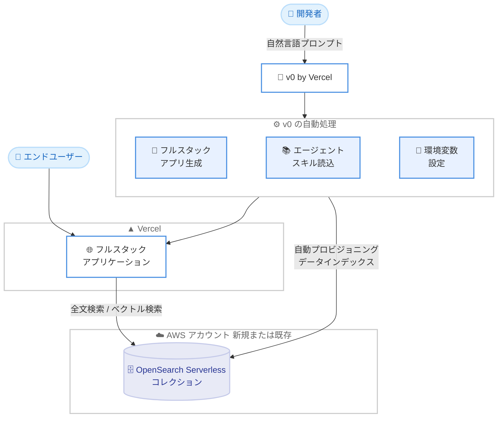

# Amazon OpenSearch Serverless - v0 by Vercel での利用開始

**リリース日**: 2026 年 9 月 10 日
**サービス**: Amazon OpenSearch Service (OpenSearch Serverless)
**機能**: v0 by Vercel における Amazon OpenSearch Serverless の統合

📊 [このアップデートのインフォグラフィックを見る](https://takech9203.github.io/aws-news-summary/20260910-amazon-opensearch-serverless-available-V0-vercel.html)

## 概要

Amazon OpenSearch Serverless が、Vercel が提供する AI 搭載アプリケーション開発プラットフォーム「v0」で利用可能になりました。v0 は自然言語プロンプトからプロダクションレディな Web アプリケーションを生成するプラットフォームであり、今回の統合により、v0 のインターフェースから離れることなく、OpenSearch Serverless を活用した全文検索や、RAG (検索拡張生成) ワークロード向けのベクトル検索を備えたフルスタックアプリケーションを数分で構築できるようになりました。

OpenSearch Serverless はインフラストラクチャ管理を不要にし、需要に応じてキャパシティを自動的にスケールアップ・スケールダウンするため、開発者はクラスターの管理ではなくアプリケーションの構築に集中できます。v0 で構築したいものを自然言語で記述するだけで、v0 が完全なフルスタックアプリケーションを生成し、OpenSearch Serverless コレクションの自動プロビジョニング、データのインデックス作成、検索クエリ配信のためのエンドポイント設定までを一括して処理します。

このアップデートは、検索機能や AI 機能を備えたプロトタイプ・アプリケーションを迅速に立ち上げたいフロントエンド開発者、スタートアップ、そして AI コーディングツールを活用した開発フローを採用するチームに特に有用です。

**アップデート前の課題**

- v0 などの AI アプリケーション生成プラットフォームで検索機能を実装する場合、検索バックエンドの選定・プロビジョニング・接続設定を開発者が手動で行う必要があった
- OpenSearch Serverless のコレクション作成、データのインデックス作成、エンドポイントや環境変数の設定など、アプリケーションコード以外の準備作業に時間がかかっていた
- AI が生成するコードが検索サービスの推奨パターンに沿っている保証がなく、手直しが必要になる場合があった

**アップデート後の改善**

- 自然言語プロンプトだけで、OpenSearch Serverless を検索バックエンドとするフルスタックアプリケーションを v0 上で数分で構築できるようになった
- v0 が OpenSearch Serverless コレクションの自動プロビジョニング、データのインデックス作成、エンドポイント設定、必要な環境変数の管理までを自動で処理するようになった
- v0 がプロバイダー固有のエージェントスキルを読み込み、OpenSearch Serverless の推奨パターンに従ったコードを生成するようになった
- 新規 AWS アカウントでのリソースプロビジョニングと、既存 AWS アカウントへのリンクの両方に対応した

## アーキテクチャ図



開発者が v0 に自然言語プロンプトを入力すると、v0 がフルスタックアプリケーションの生成、OpenSearch Serverless コレクションのプロビジョニング、データのインデックス作成、環境変数の設定までを自動で行い、生成されたアプリケーションが OpenSearch Serverless エンドポイント経由で検索クエリを実行します。

## サービスアップデートの詳細

### 主要機能

1. **自然言語プロンプトによるフルスタックアプリケーション構築**
   - v0 に構築したいアプリケーションを自然言語で記述するだけで、OpenSearch Serverless を組み込んだ完全なフルスタックアプリケーションを生成
   - 全文検索アプリケーションと、RAG ワークロード向けのベクトル検索アプリケーションの両方に対応
   - v0 のインターフェースから離れることなく構築が完結

2. **OpenSearch Serverless リソースの自動プロビジョニング**
   - v0 が OpenSearch Serverless コレクションを自動的に作成
   - ユーザーのデータをコレクションに自動でインデックス作成
   - OpenSearch Serverless エンドポイントを検索クエリの配信に使用するよう自動設定
   - 必要な環境変数と接続設定を v0 が自動で処理

3. **プロバイダー固有のエージェントスキル**
   - v0 が OpenSearch Serverless 向けのエージェントスキルを読み込み、推奨パターンに従ったコードを生成
   - 手動でのコード修正やベストプラクティスの調査にかかる時間を削減

4. **柔軟な AWS アカウント連携**
   - v0 へのプロンプトから新規 AWS アカウントでリソースをプロビジョニングする方法と、既存の AWS アカウントをリンクする方法の 2 つに対応
   - `https://v0.app/?pi=aws.opensearch` にアクセスすると、OpenSearch Serverless が事前選択された状態で開始可能

## 技術仕様

### 統合の構成要素

| 項目 | 詳細 |
|------|------|
| プラットフォーム | v0 by Vercel (AI 搭載 Web アプリケーション生成プラットフォーム) |
| 検索バックエンド | Amazon OpenSearch Serverless |
| 対応ワークロード | 全文検索、ベクトル検索 (RAG) |
| プロビジョニング | コレクション作成、データインデックス、エンドポイント設定を自動化 |
| アカウント連携 | 新規 AWS アカウントの作成、または既存 AWS アカウントのリンク |
| コード生成 | プロバイダー固有のエージェントスキルにより推奨パターンに準拠 |

### OpenSearch Serverless の特徴

| 項目 | 詳細 |
|------|------|
| インフラ管理 | 不要 (クラスター管理からの解放) |
| スケーリング | 需要に応じた自動スケールアップ・スケールダウン |
| ユースケース | 全文検索、ベクトル検索、RAG アプリケーション |

## 設定方法

### 前提条件

1. v0 (v0.app) のアカウント
2. AWS アカウント (新規作成する場合は v0 のフローで対応可能)

### 手順

#### ステップ 1: v0 で OpenSearch Serverless を選択して開始

```text
https://v0.app/?pi=aws.opensearch にアクセス
```

上記 URL にアクセスすると、Amazon OpenSearch Serverless が事前選択された状態で v0 を開始できます。通常の v0 (https://v0.app) から自然言語プロンプトで開始することも可能です。

#### ステップ 2: 自然言語プロンプトでアプリケーションを記述

```text
例: 「商品カタログを全文検索できる EC サイトの検索ページを作成して。
検索バックエンドには OpenSearch Serverless を使用して」
```

構築したいアプリケーションの内容を自然言語で記述します。v0 がフルスタックアプリケーションのコードを生成します。

#### ステップ 3: AWS アカウントの連携

v0 のプロンプトに従い、新規 AWS アカウントでのプロビジョニングを指示するか、既存の AWS アカウントをリンクします。v0 が OpenSearch Serverless コレクションのプロビジョニング、データのインデックス作成、環境変数の設定を自動で行います。

#### ステップ 4: 動作確認とデプロイ

生成されたアプリケーションの検索機能を v0 上で確認し、必要に応じてプロンプトで調整した後、Vercel にデプロイします。

## メリット

### ビジネス面

- **開発期間の大幅な短縮**: 検索・AI アプリケーションのプロトタイプから本番相当のアプリケーションまでを数分で構築でき、市場投入までの時間を短縮できる
- **インフラ運用コストの削減**: OpenSearch Serverless の自動スケーリングにより、クラスターのサイジングや運用にかかる人的コストが不要になる
- **参入障壁の低下**: 検索インフラの専門知識がないチームでも、高度な全文検索・ベクトル検索機能をアプリケーションに組み込める

### 技術面

- **セットアップの自動化**: コレクション作成、インデックス作成、エンドポイント設定、環境変数管理が自動化され、手作業による設定ミスを防げる
- **推奨パターンに準拠したコード生成**: プロバイダー固有のエージェントスキルにより、OpenSearch Serverless のベストプラクティスに沿ったコードが生成される
- **RAG ワークロードへの対応**: ベクトル検索に対応しているため、生成 AI アプリケーションの検索拡張生成 (RAG) バックエンドとしてすぐに利用できる

## デメリット・制約事項

### 制限事項

- 利用可能なリージョンは後述の 17 リージョンに限定される
- v0 by Vercel のアカウントとプラットフォームの利用が前提となる (v0 の料金体系が別途適用される)
- OpenSearch Serverless の利用料金は AWS 側で発生する (OpenSearch Compute Unit とストレージに基づく課金)

### 考慮すべき点

- 自動生成されたアプリケーションを本番運用する場合は、セキュリティ設定 (データアクセスポリシー、ネットワークポリシー) や IAM 権限の内容を確認することを推奨
- 既存 AWS アカウントをリンクする場合は、v0 に付与する権限の範囲を確認する必要がある
- 大規模・高負荷なワークロードでは、OpenSearch Serverless のキャパシティ上限やコスト特性を事前に評価することが望ましい

## ユースケース

### ユースケース 1: EC サイトの商品検索機能の迅速な構築

**シナリオ**: スタートアップが EC サイトに全文検索機能を追加したいが、検索インフラの専門家がいない。

**実装例**:
```text
v0 プロンプト:
「商品名・説明文・カテゴリで検索できる商品検索ページを作成して。
オートコンプリートとファセット絞り込みも追加して。
バックエンドは OpenSearch Serverless を使用」
```

**効果**: 検索インフラの構築・運用なしで、数分で全文検索機能を備えたアプリケーションを立ち上げられる。

### ユースケース 2: 社内ドキュメント検索の RAG アプリケーション

**シナリオ**: 社内ナレッジベースに対して、自然言語で質問できる RAG アプリケーションを構築したい。

**実装例**:
```text
v0 プロンプト:
「アップロードしたドキュメントをベクトル化して保存し、
質問に対して関連ドキュメントを検索して回答を生成する
RAG チャットアプリを作成して。
ベクトル検索には OpenSearch Serverless を使用」
```

**効果**: ベクトルデータベースのセットアップやインデックス設計を自動化し、RAG アプリケーションの構築を高速化できる。

### ユースケース 3: プロトタイプによる技術検証

**シナリオ**: 開発チームが OpenSearch Serverless の導入を検討しており、実際の検索体験を短期間で検証したい。

**実装例**:
```text
v0 プロンプト:
「サンプルデータセットを使った検索デモアプリを作成して。
検索結果のハイライトとスコア表示を含めて」
```

**効果**: インフラ構築の工数をかけずに、実データに近い形での検索体験の検証と関係者へのデモが可能になる。

## 料金

v0 との統合自体に追加料金はありませんが、以下の料金がそれぞれ発生します。

- **Amazon OpenSearch Serverless**: OpenSearch Compute Unit (OCU) 単位のコンピューティング料金と、マネージドストレージの料金が発生します。詳細は [Amazon OpenSearch Service の料金ページ](https://aws.amazon.com/opensearch-service/pricing/) を参照してください
- **v0 by Vercel**: v0 プラットフォームの利用料金は Vercel の料金体系に従います

## 利用可能リージョン

v0 で Amazon OpenSearch Serverless を使用した Vercel アプリを作成できるリージョンは以下の 17 リージョンです。

- 米国東部 (バージニア北部)
- 米国東部 (オハイオ)
- 米国西部 (オレゴン)
- 米国西部 (北カリフォルニア)
- カナダ (中部)
- 南米 (サンパウロ)
- 欧州 (アイルランド)
- 欧州 (ロンドン)
- 欧州 (パリ)
- 欧州 (フランクフルト)
- 欧州 (ストックホルム)
- アジアパシフィック (ムンバイ)
- アジアパシフィック (シンガポール)
- アジアパシフィック (シドニー)
- **アジアパシフィック (東京)**
- アジアパシフィック (ソウル)
- **アジアパシフィック (大阪)**

東京リージョンと大阪リージョンの両方が対象に含まれています。

## 関連サービス・機能

- **Amazon OpenSearch Service**: OpenSearch Serverless の基盤となるマネージド検索・分析サービス。プロビジョンドクラスター型のデプロイも選択可能
- **Amazon Bedrock Knowledge Bases**: RAG アプリケーション構築の代替手段。OpenSearch Serverless をベクトルストアとして利用可能
- **Vercel / v0**: フロントエンドのホスティングと AI によるアプリケーション生成を提供するプラットフォーム

## 参考リンク

- 📊 [インフォグラフィック](https://takech9203.github.io/aws-news-summary/20260910-amazon-opensearch-serverless-available-V0-vercel.html)
- [公式発表 (What's New)](https://aws.amazon.com/about-aws/whats-new/2026/09/amazon-opensearch-serverless-available-V0-vercel/)
- [Amazon OpenSearch Serverless ドキュメント](https://docs.aws.amazon.com/opensearch-service/latest/developerguide/serverless.html)
- [v0 by Vercel](https://v0.app)
- [v0 で OpenSearch Serverless を開始](https://v0.app/?pi=aws.opensearch)
- [Amazon OpenSearch Service 料金ページ](https://aws.amazon.com/opensearch-service/pricing/)

## まとめ

Amazon OpenSearch Serverless と v0 by Vercel の統合により、自然言語プロンプトだけで全文検索・ベクトル検索を備えたフルスタックアプリケーションを数分で構築できるようになりました。コレクションのプロビジョニングからデータのインデックス作成、環境変数の設定までが自動化されるため、検索・RAG アプリケーションのプロトタイピングや技術検証を検討しているチームは、まず v0 上で OpenSearch Serverless を試してみることを推奨します。
