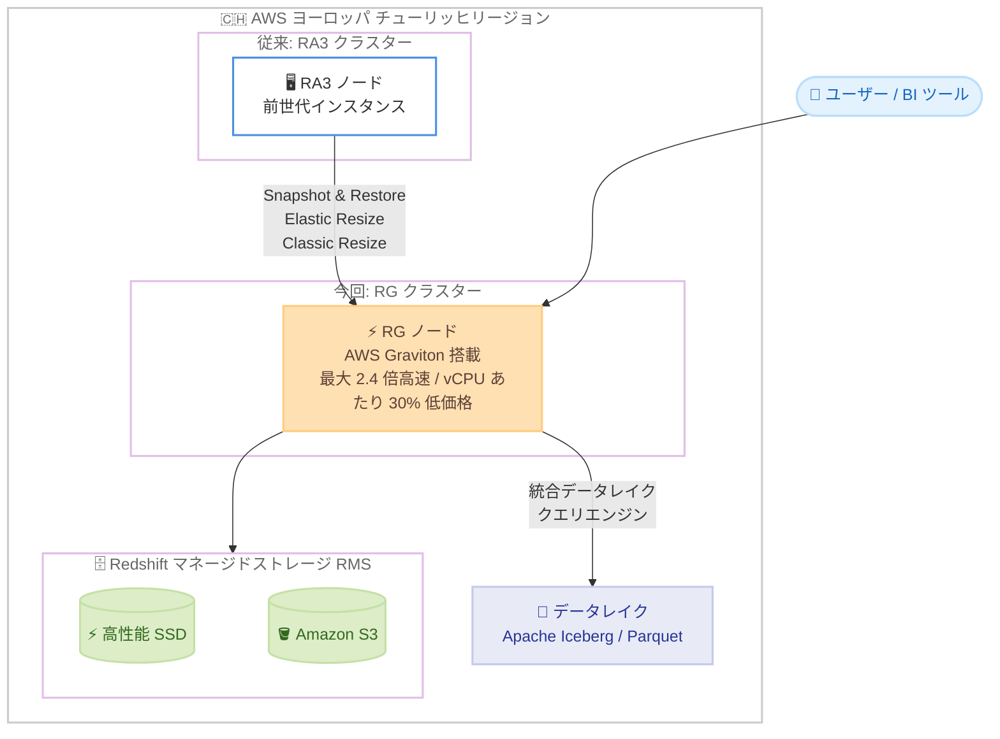

# Amazon Redshift - RG インスタンスがヨーロッパ (チューリッヒ) リージョンで利用可能に

**リリース日**: 2026 年 9 月 10 日
**サービス**: Amazon Redshift
**機能**: RG インスタンスのヨーロッパ (チューリッヒ) リージョン対応

📊 [このアップデートのインフォグラフィックを見る](https://takech9203.github.io/aws-news-summary/20260910-amazon-redshift-rg-available-zurich.html)

## 概要

AWS Graviton プロセッサを搭載した Amazon Redshift の RG インスタンスが、AWS ヨーロッパ (チューリッヒ) リージョンで利用可能になりました。RG インスタンスは、前世代の RA3 インスタンスと比較して、データウェアハウスおよびデータレイクワークロードの実行において最大 2.4 倍の高速なパフォーマンスを、vCPU あたり 30% 低い価格で提供します。

RG インスタンスには、Redshift 専用に構築されたベクトル化データレイククエリエンジンが含まれており、Apache Iceberg や Parquet のデータをクラスターノード上で直接処理します。これにより、データウェアハウスとデータレイクをまたぐ SQL 分析を単一のエンジンで実行できます。RG インスタンスは rg.large、rg.xlarge、rg.4xlarge、rg.12xlarge の 4 つのインスタンスサイズで提供されます。

チューリッヒリージョンでデータレジデンシー要件を満たしながら Redshift を運用しているユーザーは、既存の RA3 クラスターを Snapshot & Restore、Elastic Resize、Classic Resize のいずれかの方法で RG にアップグレードし、最新世代の価格性能をリージョン内で活用できるようになります。

**アップデート前の課題**

- チューリッヒリージョンでは RG インスタンスが利用できず、最新世代の Graviton ベースの価格性能を活用するには他リージョンを選択する必要があった
- スイス国内でのデータレジデンシー要件があるワークロードは、前世代の RA3 インスタンスを使い続ける必要があった
- RA3 クラスターでのデータレイククエリには Redshift Spectrum を使用する必要があり、統合データレイククエリエンジンをリージョン内で利用できなかった

**アップデート後の改善**

- チューリッヒリージョンで RG インスタンス (rg.large、rg.xlarge、rg.4xlarge、rg.12xlarge) を利用できるようになった
- データレジデンシー要件を維持したまま、RA3 比で最大 2.4 倍のパフォーマンスと vCPU あたり 30% 低い価格を享受できるようになった
- 既存の RA3 クラスターを Snapshot & Restore、Elastic Resize、Classic Resize でリージョン内のまま RG にアップグレードできるようになった

## アーキテクチャ図



チューリッヒリージョン内で既存の RA3 クラスターから RG クラスターへアップグレードできます。RG クラスターは Redshift マネージドストレージ (RMS) を利用し、統合データレイククエリエンジンにより Apache Iceberg や Parquet のデータも同じエンジンでクエリできます。

## サービスアップデートの詳細

### 主要機能

1. **チューリッヒリージョンでの RG インスタンス提供**
   - AWS ヨーロッパ (チューリッヒ) リージョンで RG インスタンスのクラスターを作成可能になった
   - rg.large、rg.xlarge、rg.4xlarge、rg.12xlarge の 4 つのインスタンスサイズを提供
   - オンデマンドに加え、1 年および 3 年のリザーブドインスタンス (全額前払い、一部前払い、前払いなし) を選択可能

2. **Graviton ベースの価格性能**
   - AWS Graviton プロセッサ搭載により、前世代 RA3 インスタンス比で最大 2.4 倍の高速なパフォーマンス
   - vCPU あたりの価格は RA3 比で 30% 低減

3. **統合データレイククエリエンジン**
   - Redshift 専用に構築されたベクトル化データレイククエリエンジンをクラスターノード上で実行
   - Apache Iceberg および Parquet データを単一エンジンで処理し、データウェアハウスとデータレイクを横断する SQL 分析が可能

4. **既存 RA3 クラスターからのアップグレードパス**
   - Snapshot & Restore: スナップショットから RG クラスターとして復元
   - Elastic Resize: クラスターを稼働させたまま短時間でノードタイプを変更
   - Classic Resize: 構成変更の自由度が高いリサイズ方式

## 技術仕様

### RG ノードタイプの仕様

| ノードタイプ | vCPU | RAM (GiB) | ノードあたり RMS 上限 | ノード数範囲 |
|------|------|------|------|------|
| rg.large | 2 | 16 | 8 TB (シングルノードは 1 TB) | 1〜16 |
| rg.xlarge | 4 | 32 | 32 TB | 2〜16 |
| rg.4xlarge | 16 | 128 | 128 TB | 2〜32 |
| rg.12xlarge | 48 | 384 | 128 TB | 2〜128 |

RMS は Redshift マネージドストレージを指します。最新の仕様は [RG インスタンスドキュメント](https://docs.aws.amazon.com/redshift/latest/mgmt/working-with-clusters.html#rs-rg-nodes-table) を参照してください。

### RA3 から RG へのアップグレード方式の比較

| 方式 | 特徴 | 適した場面 |
|------|------|------|
| Snapshot & Restore | スナップショットから新クラスターを作成。元クラスターは稼働継続 | 検証しながら段階的に移行したい場合 |
| Elastic Resize | 短いダウンタイムでノードタイプ・ノード数を変更 | 迅速に切り替えたい場合 |
| Classic Resize | 構成変更の自由度が高いが、時間がかかる場合がある | Elastic Resize で対応できない構成変更 |

### API変更履歴

今回のアップデートに伴う新規 API の追加はありません。既存の `CreateCluster` API やコンソールで、チューリッヒリージョンを対象に RG ノードタイプを指定することで利用できます。

## 設定方法

### 前提条件

1. AWS ヨーロッパ (チューリッヒ) リージョン (eu-central-2) を利用できる AWS アカウントであること
2. クラスターを起動する VPC およびクラスターサブネットグループがチューリッヒリージョンに準備されていること
3. RA3 からアップグレードする場合は、対象クラスターのスナップショットを取得しておくこと

### 手順

#### ステップ1: チューリッヒリージョンで RG クラスターを作成

```bash
aws redshift create-cluster \
  --region eu-central-2 \
  --cluster-identifier my-rg-cluster \
  --node-type rg.xlarge \
  --number-of-nodes 2 \
  --master-username awsuser \
  --master-user-password <パスワード> \
  --cluster-subnet-group-name my-subnet-group \
  --vpc-security-group-ids sg-xxxxxxxx
```

`--region eu-central-2` でチューリッヒリージョンを指定し、ノードタイプ `rg.xlarge`、ノード数 2 の RG クラスターを新規作成します。

#### ステップ2: 既存 RA3 クラスターからのアップグレード (Elastic Resize の例)

```bash
aws redshift resize-cluster \
  --region eu-central-2 \
  --cluster-identifier my-ra3-cluster \
  --node-type rg.xlarge \
  --number-of-nodes 2
```

既存の RA3 クラスターに対して Elastic Resize を実行し、ノードタイプを RG に変更します。対応可能な構成は [アップグレードガイド](https://docs.aws.amazon.com/redshift/latest/mgmt/managing-cluster-considerations.html#rs-upgrading-to-ra3) で確認してください。

#### ステップ3: クラスターの状態確認

```bash
aws redshift describe-clusters \
  --region eu-central-2 \
  --cluster-identifier my-rg-cluster \
  --query "Clusters[0].{Status:ClusterStatus,NodeType:NodeType,Nodes:NumberOfNodes}"
```

クラスターのステータスが `available` になっていること、ノードタイプとノード数が意図した構成であることを確認します。

## メリット

### ビジネス面

- **データレジデンシーと最新性能の両立**: スイス国内にデータを保持する要件を満たしながら、最新世代 RG インスタンスの価格性能を活用できる
- **コスト削減**: vCPU あたり RA3 比 30% 低い価格に加え、リザーブドインスタンスによる追加割引を選択できる
- **移行の柔軟性**: 複数のアップグレード方式と柔軟な支払いオプションにより、組織の計画に合わせた移行が可能

### 技術面

- **パフォーマンス向上**: Graviton ベースの RG インスタンスにより、RA3 比で最大 2.4 倍の高速なワークロード実行が可能
- **データレイク分析の統合**: 統合データレイククエリエンジンにより、Iceberg / Parquet データへのクエリをクラスターノード上で直接実行できる
- **既存資産の活用**: Snapshot & Restore や Resize により、既存クラスターのデータを保持したままアップグレードできる

## デメリット・制約事項

### 制限事項

- RG インスタンスは提供リージョンが限定されており、全リージョンで利用できるわけではない
- rg.xlarge 以上はマルチノード構成 (最小 2 ノード) が必要 (シングルノードは rg.large のみ対応)
- リサイズ方式 (Elastic Resize / Classic Resize) の対応状況は現在の構成により異なる

### 考慮すべき点

- RA3 用に購入済みのリザーブドノードは RG には適用されないため、移行タイミングと予約期間の整合を確認する
- アップグレード方式ごとのダウンタイムや所要時間を検証環境で確認してから本番に適用する
- パフォーマンス向上 (最大 2.4 倍) はワークロードにより異なるため、実データでの検証を推奨

## ユースケース

### ユースケース1: スイス国内のデータレジデンシー要件を持つ分析基盤の刷新

**シナリオ**: 金融機関などの規制対象組織が、スイス国内にデータを保持する要件を満たしつつ、老朽化した RA3 ベースの分析基盤を刷新したい。

**実装例**:
```bash
# 既存 RA3 クラスターのスナップショットから RG クラスターを作成して検証
aws redshift restore-from-cluster-snapshot \
  --region eu-central-2 \
  --cluster-identifier rg-validation-cluster \
  --snapshot-identifier my-ra3-snapshot \
  --node-type rg.xlarge \
  --number-of-nodes 2
```

**効果**: データをチューリッヒリージョンから移動させることなく、最新世代の性能とコスト効率を検証・導入できる。

### ユースケース2: RA3 クラスターの段階的アップグレード

**シナリオ**: チューリッヒリージョンで本番運用中の RA3 クラスターを、ダウンタイムを最小化しながら RG にアップグレードしたい。

**実装例**:
```bash
# Elastic Resize で RA3 から RG へ切り替え
aws redshift resize-cluster \
  --region eu-central-2 \
  --cluster-identifier prod-dwh \
  --node-type rg.4xlarge \
  --number-of-nodes 4
```

**効果**: 短いダウンタイムで最新世代へ移行し、以後のクエリ性能向上と vCPU あたりのコスト削減を実現できる。

### ユースケース3: データウェアハウスとデータレイクの統合分析

**シナリオ**: チューリッヒリージョンの S3 上にある Apache Iceberg / Parquet データと、Redshift 内のデータを横断して分析したい。

**実装例**:
```sql
-- 統合データレイククエリエンジンで S3 上の Iceberg テーブルと DWH テーブルを結合
SELECT c.customer_segment, SUM(s.sales_amount)
FROM datalake_db.iceberg_sales s
JOIN dwh_schema.customers c ON s.customer_id = c.customer_id
WHERE s.sale_date >= '2026-08-01'
GROUP BY c.customer_segment;
```

**効果**: Spectrum を介さず単一エンジンでデータレイクとデータウェアハウスを横断する SQL 分析を実行でき、アーキテクチャを簡素化できる。

## 料金

Amazon Redshift プロビジョンドクラスターは、ノードタイプとノード数に基づくコンピュート課金と、Redshift マネージドストレージ (RMS) の使用量に基づくストレージ課金で構成されます。RG インスタンスは RA3 と比較して vCPU あたり 30% 低い価格で提供されます。

チューリッヒリージョンの RG インスタンスでは、以下の柔軟な料金オプションを利用できます。

| 料金オプション | 内容 |
|------|------|
| オンデマンド | 秒単位の従量課金。コミットメントなし |
| 1 年リザーブドインスタンス | 全額前払い、一部前払い、前払いなしから選択可能 |
| 3 年リザーブドインスタンス | 全額前払い、一部前払い、前払いなしから選択可能 |

リージョンごとの具体的な料金は [Amazon Redshift 料金ページ](https://aws.amazon.com/redshift/pricing/) を参照してください。

## 利用可能リージョン

今回のアップデートにより、RG インスタンスは AWS ヨーロッパ (チューリッヒ) リージョン (eu-central-2) で利用可能になりました。

既存の提供リージョンには、米国東部 (バージニア北部)、米国東部 (オハイオ)、米国西部 (北カリフォルニア)、米国西部 (オレゴン)、アジアパシフィック (東京、ソウル、大阪ほか)、ヨーロッパ (フランクフルト、ストックホルム、スペイン、アイルランド、ロンドン、パリ) などが含まれます。最新の対応状況は [Amazon Redshift 料金ページ](https://aws.amazon.com/redshift/pricing/) で確認してください。

## 関連サービス・機能

- **AWS Graviton**: RG インスタンスに搭載される AWS 設計の ARM ベースプロセッサ。高い価格性能を実現
- **Amazon Redshift マネージドストレージ (RMS)**: 高性能 SSD と Amazon S3 を組み合わせたストレージレイヤー。コンピュートとストレージを独立してスケール可能
- **Apache Iceberg / Amazon S3**: 統合データレイククエリエンジンのクエリ対象となるオープンテーブルフォーマットとストレージ
- **Amazon Redshift Serverless**: クラスター管理が不要なサーバーレスオプション。断続的なワークロードでは比較検討の対象となる

## 参考リンク

- 📊 [インフォグラフィック](https://takech9203.github.io/aws-news-summary/20260910-amazon-redshift-rg-available-zurich.html)
- [公式発表 (What's New)](https://aws.amazon.com/about-aws/whats-new/2026/09/amazon-redshift-rg-available-zurich)
- [Amazon Redshift RG インスタンスドキュメント (ノードタイプ詳細)](https://docs.aws.amazon.com/redshift/latest/mgmt/working-with-clusters.html#rs-rg-nodes-table)
- [RA3 から RG へのアップグレードガイド](https://docs.aws.amazon.com/redshift/latest/mgmt/managing-cluster-considerations.html#rs-upgrading-to-ra3)
- [Amazon Redshift 料金ページ](https://aws.amazon.com/redshift/pricing/)

## まとめ

Graviton ベースの最新世代 RG インスタンスがチューリッヒリージョンに拡大し、スイス国内のデータレジデンシー要件を持つワークロードでも RA3 比最大 2.4 倍のパフォーマンスと vCPU あたり 30% 低い価格を活用できるようになりました。チューリッヒリージョンで RA3 クラスターを運用しているチームは、まず Snapshot & Restore による検証環境で実データを使った性能・コスト評価を行い、Elastic Resize などによる本番移行を計画することを推奨します。
