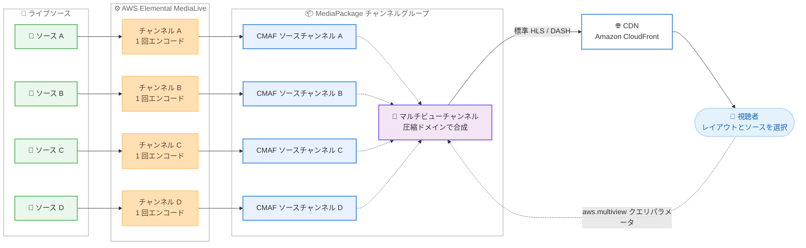

# AWS Elemental - Dynamic Multiview for live video

**リリース日**: 2026 年 9 月 10 日
**サービス**: AWS Elemental MediaPackage / AWS Elemental MediaLive
**機能**: Dynamic Multiview (ライブ映像のサーバーサイドマルチビュー合成)

📊 [このアップデートのインフォグラフィックを見る](https://takech9203.github.io/aws-news-summary/20260910-aws-elemental-dynamic-multiview-video.html)

## 概要

AWS Elemental MediaPackage に Dynamic Multiview が追加されました。Dynamic Multiview は、複数のライブ映像ソースを視聴者が選択したタイル状レイアウトにサーバーサイドで合成する機能です。コンテンツプロバイダーは、マルチアングル視聴、複数試合の同時視聴、パーソナライズされた視聴体験を、標準の HLS (HTTP Live Streaming) および DASH (Dynamic Adaptive Streaming over HTTP) ストリームとして配信できます。出力は標準規格のストリームであるため、最新のコンシューマーデバイス、テレビ、セットトップボックスの多くで、カスタムプレイヤー開発なしにそのまま再生できます。

Dynamic Multiview は完全に圧縮ドメインで動作し、個別にエンコードされたソースを再エンコードやコンポジット処理なしで結合します。各ソースは AWS Elemental MediaLive で 1 回だけエンコードし、MediaPackage が視聴者からのリクエスト時にオンデマンドで合成するため、組み合わせごとの事前エンコードは不要です。AVC (H.264) と HEVC (H.265) の両コーデック、DRM 暗号化、SCTE-35 広告マーカーのパススルー、フルスクリーン広告置換をサポートします。

スポーツ中継の複数カメラアングル配信や、複数試合を 1 画面で同時視聴するスポーツバー向け体験など、ライブ配信事業者にとって新しい視聴体験を低コストで実現できるアップデートです。

**アップデート前の課題**

- マルチビュー体験を提供するには、レイアウトの組み合わせごとに映像を事前合成して再エンコードする必要があり、組み合わせ数に比例してエンコードコストが増大した
- クライアントサイドで複数ストリームを合成する場合、カスタムプレイヤーや SDK の開発が必要で、複数ストリームの同時デコードによりデバイス側の負荷や互換性の問題が発生した
- 複数ビュー間の映像同期を維持する仕組みを独自に構築する必要があった

**アップデート後の改善**

- 各ソースを MediaLive で 1 回エンコードするだけで、MediaPackage が視聴者のリクエストに応じてオンデマンドでレイアウトを合成するため、エンコードコストがソース数にのみ比例する
- 出力は単一ビデオトラックの標準 HLS / DASH ストリームであり、既存のプレイヤーとデバイスでアプリ変更や SDK 統合なしに再生できる
- ソースは時間整列されたセグメントとして配信されるため、合成フレーム内のすべてのビューが同期を維持する
- 単一の DRM キーですべてのレイアウトをカバーでき、各ビューの音声・字幕トラックはマニフェスト内の選択可能なレンディションとして提供される

## アーキテクチャ図



各ソースは MediaLive チャンネルで 1 回だけエンコードされ、同一の MediaPackage チャンネルグループ内の CMAF ソースチャンネルに CMAF Ingest で配信されます。マルチビューチャンネルは視聴者がプレイバック URL のクエリパラメータで指定したレイアウトとソースの組み合わせを、リクエスト時に圧縮ドメインで合成して単一の HLS / DASH ストリームとして返します。

## サービスアップデートの詳細

### 主要機能

1. **圧縮ドメインでのオンデマンド合成**
   - MediaPackage はデコード、コンポジット、再エンコードを行わず、個別にエンコード済みのレンディションを圧縮ドメインで結合する
   - 合成は視聴者がリクエストしたときにのみ実行され、レイアウトの組み合わせを事前にエンコードする必要がない
   - エンコードコストは視聴者が要求できる組み合わせ数ではなく、ソースフィード数に比例する

2. **6 種類のプリセットレイアウト**
   - 等サイズレイアウト: 2EH (2 画面横並び)、3EL (左 1 + 右 2)、4E (2×2 グリッド)
   - プライマリ / セカンダリレイアウト: 2PL、3PL、4PL (左に大きなプライマリビュー、右にセカンダリビュー)
   - プライマリ / セカンダリレイアウトでは、セカンダリビューはプライマリビューのちょうど半分の幅と高さになる
   - 4E 以外のレイアウトでは、16:9 のアスペクト比を保つために黒帯パディングが挿入される

3. **標準プレイヤーでの再生**
   - 出力は H.264 (AVC) または H.265 (HEVC) の単一ビデオトラックを持つ標準 HLS / DASH ストリーム
   - カスタムプレイヤー、クライアントサイド合成、追加 SDK は不要で、単一の DRM キーですべてのレイアウトをカバーする
   - プレイヤーはプレイバック URL に `aws.multiview` クエリパラメータを付与するだけでレイアウトを選択でき、再生中のレイアウト変更も可能

4. **全ビューの音声・字幕の選択再生**
   - すべてのビューの音声・字幕トラックがマニフェスト内の選択可能なレンディションとして提供される
   - 視聴者は映像レイアウトを変えずに、任意のビューの音声や字幕に切り替えられる
   - 各レンディションには `View1_English` のようにビュー位置がプレフィックスとして付与され、どのビューに属するかを識別できる

5. **広告対応とソース断への耐性**
   - プライマリビューの SCTE-35 メッセージに基づくフルスクリーン広告置換をサポート
   - ソースが利用できない場合、該当ビューは黒映像、音声は無音、字幕は空で代替され、ストリームは継続する

## 技術仕様

### レイアウト一覧

| レイアウト | ビュー数 | 配置 | ビューサイズ |
|-----------|---------|------|------------|
| 2EH | 2 | 2 画面横並び、上下に黒帯 | 等サイズ |
| 3EL | 3 | 左 1 画面 + 右 2 画面縦積み | 等サイズ |
| 4E | 4 | 2×2 グリッド、パディングなし | 等サイズ |
| 2PL | 2 | 左に大きなプライマリ + 右に 1 画面 | プライマリはセカンダリの 2 倍 |
| 3PL | 3 | 左に大きなプライマリ + 右に 2 画面縦積み | プライマリはセカンダリの 2 倍 |
| 4PL | 4 | 左に大きなプライマリ + 右に 3 画面縦積み | プライマリはセカンダリの 2 倍 |

### 主な要件

| 項目 | 詳細 |
|------|------|
| エンコーダー | AWS Elemental MediaLive 必須 (サードパーティエンコーダーは非対応) |
| ソースチャンネル | CMAF 入力タイプ、epoch-locked 出力ロックモード、マルチビューチャンネルと同一チャンネルグループ |
| マルチビューチャンネル | 入力タイプ `MULTIVIEW`、epoch-locked 必須、自身へのインジェストは持たない |
| コーデック | H.264 (AVC) または H.265 (HEVC)。同一マルチビュー内では同一コーデックのみ結合可能。AV1 は非対応 |
| フレームレート | 結合するソース間で一致が必要 |
| ソース数 | 1 レイアウトあたり 2 〜 4 フィード |
| MediaLive 出力 | MediaPackage V2 宛の CMAF Ingest 出力グループ。`outputUsage` フィールドでマルチビュー用途を宣言 |
| 解像度制約 | H.264 は幅・高さが 16 の倍数、H.265 は 32 の倍数。プライマリはセカンダリのちょうど 2 倍の幅・高さ |
| SCTE-35 | `scte35Type` は NONE または SCTE_35_WITHOUT_IDR |

### API 変更履歴

| 日付 | サービス | 変更内容 |
|------|----------|----------|
| 2026/09/09 | [AWS Elemental MediaPackage v2](https://awsapichanges.com/archive/changes/49ca08-mediapackagev2.html) | 4 updated api methods - 入力タイプ `MULTIVIEW` と `AvailableLayouts` / `AvailableSources` の設定を追加 |
| 2026/09/09 | [AWS Elemental MediaLive](https://awsapichanges.com/archive/changes/49ca08-medialive.html) | 9 updated api methods - MediaPackage v2 出力への `outputUsage` フィールド追加 (Dynamic Multiview バリデーション用) を含む |

### プレイバック URL の形式

視聴者は `aws.multiview` クエリパラメータでレイアウトとソースを指定します。

```text
aws.multiview=layout:<レイアウト>;sources:<ソース1>,<ソース2>,...
```

- `layout`: チャンネルの `AvailableLayouts` で宣言済みのレイアウト。URL では `LAYOUT_` プレフィックスを省略する (`layout:4E`)
- `sources`: ソースチャンネル名のカンマ区切りリスト。数はレイアウトのビュー数と一致が必要で、記載順が V1 〜 V4 の配置順になる
- パラメータは URL エンコードが必要

```text
https://<egress-domain>/out/v1/exampleChannelGroup/exampleMultiviewChannel/hls/index.m3u8?aws.multiview=layout%3A4E%3Bsources%3Acam1%2Ccam2%2Ccam3%2Ccam4
```

## 設定方法

### 前提条件

1. AWS Elemental MediaLive で各ソースフィードをエンコードするチャンネルを用意していること
2. MediaPackage V2 のチャンネルグループを作成済みであること
3. MediaLive の各出力がマルチビュー互換のエンコード制約 (解像度の倍数制約、GOP 設定、`outputUsage` 宣言など) を満たしていること

### 手順

#### ステップ 1: ソースチャンネルの作成

```bash
aws mediapackagev2 create-channel \
  --channel-group-name exampleChannelGroup \
  --channel-name cam1 \
  --input-type CMAF
```

カメラアングルまたはイベントごとに CMAF、epoch-locked のソースチャンネルを作成し、MediaLive チャンネルの CMAF Ingest 出力先としてインジェストエンドポイントを指定します。出力ロックモードはチャンネル作成時に固定されるため、epoch-locked でない既存の CMAF チャンネルはマルチビューソースとして使用できません。

#### ステップ 2: マルチビューチャンネルの作成

```bash
aws mediapackagev2 create-channel \
  --channel-group-name exampleChannelGroup \
  --channel-name exampleMultiviewChannel \
  --input-type MULTIVIEW \
  --multiview-configuration '{
      "AvailableSources": ["cam1", "cam2", "cam3", "cam4"],
      "AvailableLayouts": ["LAYOUT_4E", "LAYOUT_3PL", "LAYOUT_2EH"]
  }'
```

入力タイプ `MULTIVIEW` のチャンネルを作成し、使用可能なソースチャンネル (`AvailableSources`) と視聴者がリクエストできるレイアウト (`AvailableLayouts`) を宣言します。マルチビューチャンネルは各ソースチャンネルの `AttachedMultiviewChannels` プロパティに追加され、参照されている間はソースチャンネルを削除できません。

#### ステップ 3: オリジンエンドポイントの作成と再生確認

マルチビューチャンネルにオリジンエンドポイントを作成します。マルチビューエンドポイントは CMAF または TS コンテナの HLS と、CMAF コンテナの DASH を提供します。HLS マニフェストの `UrlEncodeChildManifest` 設定はデフォルトの `true` のまま維持してください (`false` にすると HLS 再生が失敗します)。プレイバック URL に `aws.multiview` クエリパラメータを付与して、目的のレイアウトで再生できることを確認します。

## メリット

### ビジネス面

- **新しい視聴体験の提供**: マルチアングル視聴、複数試合の同時視聴、パーソナライズされたレイアウトなど、スポーツやライブイベントで差別化された体験を提供できる
- **コスト効率**: エンコードコストがソース数にのみ比例し、レイアウトの組み合わせ数が増えても事前エンコードのコストが発生しない
- **市場投入の速さ**: 既存デバイスとプレイヤーでそのまま再生できるため、クライアントアプリの改修や SDK 統合なしにマルチビュー機能をローンチできる

### 技術面

- **サーバーサイド合成**: クライアントサイドの複数ストリームデコードが不要で、デバイスの性能や互換性に依存しない
- **同期保証**: 時間整列されたセグメントにより、すべてのビューがフレームレベルで同期を維持する
- **運用の簡素化**: MediaLive と MediaPackage の既存機能として提供されるため、新しいサービスのオンボーディングが不要。DRM は単一キーで全レイアウトをカバーし、マニフェストフィルタリング (言語プルーニング、ビットレートキャップ) にも対応

## デメリット・制約事項

### 制限事項

- Low-Latency HLS は非対応
- Microsoft Smooth Streaming (ISM コンテナ) は非対応
- ハーベストジョブおよび Live-to-VOD は非対応
- タイムシフト再生 (`start` / `end` パラメータ、startover ウィンドウ、`EXT-X-START`) は非対応。タイムディレイは最大 24 時間まで
- マニフェストウィンドウは最大 900 秒 (15 分)
- I-frame only プレイリストとトリックプレイトラックは非対応
- ビューごとの個別 DRM キーは非対応 (単一キーのみ)
- AVC と HEVC のソースを同一マルチビュー内で混在できない。AV1 は非対応
- SCTE-35 はプライマリビューのメッセージのみ処理され、セグメント内配信の SCTE-35 は非対応
- MQCS ベースの入力切り替えと CMSD での MQCS 発行はマルチビューチャンネルで利用不可

### 考慮すべき点

- エンコーダーは MediaLive 必須で、サードパーティエンコーダーの出力はソースとして使用できない
- MediaLive 側で厳格なエンコード制約 (解像度の倍数、GOP 設定固定、シーンチェンジ検出無効化など) を満たす必要があり、既存チャンネル設定の見直しが必要になる場合がある
- レイアウトとソース順の組み合わせごとに CDN 上では別オブジェクトになるため、`aws.multiview` クエリパラメータをキャッシュキーに含める設定が必要。組み合わせが多い場合はアプリケーション側で提供する組み合わせを絞り、キャッシュ効率を維持することが推奨される
- 各ビューには圧縮アーティファクトの混入を防ぐ黒枠ボーダーが MediaLive で付与され、隣接ビュー間では両者のボーダーが合算されて表示される

## ユースケース

### ユースケース 1: スポーツ中継のマルチアングル視聴

**シナリオ**: サッカー中継で、メイン映像に加えてゴール裏カメラ、戦術カメラ、ベンチカメラの 4 アングルを提供し、視聴者が好みのアングルを大きく表示できるようにしたい。

**実装例**:
```text
4 つの MediaLive チャンネルで各カメラをエンコードし、
マルチビューチャンネルに LAYOUT_4PL を宣言。
プレイヤーは視聴者の選択に応じて sources の順序を変えてリクエスト:
aws.multiview=layout:4PL;sources:tactical,main,goal,bench
```

**効果**: 視聴者ごとにパーソナライズされたアングル選択体験を、単一のエンコードセットとカスタムプレイヤー開発なしで提供できる。

### ユースケース 2: 複数試合の同時視聴

**シナリオ**: リーグ最終節で複数試合が同時開催されるため、4 試合を 2×2 グリッドで同時視聴できる「マルチゲームチャンネル」を提供したい。

**実装例**:
```text
各試合の MediaLive チャンネルを同一チャンネルグループに配信し、
LAYOUT_4E でリクエスト:
aws.multiview=layout:4E;sources:game1,game2,game3,game4
音声は View1_〜View4_ プレフィックス付きレンディションから視聴者が選択
```

**効果**: 順位争いに関わる全試合を 1 画面で追える体験を提供し、視聴時間とエンゲージメントを向上できる。映像レイアウトを維持したまま注目試合の音声に切り替え可能。

### ユースケース 3: ニュース・選挙特番のマルチソース配信

**シナリオ**: 選挙特番で、スタジオ映像を大きく表示しながら各地の開票所中継 2 か所を並べて表示したい。広告時にはフルスクリーン広告に置き換えたい。

**実装例**:
```text
LAYOUT_3PL でスタジオをプライマリに配置:
aws.multiview=layout:3PL;sources:studio,site-a,site-b
プライマリビュー (studio) の SCTE-35 マーカーに基づき
フルスクリーン広告置換を実施
```

**効果**: 複数拠点の映像を同期した状態で 1 ストリームとして配信しつつ、既存の SSAI ワークフローによる収益化を維持できる。

## 料金

Dynamic Multiview は AWS Elemental MediaLive と MediaPackage の機能として提供されます。各ソースフィードのエンコードに対する MediaLive の料金と、MediaPackage のインジェストおよび配信に対する料金が適用されます。エンコードは組み合わせ数ではなくソース数に比例するため、提供するレイアウトの組み合わせを増やしてもエンコード費用は増加しません。最新の料金詳細は各サービスの料金ページを参照してください。

- [AWS Elemental MediaPackage 料金](https://aws.amazon.com/mediapackage/pricing/)
- [AWS Elemental MediaLive 料金](https://aws.amazon.com/medialive/pricing/)

## 利用可能リージョン

AWS Elemental MediaPackage と AWS Elemental MediaLive の両方が利用可能なすべての AWS リージョンで利用できます。

## 関連サービス・機能

- **AWS Elemental MediaLive**: 各ソースフィードをマルチビュー互換のエンコード制約で 1 回エンコードし、CMAF Ingest で MediaPackage に配信する
- **AWS Elemental MediaPackage (V2)**: ソースチャンネルとマルチビューチャンネルをホストし、視聴者のリクエストに応じて圧縮ドメインで合成する
- **Amazon CloudFront**: マルチビューストリームの配信に使用。`aws.multiview` クエリパラメータをキャッシュキーに含める設定が必要
- **AWS Elemental MediaTailor**: SCTE-35 マーカーと組み合わせたサーバーサイド広告挿入 (SSAI) ワークフローで併用可能

## 参考リンク

- 📊 [インフォグラフィック](https://takech9203.github.io/aws-news-summary/20260910-aws-elemental-dynamic-multiview-video.html)
- [公式発表 (What's New)](https://aws.amazon.com/about-aws/whats-new/2026/09/aws-elemental-dynamic-multiview-video/)
- [Dynamic Multiview (MediaLive ユーザーガイド)](https://docs.aws.amazon.com/medialive/latest/ug/dynamic-multiview.html)
- [Dynamic Multiview: MediaLive Configuration Reference](https://docs.aws.amazon.com/medialive/latest/ug/dynamic-multiview-reference.html)
- [Dynamic Multiview (MediaPackage ユーザーガイド)](https://docs.aws.amazon.com/mediapackage/latest/userguide/dynamic-multiview.html)
- [AWS Elemental MediaPackage 料金](https://aws.amazon.com/mediapackage/pricing/)

## まとめ

Dynamic Multiview は、複数のライブ映像を視聴者選択のレイアウトでサーバーサイド合成し、標準 HLS / DASH ストリームとして既存デバイスに配信できる機能です。エンコードはソースごとに 1 回で済み、カスタムプレイヤー開発も不要なため、マルチアングルや複数試合同時視聴といった体験を低コストかつ短期間で実現できます。ライブスポーツやイベント配信を手がける事業者は、MediaLive のエンコード制約と MediaPackage の epoch-locked CMAF チャンネル要件を確認した上で、検証環境での試用を推奨します。
