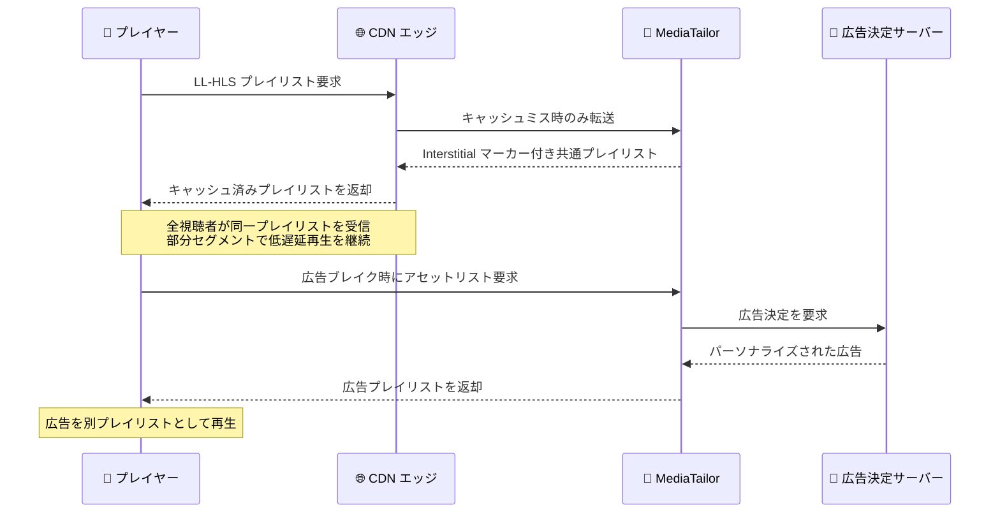

# AWS Elemental MediaTailor - Low-Latency HLS 広告挿入のサポート

**リリース日**: 2026 年 9 月 10 日
**サービス**: AWS Elemental MediaTailor
**機能**: Low-Latency HLS (LL-HLS) 広告挿入 (HLS Interstitials 使用)

📊 [このアップデートのインフォグラフィックを見る](https://takech9203.github.io/aws-news-summary/20260910-aws-elemental-mediatailor-low-latency-hls-ad-insertion.html)

## 概要

AWS Elemental MediaTailor が、HLS Interstitials を使用した Low-Latency HTTP Live Streaming (LL-HLS) への広告挿入をサポートしました。MediaTailor は、ライブストリーム、リニアチャンネル、ビデオオンデマンド (VOD) コンテンツを収益化するための、チャンネルアセンブリとパーソナライズド広告挿入のサービスです。今回のアップデートにより、映像配信事業者は視聴者が期待する低遅延を維持したまま、低遅延ライブストリームに広告を挿入できるようになりました。

LL-HLS は、部分セグメントの配信と、次のセグメントパートが準備できるまでプレイヤーがプレイリストリクエストを保持し続ける仕組みによってライブ配信の遅延を削減します。この方式では、メディアプレイリストが CDN エッジでキャッシュ可能であることが必要です。MediaTailor は HLS Interstitials を使用してこの要件に対応します。広告を各視聴者のメディアプレイリストにステッチするのではなく、別プレイリストとして参照するため、すべての視聴者が同一のキャッシュ可能なプレイリストを受け取ります。これにより MediaTailor は大規模配信でも低遅延再生を維持し、広告決定サーバー (ADS) への呼び出しをマニフェストリクエストのパスから切り離します。

この機能は、数百万視聴規模のライブスポーツイベントの本番環境で実証済みであり、ライブスポーツ、ニュース、ベッティング、ウォッチパーティー、インタラクティブなライブ形式など、遅延が製品要件となるユースケースに最適です。

**アップデート前の課題**

- 従来のステッチ型サーバーサイド広告挿入 (SSAI) では、視聴者ごとにパーソナライズされたマニフェストを生成するため、CDN エッジでのプレイリストキャッシュが困難だった
- LL-HLS はプレイリストの CDN エッジキャッシュを前提とするため、低遅延ライブ配信と SSAI による広告挿入の両立が難しかった
- 広告決定サーバーへの呼び出しがマニフェストリクエストのパス上にあり、大規模ライブイベントでの応答遅延の要因となり得た

**アップデート後の改善**

- HLS Interstitials により広告を別プレイリストとして参照することで、すべての視聴者が同一のキャッシュ可能なプレイリストを受け取り、LL-HLS の低遅延を維持したまま広告挿入が可能になった
- ADS 呼び出しがマニフェストリクエストのパスから分離され、大規模配信時もマニフェスト応答が高速に保たれるようになった
- 低遅延が求められるライブスポーツやベッティングなどの配信でも、パーソナライズド広告による収益化が可能になった

## アーキテクチャ図



サーバーガイド型広告挿入 (SGAI) では、広告が別プレイリストとして参照されるため、メディアプレイリストは全視聴者で共通となり CDN エッジでキャッシュ可能です。ADS 呼び出しはマニフェストリクエストとは別のパスで行われます。

## サービスアップデートの詳細

### 主要機能

1. **HLS Interstitials による LL-HLS 広告挿入**
   - 広告を各視聴者のメディアプレイリストにステッチせず、別プレイリストとして参照する方式で挿入
   - すべての視聴者が同一のプレイリストを受け取るため、CDN エッジでのキャッシュが可能
   - LL-HLS が要求するプレイリストのキャッシュ可能性を満たし、低遅延再生を大規模に維持

2. **ADS 呼び出しのマニフェストパスからの分離**
   - 広告決定サーバーへの呼び出しがマニフェストリクエストの処理パスから切り離される
   - マニフェスト応答の遅延要因を排除し、ピーク時の応答性能を確保

3. **大規模ライブイベントでの実績**
   - 数百万視聴規模のライブスポーツイベントの本番環境で実証済み
   - 低遅延と高いスケーラビリティの両立を実現

## 技術仕様

### LL-HLS と広告挿入方式の比較

| 項目 | ステッチ型 SSAI | SGAI (HLS Interstitials) |
|------|----------------|--------------------------|
| マニフェスト | 視聴者ごとにパーソナライズ | 全視聴者で共通 |
| CDN エッジキャッシュ | 困難 | 可能 |
| LL-HLS との親和性 | 低い | 高い |
| ADS 呼び出し | マニフェストリクエストのパス上 | マニフェストパスから分離 |
| 広告の参照方法 | メディアプレイリストに直接挿入 | 別プレイリストとして参照 |

### 設定パラメータ

サーバーガイド型広告挿入を利用するには、MediaTailor の再生設定 (Playback Configuration) で `Insertion Mode` を `PLAYER_SELECT` に設定します。これにより、プレイヤーはセッション初期化時にステッチ型 (`STITCHED`) とガイド型 (`GUIDED`) のいずれかを選択できます。

```json
{
  "insertionMode": "GUIDED"
}
```

明示的セッションの場合、プレイヤーはセッション初期化エンドポイントへの HTTP POST の JSON メタデータに上記の `insertionMode` を含めます。

## 設定方法

### 前提条件

1. AWS Elemental MediaTailor の再生設定が作成済みであること
2. LL-HLS に対応したオリジン (パッケージャー) と CDN が構成されていること
3. プレイヤーが HLS Interstitials に対応していること

### 手順

#### ステップ 1: 再生設定で Insertion Mode を設定する

MediaTailor コンソールまたは API で、再生設定の `Insertion Mode` を `PLAYER_SELECT` に設定します。これにより、プレイヤーがセッション初期化時にガイド型広告挿入を選択できるようになります。

#### ステップ 2: サーバーガイド型セッションを作成する (暗黙的セッション)

```bash
# HLS マルチバリアントプレイリストのリクエストにクエリパラメータを付与する
curl "https://<playback-endpoint>/v1/master/<hashed-account-id>/<origin-id>/index.m3u8?aws.insertionMode=GUIDED"
```

HLS マルチバリアントプレイリストのリクエスト URL に `aws.insertionMode=GUIDED` を付与することで、暗黙的にサーバーガイド型セッションを作成します。`playback-endpoint` は再生設定の作成時に MediaTailor が生成した一意の再生エンドポイントです。

#### ステップ 3: サーバーガイド型セッションを作成する (明示的セッション)

```bash
# セッション初期化エンドポイントに POST し、insertionMode を指定する
curl -X POST "https://<playback-endpoint>/v1/session/<hashed-account-id>/<origin-id>/index.m3u8" \
  -H "Content-Type: application/json" \
  -d '{"insertionMode": "GUIDED"}'
```

プレイヤーが明示的セッションを使用する場合は、セッション初期化エンドポイントへの HTTP POST の JSON メタデータに `insertionMode: GUIDED` を含めます。このメタデータにより、再生セッションはサーバーガイド型広告挿入を使用します。

## メリット

### ビジネス面

- **低遅延配信の収益化**: ライブスポーツやベッティングなど、遅延が製品要件となるコンテンツでもパーソナライズド広告による収益化が可能
- **視聴体験の維持**: 広告挿入のために低遅延という視聴者の期待を犠牲にする必要がない
- **実績に基づく信頼性**: 数百万視聴規模のライブイベントの本番環境で実証済み

### 技術面

- **CDN キャッシュ効率の向上**: 全視聴者が同一のプレイリストを受け取るため、CDN エッジでのキャッシュヒット率が向上し、オリジン負荷を軽減
- **スケーラビリティ**: マニフェスト生成が視聴者ごとに分岐しないため、大規模同時視聴でも低遅延を維持
- **応答性能の確保**: ADS 呼び出しがマニフェストリクエストのパスから分離され、広告決定の遅延がマニフェスト応答に影響しない

## デメリット・制約事項

### 制限事項

- HLS Interstitials を使用するため、プレイヤー側が HLS Interstitials に対応している必要がある
- ガイド型セッションを利用するには、再生設定の `Insertion Mode` を `PLAYER_SELECT` に設定する必要がある
- 本機能は HLS (LL-HLS) を対象としたものであり、広告の再生はプレイヤーが別プレイリストを取得して行う方式となる

### 考慮すべき点

- ステッチ型 SSAI と異なり、広告再生の挙動がプレイヤーの HLS Interstitials 実装に依存するため、対象デバイス・プレイヤーでの検証が必要
- 既存のステッチ型セッションと併用する場合は、セッション初期化時の `insertionMode` の指定方法 (暗黙的・明示的) を設計に組み込む必要がある

## ユースケース

### ユースケース 1: ライブスポーツ中継の低遅延配信と広告収益化

**シナリオ**: 数百万人が同時視聴するプロリーグの決勝戦を LL-HLS で配信し、ソーシャルメディアや放送との遅延差を最小化しながら、ハーフタイムにパーソナライズド広告を挿入したい。

**実装例**:
```
1. MediaLive で LL-HLS 対応のライブエンコードを構成
2. MediaTailor の再生設定で Insertion Mode を PLAYER_SELECT に設定
3. プレイヤーからのリクエストに aws.insertionMode=GUIDED を付与
4. CloudFront でプレイリストをエッジキャッシュ
```

**効果**: 低遅延を維持したまま広告を挿入でき、視聴体験と収益化を両立できる。

### ユースケース 2: ベッティング・ワゲリング連動のライブ配信

**シナリオ**: スポーツベッティングと連動するライブ配信では、映像の遅延がベッティング体験に直結するため、遅延を最小化しつつ広告ブレイクを収益化したい。

**実装例**:
```
1. LL-HLS で遅延を数秒以内に抑えた配信を構成
2. MediaTailor のサーバーガイド型セッションで広告を別プレイリスト参照
3. 広告決定はマニフェストパス外で実行され、配信遅延に影響しない
```

**効果**: ベッティングに必要な低遅延を損なわずに、広告在庫を収益化できる。

### ユースケース 3: ウォッチパーティー・インタラクティブライブ配信

**シナリオ**: 視聴者同士がリアルタイムにチャットしながら視聴するウォッチパーティー形式の配信で、視聴者間の再生タイミングのずれを最小化しつつ広告を挿入したい。

**実装例**:
```
1. LL-HLS により全視聴者の再生位置のずれを最小化
2. 全視聴者に同一のキャッシュ可能なプレイリストを配信
3. 広告ブレイク時に各プレイヤーがアセットリストを取得して広告を再生
```

**効果**: 視聴者間の同期性を保ちながら、パーソナライズされた広告体験を提供できる。

## 料金

MediaTailor の広告挿入は、広告が挿入されたストリームの再生に基づいて課金されます。今回の LL-HLS 広告挿入サポートに関する追加料金の発表はありません。詳細は [AWS Elemental MediaTailor 料金ページ](https://aws.amazon.com/mediatailor/pricing/) を参照してください。

## 利用可能リージョン

AWS Elemental MediaTailor が利用可能なすべての AWS リージョンで利用できます。

## 関連サービス・機能

- **AWS Elemental MediaLive**: ライブ映像のエンコードを行い、SCTE-35 広告マーカーを含むストリームを生成して MediaTailor と連携
- **AWS Elemental MediaPackage**: ライブストリームのパッケージングとオリジン機能を提供し、LL-HLS 出力に対応
- **Amazon CloudFront**: CDN エッジでのプレイリストキャッシュにより、LL-HLS の低遅延配信と大規模スケールを支援

## 参考リンク

- 📊 [インフォグラフィック](https://takech9203.github.io/aws-news-summary/20260910-aws-elemental-mediatailor-low-latency-hls-ad-insertion.html)
- [公式発表 (What's New)](https://aws.amazon.com/about-aws/whats-new/2026/09/aws-elemental-mediatailor-low-latency-hls-ad-insertion)
- [AWS Elemental MediaTailor 製品ページ](https://aws.amazon.com/mediatailor/)
- [MediaTailor サーバーガイド型広告挿入ドキュメント](https://docs.aws.amazon.com/mediatailor/latest/ug/server-guided.html)
- [料金ページ](https://aws.amazon.com/mediatailor/pricing/)

## まとめ

AWS Elemental MediaTailor の LL-HLS 広告挿入サポートにより、低遅延ライブ配信と広告収益化の両立という長年の課題が解消されました。HLS Interstitials による全視聴者共通のキャッシュ可能なプレイリストと、マニフェストパスから分離された広告決定により、数百万視聴規模でも低遅延を維持できます。ライブスポーツ、ニュース、ベッティングなど低遅延が求められる配信を運用している場合は、再生設定の `Insertion Mode` を `PLAYER_SELECT` に設定し、サーバーガイド型セッションの検証から始めることを推奨します。
