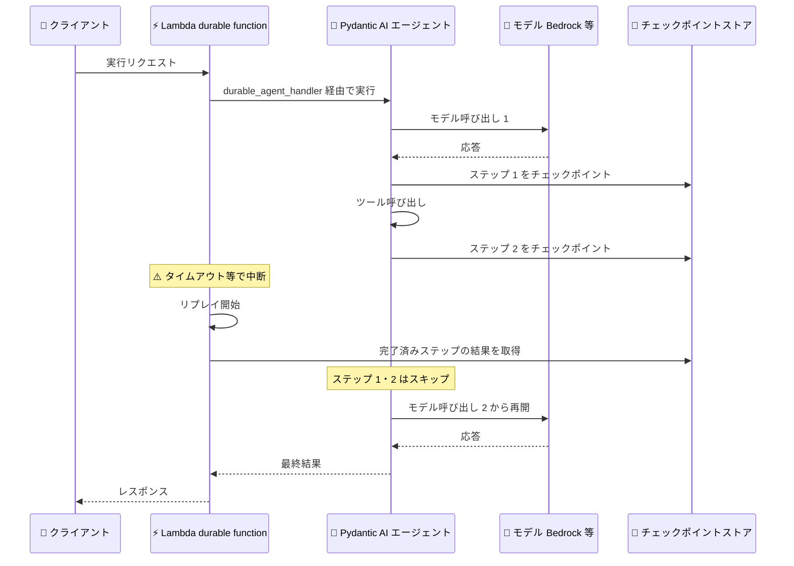

# AWS Lambda - durable functions が Pydantic AI と統合

**リリース日**: 2026 年 9 月 10 日
**サービス**: AWS Lambda
**機能**: AWS Lambda durable functions と Pydantic AI の統合

📊 [このアップデートのインフォグラフィックを見る](https://takech9203.github.io/aws-news-summary/20260910-aws-lambda-durable-pydantic-ai.html)

## 概要

AWS Lambda durable functions が、Python 製のオープンソース AI エージェントフレームワークである [Pydantic AI](https://pydantic.dev/docs/ai/overview/) との統合を発表しました。この統合により、Pydantic AI エージェントの実行進捗が AWS Lambda durable functions によって自動的に保存され、タイムアウトなどの中断が発生しても、エージェントは最初からやり直すことなく、最後に完了したステップから再開できます。

この統合では、エージェントが行うモデル呼び出しとツール呼び出しのそれぞれが durable execution のステップとしてチェックポイント化されます。中断された実行が再開される際、すでに完了した呼び出しは繰り返されません。これは、複数のドキュメントをレビューする一連のモデル呼び出しや、多数のソースを横断してトピックを調査する処理など、やり直しのコストが高いワークロードで特に重要です。また、顧客への二重課金のような、再開時の望ましくない副作用の回避にも役立ちます。

チェックポイントやリトライのロジックを自分で書くことなく、エージェントに耐障害性を持たせることができます。エージェントは AWS Lambda 上で動作するため、サーバー管理は不要で、使用したコンピューティングリソースに対してのみ料金が発生します。

**アップデート前の課題**

- Pydantic AI エージェントの実行が Lambda のタイムアウトや障害で中断されると、エージェントは最初から実行をやり直す必要があった
- やり直しに伴い、完了済みのモデル呼び出しのトークン料金を再度支払う必要があった
- 決済処理のような副作用を伴うツール呼び出しが再実行され、二重課金などの問題が発生するリスクがあった
- 耐障害性を確保するには、チェックポイントやリトライのロジックを開発者自身が実装する必要があった

**アップデート後の改善**

- モデル呼び出しとツール呼び出しが自動的に durable step としてチェックポイント化され、中断後は最後に完了したステップから再開できるようになった
- 完了済みの呼び出しは再実行されないため、トークン料金の二重支払いを回避できるようになった
- ツールごとにステップのセマンティクスやリトライ戦略を設定でき、副作用の重複を制御できるようになった
- チェックポイントとリトライのロジックを自前で実装する必要がなくなった

## アーキテクチャ図



Pydantic AI エージェントの各モデル呼び出し・ツール呼び出しが durable step としてチェックポイント化され、中断後のリプレイでは完了済みステップの結果が再利用される流れを示しています。

## サービスアップデートの詳細

### 主要機能

1. **モデル呼び出し・ツール呼び出しの自動チェックポイント化**
   - `AWSLambdaDurability` capability をエージェントに追加すると、各モデルリクエスト、ツール呼び出し、MCP 呼び出し、動的ツールセットの解決がそれぞれ durable step としてチェックポイント化される
   - 実行が失敗、タイムアウト、リトライされた場合、最後に完了したステップから再開され、完了済みの処理は再実行されない
   - ステップ名はエージェント名とツールセット ID の組み合わせで決定される (例: `{name}__model.request`)

2. **`durable_agent_handler` デコレーターによるハンドラー統合**
   - Lambda の durable execution API は同期型、エージェント実行は非同期型であるが、`durable_agent_handler` デコレーターが両者を橋渡しする
   - `@durable_execution` を最外側、`@durable_agent_handler` をその内側に配置する。順序を逆にするとエラーが発生する
   - capability を付与しただけでは durable にならず、`durable_agent_handler` または `run_durable` を経由した実行のみがチェックポイント化される点に注意が必要

3. **ツールごとの詳細な実行制御**
   - ツールのメタデータの `aws_lambda` キーで `StepConfig` (retry_strategy、step_semantics、serdes) を設定できる
   - 決済のような繰り返してはならないツールには `AT_MOST_ONCE_PER_RETRY` セマンティクスと `RetryPresets.none()` を併用する
   - `metadata={'aws_lambda': False}` で軽量かつ副作用のないツールをチェックポイント対象から除外できる (MCP ツールは除外不可)

## 技術仕様

### 統合の主な仕様

| 項目 | 詳細 |
|------|------|
| 対応言語 | Python (AWS Durable Execution SDK は Python 3.11 以降が必要) |
| パッケージ | `pydantic-ai-harness[aws-lambda]` |
| チェックポイント対象 | モデルリクエスト、ツール呼び出し、MCP 呼び出し、動的ツールセット解決 |
| 実行セマンティクス | デフォルトは at-least-once (副作用は冪等に設計することを推奨) |
| デフォルトリトライ | 最大 6 回、指数バックオフ (5 秒〜60 秒) |
| 実行あたりの上限 | 3,000 オペレーション、チェックポイント状態 100 MB |
| ツール実行 | durable ハンドラー内ではツール呼び出しは逐次実行 (ステップの同一性が順序に依存するため) |
| ストリーミング | 実行は単一の戻り値を返す。実行中のトークンストリーミングは不可 |

### コード例

```python
from typing import Any

from aws_durable_execution_sdk_python import DurableContext, durable_execution
from pydantic_ai import Agent

from pydantic_ai_harness.aws_lambda import AWSLambdaDurability, durable_agent_handler

agent = Agent(
    "bedrock:us.amazon.nova-pro-v1:0",
    name="support",
    capabilities=[AWSLambdaDurability()],
)


@agent.tool_plain
def get_weather(city: str) -> str:
    return f"It is sunny in {city}."


@durable_execution
@durable_agent_handler
async def handler(event: dict[str, Any], context: DurableContext) -> str:
    result = await agent.run(str(event["prompt"]))
    return result.output
```

エージェント構築時に `AWSLambdaDurability` capability を追加し、ハンドラーを `@durable_execution` (最外側) と `@durable_agent_handler` でラップします。エージェントには `name` の指定が必須です。

## 設定方法

### 前提条件

1. Python 3.11 以降のランタイム (例: python3.13) を使用する Lambda 関数
2. AWS Lambda durable functions が利用可能なリージョン
3. 使用するモデル (例: Amazon Bedrock) への IAM アクセス権限

### 手順

#### ステップ 1: パッケージのインストール

```bash
pip install "pydantic-ai-harness[aws-lambda,bedrock]"
```

Pydantic AI の AWS Lambda 統合パッケージと Bedrock 用の依存関係をインストールします。デプロイパッケージまたは Lambda レイヤーに含めます。

#### ステップ 2: エージェントとハンドラーの実装

前述のコード例のように、`AWSLambdaDurability` capability を付与したエージェントを定義し、ハンドラーを `@durable_execution` と `@durable_agent_handler` でラップします。capability はエージェント構築時に付与し、実行ごとに変更しないことで、ステップ構造を安定させます。

#### ステップ 3: durable 設定付きで Lambda 関数を作成

```bash
aws lambda create-function \
  --function-name support-agent \
  --runtime python3.13 \
  --handler handler.handler \
  --durable-config '{"ExecutionTimeout":3600,"RetentionPeriodInDays":7}' \
  --role arn:aws:iam::123456789012:role/lambda-durable-role \
  --zip-file fileb://function.zip

aws lambda publish-version --function-name support-agent
```

`--durable-config` で durable execution の実行タイムアウトと保持期間を指定して関数を作成し、バージョンを発行します。実行中の durable execution は開始時のバージョンに固定されるため、ツールの追加・削除やモデル変更などのコード変更は新しい発行バージョンとしてデプロイします。

## メリット

### ビジネス面

- **コスト削減**: 中断後の再開時に完了済みのモデル呼び出しを繰り返さないため、同じ処理に対するトークン料金の二重支払いを回避できる
- **信頼性の向上**: ドキュメントレビューやリサーチなど長時間実行されるエージェントワークロードを、障害があっても確実に完了させられる
- **ビジネスリスクの低減**: 顧客への二重請求のような、再実行に伴う望ましくない副作用を防止できる

### 技術面

- **実装の簡素化**: チェックポイントとリトライのロジックを自前で実装する必要がなく、capability の追加とデコレーターの適用だけで耐障害性を得られる
- **きめ細かな制御**: ツールごとにリトライ戦略やステップセマンティクスを設定でき、副作用を持つツールと冪等なツールを適切に使い分けられる
- **サーバーレスの利点**: AWS Lambda 上で動作するためサーバー管理が不要で、使用したコンピューティングリソースに対してのみ課金される

## デメリット・制約事項

### 制限事項

- AWS Durable Execution SDK は Python 3.11 以降が必要
- 1 回の実行あたり 3,000 オペレーション、チェックポイント状態 100 MB の上限がある (大きなデータは S3 キーなどの参照を返す設計が必要)
- durable ハンドラー内のツール呼び出しは逐次実行となり、並列実行はできない
- 実行中のクライアントへのトークンストリーミングはできない (`event_stream_handler` は内部的には動作する)
- MCP ツールはチェックポイントの除外設定ができない

### 考慮すべき点

- チェックポイントはステップ実行後に記録されるため、実行セマンティクスは at-least-once となる。副作用とチェックポイントの間で中断が発生するとツールが再実行される可能性があり、副作用は冪等に設計する必要がある
- capability を付与しただけでは durable にならない。`agent.run_sync()` などを直接呼び出した場合、警告なしに非 durable で動作する
- Pydantic AI やモデルプロバイダー側のリトライとステップのリトライが多重になるため、どちらか一方を無効化することが推奨される
- ツールの追加・削除、エージェント名やツールセット ID の変更、モデル変更はステップの順序・名前を変えるため、実行中の durable execution が破損する。発行バージョンを使ったデプロイが必要
- ツール内での `asyncio.create_task()` などのデタッチされた処理はチェックポイント化されず、呼び出しをまたいで残存する可能性があるため避ける

## ユースケース

### ユースケース 1: 大量ドキュメントのレビューエージェント

**シナリオ**: 数百件の契約書をエージェントが順にレビューし、リスク項目を抽出する。処理全体で多数のモデル呼び出しが発生し、Lambda のタイムアウトや一時的なモデル API のエラーで中断される可能性がある。

**実装例**:
```python
agent = Agent(
    "bedrock:us.amazon.nova-pro-v1:0",
    name="contract-reviewer",
    capabilities=[AWSLambdaDurability()],
)

@agent.tool_plain
def fetch_document(doc_id: str) -> str:
    # S3 からドキュメントを取得
    ...
```

**効果**: 中断が発生しても完了済みのレビュー結果はチェックポイントから再利用され、レビュー済みドキュメントのトークン料金を再度支払うことなく続きから再開できる。

### ユースケース 2: 副作用を伴う業務処理エージェント

**シナリオ**: 注文処理エージェントが在庫確認、決済、通知をツールとして実行する。決済ツールは絶対に二重実行してはならない。

**実装例**:
```python
from aws_durable_execution_sdk_python import RetryPresets, StepSemantics

@toolset.tool_plain(
    metadata={
        "aws_lambda": {
            "step_semantics": StepSemantics.AT_MOST_ONCE_PER_RETRY,
            "retry_strategy": RetryPresets.none(),
        }
    }
)
def charge_card(amount: int) -> str:
    return f"charged {amount}"
```

**効果**: 決済ツールはリトライごとに最大 1 回しか実行されず、顧客への二重課金を防止できる。

### ユースケース 3: 複数ソースを横断するリサーチエージェント

**シナリオ**: 多数の Web ソースや社内ナレッジベースを横断してトピックを調査し、レポートを生成する長時間実行のエージェント。MCP ツールも利用する。

**実装例**:
```python
agent = Agent(
    "bedrock:us.amazon.nova-pro-v1:0",
    name="researcher",
    toolsets=[mcp_server],
    capabilities=[AWSLambdaDurability()],
)
```

**効果**: MCP 呼び出しを含む各ステップがチェックポイント化され、長時間の調査処理が中断しても調査済みソースの再取得や再分析なしに再開できる。

## 料金

この統合自体に追加料金はありません。AWS Lambda durable functions の料金体系に従い、エージェントが実際に使用したコンピューティングリソースに対してのみ課金されます。durable execution の待機中はコンピューティング料金が発生しません。モデル呼び出し (Amazon Bedrock など) の料金は別途発生します。

詳細は [AWS Lambda 料金ページ](https://aws.amazon.com/lambda/pricing/) を参照してください。

## 利用可能リージョン

AWS Lambda durable functions が利用可能なすべての AWS リージョンで利用できます。

## 関連サービス・機能

- **AWS Lambda durable functions**: 本統合の基盤となる機能。チェックポイントとリプレイにより最長 1 年間の耐障害性のある実行を実現する
- **AWS Durable Execution SDK**: durable step や wait などのプリミティブを提供する SDK。Python、JavaScript、TypeScript、Java に対応 (本統合は Python)
- **Amazon Bedrock**: Pydantic AI エージェントのモデルプロバイダーとして利用できる。コード例では Amazon Nova Pro を使用
- **AWS Step Functions**: ビジュアルなワークフローオーケストレーションサービス。ビジネスロジックと密結合したワークフローには durable functions、サービス横断のオーケストレーションには Step Functions が適する

## 参考リンク

- 📊 [インフォグラフィック](https://takech9203.github.io/aws-news-summary/20260910-aws-lambda-durable-pydantic-ai.html)
- [公式発表 (What's New)](https://aws.amazon.com/about-aws/whats-new/2026/09/aws-lambda-durable-pydantic-ai/)
- [Durable Execution SDK リファレンス - Pydantic AI 統合](https://docs.aws.amazon.com/durable-execution/sdk-reference/integrations/pydantic-ai/)
- [Pydantic AI - AWS Lambda Durability ドキュメント](https://pydantic.dev/docs/ai/harness/aws-lambda/)
- [AWS Lambda durable functions 開発者ガイド](https://docs.aws.amazon.com/lambda/latest/dg/durable-functions.html)
- [AWS Lambda 製品ページ](https://aws.amazon.com/lambda/)
- [AWS Lambda 料金ページ](https://aws.amazon.com/lambda/pricing/)

## まとめ

このアップデートにより、Pydantic AI で構築した Python エージェントに、コード変更を最小限に抑えつつ耐障害性を追加できるようになりました。長時間実行されるエージェントワークロードや、決済のような副作用を伴うツールを持つエージェントを Lambda 上で運用している場合、この統合の採用を検討する価値があります。まずは `pydantic-ai-harness[aws-lambda]` をインストールし、Durable Execution SDK リファレンスのクイックスタートから試すことを推奨します。
