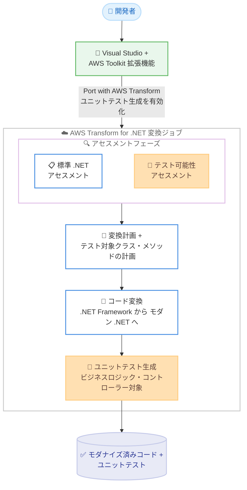

# AWS Transform - .NET モダナイズ済みコードのユニットテスト自動生成

**リリース日**: 2026 年 9 月 10 日
**サービス**: AWS Transform for .NET
**機能**: モダナイズ済みコードに対するユニットテストの自動生成

📊 [このアップデートのインフォグラフィックを見る](https://takech9203.github.io/aws-news-summary/20260910-aws-transform-net-unit-tests.html)

## 概要

AWS は、AWS Transform for .NET がモダナイズしたコードに対してユニットテストを自動生成できるようになったことを発表しました。この機能を有効にすると、AWS Transform は変換後の .NET アプリケーション内のテスト可能なクラス (ビジネスロジックやコントローラーなど) を対象にユニットテストを生成します。移行を実行するのと同じジョブの一部として、モダナイズ済みコードに対する自動テストのセーフティネットが得られます。

.NET Framework アプリケーションをモダンな .NET に移行すると、変換済みでビルド可能なコードベースが得られますが、従来はそのモダナイズ済みコードに対するテストカバレッジをチーム自身が手作業で書く必要がありました。今回のリリースにより、AWS Transform は標準の .NET アセスメントと並行してアプリケーションのテスト可能性 (testability) を評価し、カバーすべきクラスとメソッドを計画し、対応するユニットテストコードを生成します。これにより、テストが整備された状態で移行を完了できます。

ユニットテスト生成はオプトイン方式であり、ジョブの開始時に有効化することも、変換完了後に有効化することも可能です。本機能は AWS Toolkit for Visual Studio 拡張機能でサポートされ、AWS Transform for .NET が利用可能なすべての AWS リージョンで利用できます。

**アップデート前の課題**

- .NET Framework からモダン .NET への変換は、変換済みでビルド可能なコードベースを生成するものの、そのコードに対するユニットテストは自動では用意されなかった
- モダナイズ済みコードのテストカバレッジを確保するには、チームが手作業でテストコードを書く必要があり、移行後の検証に時間がかかった
- テストが不足したまま移行を完了すると、リファクタリングや追加変更の際にリグレッションを検出するセーフティネットがなかった

**アップデート後の改善**

- AWS Transform が変換対象アプリケーションのテスト可能性を標準の .NET アセスメントと並行して評価し、カバーすべきクラスとメソッドを自動で計画するようになった
- ビジネスロジックやコントローラーといったテスト可能なクラスを対象に、ユニットテストコードが自動生成されるようになった
- 移行を実行するのと同じジョブ内でテストが生成されるため、テストが整備された状態で移行を完了できるようになった
- オプトイン方式で、ジョブ開始時と変換完了後のどちらのタイミングでも有効化できる柔軟性が提供された

## アーキテクチャ図



AWS Transform for .NET の変換ジョブ内で、標準の .NET アセスメントと並行してテスト可能性が評価され、コード変換に続いてテスト対象クラスへのユニットテストが同一ジョブで生成されます。

## サービスアップデートの詳細

### 主要機能

1. **テスト可能性アセスメント**
   - 標準の .NET アセスメントと並行して、アプリケーションのテスト可能性を評価する
   - カバーすべきクラスとメソッドを自動で計画する
   - 追加のジョブを別途実行する必要がなく、移行と同じジョブの中で完結する

2. **テスト可能なクラスを対象としたユニットテスト生成**
   - 変換後の .NET アプリケーション内のテスト可能なクラスを対象にユニットテストコードを生成する
   - 対象の例として、ビジネスロジックやコントローラーが挙げられている
   - モダナイズ済みコードに対する自動テストのセーフティネットとして機能する

3. **オプトインによる柔軟な有効化**
   - ユニットテスト生成はオプトイン方式で、デフォルトでは実行されない
   - ジョブの開始時に有効化するか、変換完了後に有効化するかを選択できる
   - まず変換結果を確認してから、後追いでテスト生成を実行する運用も可能

4. **Visual Studio IDE エクスペリエンスでの提供**
   - AWS Toolkit for Visual Studio 拡張機能の AWS Transform for .NET でサポートされる
   - Visual Studio 上で .NET 変換を実行し、ユニットテスト生成を選択するだけで利用を開始できる

## 技術仕様

### 機能の位置づけ

| 項目 | 詳細 |
|------|------|
| 提供インターフェイス | AWS Toolkit for Visual Studio 拡張機能 |
| 有効化方式 | オプトイン (ジョブ開始時または変換完了後) |
| テスト生成の対象 | 変換後アプリケーション内のテスト可能なクラス (ビジネスロジック、コントローラーなど) |
| 実行タイミング | 移行を実行するジョブと同一ジョブ内 |
| テスト可能性の評価 | 標準の .NET アセスメントと並行して実施 |
| 利用可能リージョン | AWS Transform for .NET がサポートされるすべてのリージョン |

### AWS Transform for .NET の変換対象 (参考)

公式ドキュメントによると、AWS Transform for .NET は以下の変換に対応しています。

| 項目 | 詳細 |
|------|------|
| 変換元 | .NET Framework 3.5、.NET Core 3.1、.NET 5.x 以降から .NET 10 まで |
| 変換先 | .NET 8、.NET 10、.NET Standard (クラスライブラリ) |
| 言語 | C#、VB.NET (プレビュー機能) |
| サポートされるプロジェクトタイプ | クラスライブラリ、コンソールアプリ、ASP.NET (MVC、Web API、Web Forms)、ユニットテストプロジェクト (NUnit、xUnit、MSTest)、WCF サービス |

なお、既存のユニットテストプロジェクトの移植 (unit test porting) は従来から変換の検証手段としてサポートされており、今回のアップデートは既存テストの移植に加えて、テストが存在しないモダナイズ済みコードへの新規テスト生成を可能にするものです。

## 設定方法

### 前提条件

1. AWS Transform for .NET がサポートされるリージョンでの AWS Transform のセットアップ (Visual Studio IDE エクスペリエンスは IAM Identity Center による認証が必要)
2. Visual Studio Marketplace から AWS Toolkit 拡張機能をインストール済みであること
3. 変換対象の C# または VB.NET ソリューション / プロジェクトが AWS Transform for .NET の対応バージョン・プロジェクトタイプであること

### 手順

#### ステップ 1: Visual Studio で AWS Transform に認証する

Visual Studio のメニューから **Extensions > AWS Toolkit > Getting Started** を開き、**AWS Transform** 認証を選択します。管理者から共有された AWS Transform のスタート URL を使用してプロファイルを作成し、IAM Identity Center 経由でサインインします。

#### ステップ 2: 変換ジョブを開始し、ユニットテスト生成を有効化する

ソリューションエクスプローラーで対象のソリューションまたはプロジェクトを右クリックし、**Port with AWS Transform** を選択します。ワークスペース、ターゲットの .NET バージョン、変換モード (Autonomous / Interactive) を選択して変換を開始し、ユニットテスト生成 (generate unit tests) を選択します。ジョブ開始時に有効化しなかった場合でも、変換完了後に有効化できます。

#### ステップ 3: 生成されたユニットテストを確認する

変換ジョブの完了後、モダナイズ済みコードとあわせて生成されたユニットテストコードを確認します。差分ビューで変更内容をレビューし、テストを実行してモダナイズ済みコードの動作を検証します。必要に応じてチャットで追加の変更を依頼できます。

## メリット

### ビジネス面

- **移行後の品質保証の高速化**: 従来は手作業で行っていたモダナイズ済みコードへのテスト整備が自動化され、移行プロジェクト全体のリードタイムを短縮できる
- **移行リスクの低減**: テストが整備された状態で移行を完了できるため、移行後の変更やリリースに伴うリグレッションリスクを抑制できる
- **モダナイゼーションの促進**: テスト作成の負担が移行の障壁になっていた組織でも、.NET Framework 資産のモダナイゼーションに着手しやすくなる

### 技術面

- **同一ジョブでの完結**: テスト可能性の評価からテスト生成までが移行ジョブと同じジョブ内で実行され、別のツールやプロセスを組み合わせる必要がない
- **対象を絞った効率的なテスト生成**: ビジネスロジックやコントローラーといったテスト可能なクラスを自動で特定し、カバーすべきクラスとメソッドを計画したうえでテストを生成する
- **オプトインによる制御**: テスト生成の要否をジョブごとに選択でき、変換結果を確認してから後追いで生成する運用も可能

## デメリット・制約事項

### 制限事項

- 本機能は AWS Toolkit for Visual Studio 拡張機能でのサポートとして発表されており、他のインターフェイスでの提供は公式発表には記載されていない
- テスト生成の対象は「テスト可能なクラス」であり、アプリケーション内のすべてのコードにテストが生成されるわけではない
- Visual Studio IDE エクスペリエンスの利用には IAM Identity Center による認証が必要

### 考慮すべき点

- 自動生成されたユニットテストはあくまでセーフティネットであり、ビジネス要件を反映したテストケースの妥当性は人間によるレビューで確認することが望ましい
- テスト生成はエージェントの追加作業となるため、料金への影響は [AWS Transform 料金ページ](https://aws.amazon.com/transform/pricing/) で確認することを推奨
- 既存のテスト資産がある場合は、従来からサポートされているユニットテストプロジェクトの移植と、今回の新規テスト生成の使い分けを検討する

## ユースケース

### ユースケース 1: テスト資産のないレガシーアプリケーションの移行

**シナリオ**: ユニットテストがほとんど存在しない .NET Framework 4.x の業務アプリケーションをモダン .NET に移行したいが、移行後の動作検証の手段がなく着手できていない。

**実装例**:
```text
1. Visual Studio でソリューションを右クリックし Port with AWS Transform を選択
2. ジョブ開始時にユニットテスト生成を有効化
3. 変換完了後、ビジネスロジックとコントローラーに生成されたテストを実行して動作を検証
```

**効果**: 移行と同時にテストのセーフティネットが整備され、テスト資産ゼロの状態から移行後の検証・継続的な改修が可能な状態に到達できる。

### ユースケース 2: 変換結果を確認してから後追いでテストを生成

**シナリオ**: まず変換結果のコードをレビューし、ビルドと手動での動作確認を済ませてから、リグレッション対策としてユニットテストを整備したい。

**実装例**:
```text
1. ユニットテスト生成を有効化せずに変換ジョブを実行
2. 差分ビューで変換結果をレビューし、ローカルビルドを確認
3. 変換完了後にユニットテスト生成を有効化し、テストコードを追加生成
```

**効果**: オプトイン方式を活用し、変換そのものの品質確認とテスト整備を段階的に進められる。チームのレビュープロセスに合わせた柔軟な運用が可能になる。

### ユースケース 3: 大規模モダナイゼーションにおけるテスト整備の標準化

**シナリオ**: 多数の .NET Framework アプリケーションを順次モダナイズする計画があり、移行後のコードには必ずユニットテストを付随させる方針を組織として標準化したい。

**実装例**:
```text
1. 移行ランブックに「変換ジョブ開始時にユニットテスト生成を有効化する」手順を明記
2. 各アプリケーションの変換ジョブでテスト可能性アセスメントの結果とテスト計画を確認
3. 生成されたテストを CI パイプラインに組み込み、以降の改修時に常時実行
```

**効果**: 移行後のすべてのアプリケーションに一定水準のテストカバレッジが確保され、モダナイゼーション後の継続的な開発の品質基準を組織的に維持できる。

## 料金

公式発表に本機能固有の料金に関する記載はありません。AWS Transform の料金体系については [AWS Transform 料金ページ](https://aws.amazon.com/transform/pricing/) を参照してください。

## 利用可能リージョン

AWS Transform for .NET がサポートされるすべての AWS リージョンで利用可能です。AWS Transform は以下のリージョンで提供されています。

- 米国東部 (バージニア北部) - us-east-1
- アジアパシフィック (ムンバイ) - ap-south-1
- **アジアパシフィック (東京) - ap-northeast-1**
- アジアパシフィック (ソウル) - ap-northeast-2
- アジアパシフィック (シドニー) - ap-southeast-2
- カナダ (中部) - ca-central-1
- 欧州 (フランクフルト) - eu-central-1
- 欧州 (ロンドン) - eu-west-2

## 関連サービス・機能

- **AWS Transform for .NET**: .NET Framework からクロスプラットフォームの .NET への移行と、.NET アプリケーションのバージョンアップグレードを支援する生成 AI エージェント。今回のユニットテスト生成はこのエージェントの機能拡張
- **AWS Toolkit for Visual Studio**: 本機能が提供される Visual Studio 拡張機能。チャット、ジョブプラン、ワークログの各ウィンドウを通じて対話的に変換を進められる
- **AWS Transform custom**: CLI (`atx`) や AWS マネージド変換 AWS/dotnet-modernization を通じて .NET モダナイゼーションを実行する機能。Web Forms から React への変換など .NET 以外への変換にも対応
- **IAM Identity Center**: Visual Studio IDE エクスペリエンスで必要となる認証基盤

## 参考リンク

- 📊 [インフォグラフィック](https://takech9203.github.io/aws-news-summary/20260910-aws-transform-net-unit-tests.html)
- [公式発表 (What's New)](https://aws.amazon.com/about-aws/whats-new/2026/09/aws-transform-net-unit-tests)
- [ドキュメント: Modernizing .NET in the IDE](https://docs.aws.amazon.com/transform/latest/userguide/dotnet-ide.html)
- [ドキュメント: Modernizing .NET with AWS Transform](https://docs.aws.amazon.com/transform/latest/userguide/dotnet.html)
- [ドキュメント: Modernizing .NET using AWS Transform in Visual Studio](https://docs.aws.amazon.com/transform/latest/userguide/dotnet-ide-vs.html)
- [料金ページ](https://aws.amazon.com/transform/pricing/)

## まとめ

AWS Transform for .NET がモダナイズ済みコードへのユニットテスト自動生成に対応し、.NET Framework からモダン .NET への移行を「テストが整備された状態」で完了できるようになりました。テスト可能性の評価からテスト計画、テストコード生成までが移行と同一ジョブ内で完結するため、移行後の品質保証にかかる工数を大幅に削減できます。テスト資産の乏しいレガシー .NET アプリケーションを抱える組織は、Visual Studio の AWS Toolkit 拡張機能から変換ジョブを実行する際に、ユニットテスト生成の有効化を検討することを推奨します。
