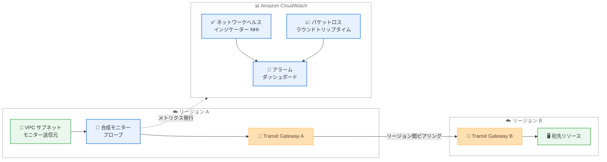

# Amazon CloudWatch - 合成モニターによる Transit Gateway リージョン間ピアリングのネットワークヘルスインジケーター対応

**リリース日**: 2026 年 9 月 10 日
**サービス**: Amazon CloudWatch (Network Monitoring / Network Synthetic Monitor)
**機能**: Transit Gateway リージョン間ピアリング経路に対するネットワークヘルスインジケーター (NHI) のサポート

📊 [このアップデートのインフォグラフィックを見る](https://takech9203.github.io/aws-news-summary/20260910-cloudwatch-network-monitoring-tgw-support.html)

## 概要

Amazon CloudWatch Network Monitoring の合成モニター (Network Synthetic Monitor) が、AWS Transit Gateway のリージョン間ピアリング接続を経由する経路に対して、ネットワークヘルスインジケーター (NHI) をサポートしました。これにより、ピアリングされたリージョン内の宛先へ到達する経路でネットワークパフォーマンスの問題が発生した際に、その原因が AWS ネットワーク側にあるかどうかを迅速に判断できるようになります。

NHI は、AWS が管理するネットワーク経路上で劣化が観測されたかどうかを示すバイナリメトリクス (0 または 100) です。従来、合成モニターの NHI は AWS Direct Connect を経由する経路のみを対象としていましたが、今回のリリースで Transit Gateway リージョン間ピアリングを経由する経路にも拡張されました。これらの経路では、NHI は Transit Gateway ピアリング接続までの AWS ネットワーク経路の健全性を反映します。

NHI メトリクスはお客様の CloudWatch アカウントに発行されるため、ダッシュボードの構築やアラームの設定が可能です。ネットワークオペレーターやアプリケーション開発者は、リージョン間経路における性能劣化の切り分けにかかる時間を大幅に短縮できます。

**アップデート前の課題**

- 合成モニターの NHI は AWS Direct Connect を経由する経路のみを対象としており、Transit Gateway リージョン間ピアリングを経由する経路では利用できなかった
- リージョン間経路でパケットロスやレイテンシーの劣化が発生した場合、原因が AWS ネットワーク側にあるのか、自社側の構成にあるのかを切り分けるために多くの調査時間が必要だった
- リージョン間通信の問題切り分けには、複数のメトリクスを手動で相関分析する必要があった

**アップデート後の改善**

- Transit Gateway リージョン間ピアリングを経由する経路でも NHI を利用できるようになり、AWS ネットワーク起因の劣化かどうかを迅速に判断できるようになった
- NHI が CloudWatch アカウントに発行されるため、リージョン間経路の健全性についてダッシュボード作成やアラーム設定が可能になった
- 障害発生時の原因切り分け時間が短縮され、適切なエスカレーション (AWS サポートへの連絡または自社ネットワークの調査) を早期に判断できるようになった

## アーキテクチャ図



合成モニターのプローブがリージョン A の VPC サブネットから Transit Gateway リージョン間ピアリングを経由してリージョン B の宛先へトラフィックを送信し、NHI とパフォーマンスメトリクスを CloudWatch に発行する構成です。NHI は Transit Gateway ピアリング接続までの AWS ネットワーク経路の健全性を反映します。

## サービスアップデートの詳細

### 主要機能

1. **Transit Gateway リージョン間ピアリング経路への NHI 拡張**
   - 従来は AWS Direct Connect を経由する経路のみが NHI の対象だった
   - 今回のリリースにより、ピアリングされたリージョン内の宛先へ Transit Gateway リージョン間ピアリング経由で到達する経路も NHI の対象になった
   - これらの経路では、NHI は Transit Gateway ピアリング接続までの AWS ネットワーク経路の健全性を反映する

2. **バイナリ値によるシンプルな判定**
   - NHI は 0 または 100 のバイナリ値で発行される
   - 100 は AWS 管理のネットワーク経路内で劣化が観測されたことを示し、0 は劣化が観測されなかったことを示す
   - AWS のサンプルデータセットと、お客様のネットワーク経路を模擬したトラフィックのパケットロス / ラウンドトリップレイテンシーメトリクスに対する統計的相関と異常検出に基づいて算出される

3. **CloudWatch へのメトリクス発行**
   - NHI はお客様の CloudWatch アカウントに発行される
   - ダッシュボードでの可視化や、アラームによる通知の自動化が可能
   - パケットロスとラウンドトリップタイムのメトリクスと組み合わせて、包括的なネットワーク監視を実現できる

4. **フルマネージドかつエージェントレスの監視**
   - 監視対象リソースへのエージェントのインストールは不要
   - VPC サブネットと宛先 IP アドレスを指定するだけで監視を開始できる
   - プローブ用のインフラストラクチャは AWS が作成・管理する

## 技術仕様

### 合成モニターと NHI の仕様

| 項目 | 詳細 |
|------|------|
| NHI の値 | 0 (劣化なし) または 100 (AWS ネットワーク内で劣化を観測) |
| NHI 対象経路 | AWS Direct Connect 経由の経路、Transit Gateway リージョン間ピアリング経由の経路 |
| NHI の測定範囲 (TGW 経路) | モニター送信元から Transit Gateway ピアリング接続までの AWS ネットワーク経路 |
| 発行されるメトリクス | ラウンドトリップタイム (マイクロ秒)、パケットロス (%)、NHI |
| 集計間隔 | 30 秒または 60 秒 |
| 対応プロトコル | ICMP、TCP |
| IP アドレス | IPv4 / IPv6 の両方をサポート (同一モニター内での混在は不可) |
| プローブトラフィック量 (TGW 経路) | 追加のネットワーク経路をカバーするため、宛先ごとに最大 240 パケット/秒 |

### 注意事項

- 新しいモニターの作成、プローブの追加、プローブの再有効化を行った場合、異常検出のためのデータ収集に数時間かかるため、NHI の発行が遅延する
- AWS Cloud WAN による中間ルーティングを使用する Direct Connect アタッチメントでは NHI は正確ではないため、Cloud WAN を含むハイブリッドネットワークでは NHI をパフォーマンス問題の指標として使用しないことが推奨されている

## 設定方法

### 前提条件

1. 監視対象の VPC サブネットがモニターと同じアカウントに存在すること
2. Transit Gateway リージョン間ピアリング接続が構成されており、宛先へのルーティングが設定されていること
3. TCP プローブを使用する場合、送信元ポート範囲 1024-65535 からの TCP トラフィックを許可するファイアウォールルールが設定されていること

### 手順

#### ステップ 1: モニターの作成

```bash
aws networkmonitor create-monitor \
    --monitor-name tgw-peering-monitor \
    --aggregation-period 60
```

Network Synthetic Monitor のモニターを作成します。集計間隔は 30 秒または 60 秒から選択できます。

#### ステップ 2: プローブの追加

```bash
aws networkmonitor create-probe \
    --monitor-name tgw-peering-monitor \
    --probe '{
        "sourceArn": "arn:aws:ec2:ap-northeast-1:123456789012:subnet/subnet-0123456789abcdef0",
        "destination": "10.1.0.10",
        "protocol": "TCP",
        "destinationPort": 443,
        "packetSize": 256
    }'
```

送信元サブネットと、ピアリング先リージョンにある宛先 IP アドレスを指定してプローブを作成します。プロトコルは ICMP または TCP を選択できます。

#### ステップ 3: NHI に対するアラームの設定

```bash
aws cloudwatch put-metric-alarm \
    --alarm-name tgw-peering-nhi-alarm \
    --namespace "AWS/NetworkMonitor" \
    --metric-name "HealthIndicator" \
    --dimensions Name=MonitorName,Value=tgw-peering-monitor \
    --statistic Maximum \
    --period 300 \
    --threshold 100 \
    --comparison-operator GreaterThanOrEqualToThreshold \
    --evaluation-periods 1 \
    --alarm-actions arn:aws:sns:ap-northeast-1:123456789012:network-alerts
```

NHI の値が 100 (AWS ネットワーク内で劣化を観測) になった場合に SNS トピックへ通知するアラームを設定します。これにより、AWS ネットワーク起因の問題を即座に検知できます。

## メリット

### ビジネス面

- **障害対応時間の短縮**: リージョン間経路の劣化が AWS 起因か自社起因かを数分で判断でき、MTTR (平均復旧時間) を短縮できる
- **運用コストの削減**: エージェントレスのフルマネージド監視により、監視基盤の構築・運用負荷を削減できる
- **適切なエスカレーション判断**: AWS 起因と判明した場合は AWS サポートへの問い合わせ、自社起因の場合は社内調査と、初動を迅速に決定できる

### 技術面

- **切り分けの自動化**: 統計的相関と異常検出に基づく NHI により、手動でのメトリクス相関分析が不要になる
- **既存の CloudWatch 機能との統合**: ダッシュボード、アラーム、異常検出など既存の CloudWatch 機能をそのまま活用できる
- **マルチリージョンアーキテクチャの可観測性向上**: Direct Connect 経路に加えてリージョン間ピアリング経路もカバーされ、ハイブリッド / マルチリージョン構成の監視範囲が広がる

## デメリット・制約事項

### 制限事項

- TGW リージョン間ピアリング経路の NHI は、Transit Gateway ピアリング接続までの AWS ネットワーク経路の健全性のみを反映する
- モニター作成やプローブ追加・再有効化の直後は、異常検出のためのデータ収集により NHI の発行に数時間の遅延が発生する
- AWS Cloud WAN による中間ルーティングを使用する経路では NHI は正確ではない
- Network Synthetic Monitor はネットワーク障害時の自動フェイルオーバー機能を提供しない

### 考慮すべき点

- TGW リージョン間ピアリング経由の宛先には、追加のネットワーク経路をカバーするため最大 240 パケット/秒のプローブトラフィックが送信される
- プローブごとに料金が発生するため、監視対象のサブネットと宛先 IP アドレスの数を適切に設計する必要がある
- TCP プローブでは送信元ポートが 1024-65535 の範囲で定期的に切り替わるため、ファイアウォールルールの許可設定が必要

## ユースケース

### ユースケース 1: マルチリージョン構成におけるリージョン間通信の監視

**シナリオ**: 東京リージョンとバージニア北部リージョンに展開したアプリケーションが、Transit Gateway リージョン間ピアリングを介して通信しており、リージョン間のレイテンシー悪化がサービス品質に直結する。

**実装例**:
```
1. 東京リージョンのアプリケーションサブネットを送信元とするモニターを作成
2. バージニア北部リージョンの宛先 IP アドレスへのプローブを追加
3. NHI、パケットロス、ラウンドトリップタイムのアラームを設定
4. CloudWatch ダッシュボードでリージョン間経路の健全性を常時可視化
```

**効果**: リージョン間通信の劣化を早期に検知し、AWS ネットワーク起因かどうかを即座に判断できるため、障害対応の初動が迅速になります。

### ユースケース 2: 障害発生時の原因切り分けの迅速化

**シナリオ**: リージョン間で通信するマイクロサービスにタイムアウトが多発しており、原因がアプリケーション、自社ネットワーク設定、AWS ネットワークのいずれにあるかを特定したい。

**実装例**:
```
1. 該当経路の合成モニターの NHI メトリクスを確認
2. NHI = 100 の場合: AWS ネットワーク内の劣化と判断し、AWS サポートへ連絡
3. NHI = 0 の場合: セキュリティグループ、ルートテーブル、
   アプリケーション側の設定など自社リソースの調査に集中
```

**効果**: 原因の切り分けにかかる時間を数時間から数分に短縮し、調査リソースを適切な領域に集中できます。

### ユースケース 3: ハイブリッド + マルチリージョン環境の統合監視

**シナリオ**: オンプレミスと AWS を Direct Connect で接続し、さらに複数リージョンを Transit Gateway リージョン間ピアリングで接続している企業が、すべての主要経路を一元的に監視したい。

**実装例**:
```
1. Direct Connect 経由のオンプレミス宛先へのプローブを持つモニターを作成
2. TGW リージョン間ピアリング経由のリモートリージョン宛先へのプローブを追加
3. 両経路の NHI を単一の CloudWatch ダッシュボードに集約
4. 経路ごとにアラームを設定し、SNS 経由で運用チームに通知
```

**効果**: Direct Connect 経路とリージョン間ピアリング経路の両方で AWS ネットワークの健全性を統一的な指標で監視でき、ネットワーク運用の標準化が進みます。

## 料金

Network Synthetic Monitor の料金は以下の 2 つの要素で構成されます。初期費用や長期契約は不要です。

- 監視対象の AWS リソース (VPC サブネット) ごとの時間単位料金
- CloudWatch メトリクスの料金

各リソースに対して最大 4 つのプローブ (宛先 IP アドレス) を作成できます。監視対象のサブネット数と宛先 IP アドレス数を調整することで、コストをコントロールできます。詳細は [Amazon CloudWatch 料金ページ](https://aws.amazon.com/cloudwatch/pricing/) を参照してください。

## 利用可能リージョン

Network Monitoring for AWS workloads が利用可能なすべての AWS リージョンで利用できます。最新のリージョン一覧は [AWS リージョン別サービス一覧](https://aws.amazon.com/about-aws/global-infrastructure/regional-product-services/) を参照してください。

## 関連サービス・機能

- **AWS Transit Gateway**: リージョン間ピアリング接続により複数リージョンの VPC を相互接続するサービス。今回のアップデートで NHI の監視対象経路となった
- **AWS Direct Connect**: オンプレミスと AWS を専用線で接続するサービス。従来から NHI の対象経路としてサポートされている
- **Amazon CloudWatch アラーム / ダッシュボード**: NHI やパフォーマンスメトリクスに対するしきい値監視と可視化に使用する
- **AWS PrivateLink**: VPC と Network Synthetic Monitor リソース間のプライベート接続に使用できる

## 参考リンク

- 📊 [インフォグラフィック](https://takech9203.github.io/aws-news-summary/20260910-cloudwatch-network-monitoring-tgw-support.html)
- [公式発表 (What's New)](https://aws.amazon.com/about-aws/whats-new/2026/09/cloudwatch-network-monitoring-tgw-support/)
- [Network Synthetic Monitor ドキュメント](https://docs.aws.amazon.com/AmazonCloudWatch/latest/monitoring/what-is-network-monitor.html)
- [How Network Synthetic Monitor works](https://docs.aws.amazon.com/AmazonCloudWatch/latest/monitoring/nw-monitor-how-it-works.html)
- [Amazon CloudWatch 料金ページ](https://aws.amazon.com/cloudwatch/pricing/)

## まとめ

Amazon CloudWatch Network Monitoring の合成モニターが、Transit Gateway リージョン間ピアリング経路のネットワークヘルスインジケーターに対応し、リージョン間通信の劣化が AWS ネットワーク起因かどうかを迅速に判断できるようになりました。マルチリージョン構成で Transit Gateway ピアリングを利用している場合は、主要な経路に合成モニターを設定し、NHI に対するアラームを構成することで障害対応の初動を大幅に改善できます。まずは対象経路のモニターとプローブを作成し、CloudWatch ダッシュボードで NHI の可視化を始めることを推奨します。
