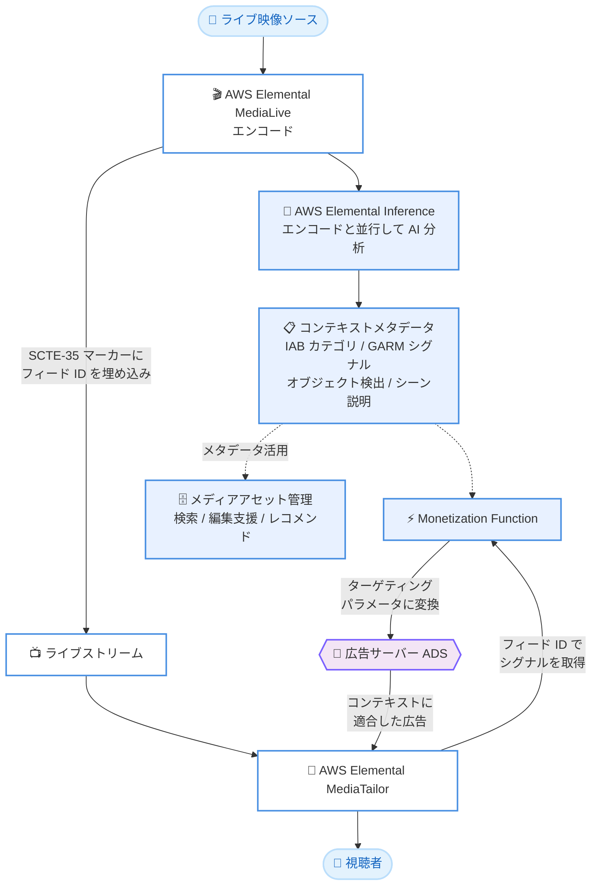

# AWS Elemental Inference - ライブ映像からのリアルタイムコンテキストメタデータ生成

**リリース日**: 2026 年 9 月 10 日
**サービス**: AWS Elemental Inference / AWS Elemental MediaLive / AWS Elemental MediaTailor
**機能**: ライブ映像からのリアルタイムコンテキストメタデータ生成 (Contextual Metadata)

📊 [このアップデートのインフォグラフィックを見る](https://takech9203.github.io/aws-news-summary/20260910-elemental-inference-contextual-metadata.html)

## 概要

AWS Elemental Inference が、ライブ映像ストリームからコンテキストメタデータをリアルタイムに生成できるようになりました。カスタムの機械学習インフラストラクチャを構築することなく、AI によるシーンレベルのインテリジェンスを取得できます。エンコードと並行してライブ映像を分析し、IAB (Interactive Advertising Bureau) コンテンツタクソノミーカテゴリ、GARM (Global Alliance for Responsible Media) ブランド適合性シグナル、検出されたオブジェクトとアクション、ショット / シーンレベルの説明文を抽出します。

コンテキスト広告のワークフローでは、AWS Elemental MediaLive が Elemental Inference のフィード ID をライブストリーム内の SCTE-35 広告マーカーに埋め込みます。各広告ブレークで AWS Elemental MediaTailor が Monetization Function を使用してそのフィード ID に対応するシーンレベルのシグナルを取得し、広告サーバーが期待するターゲティングパラメータに変換します。これにより、カスタムのインテグレーション作業なしでコンテキストを考慮した広告判断が可能になります。

放送事業者やコンテンツプラットフォームは、この機能を使用してコンテキスト広告の意思決定、メディアアセットのエンリッチメント、コンテンツディスカバリーのワークフローを、サーバーレスかつフルマネージドな AI で実現できます。

**アップデート前の課題**

- ライブ映像からシーンレベルのメタデータを取得するには、カスタムの機械学習インフラストラクチャや外部のポイントソリューションを構築・運用する必要があった
- コンテキスト広告のターゲティングに必要なシグナル (IAB カテゴリ、ブランド適合性など) をリアルタイムに広告サーバーへ連携するには、独自のインテグレーション開発が必要だった
- メディアアセットのメタデータ付与は手動のロギングやポストプロダクションでの入力作業に依存しており、アーカイブの検索性や再利用性に限界があった

**アップデート後の改善**

- エンコードと並行した AI 分析により、IAB カテゴリ、GARM シグナル、オブジェクト / アクション検出、シーン説明文をリアルタイムに自動生成できるようになった
- MediaLive の SCTE-35 マーカーと MediaTailor の Monetization Function の連携により、カスタム開発なしでコンテキストを考慮した広告判断が可能になった
- すべてのシーンとショットに対する構造化メタデータの自動生成により、手動ロギング不要でリッチなアーカイブ構築、編集支援、コンテンツレコメンデーションが実現できるようになった

## アーキテクチャ図



ライブ映像のエンコードと並行して Elemental Inference が AI 分析を実行し、生成されたシーンレベルのシグナルを MediaTailor の Monetization Function が広告ブレークごとに取得して、広告サーバー向けのターゲティングパラメータに変換する流れを示しています。

## サービスアップデートの詳細

### 主要機能

1. **リアルタイムコンテキストメタデータ生成**
   - ライブ映像をエンコードと並行して AI 分析し、シーンレベルのインテリジェンスをリアルタイムに抽出
   - IAB コンテンツタクソノミーカテゴリの自動分類
   - GARM ブランド適合性シグナルの生成
   - オブジェクトとアクションの検出、ショット / シーンレベルの説明文生成
   - サーバーレスかつフルマネージドで、カスタム ML インフラストラクチャは不要

2. **SCTE-35 マーカーによるコンテキスト広告連携**
   - MediaLive が Elemental Inference のフィード ID を SCTE-35 広告マーカーに埋め込み
   - 広告ブレークごとに MediaTailor の Monetization Function がフィード ID からシーンレベルのシグナルを取得
   - シグナルを広告サーバーが期待するターゲティングパラメータへ変換
   - コンテキストに基づくディールキュレーションやブランド適合性スコアリングを実現し、パブリッシャーの収益化を改善

3. **メディアアセット管理向けの構造化メタデータ**
   - すべてのシーンとショットに対して構造化メタデータを自動生成
   - 手動ロギングやポストプロダクションでのメタデータ入力が不要
   - コンテキストに基づくコンテンツディスカバリー、編集支援ワークフロー、パーソナライズされたコンテンツレコメンデーションを支えるリッチなアーカイブを構築

## 技術仕様

### 生成されるメタデータの種類

| メタデータ | 詳細 |
|------|------|
| IAB コンテンツタクソノミー | Interactive Advertising Bureau が定義するコンテンツ分類カテゴリ。コンテキスト広告のターゲティングに使用 |
| GARM ブランド適合性シグナル | Global Alliance for Responsible Media の枠組みに基づくブランドセーフティ / 適合性の指標 |
| オブジェクト / アクション検出 | 映像内に登場する物体や動作の検出結果 |
| ショット / シーン説明 | ショットおよびシーン単位の自然言語による説明文 |

### 広告連携の仕組み

| 項目 | 詳細 |
|------|------|
| フィード ID の伝搬 | MediaLive が SCTE-35 広告マーカーに Elemental Inference のフィード ID を埋め込み |
| シグナル取得 | MediaTailor の Monetization Function が広告ブレーク時にフィード ID をキーとしてシーンレベルのシグナルを取得 |
| ターゲティング変換 | 取得したシグナルを広告サーバー (ADS) が期待するターゲティングパラメータへ変換 |
| 設定場所 | AWS Elemental MediaLive コンソール |

## 設定方法

### 前提条件

1. AWS Elemental MediaLive でライブチャンネルを運用していること
2. AWS Elemental Inference が利用可能なリージョンを使用していること
3. コンテキスト広告連携を行う場合は、AWS Elemental MediaTailor の設定と Monetization Function の構成が必要

### 手順

#### ステップ 1: MediaLive コンソールでコンテキストメタデータを有効化

MediaLive コンソールでチャンネルの Elemental Inference 設定を開き、コンテキストメタデータ (Contextual Metadata) の生成を有効にします。エンコードと並行して AI 分析が実行され、フィード ID が割り当てられます。

#### ステップ 2: SCTE-35 広告マーカーへのフィード ID 埋め込みを確認

MediaLive がライブストリームの SCTE-35 広告マーカーに Elemental Inference のフィード ID を埋め込みます。既存の SCTE-35 ベースの広告ワークフローをそのまま活用できます。

#### ステップ 3: MediaTailor の Monetization Function を構成

MediaTailor 側で Monetization Function を構成し、広告ブレーク時にフィード ID からシーンレベルのシグナルを取得して、広告サーバー向けのターゲティングパラメータに変換するようにします。これにより ADS リクエストにコンテキスト情報が付与されます。

## メリット

### ビジネス面

- **収益化の改善**: シーンの内容に適合した広告配信 (コンテキスト広告) により、広告単価やフィルレートの向上が期待でき、パブリッシャーの収益化を改善できる
- **ブランドセーフティの担保**: GARM ブランド適合性シグナルにより、広告主のブランドイメージに適さないシーンへの広告配信を回避できる
- **運用コストの削減**: 手動ロギングやポストプロダクションでのメタデータ入力が不要になり、アーカイブ整備の工数を削減できる

### 技術面

- **ML インフラ不要**: サーバーレスかつフルマネージドな AI により、カスタム機械学習基盤の構築・運用が不要
- **エンコードとの並行処理**: 既存のエンコードワークフローに追加の遅延を持ち込まず、単一のワークフロー内で AI 分析を実行できる
- **標準規格ベースの連携**: SCTE-35 という業界標準の広告マーカーを利用するため、既存の SSAI ワークフローと自然に統合でき、カスタムインテグレーション開発が不要

## デメリット・制約事項

### 制限事項

- AWS Elemental Inference が利用可能なリージョンでのみ使用できる
- 設定は AWS Elemental MediaLive コンソールから行う (MediaLive のワークフローが前提)
- コンテキスト広告連携には MediaTailor の Monetization Function の構成が必要

### 考慮すべき点

- Elemental Inference は従量課金制のため、分析対象のストリーム量に応じたコストを事前に見積もることが望ましい
- 広告サーバー側でターゲティングパラメータ (IAB カテゴリや適合性スコアなど) を受け取り活用できるよう、ADS 側の設定確認が必要
- AI による自動分類のため、重要なブランドセーフティ判断についてはシグナルの精度を運用の中で検証することが推奨される

## ユースケース

### ユースケース 1: ライブスポーツ配信でのコンテキスト広告

**シナリオ**: スポーツ配信プラットフォームが、試合のシーン内容 (競技種目、盛り上がりの場面など) に応じた広告を広告ブレークで配信したい。

**実装例**:
```
1. MediaLive チャンネルで Elemental Inference のコンテキストメタデータを有効化
2. MediaLive が SCTE-35 マーカーにフィード ID を埋め込み
3. MediaTailor の Monetization Function が IAB カテゴリと
   ブランド適合性スコアを ADS リクエストのターゲティングパラメータに変換
4. 広告サーバーがシーンに適合した広告を返却
```

**効果**: シーンの文脈に合った広告配信により広告価値が向上し、コンテキストディールのキュレーションによる収益改善が期待できる。

### ユースケース 2: ニュース配信でのブランドセーフティ管理

**シナリオ**: ニュース配信事業者が、災害や事件などセンシティブな内容のシーンでは特定広告主の広告を配信しないよう制御したい。

**実装例**:
```
1. Elemental Inference が各シーンの GARM ブランド適合性シグナルを生成
2. Monetization Function がシグナルをブランド適合性スコアとして ADS に連携
3. 広告サーバー側でスコアに基づき広告主のポリシーに合わせた配信制御を実施
```

**効果**: センシティブなシーンへの広告出稿を自動的に回避でき、広告主との信頼関係を維持しながら収益機会を最大化できる。

### ユースケース 3: ライブアーカイブの自動メタデータ付与とコンテンツ活用

**シナリオ**: 放送事業者が、ライブ配信のアーカイブに対してシーン単位の検索やハイライト編集を効率化したい。

**実装例**:
```
1. ライブ配信中に Elemental Inference がショット / シーンごとの
   説明文、オブジェクト、アクションを自動生成
2. 生成された構造化メタデータをメディアアセット管理システムに取り込み
3. シーン説明文による全文検索、オブジェクト検出結果による
   フィルタリング、レコメンデーションに活用
```

**効果**: 手動ロギングなしでリッチなアーカイブを構築でき、編集ワークフローの高速化とコンテンツの再利用促進につながる。

## 料金

AWS Elemental Inference は従量課金制 (consumption-based pricing) です。分析対象のコンテンツ量に応じて課金されます。詳細は [AWS Elemental Inference 料金ページ](https://aws.amazon.com/elemental-inference/pricing/) を参照してください。

また、コンテキスト広告連携で使用する AWS Elemental MediaTailor の広告挿入についても、MediaTailor の料金が別途発生します。

## 利用可能リージョン

コンテキストメタデータは、AWS Elemental Inference が利用可能なすべての AWS リージョンの AWS Elemental MediaLive コンソールで本日から利用できます。

参考として、Elemental Inference の GA 時点 (2026 年 2 月) では以下のリージョンで提供されていました。最新のリージョン情報は公式ドキュメントを確認してください。

| リージョン | リージョンコード |
|------|------|
| 米国東部 (バージニア北部) | us-east-1 |
| 米国西部 (オレゴン) | us-west-2 |
| アジアパシフィック (ムンバイ) | ap-south-1 |
| 欧州 (アイルランド) | eu-west-1 |

## 関連サービス・機能

- **AWS Elemental MediaLive**: ライブ映像のエンコードを担当し、Elemental Inference の設定と SCTE-35 マーカーへのフィード ID 埋め込みを行う
- **AWS Elemental MediaTailor**: サーバーサイド広告挿入 (SSAI) を提供し、Monetization Function でシーンレベルのシグナルをターゲティングパラメータに変換する
- **AWS Elemental Inference の既存機能**: 縦型動画の自動生成、ハイライトクリップ生成、スマート字幕 (Smart Subtitles) など、同一のエンコードパスから複数の AI 機能を利用可能

## 参考リンク

- 📊 [インフォグラフィック](https://takech9203.github.io/aws-news-summary/20260910-elemental-inference-contextual-metadata.html)
- [公式発表 (What's New)](https://aws.amazon.com/about-aws/whats-new/2026/09/elemental-inference-contextual-metadata/)
- [AWS Elemental Inference 製品ページ](https://aws.amazon.com/elemental-inference/)
- [AWS Elemental MediaLive 製品ページ](https://aws.amazon.com/medialive/)
- [AWS Elemental MediaTailor 製品ページ](https://aws.amazon.com/mediatailor/)
- [AWS Elemental Inference 料金ページ](https://aws.amazon.com/elemental-inference/pricing/)

## まとめ

AWS Elemental Inference のコンテキストメタデータ生成により、ライブ映像からシーンレベルのインテリジェンスをリアルタイムに取得し、カスタム開発なしでコンテキスト広告やメディアアセット管理に活用できるようになりました。MediaLive と MediaTailor を利用した SSAI ワークフローを運用中の事業者は、収益化改善とブランドセーフティ強化の観点から本機能の評価を推奨します。まずは MediaLive コンソールでコンテキストメタデータを有効化し、Monetization Function との連携を検証することから始めてください。
