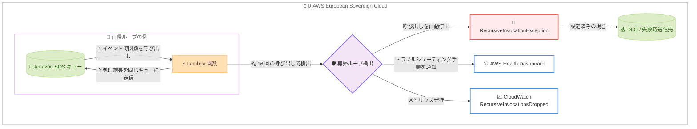

# AWS Lambda - 再帰ループ検出機能が AWS European Sovereign Cloud で利用可能に

**リリース日**: 2026 年 9 月 10 日
**サービス**: AWS Lambda
**機能**: 再帰ループ検出 (Recursive Loop Detection) の AWS European Sovereign Cloud 対応

📊 [このアップデートのインフォグラフィックを見る](https://takech9203.github.io/aws-news-summary/20260910-lambda-recursion-europe-sovereign-cloud.html)

## 概要

AWS Lambda の再帰ループ検出機能が、AWS European Sovereign Cloud で実行される Lambda 関数でもサポートされるようになりました。再帰ループ検出は、Lambda 関数とサポート対象サービス (Amazon S3、Amazon SQS、Amazon SNS) の間で発生する再帰的な呼び出しを自動的に検出して停止し、意図しない再帰ループによる予期しない請求を防止するセーフティガードレールです。

再帰ループは、設定ミスやコードの欠陥により、関数を呼び出したイベントソースに対して関数がイベントを書き戻してしまうことで発生します。ループが検出されると、Lambda は該当イベントの処理を自動的に停止し、トラブルシューティング手順を含む AWS Health Dashboard 通知を送信します。本機能はサポート対象の SDK バージョンを使用する Lambda 関数でデフォルトで有効です。

AWS European Sovereign Cloud は、完全に欧州連合 (EU) 域内に配置された独立したクラウドであり、ソブリンティ (主権) 要件を持つ組織を支援するために構築されています。今回のアップデートにより、商用リージョンと同等のコスト保護ガードレールがソブリン境界内のサーバーレスワークロードにも提供されます。

**アップデート前の課題**

- AWS European Sovereign Cloud では再帰ループ検出が利用できず、設定ミスによる無限ループが自動停止されないため、意図しない大量の呼び出しとコストが発生する可能性があった
- ソブリン環境では、CloudWatch アラームや請求アラームなどの間接的な仕組みでループを検知する必要があった
- 商用リージョンとソブリン環境で保護レベルが異なり、統一的な運用ガードレールを設計しにくかった

**アップデート後の改善**

- AWS European Sovereign Cloud の Lambda 関数でも、追加設定なし (デフォルト有効・無料) で再帰ループが自動検出・停止されるようになった
- ループ検出時に、トラブルシューティング手順を含む AWS Health Dashboard 通知を受け取れるようになった
- 意図的に再帰パターンを使用する場合は、`PutFunctionRecursionConfig` API で関数ごとに検出を無効化できる

## アーキテクチャ図



AWS European Sovereign Cloud 内で Lambda 関数と SQS キューの間に再帰ループが発生した場合の検出と通知の流れを示しています。同一のリクエストチェーンで呼び出しがしきい値に達すると、Lambda は次の呼び出しを自動的に停止し、Health Dashboard と CloudWatch メトリクスを通じて通知します。すべての処理と検出はソブリン境界内で完結します。

## サービスアップデートの詳細

### 主要機能

1. **再帰ループの自動検出と停止**
   - Lambda 関数と Amazon S3、Amazon SQS、Amazon SNS などのサポート対象サービス間の再帰的な呼び出しを追跡する
   - 同じトリガーイベントによる呼び出しが約 16 回に達すると、次の呼び出しを自動的に停止する
   - 追加料金なしで、サポート対象の SDK バージョンを使用する関数でデフォルト有効

2. **検出時の通知**
   - ループ検出時に、トラブルシューティング手順を含む通知を AWS Health Dashboard に送信する
   - CloudWatch メトリクス `RecursiveInvocationsDropped` で停止された呼び出し数を監視可能
   - 失敗時送信先 (on-failure destination) または DLQ が設定されている場合、停止されたイベントはそちらに送信される

3. **意図的な再帰パターンのサポート**
   - 設計上意図的に再帰を使用するワークロードでは、`PutFunctionRecursionConfig` API で関数ごとに検出を無効化できる
   - Lambda コンソール、AWS CLI (`put-function-recursion-config`)、AWS SDK から設定可能

4. **AWS European Sovereign Cloud への拡大**
   - 今回のアップデートにより、AWS European Sovereign Cloud で実行される Lambda 関数でも利用可能になった
   - ソブリン境界内のサーバーレスワークロードにも、商用リージョンと一貫したコスト保護ガードレールを提供

## 技術仕様

### 検出対象と動作

| 項目 | 詳細 |
|------|------|
| 検出対象サービス | Amazon SQS、Amazon S3、Amazon SNS、Lambda 関数間の呼び出し |
| 検出のしきい値 | 同一リクエストチェーンで約 16 回の呼び出し |
| 検出の仕組み | X-Ray トレースヘッダーのメタデータによるイベント追跡 (アクティブトレースの有効化は不要) |
| デフォルト設定 | 有効 (ループ検出時に呼び出しを停止) |
| 前提条件 | サポート対象バージョン以上の AWS SDK を使用していること |
| 料金 | 無料 |
| 通知手段 | AWS Health Dashboard、CloudWatch メトリクス `RecursiveInvocationsDropped` |
| 検出対象外 | Amazon DynamoDB など上記以外のサービスを含むループは検出不可 |

### サポートされる AWS SDK の最小バージョン

再帰ループ検出には、関数がサポート対象バージョン以上の AWS SDK を使用している必要があります。主なランタイムの最小バージョンは以下のとおりです。

| ランタイム | 最小 SDK バージョン |
|------|------|
| Node.js | 2.1147.0 (v2) / 3.105.0 (v3) |
| Python | boto3 1.24.46 / botocore 1.27.46 |
| Java 8 / 11 | 2.17.135 |
| Java 17 | 2.20.81 |
| Java 21 | 2.21.24 |
| .NET | 3.7.293.0 |
| Ruby | 3.134.0 |
| PHP | 3.232.0 |
| Go | v2 SDK 1.57.0 |

ランタイム同梱の SDK バージョンが要件を満たさない場合は、デプロイパッケージまたは Lambda レイヤーでサポート対象バージョンの SDK を追加できます。最新のサポート対象バージョンは [公式ドキュメント](https://docs.aws.eu/lambda/latest/dg/invocation-recursion.html#invocation-recursion-supported) を参照してください。

## 設定方法

### 前提条件

1. AWS European Sovereign Cloud のアカウントを利用していること
2. Lambda 関数がサポート対象の AWS SDK バージョン以上を使用していること
3. 検出設定を変更する場合は `lambda:PutFunctionRecursionConfig` の IAM 権限があること

### 手順

本機能はデフォルトで有効なため、通常は設定不要です。以下は意図的な再帰パターンを使用する場合の設定手順です。

#### ステップ 1: 現在の再帰検出設定を確認する

```bash
aws lambda get-function-recursion-config \
  --function-name my-function \
  --region eusc-de-east-1
```

指定した関数の再帰ループ検出設定を取得します。デフォルトでは `RecursiveLoop` が `Terminate` (検出時に停止) に設定されています。

#### ステップ 2: 意図的な再帰を許可する

```bash
aws lambda put-function-recursion-config \
  --function-name my-function \
  --recursive-loop Allow \
  --region eusc-de-east-1
```

関数の再帰ループ検出を無効化し、再帰的な呼び出しを許可します。意図的に再帰パターンを使用する設計の場合のみ実行してください。

#### ステップ 3: ループ検出時の緊急対応

再帰ループが検出された場合は、以下の対応で再発を防止します。

```bash
# 関数の同時実行数を 0 にして呼び出しをスロットリング
aws lambda put-function-concurrency \
  --function-name my-function \
  --reserved-concurrent-executions 0 \
  --region eusc-de-east-1
```

関数の予約済み同時実行数を 0 に設定してすべての呼び出しを停止します。その後、イベントソースとターゲットに同じリソースを指定しているなどのコード上の欠陥を修正し、同時実行数の設定を戻します。

## メリット

### ビジネス面

- **予期しないコストの防止**: 設定ミスによる無限ループを自動停止することで、意図しない大量呼び出しによる予期しない請求を防止できる
- **ソブリン環境でも一貫した保護**: 商用リージョンと同一のガードレールが AWS European Sovereign Cloud でも提供され、環境ごとの保護レベルの差異を考慮する必要がなくなる
- **追加コストゼロ**: 機能は無料かつデフォルト有効のため、導入コストや運用負荷なしで保護を得られる

### 技術面

- **同時実行枠の保護**: ループによって Lambda がスケールし、アカウントの利用可能な同時実行数を使い果たす事態を防止できる
- **迅速な検知と通知**: Health Dashboard 通知と CloudWatch メトリクスにより、根本原因の調査を支援する
- **柔軟なオプトアウト**: 意図的な再帰パターンを使用するワークロードでは、`PutFunctionRecursionConfig` API で関数単位で検出を無効化できる

## デメリット・制約事項

### 制限事項

- 検出対象は Amazon SQS、Amazon S3、Amazon SNS、および Lambda 関数間の呼び出しに限定される。DynamoDB など他のサービスを含むループは検出されない
- 関数がサポート対象バージョン以上の AWS SDK を使用していない場合、検出は機能しない
- Health Dashboard への通知表示には時間がかかる場合がある

### 考慮すべき点

- SQS がイベントソースの場合、ループ検出後も `maxReceiveCount` を超えるまで SQS はメッセージの再試行を続ける (最終的にメッセージはソースキューの DLQ に送信される)
- 関数の失敗時送信先や DLQ に、関数のトリガーと同じリソースを指定すると別の再帰ループが発生するため避ける
- 検出対象外のサービスを含むワークロードでは、CloudWatch アラームや請求アラームの併用が引き続き推奨される

## ユースケース

### ユースケース 1: ソブリン環境の SQS キュー処理での設定ミス保護

**シナリオ**: AWS European Sovereign Cloud 上で、SQS キューからメッセージを受信して加工し、別のキューに送信する Lambda 関数を運用している。環境変数の設定ミスにより送信先が入力元と同じキューになってしまった。

**実装例**:
```python
import os
import boto3

sqs = boto3.client("sqs")

def handler(event, context):
    for record in event["Records"]:
        processed = transform(record["body"])
        # 設定ミス: OUTPUT_QUEUE_URL に入力キューの URL が設定されていた
        sqs.send_message(
            QueueUrl=os.environ["OUTPUT_QUEUE_URL"],
            MessageBody=processed,
        )
```

**効果**: 約 16 回の呼び出し後に Lambda が自動的にループを停止し、Health Dashboard で通知される。無限ループによるコスト爆発と同時実行枠の枯渇をソブリン環境でも回避できる。

### ユースケース 2: S3 イベント駆動処理での出力先誤設定の保護

**シナリオ**: S3 バケットへのオブジェクト作成をトリガーにファイルを変換し、処理結果を保存する構成で、誤って入力と同じバケット・同じプレフィックスに出力してしまい、出力オブジェクトが再び関数をトリガーした。

**実装例**:
```bash
# ループ検出後、CloudWatch メトリクスで停止された呼び出し数を確認
aws cloudwatch get-metric-statistics \
  --namespace AWS/Lambda \
  --metric-name RecursiveInvocationsDropped \
  --dimensions Name=FunctionName,Value=file-converter \
  --start-time 2026-09-10T00:00:00Z \
  --end-time 2026-09-10T23:59:59Z \
  --period 3600 --statistics Sum \
  --region eusc-de-east-1
```

**効果**: ループが自動停止されるため被害が最小限に抑えられ、メトリクスから影響範囲を定量的に把握して修正 (出力先バケットの分離やプレフィックスフィルターの設定) につなげられる。

### ユースケース 3: 意図的な再帰パターンの継続利用

**シナリオ**: 大規模データセットをバッチ分割して処理するため、Lambda 関数が自分自身を再帰的に呼び出す設計を意図的に採用しており、この設計をソブリン環境でも維持したい。

**実装例**:
```bash
# 対象関数のみ再帰ループ検出を無効化
aws lambda put-function-recursion-config \
  --function-name batch-processor \
  --recursive-loop Allow \
  --region eusc-de-east-1
```

**効果**: 意図的な再帰設計を維持したまま AWS European Sovereign Cloud で運用できる。ただし、同時実行数の予約や CloudWatch アラームなどのガードレールを併せて実装することが推奨される。

## 料金

再帰ループ検出機能自体は無料で、追加料金は発生しません。デフォルトで有効化されており、X-Ray のアクティブトレースを有効化する必要もありません。

なお、ループが停止されるまでの約 16 回の呼び出しには通常の Lambda 料金 (リクエスト数と実行時間に基づく課金) が適用されます。

## 利用可能リージョン

AWS European Sovereign Cloud で利用可能になりました。なお、商用 AWS リージョンでは 2026 年 8 月にすべてのリージョンで利用可能になっています。

## 関連サービス・機能

- **AWS European Sovereign Cloud**: EU 域内に完全に配置された独立したクラウドで、ソブリンティ要件への対応を支援する
- **AWS Health Dashboard**: ループ検出時の通知とトラブルシューティング手順を表示する
- **Amazon CloudWatch**: `RecursiveInvocationsDropped` メトリクスによる監視や、検出対象外サービスに対するアラーム設定に使用する
- **Amazon SQS / Amazon SNS / Amazon S3**: 再帰ループ検出の対象となるイベントソース。DLQ や失敗時送信先の設定と組み合わせることで、停止されたイベントを保全できる

## 参考リンク

- 📊 [インフォグラフィック](https://takech9203.github.io/aws-news-summary/20260910-lambda-recursion-europe-sovereign-cloud.html)
- [公式発表 (What's New)](https://aws.amazon.com/about-aws/whats-new/2026/09/lambda-recursion-europe-sovereign-cloud)
- [ドキュメント: Lambda 再帰ループ検出 (European Sovereign Cloud)](https://docs.aws.eu/lambda/latest/dg/invocation-recursion.html)
- [API リファレンス: PutFunctionRecursionConfig](https://docs.aws.eu/lambda/latest/api/API_PutFunctionRecursionConfig.html)
- [AWS Blog: Detecting and stopping recursive loops in AWS Lambda functions](https://aws.amazon.com/blogs/compute/detecting-and-stopping-recursive-loops-in-aws-lambda-functions/)
- [関連レポート: 再帰ループ検出機能の全商用リージョン対応 (2026 年 8 月 31 日)](./2026-08-31-lambda-recursion-regions.md)

## まとめ

AWS Lambda の再帰ループ検出機能が AWS European Sovereign Cloud に拡大され、ソブリンティ要件を持つ組織でも設定ミスによる無限ループとそれに伴う予期しないコストから自動的に保護されるようになりました。機能は無料かつデフォルト有効のため追加の対応は不要ですが、関数が使用する AWS SDK バージョンがサポート要件を満たしているかの確認と、意図的な再帰パターンを使用する関数での `PutFunctionRecursionConfig` の設定を推奨します。
