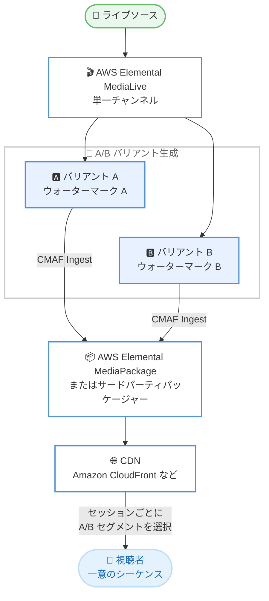

# AWS Elemental MediaLive - A/B フォレンジックウォーターマーキングのサポート

**リリース日**: 2026 年 9 月 10 日
**サービス**: AWS Elemental MediaLive
**機能**: A/B フォレンジックウォーターマーキング (A/B Forensic Watermarking)

📊 [このアップデートのインフォグラフィックを見る](https://takech9203.github.io/aws-news-summary/20260910-medialive-ab-forensic-watermarking.html)

## 概要

AWS Elemental MediaLive が A/B フォレンジックウォーターマーキングをサポートしました。この機能により、コンテンツ所有者はライブ動画コンテンツの不正な再配信の発生源を追跡できるようになります。単一の MediaLive チャンネルが、それぞれ異なる視覚的に透明なウォーターマーク (電子透かし) を埋め込んだ 2 つの同期された出力バリアント (A と B) を生成します。このウォーターマークは再エンコードや画面キャプチャを経ても保持されます。

下流のパッケージングおよび CDN インフラストラクチャがこれらのバリアントを組み合わせ、視聴セッションごとに一意のシーケンスを構築することで、流出したコンテンツの発生源となった視聴セッションを特定できます。ウォーターマーキングは DASH Industry Forum (DASH-IF) の A/B ウォーターマーキング仕様 (European Telecommunications Standards Institute (ETSI) TS 104 002) に準拠しており、標準準拠のパッケージャーや CDN インフラストラクチャとの相互運用性が確保されています。

本機能は、スポーツ中継やプレミアムライブイベントなど、コンテンツの不正流出対策が収益保護に直結する放送事業者、ストリーミングプラットフォーム、コンテンツ配信事業者を対象としています。MediaLive におけるウォーターマーキングプロバイダーの最初の実装として、Irdeto が利用可能です。

**アップデート前の課題**

- MediaLive 単体ではフォレンジックウォーターマークを動画に埋め込む手段がなく、不正再配信の発生源を特定するには別途エンコーダーや専用インフラストラクチャの構築が必要だった
- セッション単位でのウォーターマーク付与をサーバーサイドで実現するには、A/B 方式に対応した複数系統のエンコード出力を独自に構成・同期する必要があった
- 標準仕様に準拠しないウォーターマーキング構成では、パッケージャーや CDN との相互運用に個別のインテグレーション作業が発生していた

**アップデート後の改善**

- 単一の MediaLive チャンネルで、異なるウォーターマークペイロードを持つ同期済みの A/B 2 バリアントを生成できるようになった
- DASH-IF 仕様 (ETSI TS 104 002) 準拠により、標準準拠のパッケージャーや Amazon CloudFront を含む CDN インフラストラクチャと組み合わせて、セッションごとの一意なウォーターマークシーケンスを構築できるようになった
- CMAF Ingest 出力グループに対して、MediaLive API またはコンソールからウォーターマーキングを設定できるようになった

## アーキテクチャ図



MediaLive が生成した A/B 2 バリアントを CMAF Ingest でパッケージャーに送信し、下流の CDN がセッションごとに A/B セグメントを選択して一意のウォーターマークシーケンスを構築します。

## サービスアップデートの詳細

### 主要機能

1. **A/B 2 バリアントの同期出力**
   - ウォーターマーキングを有効にした出力グループにおいて、各ビデオレンディションの A/B 2 バリアントを単一チャンネルから生成
   - 各バリアントは異なるウォーターマークペイロードを保持
   - A バリアントは出力グループの通常の宛先 (A 宛先) へ、B バリアントはペアとなる B 代替宛先へ送信
   - チャンネル内の他の出力グループには影響しない

2. **耐性のある視覚的に透明なウォーターマーク**
   - 人間の目には知覚できない形で映像フレームに識別子を埋め込む
   - 再エンコードや画面キャプチャを経ても保持されるため、不正コピー後も追跡が可能
   - 音声に埋め込む Nielsen ウォーターマーキングとは別の、映像向けの独立した機能

3. **標準仕様準拠による相互運用性**
   - DASH-IF の A/B ウォーターマーキング仕様 (ETSI TS 104 002) に準拠
   - AWS Elemental MediaPackage のほか、標準準拠のサードパーティパッケージャーにも CMAF Ingest で配信可能
   - Amazon CloudFront を含む対応 CDN インフラストラクチャで、セッションごとのウォーターマーク組み立てを実現

4. **ウォーターマーキングプロバイダーによる実装**
   - A/B フォレンジックウォーターマーキングは、ウォーターマーキングプロバイダーが実装を提供する MediaLive の機能
   - 最初の実装として Irdeto AB Watermarker が利用可能
   - Irdeto と直接ライセンス契約を結び、オペレーター ID とウォーターマーク ID 長の値を取得して使用する

### 動作の仕組み

1. MediaLive チャンネルの CMAF Ingest または MediaPackage v2 出力グループでウォーターマーキングを有効化する
2. MediaLive が各ビデオレンディションについて、異なるウォーターマークを持つ A/B 2 バリアントを生成する
3. A バリアントは通常の宛先へ、B バリアントは指定した B 代替宛先へ CMAF Ingest で送信される
4. 下流のウォーターマーク対応オリジンまたは CDN が、視聴者のリクエストごとに A または B のセグメントコピーを選択し、セッション単位で一意のシーケンスを構築する
5. 流出コンテンツからウォーターマークシーケンスを検出することで、流出元の視聴セッションを特定できる

なお、視聴者ごとのセグメント選択や視聴者向けマニフェストの生成は MediaLive では行わず、下流システムの責務となります。

## 技術仕様

### 要件

| 項目 | 詳細 |
|------|------|
| 対応出力グループ | CMAF Ingest、MediaPackage v2 |
| 出力解像度 | 幅 240〜3,840 ピクセル、高さ 240〜2,160 ピクセル |
| 出力ロックモード | Epoch Locking が必須 (Pipeline Locking は非対応) |
| タイムコード | 入力に埋め込み UTC タイムコードが必要 (ウォーターマークのシーケンス処理に使用) |
| フレームレート | 出力グループ内の全ビデオエンコードで明示的な指定が必須 (Initialize from source は使用不可)。29.97 や 59.94 などの分数フレームレートは明示指定すれば対応 |
| 宛先構成 | 通常の A 宛先とペアの B 代替宛先を下流システムと調整して設定 |
| ウォーターマーカー | Irdeto AB Watermarker (最初の実装) |
| ライセンス管理 | Irdeto のライセンスを AWS Secrets Manager に保存し、シークレット名を設定 |
| IAM 権限 | MediaLive の信頼されたエンティティロールに `secretsmanager:GetSecretValue` 権限が必要 |
| 準拠仕様 | DASH-IF A/B ウォーターマーキング仕様 (ETSI TS 104 002) |

### API 変更履歴

| 日付 | サービス | 変更内容 |
|------|----------|----------|
| 2026/09/02 | [medialive](https://awsapichanges.com/archive/changes/fba41c-medialive.html) | 8 updated api methods - AB フォレンジックビデオウォーターマーキングのサポートを追加 |

## 設定方法

### 前提条件

1. Irdeto と直接ウォーターマーキングライセンス契約を締結し、Irdeto が提供するオペレーター ID とウォーターマーク ID 長の値を取得していること
2. ライセンスを AWS Secrets Manager に保存し、シークレット名を控えていること (無効・期限切れ・欠損・取得不能なライセンスではウォーターマークが適用されない)
3. MediaLive が引き受ける IAM ロールに、ライセンスシークレットへの `secretsmanager:GetSecretValue` 権限が付与されていること
4. チャンネルが Epoch Locking の要件を満たしており、入力に利用可能な埋め込み UTC タイムコードが含まれていること
5. B 代替宛先について下流のパッケージャー・CDN と調整済みであること

### 手順

#### ステップ 1: 出力グループでウォーターマーカーを選択

MediaLive コンソールのチャンネル作成ページで、CMAF Ingest または MediaPackage v2 出力グループを選択します。出力グループ設定の Watermarking セクションを展開し、Watermarker で [Irdeto AB Watermarker] を選択します。ウォーターマーキング設定は出力グループ内のすべての出力に適用されます。

#### ステップ 2: ウォーターマーキングフィールドを設定

Irdeto から提供されたオペレーター ID、ウォーターマーク ID 長、Secrets Manager のシークレット名などのフィールドを入力します。これらの値はライセンスと一致している必要があります。

#### ステップ 3: B 代替宛先を設定

通常の A 宛先に対応する B 代替宛先を設定します。CMAF Ingest の場合は URL を入力し、MediaPackage v2 の場合はチャンネルグループ、チャンネル名、リージョン、エンドポイントを選択します。標準チャンネル (2 パイプライン) では Pipeline 0 と Pipeline 1 の両方を設定します。各 B 代替宛先は互いに異なるエンドポイントとして構成する必要があります。なお、追加の A/B 宛先ペアは現在最大 1 組までサポートされます。

#### ステップ 4: Epoch Locking を有効化

ナビゲーションペインで [General settings] から [Global configuration] を選択し、[Enable global configuration] を有効にした上で、Output locking mode に `EPOCH_LOCKING` を指定します。

## メリット

### ビジネス面

- **不正再配信への抑止力と追跡能力**: 流出したコンテンツから流出元の視聴セッションを特定できるため、海賊版対策の実効性が向上し、プレミアムライブコンテンツの収益を保護できる
- **コンテンツライセンス要件への対応**: スポーツリーグや映画スタジオなどの権利者がフォレンジックウォーターマーキングを配信条件とするケースに、マネージドサービスの構成で対応できる
- **追加インフラ構築の削減**: 専用エンコーダーや独自のウォーターマーキング基盤を構築することなく、既存の MediaLive ワークフローに組み込める

### 技術面

- **単一チャンネルでの A/B 生成**: 2 つのバリアントを別々のチャンネルで運用する必要がなく、フレーム単位で同期された A/B 出力を単一チャンネルから取得できる
- **標準仕様準拠**: DASH-IF 仕様 (ETSI TS 104 002) 準拠により、AWS サービスに限らず標準準拠のサードパーティパッケージャーや CDN とも組み合わせられる
- **耐性の高いウォーターマーク**: 再エンコードや画面キャプチャを経ても保持されるため、多様な流出経路に対して検出能力を維持できる

## デメリット・制約事項

### 制限事項

- 対応する出力グループは CMAF Ingest と MediaPackage v2 のみで、その他の出力グループタイプでは利用できない
- 出力解像度は幅 240〜3,840 ピクセル、高さ 240〜2,160 ピクセルの範囲に限られる
- Epoch Locking が必須であり、Pipeline Locking では利用できない
- 入力に利用可能な埋め込み UTC タイムコードがない場合、チャンネルは動作するもののウォーターマークが正しくシーケンスされず、下流で確実に検出できない
- フレームレートは明示指定が必須で、入力と出力の間で割り切れないフレームレートはウォーターマークシーケンス番号が不正確になる
- 追加の A/B 宛先ペアは最大 1 組まで
- 現時点で利用可能なウォーターマーキング実装は Irdeto のみ

### 考慮すべき点

- Irdeto とのライセンス契約が別途必要であり、ライセンス費用や契約条件は Irdeto との直接交渉となる
- セッションごとのウォーターマーク組み立ては下流のウォーターマーク対応オリジン・CDN の責務であり、MediaLive 単体ではエンドツーエンドのソリューションにならない (下流システムとの構成調整が必要)
- A/B 2 バリアントを生成・送信するため、出力系統が増えることによる下流のインジェスト・ストレージ構成への影響を確認する必要がある
- 流出検出には、流出コンテンツからウォーターマークを抽出・解析する Irdeto 側の検出サービスとの連携が前提となる

## ユースケース

### ユースケース 1: プレミアムスポーツライブ配信の海賊版対策

**シナリオ**: スポーツストリーミングプラットフォームが、高額な放映権を持つライブ中継の不正再配信サイトへの流出に悩んでいる。流出元の契約者を特定し、アカウント停止や法的措置につなげたい。

**実装例**:
```
1. MediaLive チャンネルの CMAF Ingest 出力グループで
   Irdeto AB Watermarker を有効化
2. A/B バリアントを MediaPackage v2 へ CMAF Ingest で送信
3. CloudFront とウォーターマーク対応構成でセッションごとの
   A/B シーケンスを組み立て
4. 流出検知時に Irdeto の検出サービスでシーケンスを解析し
   流出元セッションを特定
```

**効果**: 流出元の視聴セッションを特定できるため、迅速なアカウント停止と再発防止が可能になり、放映権者への契約義務も果たせる。

### ユースケース 2: 権利者要件としてのフォレンジックウォーターマーキング対応

**シナリオ**: 配信事業者が新たにプレミアム映画チャンネルのライブリニア配信を契約する際、権利者からフォレンジックウォーターマーキングの実装を配信条件として求められている。

**実装例**:
```
1. Irdeto とライセンス契約を締結し、オペレーター ID と
   ウォーターマーク ID 長を取得
2. ライセンスを AWS Secrets Manager に保存
3. 既存の MediaLive チャンネルの出力グループに
   ウォーターマーキング設定を追加し、Epoch Locking を有効化
4. 標準準拠のパッケージャー・CDN と B 代替宛先を調整
```

**効果**: 専用エンコーダーの導入なしに、既存の MediaLive ベースの配信ワークフローのまま権利者のセキュリティ要件を満たし、コンテンツ調達の選択肢を拡大できる。

### ユースケース 3: サードパーティパッケージャーを含むマルチベンダー構成

**シナリオ**: 放送事業者が、エンコードは MediaLive、パッケージングは既存のサードパーティ製パッケージャーという構成を維持したまま、フォレンジックウォーターマーキングを導入したい。

**実装例**:
```
1. MediaLive の CMAF Ingest 出力グループでウォーターマーキングを設定
2. A 宛先と B 代替宛先にサードパーティパッケージャーの
   インジェスト URL をそれぞれ指定
3. ETSI TS 104 002 準拠のパッケージャー・CDN で
   セッションごとのウォーターマーク組み立てを構成
```

**効果**: DASH-IF 標準仕様準拠により、AWS 以外のパッケージング・CDN 基盤とも相互運用でき、既存投資を活かしながらウォーターマーキングを追加できる。

## 料金

What's New での追加料金に関する言及はありません。MediaLive のチャンネル料金は入出力の構成に基づいて課金されるため、A/B 2 バリアントの出力構成が料金に与える影響は [AWS Elemental MediaLive 料金ページ](https://aws.amazon.com/medialive/pricing/) で確認してください。

また、ウォーターマーキングライセンスは Irdeto と直接契約する必要があり、そのライセンス費用は AWS の料金とは別に発生します。

## 利用可能リージョン

AWS Elemental MediaLive が利用可能なすべての AWS リージョンで利用できます。

## 関連サービス・機能

- **AWS Elemental MediaPackage**: MediaLive からウォーターマーク付き A/B バリアントを CMAF Ingest で受信するパッケージングサービス。MediaPackage v2 出力グループが本機能に対応
- **Amazon CloudFront**: 下流でセッションごとの A/B ウォーターマークシーケンス組み立てを実現する CDN インフラストラクチャの一例
- **AWS Secrets Manager**: Irdeto のウォーターマーキングライセンスを保存し、MediaLive が実行時に参照するためのシークレット管理サービス
- **Nielsen ウォーターマーキング (MediaLive)**: 音声にウォーターマークを挿入する既存機能。本機能は映像向けであり、両者は独立した機能

## 参考リンク

- 📊 [インフォグラフィック](https://takech9203.github.io/aws-news-summary/20260910-medialive-ab-forensic-watermarking.html)
- [公式発表 (What's New)](https://aws.amazon.com/about-aws/whats-new/2026/09/medialive-ab-forensic-watermarking/)
- [ドキュメント: Creating A/B forensic video watermarks](https://docs.aws.amazon.com/medialive/latest/ug/feature-ab-watermark.html)
- [ドキュメント: Setting up A/B video watermarking](https://docs.aws.amazon.com/medialive/latest/ug/ab-watermark-configure.html)
- [API 変更履歴 (awsapichanges.com)](https://awsapichanges.com/archive/changes/fba41c-medialive.html)
- [料金ページ](https://aws.amazon.com/medialive/pricing/)

## まとめ

AWS Elemental MediaLive の A/B フォレンジックウォーターマーキング対応により、単一チャンネルから標準仕様 (ETSI TS 104 002) 準拠の A/B バリアントを生成し、ライブ動画の不正再配信の発生源をセッション単位で追跡できるようになりました。プレミアムライブコンテンツを配信する事業者は、Irdeto とのライセンス契約と下流のウォーターマーク対応構成を前提に、Epoch Locking などの要件を確認した上で導入を検討することを推奨します。
