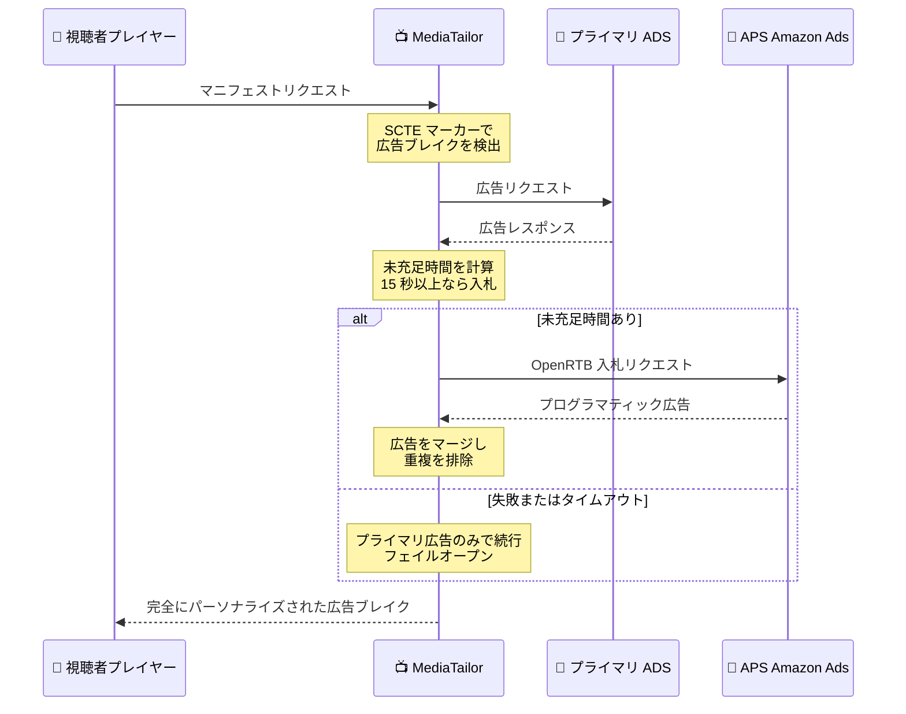

# AWS Elemental MediaTailor - Yield Optimization

**リリース日**: 2026 年 9 月 10 日
**サービス**: AWS Elemental MediaTailor
**機能**: Yield Optimization (Amazon Ads 需要による広告枠の自動収益化)

📊 [このアップデートのインフォグラフィックを見る](https://takech9203.github.io/aws-news-summary/20260910-mediatailor-yield-optimization.html)

## 概要

AWS Elemental MediaTailor に Yield Optimization が追加されました。ライブ配信のサーバーサイド広告挿入 (SSAI) において、プライマリ広告サーバーで埋まらなかった広告枠を Amazon Ads の需要で自動的に収益化する新機能です。追加インフラ不要、有効化コストゼロで、未充足の広告ブレイクを収益化されたインプレッションに変換できます。

本機能は、Amazon Publisher Services (APS) の Streaming TV プログラムに参加しているパブリッシャー向けに提供されます。広告はストリームに直接ステッチされて視聴者に届くため、あらゆるデバイスでシームレスに再生されます。プロリーグのチャンピオンシップのような大規模ライブイベントを想定して設計されており、低レイテンシーかつ高速なレスポンスでピーク視聴時の広告充足率を最大化します。

対象ユーザーは、ライブスポーツ、ニュース、FAST チャンネルなどのライブ配信を SSAI で収益化しているブロードキャスターや動画配信プラットフォームです。

**アップデート前の課題**

- プライマリ広告デシジョンサーバー (ADS) が広告ブレイクを埋め切れない場合、残余枠 (レムナント在庫) は未収益のままスレートやハウス広告で埋める必要があった
- 未充足枠をプログラマティック需要で埋めるには、SSP や広告取引システムとの個別統合や追加インフラの構築・運用が必要だった
- 同一ブレイク内での競合広告の排除や重複広告の防止を自前で実装する必要があった

**アップデート後の改善**

- MediaTailor が未充足の広告枠を検出し、OpenRTB 入札リクエストを APS に自動送信して Amazon Ads 需要 (Amazon DSP、Sponsored TV) で充足できるようになった
- MediaTailor API またはコンソールの設定だけで有効化でき、追加インフラやクライアント側の変更が不要になった
- VAST 広告カテゴリシグナルを OpenRTB 経由で伝搬し、同一ブレイク内の競合カテゴリ排除と広告の重複排除が自動で行われるようになった
- CloudWatch メトリクスで広告充足率の改善を監視し、APS Publisher ポータルで収益を追跡できるようになった

## アーキテクチャ図



広告ブレイク検出からプライマリ ADS への広告リクエスト、未充足時間の APS 需要による充足までの処理フローです。APS へのリクエストが失敗しても常にフェイルオープンで動作し、視聴者の再生を妨げません。

## サービスアップデートの詳細

### 主要機能

1. **未充足広告枠の自動収益化**
   - プライマリ ADS のレスポンス後に未充足時間を計算し、15 秒以上の未充足があれば APS に OpenRTB 入札リクエストを送信
   - Amazon DSP と Sponsored TV のプログラマティック需要で残余在庫を充足
   - APS リクエストの失敗時はプライマリ広告のみで続行するフェイルオープン設計で、再生をブロックまたは遅延させない

2. **大規模ライブイベント対応**
   - プロリーグのチャンピオンシップなど大規模ライブイベント向けに設計
   - 低レイテンシーと高速レスポンスにより、ピーク視聴時でも広告充足を最大化

3. **ブランドセーフティ**
   - VAST 広告カテゴリシグナルを OpenRTB 入札リクエストに伝搬し、同一ブレイク内での競合カテゴリや制限カテゴリの広告を除外
   - パブリッシャー自身がプライスフロア (最低価格) とカテゴリルールを設定し、配信される広告を完全にコントロール
   - 同一ブレイク内で同じ広告が複数回挿入されないよう重複排除を実施

4. **シンプルな有効化と可視性**
   - MediaTailor API (`PutPlaybackConfiguration` の `YieldOptimizationConfiguration`) またはコンソールから設定可能
   - CloudWatch メトリクス (`YieldOptimization.BidRequest`、`YieldOptimization.AdsInserted`) で充足率改善を監視
   - 収益とアーニングは APS Publisher ポータルで追跡

## 技術仕様

### 機能仕様

| 項目 | 詳細 |
|------|------|
| 対象コンテンツ | ライブ配信の HLS / DASH ミッドロール広告ブレイク (SCTE ブレイク時間が必要) |
| 非対応 | VOD、プリロール広告、プリフェッチワークフロー、オーバーレイ広告リクエスト |
| 最小未充足時間 | 15 秒以上を推奨 (APS の広告クリエイティブは通常 15 秒以上のため) |
| 需要ソース | Amazon Publisher Services (Amazon DSP、Sponsored TV)。今後、追加の需要ソースが提供予定 |
| 入札プロトコル | OpenRTB (JSON テンプレートでカスタマイズ可能) |
| Amazon Ads リージョン | Americas、Europe、Asia Pacific から主要オーディエンスに応じて選択 |
| 障害時動作 | フェイルオープン (APS 失敗時はプライマリ広告のみで続行) |
| 前提条件 | APS Streaming TV プログラムへの登録と APS Publisher ID の取得 |

### API 変更履歴

| 日付 | サービス | 変更内容 |
|------|----------|----------|
| 2026/09/04 | [AWS MediaTailor](https://awsapichanges.com/archive/changes/acf9b2-api.mediatailor.html) | 7 updated api methods - Yield Optimization (APS 需要) の追加、Monetization Functions のライフサイクルフック追加など |

### YieldOptimizationConfiguration の設定例

```json
{
  "MinimumUnfilledDuration": 15,
  "PublisherId": "your-aps-publisher-id",
  "Region": "AMERICAS",
  "OpenRtbTemplate": "{\"app\":{\"bundle\":\"your.app.bundle\",\"storeurl\":\"https://store-url\",\"content\":{}},\"device\":{\"ua\":\"{{session.user_agent}}\",\"ip\":\"{{session.client_ip}}\"},\"imp\":[{\"video\":{\"mimes\":[\"video/mp4\"],\"protocols\":[2,3,5,6],\"ext\":{\"slotId\":\"your-slot-id\"}},\"bidfloor\":1.0}]}"
}
```

## 設定方法

### 前提条件

1. Amazon Publisher Services (APS) の Streaming TV プログラムへのオンボーディングが完了し、APS Publisher ID を取得済みであること (登録には数日かかる場合があるため早めに開始する)
2. 既存の MediaTailor 再生設定 (playback configuration) があること
3. SCTE 広告ブレイクマーカー (ブレイク時間情報を含む) を持つライブ配信コンテンツソースがあること

### 手順

#### ステップ 1: コンソールで Yield Optimization を有効化

1. [MediaTailor コンソール](https://console.aws.amazon.com/mediatailor/home) を開き、[Configurations] から対象の再生設定を選択して [Edit] を選択
2. [Yield Optimization Settings] セクションを展開し、有効化ドロップダウンを [Enabled] に設定
3. 以下のフィールドを入力
   - **APS Publisher ID**: APS Publisher アカウントに紐づく ID
   - **Minimum Unfilled Duration**: 15 以上を設定
   - **Amazon Ads Region**: Americas / Europe / Asia Pacific から選択
   - **OpenRTB Template Configuration**: OpenRTB の JSON テンプレート
4. [Save] を選択

コンソールは JSON 構文を検証し、必須フィールドが不足している場合はエラーや警告をインラインで表示します。

#### ステップ 2: API で設定する場合

```bash
aws mediatailor put-playback-configuration \
  --name "MyStreamingService" \
  --ad-decision-server-url "https://ads.example.com/vast" \
  --video-content-source-url "https://origin.example.com/hls/" \
  --yield-optimization-configuration '{
    "MinimumUnfilledDuration": 15,
    "PublisherId": "your-aps-publisher-id",
    "Region": "AMERICAS",
    "OpenRtbTemplate": "{\"app\":{\"bundle\":\"your.app.bundle\",\"storeurl\":\"https://store-url\",\"content\":{}},\"device\":{\"ua\":\"{{session.user_agent}}\",\"ip\":\"{{session.client_ip}}\"},\"imp\":[{\"video\":{\"mimes\":[\"video/mp4\"],\"protocols\":[2,3,5,6],\"ext\":{\"slotId\":\"your-slot-id\"}},\"bidfloor\":1.0}]}"
  }'
```

`PutPlaybackConfiguration` API の `YieldOptimizationConfiguration` パラメータで、最小未充足時間、APS Publisher ID、Amazon Ads リージョン、OpenRTB テンプレートを指定して再生設定を更新しています。

#### ステップ 3: 動作確認

```bash
aws cloudwatch get-metric-statistics \
  --namespace AWS/MediaTailor \
  --metric-name YieldOptimization.BidRequest \
  --dimensions Name=ConfigurationName,Value=MyStreamingService \
  --start-time 2026-09-10T00:00:00Z \
  --end-time 2026-09-10T23:59:59Z \
  --period 300 \
  --statistics Sum
```

プレイヤーパラメータ (User-Agent、IP アドレスなど) を含む再生セッションを開始し、未充足時間のある広告ブレイクを待った後、CloudWatch メトリクス `YieldOptimization.BidRequest` と `YieldOptimization.AdsInserted` を確認します。`BidRequest` が出力されているのに `AdsInserted` が 0 の場合は、`ads_interaction_log` の `RAW_BID_REQUEST` イベントでテンプレートが有効な入札リクエストを生成しているか確認します。

## メリット

### ビジネス面

- **残余在庫の収益化**: プライマリ ADS が埋め切れなかった広告枠を Amazon DSP や Sponsored TV のプログラマティック需要で充足し、これまで失われていた収益機会を回収できる
- **有効化コストゼロ**: 機能の利用に追加料金は不要で、追加インフラの構築・運用コストも発生しない
- **視聴体験の向上**: 繰り返し表示されるハウス広告やスレートを、関連性の高いプログラマティック広告に置き換えられる

### 技術面

- **統合作業が不要**: SSP との個別統合を開発せずに、MediaTailor の設定だけでプログラマティック需要へ接続できる
- **フェイルオープン設計**: APS リクエストの失敗やタイムアウトが視聴者の再生をブロック・遅延させない
- **サーバーサイド挿入**: 広告がストリームにステッチされるため、クライアント側の変更なしにあらゆるデバイスでシームレスに再生される
- **運用可視性**: CloudWatch メトリクスで充足率を監視し、APS Publisher ポータルで収益を追跡できる

## デメリット・制約事項

### 制限事項

- APS Streaming TV プログラムへの登録が必須であり、登録のないパブリッシャーは利用できない (オンボーディングには数日かかる場合がある)
- 現時点ではライブ配信の HLS / DASH ミッドロール広告のみ対応 (VOD、プリロール、プリフェッチ、オーバーレイ広告は非対応)
- 未充足時間が 15 秒未満の場合、APS の広告クリエイティブは通常 15 秒以上のため広告が返却されない
- SCTE マーカーにブレイク時間情報が含まれている必要がある

### 考慮すべき点

- 需要ソースは現時点で Amazon Ads (APS) のみ (追加の需要ソースは今後提供予定)
- OpenRTB テンプレートの構築には `app.bundle`、`device`、`imp.video` など必須フィールドの理解が必要
- プライスフロアとカテゴリルールの設定はパブリッシャー側の責任であり、収益性とブランドセーフティのバランス調整が必要
- パーソナライズに使える残り時間が不足している場合は入札リクエストが行われない

## ユースケース

### ユースケース 1: 大規模ライブスポーツイベントの広告充足率向上

**シナリオ**: プロリーグのチャンピオンシップ中継で視聴者が急増し、プライマリ ADS の直販在庫だけでは広告ブレイクを埋め切れず、未充足枠がスレートで埋まっている。

**実装例**:
```json
{
  "MinimumUnfilledDuration": 15,
  "PublisherId": "aps-publisher-id",
  "Region": "AMERICAS"
}
```

**効果**: ピーク視聴時の未充足枠が Amazon Ads 需要で自動的に充足され、最大視聴者数のタイミングで収益を最大化できる。

### ユースケース 2: FAST チャンネルの残余在庫の収益化

**シナリオ**: 24 時間 365 日運用するリニアチャンネルで、深夜帯やニッチコンテンツの時間帯に直販広告が埋まらず、ハウス広告の繰り返しが視聴体験を損ねている。

**実装例**:
```bash
aws mediatailor put-playback-configuration \
  --name "FastChannel01" \
  --yield-optimization-configuration '{"MinimumUnfilledDuration": 15, "PublisherId": "aps-publisher-id", "Region": "ASIA_PACIFIC", "OpenRtbTemplate": "..."}'
```

**効果**: 直販需要が薄い時間帯でもプログラマティック広告で充足され、ハウス広告の繰り返しが減って視聴体験と収益の両方が改善する。

### ユースケース 3: ブランドセーフティを維持した残余枠販売

**シナリオ**: 自動車メーカーがスポンサーの番組で、同一広告ブレイク内に競合他社の広告が混入することを避けながら残余枠を販売したい。

**実装例**:
```
OpenRTB テンプレートに bidfloor (プライスフロア) を設定し、
VAST 広告カテゴリシグナルによる競合カテゴリ排除を活用する。
プライマリ ADS が返した広告のカテゴリ情報が OpenRTB 入札リクエストに
伝搬され、競合カテゴリの広告が自動的に除外される。
```

**効果**: 同一ブレイク内の競合広告の混入や広告の重複を自動で防ぎつつ、パブリッシャーが設定した価格条件を満たす広告のみで残余枠を収益化できる。

## 料金

Yield Optimization は追加料金なしで利用できます。MediaTailor の広告挿入に対する既存の料金 (挿入された広告に対する課金) は通常どおり適用されます。収益とアーニングは APS Publisher ポータルで確認できます。

詳細は [AWS Elemental MediaTailor 料金ページ](https://aws.amazon.com/mediatailor/pricing/) を参照してください。

## 利用可能リージョン

MediaTailor が利用可能なすべての AWS リージョンで利用できます。

- 米国東部 (オハイオ、バージニア北部)、米国西部 (オレゴン)
- アフリカ (ケープタウン)
- アジアパシフィック (ハイデラバード、マレーシア、メルボルン、ムンバイ、大阪、ソウル、シンガポール、シドニー、東京)
- カナダ (中部)
- 欧州 (フランクフルト、アイルランド、ロンドン、パリ、ストックホルム)
- 中東 (UAE)
- 南米 (サンパウロ)

## 関連サービス・機能

- **Amazon Publisher Services (APS)**: Yield Optimization の需要ソース。Streaming TV プログラムへの登録と Publisher ID の取得が前提条件で、収益追跡も APS Publisher ポータルで行う
- **AWS Elemental MediaLive**: ライブストリームのエンコードと SCTE-35 広告マーカーの挿入を担い、MediaTailor の広告ブレイク検出の起点となる
- **AWS Elemental Inference**: 同日発表されたコンテキストメタデータ生成機能と組み合わせることで、Monetization Function 経由のコンテキスト広告ターゲティングと併用できる
- **Amazon CloudWatch**: `YieldOptimization.BidRequest` や `YieldOptimization.AdsInserted` などのメトリクスで充足率改善を監視する

## 参考リンク

- 📊 [インフォグラフィック](https://takech9203.github.io/aws-news-summary/20260910-mediatailor-yield-optimization.html)
- [公式発表 (What's New)](https://aws.amazon.com/about-aws/whats-new/2026/09/mediatailor-yield-optimization/)
- [ドキュメント: Working with MediaTailor Yield Optimization](https://docs.aws.amazon.com/mediatailor/latest/ug/yield-optimization.html)
- [ドキュメント: Yield Optimization quick start guide](https://docs.aws.amazon.com/mediatailor/latest/ug/yield-optimization-quickstart.html)
- [料金ページ](https://aws.amazon.com/mediatailor/pricing/)

## まとめ

MediaTailor の Yield Optimization は、ライブ配信 SSAI の未充足広告枠を Amazon Ads 需要で自動収益化する機能で、追加インフラなしに設定のみで残余在庫の収益機会を回収できます。APS Streaming TV プログラムのパブリッシャーは、オンボーディングに数日かかる場合があるため、まず APS 登録を開始し、その後 MediaTailor 再生設定で本機能を有効化して CloudWatch メトリクスで充足率の改善を確認することを推奨します。
