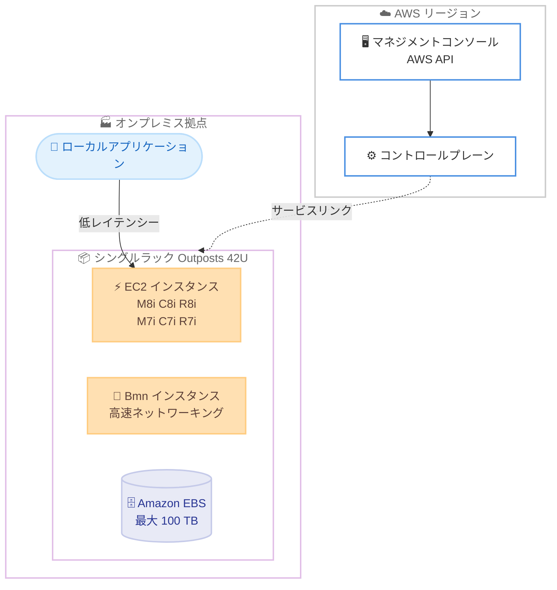

# AWS Outposts - 第 2 世代シングルラック AWS Outposts の一般提供開始

**リリース日**: 2026 年 9 月 10 日
**サービス**: AWS Outposts
**機能**: 第 2 世代シングルラック AWS Outposts (Second-generation single-rack AWS Outposts)

📊 [このアップデートのインフォグラフィックを見る](https://takech9203.github.io/aws-news-summary/20260910-single-rack-aws-outposts.html)

## 概要

AWS は、第 2 世代シングルラック AWS Outposts の一般提供を発表しました。シングルラック Outposts は、コンピューティング、ストレージ、ネットワーキングを 1 台のコンパクトな 42U ラックに統合した自己完結型のユニットで、低レイテンシー、ローカルデータ処理、データレジデンシーが求められるワークロードを、スペースや電力に制約のあるロケーションで実行するために設計されています。

シングルラック Outposts は、最大 2,688 vCPU と 100 TB の Amazon Elastic Block Store (Amazon EBS) ストレージを提供します。さらに、マルチラック Outposts と同様に、最新の x86 ベース EC2 インスタンスをサポートします。汎用 (M7i、M8i)、コンピューティング最適化 (C7i、C8i)、メモリ最適化 (R7i、R8i) に加えて、Outposts 高速ネットワーキングインスタンス (Bmn-sf2e、Bmn-cx2、Bmn-cx3a) も利用できます。

製造業やゲーム業界など、ラックスペースが限られたロケーションで事業を運営する組織にとって、シングルラック Outposts は最新の AWS のコンピューティング、ストレージ、ネットワーキング機能をオンプレミスに提供し、現在利用可能なスペースと電力を活用しながらモダナイゼーションを進める直接的な道筋となります。シングルラックとマルチラックの Outposts は、AWS リージョンとオンプレミスロケーションにわたって、同一の AWS API、マネジメントコンソール、自動化、ガバナンスポリシー、セキュリティコントロールによる一貫した体験を提供します。

**アップデート前の課題**

第 2 世代 Outposts の展開には、次のような制約がありました。

- 第 2 世代 Outposts ラックはマルチラック構成が前提であり、コンピューティングラックに加えて専用のネットワークラックを接続する必要があった
- ラックスペースや電力に制約のある拠点 (工場、エッジロケーション、コロケーション施設など) では、複数ラック分の設置スペースを確保することが難しかった
- 小規模な拠点で最新世代の EC2 インスタンス (M8i、C8i、R8i など) をオンプレミスで利用する選択肢が限られていた

**アップデート後の改善**

今回のアップデートにより、次のことが可能になりました。

- 1 台の 42U ラックのみで、コンピューティング、ストレージ、ネットワーキングを含む自己完結型の Outposts を展開できるようになった (別途ネットワークラックは不要)
- 最大 2,688 vCPU と 100 TB の Amazon EBS ストレージを、最小限のフットプリントで利用できるようになった
- 第 8 世代を含む最新の x86 EC2 インスタンスと、高速ネットワーキング Bmn インスタンスを、スペースや電力に制約のある拠点でも利用できるようになった

## アーキテクチャ図



1 台の 42U ラックにコンピューティング、ストレージ、ネットワーキングが統合され、サービスリンク経由で AWS リージョンのコントロールプレーンと接続されます。ローカルアプリケーションは低レイテンシーでオンプレミスの EC2 インスタンスにアクセスできます。

## サービスアップデートの詳細

### 主要機能

1. **自己完結型の 42U シングルラック構成**
   - コンピューティング、ストレージ、ネットワーキングを 1 台のラックに統合
   - マルチラック構成と異なり、専用のネットワークラックが不要
   - スペースや電力に制約のある拠点向けに設計されたコンパクトなフォームファクター

2. **大容量のコンピューティングとストレージ**
   - 最大 2,688 vCPU の EC2 コンピューティングキャパシティ
   - 最大 100 TB の Amazon EBS ストレージ
   - EC2 インスタンスキャパシティと EBS ボリュームの組み合わせは、事前構成されたカタログから選択

3. **最新の x86 ベース EC2 インスタンスのサポート**
   - 汎用: M7i、M8i
   - コンピューティング最適化: C7i、C8i
   - メモリ最適化: R7i、R8i
   - 高速ネットワーキング: Bmn-sf2e、Bmn-cx2、Bmn-cx3a

4. **AWS リージョンと一貫した運用体験**
   - 同一の AWS API、マネジメントコンソール、自動化ツールを利用可能
   - ガバナンスポリシーとセキュリティコントロールを AWS リージョンとオンプレミスで統一
   - マルチラック Outposts と同じ運用モデルで管理可能

## 技術仕様

### シングルラック Outposts の主な仕様

| 項目 | 詳細 |
|------|------|
| フォームファクター | 42U ラック (高さ 203 cm x 幅 61 cm x 奥行 122 cm) |
| 最大 vCPU | 2,688 vCPU |
| 最大 EBS ストレージ | 100 TB |
| 対応インスタンス | M7i、M8i、C7i、C8i、R7i、R8i、Bmn-sf2e、Bmn-cx2、Bmn-cx3a |
| 電力構成 | 10 kVA、15 kVA、30 kVA (冗長電源フィード対応) |
| アップリンク | 10 / 40 / 100 Gbps を各 1〜4 本 (100 Gbps は FEC CL91 が必要) |
| セキュリティ | 全ホストに AWS Nitro カード、施錠可能なドアと改ざん検知 |

### 高速ネットワーキング Bmn インスタンスの例

| インスタンス | vCPU | メモリ | 高速ネットワーク帯域 |
|------|------|------|------|
| bmn-sf2e.metal-16xl | 64 | 512 GiB | 100 Gbps |
| bmn-sf2e.metal-32xl | 128 | 1,024 GiB | 200 Gbps |
| bmn-cx2.metal-48xl | 192 | 1,024 GiB | 800 Gbps |

Bmn-sf2e は Solarflare X2522 NIC を搭載し、外部 1 pps 時刻ソースによるナノ秒精度の PTP をサポートします。Bmn-cx2 は NVIDIA ConnectX-7 400G NIC を搭載します。いずれもベアメタルで、L2 マルチキャストとハードウェア PTP をサポートします。

### API 変更履歴

| 日付 | サービス | 変更内容 |
|------|----------|----------|
| 2026/09/10 | [outposts](https://awsapichanges.com/archive/changes/dfd7fe-outposts.html) | 10 updated api methods - Outpost および CatalogItem リソースに、Outpost の世代とラックスケーリング構成を識別するフィールドを追加 |

## 設定方法

### 前提条件

1. AWS アカウントと AWS Outposts を利用可能な AWS リージョンへのアクセス
2. 設置場所の要件を満たすファシリティ。温度 5〜35 度、湿度 8〜80% (結露なきこと)、前面から背面へのエアフロー、標高 3,050 m 未満
3. 電力要件 (10 / 15 / 30 kVA 構成に応じた電源) とネットワーク要件 (10 / 40 / 100 Gbps のアップリンク) の充足
4. AWS リージョンへのサービスリンク接続 (パブリックインターネットまたは AWS Direct Connect 経由)

### 手順

#### ステップ 1: Outposts コンソールで注文を作成

```bash
# 利用可能なシングルラックカタログアイテムを確認
aws outposts list-catalog-items \
  --item-class-filter RACK
```

AWS Outposts コンソールまたは CLI で、事前構成されたカタログからシングルラック構成を選択します。上記コマンドは、注文可能なラックのカタログアイテム一覧を取得します。

#### ステップ 2: サイト情報の登録と設置

```bash
# 設置サイトを作成
aws outposts create-site \
  --name "factory-site-tokyo" \
  --description "Manufacturing site with space constraints"
```

設置先サイトの電力、ネットワーク、ファシリティ情報を登録します。注文後、AWS がラックの配送と設置を行います。

#### ステップ 3: Outpost 上でリソースを起動

```bash
# Outpost のサブネットに EC2 インスタンスを起動
aws ec2 run-instances \
  --instance-type m8i.4xlarge \
  --subnet-id subnet-0123456789abcdef0 \
  --image-id ami-0123456789abcdef0
```

設置完了後、VPC のサブネットを Outpost に拡張し、通常の EC2 API と同じ操作でインスタンスを起動します。EBS ボリュームもリージョンと同じ API で作成できます。

## メリット

### ビジネス面

- **省スペース拠点のモダナイゼーション**: ラック 1 台分のスペースと電力で最新の AWS インフラストラクチャを導入でき、既存拠点の制約の中でモダナイゼーションを進められる
- **データレジデンシー要件への対応**: データをオンプレミスに保持しながら AWS のサービスと運用モデルを利用でき、規制要件を満たしやすい
- **導入までの道筋が明確**: 事前構成されたカタログから選択して注文するだけで、AWS が配送と設置を実施する

### 技術面

- **低レイテンシーなローカル処理**: アプリケーションとデータの近くでコンピューティングを実行でき、製造ラインの制御やゲームサーバーなど遅延に敏感なワークロードに対応できる
- **最新世代インスタンスの利用**: 第 8 世代 (M8i、C8i、R8i) を含む最新の x86 インスタンスと、最大 800 Gbps の高速ネットワーキング Bmn インスタンスをオンプレミスで利用できる
- **一貫した運用**: AWS リージョンと同一の API、コンソール、自動化、セキュリティコントロールを使用でき、オンプレミス専用の運用スキルやツールが不要

## デメリット・制約事項

### 制限事項

- コンピューティングとネットワーキングを独立してスケールする構成や、後からコンピューティングラックを追加する拡張は、マルチラック Outposts の領域となる (シングルラックは 1 台で完結する構成)
- EC2 インスタンスキャパシティと EBS ストレージの組み合わせは、事前構成されたカタログからの選択となる
- 設置には温度、湿度、エアフロー、電力、ネットワークアップリンクなどのファシリティ要件を満たす必要がある

### 考慮すべき点

- Outposts はサービスリンクを通じて AWS リージョンのコントロールプレーンと常時接続する前提のため、接続回線の冗長性を計画する必要がある
- 将来のキャパシティ需要が 1 ラックを超える見込みがある場合は、マルチラック構成との比較検討が必要
- 利用可能な国と地域は Outposts ラックの FAQ ページで事前に確認する必要がある

## ユースケース

### ユースケース 1: 製造業の工場でのローカルデータ処理

**シナリオ**: 工場の生産ラインで発生するセンサーデータをリアルタイムに処理したいが、サーバールームにはラック 1 台分のスペースしかない。

**実装例**:
```
- シングルラック Outposts を工場のサーバールームに設置
- C8i インスタンスでストリーム処理アプリケーションを実行
- EBS ボリュームに処理結果をローカル保存し、集計データのみリージョンへ転送
```

**効果**: 限られたスペースで低レイテンシーのローカル処理を実現し、生産ラインの制御に必要な応答性能を確保できます。

### ユースケース 2: ゲームサーバーのエッジ展開

**シナリオ**: プレイヤーへの低レイテンシー配信のため、リージョンから離れた都市にゲームサーバーを展開したいが、コロケーション費用を抑えるため設置面積を最小化したい。

**実装例**:
```
- コロケーション施設にシングルラック Outposts を設置
- M8i インスタンスでゲームサーバーを稼働
- リージョンと同じ CI/CD パイプラインとガバナンスポリシーでデプロイを管理
```

**効果**: ラック 1 台分のコロケーション契約で低レイテンシーなゲーム体験を提供しつつ、リージョンと同一の運用モデルを維持できます。

### ユースケース 3: 金融ワークロードの高速ネットワーキング処理

**シナリオ**: 取引所への近接性とナノ秒精度の時刻同期が求められる金融ワークロードを、省スペースで展開したい。

**実装例**:
```
- 取引所近傍の施設にシングルラック Outposts を設置
- Bmn-sf2e インスタンスで外部 1 pps 時刻ソースと連携したハードウェア PTP を構成
- L2 マルチキャストでマーケットデータを受信
```

**効果**: 高速ネットワーキングと高精度時刻同期を必要とするワークロードを、最小限のフットプリントで実現できます。

## 料金

AWS Outposts ラックの料金は、選択する構成 (EC2 インスタンスキャパシティと EBS ストレージの組み合わせ) に基づく月額課金で、3 年間の契約期間に対して All Upfront、Partial Upfront、No Upfront の支払いオプションが用意されています。料金には配送、設置、インフラストラクチャの保守が含まれます。詳細は [AWS Outposts ラックの料金ページ](https://aws.amazon.com/outposts/rack/pricing/) を参照してください。

## 利用可能リージョン

Outposts ラックがサポートされる AWS リージョンおよび国・地域の最新リストは、[Outposts ラックの FAQ ページ](https://aws.amazon.com/outposts/rack/faqs/) を参照してください。

## 関連サービス・機能

- **Amazon EC2**: シングルラック Outposts 上で M7i / M8i、C7i / C8i、R7i / R8i、Bmn インスタンスを実行
- **Amazon EBS**: Outposts 上で最大 100 TB のブロックストレージを提供
- **Amazon VPC**: VPC のサブネットを Outpost に拡張し、リージョンと一貫したネットワーク構成を実現
- **AWS Direct Connect**: サービスリンクの接続経路として利用し、リージョンとの安定した接続を確保
- **AWS Outposts サーバー / マルチラック Outposts**: 設置スペースとキャパシティ要件に応じた代替のフォームファクター

## 参考リンク

- 📊 [インフォグラフィック](https://takech9203.github.io/aws-news-summary/20260910-single-rack-aws-outposts.html)
- [公式発表 (What's New)](https://aws.amazon.com/about-aws/whats-new/2026/09/single-rack-aws-outposts/)
- [AWS Outposts ラック製品ページ](https://aws.amazon.com/outposts/rack/)
- [AWS Outposts ラックのハードウェア仕様](https://aws.amazon.com/outposts/rack/hardware-specs/)
- [AWS Outposts ラックの FAQ](https://aws.amazon.com/outposts/rack/faqs/)
- [AWS Outposts ラックの料金ページ](https://aws.amazon.com/outposts/rack/pricing/)
- [AWS Outposts コンソール](https://console.aws.amazon.com/outposts/)

## まとめ

第 2 世代シングルラック AWS Outposts の一般提供により、スペースや電力に制約のある拠点でも、1 台の 42U ラックで最新の EC2 インスタンスと最大 100 TB の EBS ストレージを利用できるようになりました。低レイテンシー、ローカルデータ処理、データレジデンシーの要件を持つ製造業やゲーム業界などの組織は、既存拠点の制約を維持したままモダナイゼーションを進められます。オンプレミスワークロードの要件を整理し、ハードウェア仕様と設置要件を確認した上で、AWS Outposts コンソールからの検討を開始することを推奨します。
