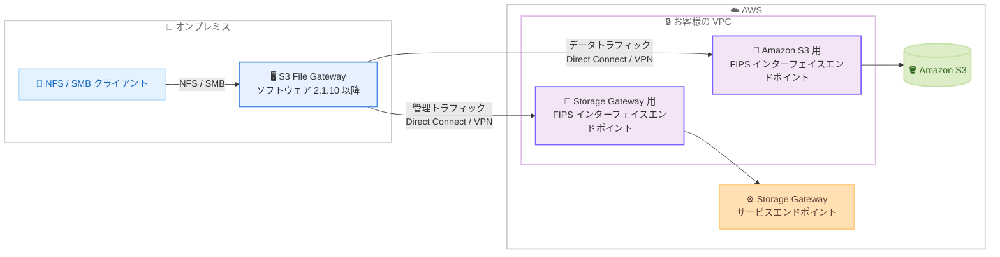

# AWS Storage Gateway - Amazon S3 File Gateway 向け FIPS 準拠プライベート接続のサポート

**リリース日**: 2026 年 9 月 10 日
**サービス**: AWS Storage Gateway (Amazon S3 File Gateway)
**機能**: AWS PrivateLink 経由の FIPS 140-3 検証済みエンドポイントのサポート

📊 [このアップデートのインフォグラフィックを見る](https://takech9203.github.io/aws-news-summary/20260910-storage-gateway-fips-privatelink-s3.html)

## 概要

AWS Storage Gateway が、Amazon S3 File Gateway 向けに AWS PrivateLink 経由の FIPS 140-3 検証済みエンドポイントをサポートしました。これまで File Gateway の FIPS エンドポイントはパブリックインターネット経由でのみ利用可能でしたが、今回のアップデートにより、FIPS 準拠のトラフィックを AWS のプライベートネットワーク内に閉じたまま転送できるようになります。

File Gateway は、VPC 内に作成した FIPS インターフェイス VPC エンドポイントを通じて Storage Gateway のサービスエンドポイントにプライベートに到達できます。さらに、NFS および SMB ファイル共有が S3 FIPS インターフェイスエンドポイント経由で Amazon S3 にアクセスできるため、ファイル転送ワークロード全体をエンドツーエンドで FIPS 準拠のプライベート接続にすることが可能です。

米国政府機関やその委託事業者、金融、医療など、FIPS 140-3 準拠の暗号化モジュールの使用とインターネット非経由の閉域接続の両方が求められる規制対象ワークロードで Storage Gateway を利用しやすくなるアップデートです。

**アップデート前の課題**

- File Gateway の FIPS エンドポイントはパブリックインターネット経由でのみ提供されており、FIPS 準拠とプライベート接続を両立できなかった
- PrivateLink 経由の閉域接続を構成すると、FIPS 検証済みエンドポイントを利用できなかった
- 規制対象ワークロードでは、FIPS 準拠と閉域接続の要件を同時に満たすために追加のネットワーク設計や代替手段の検討が必要だった

**アップデート後の改善**

- FIPS インターフェイス VPC エンドポイント経由で Storage Gateway サービスへのプライベート接続が可能になった
- NFS / SMB ファイル共有が S3 FIPS インターフェイスエンドポイント経由で Amazon S3 にアクセスでき、エンドツーエンドで FIPS 準拠のプライベート接続を実現できるようになった
- ゲートウェイのアクティベーション時とファイル共有の設定時に FIPS VPC エンドポイントオプションを選択するだけで構成できるようになった

## アーキテクチャ図



オンプレミスの File Gateway が、VPC 内の 2 つの FIPS インターフェイスエンドポイント (Storage Gateway 用と Amazon S3 用) を経由して、管理トラフィックとデータトラフィックの両方をプライベートかつ FIPS 準拠で転送する構成です。

## サービスアップデートの詳細

### 主要機能

1. **Storage Gateway サービスへの FIPS 準拠プライベート接続**
   - VPC 内に作成した FIPS インターフェイス VPC エンドポイント経由で、File Gateway が Storage Gateway のサービスエンドポイントにプライベートに到達できる
   - ゲートウェイのアクティベーション時に FIPS VPC エンドポイントオプションを選択して構成する
   - FIPS PrivateLink エンドポイントでゲートウェイをアクティベートするには、ゲートウェイソフトウェアのバージョン 2.1.10 以降が必要

2. **Amazon S3 への FIPS 準拠プライベートデータ転送**
   - NFS および SMB ファイル共有が、S3 FIPS インターフェイスエンドポイント経由で Amazon S3 にアクセスできる
   - 管理トラフィックとデータトラフィックの両方をプライベートネットワーク上に維持し、エンドツーエンドで FIPS 準拠を実現できる
   - ファイル共有の設定時に FIPS VPC エンドポイントを指定する

3. **規制対象ワークロードへの対応強化**
   - FIPS 140-3 検証済み暗号化モジュールの利用が求められる政府機関や規制業界のワークロードで、インターネット非経由の構成が可能になった
   - AWS GovCloud (US) の 2 リージョンを含む、FIPS エンドポイントを提供する 8 リージョンで利用可能

## 技術仕様

### 構成要素

| 項目 | 詳細 |
|------|------|
| 対象ゲートウェイタイプ | Amazon S3 File Gateway |
| 対応プロトコル | NFS、SMB |
| 必要なソフトウェアバージョン | 2.1.10 以降 (FIPS PrivateLink エンドポイントでのアクティベーション時) |
| 必要な VPC エンドポイント | Storage Gateway 用 FIPS インターフェイスエンドポイント、Amazon S3 用 FIPS インターフェイスエンドポイント |
| FIPS 準拠レベル | FIPS 140-3 検証済みエンドポイント |
| リージョン制約 | ゲートウェイのアクティベーションは Storage Gateway 用 VPC エンドポイントと同一リージョン、ファイル共有の S3 バケットは S3 用 VPC エンドポイントと同一リージョンである必要がある |

### VPC エンドポイントの構成に関する注意

AWS ドキュメントによると、VPC 経由でゲートウェイを利用するには以下の 2 種類のエンドポイントが必要です。

- **Storage Gateway 用 VPC エンドポイント**: ゲートウェイのアクティベーションと管理トラフィックに使用
- **Amazon S3 用 VPC エンドポイント**: ファイル共有のデータ転送に使用 (Storage Gateway 用とは別に作成が必要)

## 設定方法

### 前提条件

1. オンプレミスと VPC 間のプライベート接続 (AWS Direct Connect または AWS Site-to-Site VPN など) が構成されていること
2. ゲートウェイソフトウェアのバージョンが 2.1.10 以降であること
3. FIPS エンドポイントを提供する 8 リージョンのいずれかを利用すること

### 手順

#### ステップ1: Storage Gateway 用 FIPS インターフェイスエンドポイントの作成

```bash
aws ec2 create-vpc-endpoint \
  --vpc-id vpc-0123456789abcdef0 \
  --vpc-endpoint-type Interface \
  --service-name com.amazonaws.us-east-1.storagegateway-fips \
  --subnet-ids subnet-0123456789abcdef0 \
  --security-group-ids sg-0123456789abcdef0
```

VPC 内に Storage Gateway サービス向けの FIPS インターフェイスエンドポイントを作成します。ゲートウェイのアクティベーションと管理トラフィックがこのエンドポイントを経由します。

#### ステップ2: Amazon S3 用 FIPS インターフェイスエンドポイントの作成

```bash
aws ec2 create-vpc-endpoint \
  --vpc-id vpc-0123456789abcdef0 \
  --vpc-endpoint-type Interface \
  --service-name com.amazonaws.us-east-1.s3-fips \
  --subnet-ids subnet-0123456789abcdef0 \
  --security-group-ids sg-0123456789abcdef0
```

ファイル共有のデータ転送に使用する Amazon S3 向けの FIPS インターフェイスエンドポイントを作成します。Storage Gateway 用エンドポイントとは別に作成する必要があります。

#### ステップ3: FIPS VPC エンドポイントを指定したゲートウェイのアクティベーション

Storage Gateway コンソールでゲートウェイを作成する際、AWS への接続オプションで FIPS VPC エンドポイントを選択し、ステップ 1 で作成したエンドポイントを指定します。ゲートウェイソフトウェアがバージョン 2.1.10 以降であることを事前に確認します。

#### ステップ4: FIPS S3 エンドポイントを指定したファイル共有の作成

NFS または SMB ファイル共有を作成する際、ステップ 2 で作成した S3 FIPS インターフェイスエンドポイントを指定します。これにより、ファイルデータの転送も FIPS 準拠のプライベート接続経由になります。

## メリット

### ビジネス面

- **コンプライアンス対応の簡素化**: FIPS 140-3 準拠と閉域接続の両方が求められる規制要件を、標準機能の組み合わせで満たせる
- **規制対象ワークロードの移行促進**: 政府機関、金融、医療などの規制業界で、オンプレミスファイルデータの S3 への移行や共有に Storage Gateway を採用しやすくなる
- **追加コストなしのセキュリティ強化**: 代替ソリューションや独自のネットワーク設計を検討することなく、既存の PrivateLink の仕組みで対応できる

### 技術面

- **エンドツーエンドのプライベート接続**: 管理トラフィックとデータトラフィックの両方がパブリックインターネットを経由しない
- **攻撃対象領域の削減**: インターネット向けの経路が不要になり、ネットワークセキュリティの管理がシンプルになる
- **既存ワークフローとの互換性**: NFS / SMB のファイルアクセスインターフェイスは変わらず、接続経路のみを FIPS 準拠のプライベート接続に変更できる

## デメリット・制約事項

### 制限事項

- 利用可能なリージョンは Storage Gateway が FIPS エンドポイントを提供する 8 リージョンに限定される (東京リージョンは対象外)
- FIPS PrivateLink エンドポイントでのアクティベーションには、ゲートウェイソフトウェア 2.1.10 以降が必要
- ゲートウェイのアクティベーションは Storage Gateway 用 VPC エンドポイントと同一リージョンで行う必要があり、ファイル共有で使用する S3 バケットも S3 用 VPC エンドポイントと同一リージョンである必要がある

### 考慮すべき点

- Storage Gateway 用と Amazon S3 用の 2 つのインターフェイスエンドポイントを個別に作成する必要があり、それぞれに PrivateLink の時間課金とデータ処理料金が発生する
- オンプレミスから VPC への到達には Direct Connect や Site-to-Site VPN などのプライベート接続が別途必要
- 既存ゲートウェイの構成変更時は、ソフトウェアバージョンの確認とエンドポイント設定の見直しが必要

## ユースケース

### ユースケース1: 政府機関のファイルサーバーデータの S3 保管

**シナリオ**: 米国政府機関やその委託事業者が、FedRAMP などの規制要件により FIPS 140-3 検証済み暗号化とインターネット非経由の通信の両方を求められる環境で、オンプレミスのファイルサーバーデータを Amazon S3 に保管する。

**実装例**:
```
1. AWS GovCloud (US-West) に Storage Gateway 用と S3 用の FIPS インターフェイスエンドポイントを作成
2. Direct Connect 経由で VPC に接続し、FIPS VPC エンドポイントでゲートウェイをアクティベート
3. SMB ファイル共有を S3 FIPS エンドポイント経由で構成
```

**効果**: FIPS 準拠と閉域接続の要件を同時に満たしながら、既存の SMB ワークフローを変更せずに S3 へのデータ保管を実現できる。

### ユースケース2: 金融機関のバックアップデータのプライベート転送

**シナリオ**: 金融機関が、社内ポリシーによりパブリックインターネット経由のデータ転送を禁止し、かつ FIPS 検証済み暗号化モジュールの使用を義務付けている環境で、日次バックアップファイルを S3 に転送する。

**実装例**:
```
1. US East (N. Virginia) の VPC に FIPS インターフェイスエンドポイントを 2 つ作成
2. NFS ファイル共有を S3 FIPS エンドポイント経由で構成
3. バックアップソフトウェアの出力先を File Gateway の NFS マウントポイントに設定
```

**効果**: バックアップデータの転送経路全体が FIPS 準拠のプライベートネットワークに閉じ、監査対応と社内ポリシー準拠が容易になる。

### ユースケース3: 医療機関の研究データのハイブリッド共有

**シナリオ**: 医療研究機関が、患者データを含む研究ファイルをオンプレミスの解析環境と AWS 上の分析基盤で共有する際、規制要件により FIPS 準拠の暗号化通信と閉域接続が必要となる。

**実装例**:
```
1. Canada (Central) に FIPS インターフェイスエンドポイントを作成
2. File Gateway を FIPS VPC エンドポイントでアクティベートし、NFS ファイル共有を構成
3. オンプレミスの解析サーバーからは NFS でアクセスし、AWS 上の分析サービスからは S3 API でアクセス
```

**効果**: オンプレミスとクラウドの両方から同一データにセキュアにアクセスでき、規制要件を満たしたハイブリッド分析基盤を構築できる。

## 料金

今回のアップデート自体に追加料金はありません。ただし、以下の既存料金が適用されます。

- **AWS Storage Gateway**: ゲートウェイ経由で S3 に書き込まれたデータに対するデータ転送料金 (上限あり) と、S3 のストレージ料金
- **AWS PrivateLink**: インターフェイスエンドポイントの時間課金とデータ処理料金 (Storage Gateway 用と S3 用の 2 エンドポイント分)

詳細は [AWS Storage Gateway 料金ページ](https://aws.amazon.com/storagegateway/pricing/) および [AWS PrivateLink 料金ページ](https://aws.amazon.com/privatelink/pricing/) を参照してください。

## 利用可能リージョン

Storage Gateway が FIPS エンドポイントを提供する以下の 8 リージョンで利用可能です。

- 米国東部 (バージニア北部)
- 米国東部 (オハイオ)
- 米国西部 (北カリフォルニア)
- 米国西部 (オレゴン)
- カナダ (中部)
- カナダ西部 (カルガリー)
- AWS GovCloud (US-East)
- AWS GovCloud (US-West)

## 関連サービス・機能

- **Amazon S3**: File Gateway のバックエンドストレージ。S3 FIPS インターフェイスエンドポイント経由でファイルデータが転送される
- **AWS PrivateLink**: VPC 内のインターフェイスエンドポイントを通じて AWS サービスへのプライベート接続を提供する基盤機能
- **AWS Direct Connect / AWS Site-to-Site VPN**: オンプレミスから VPC へのプライベート接続を提供し、今回の構成の前提となる接続手段
- **AWS Storage Gateway (Tape Gateway / Volume Gateway)**: 同じ Storage Gateway ファミリーのゲートウェイタイプ。今回のアップデートの対象は S3 File Gateway

## 参考リンク

- 📊 [インフォグラフィック](https://takech9203.github.io/aws-news-summary/20260910-storage-gateway-fips-privatelink-s3.html)
- [公式発表 (What's New)](https://aws.amazon.com/about-aws/whats-new/2026/09/storage-gateway-fips-privatelink-s3/)
- [Activating a gateway in a virtual private cloud - AWS Storage Gateway User Guide](https://docs.aws.amazon.com/filegateway/latest/files3/gateway-private-link.html)
- [AWS Storage Gateway 製品ページ](https://aws.amazon.com/storagegateway/)
- [AWS Storage Gateway 料金ページ](https://aws.amazon.com/storagegateway/pricing/)

## まとめ

Amazon S3 File Gateway が AWS PrivateLink 経由の FIPS 140-3 検証済みエンドポイントに対応し、FIPS 準拠と閉域接続の両方が求められる規制対象ワークロードで Storage Gateway を採用しやすくなりました。政府機関、金融、医療などの規制業界で File Gateway の利用を検討している場合は、ゲートウェイソフトウェアを 2.1.10 以降に更新のうえ、Storage Gateway 用と S3 用の FIPS インターフェイスエンドポイントを作成して構成を検証することを推奨します。
