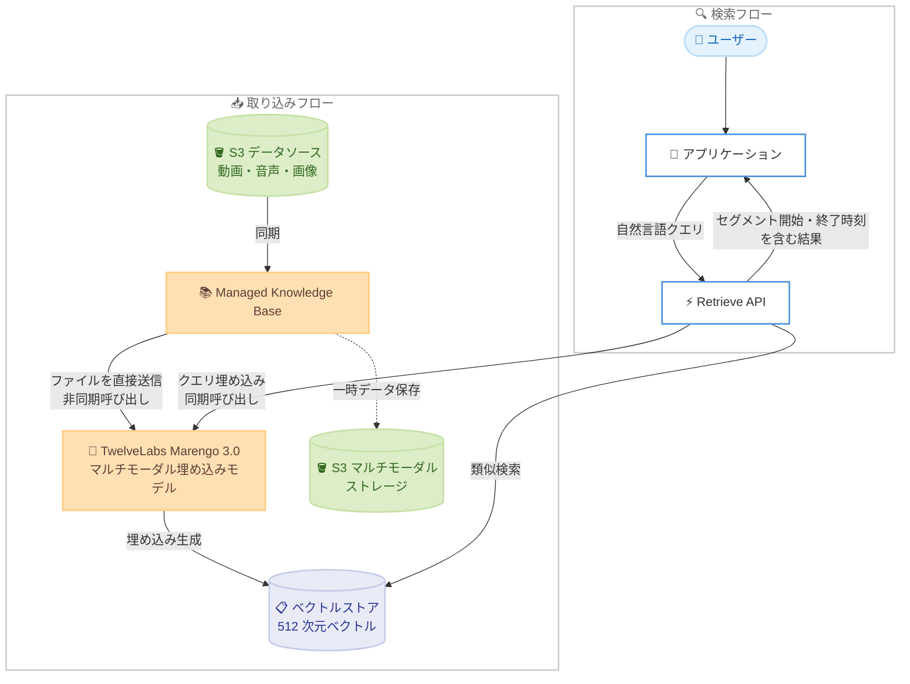

# Amazon Bedrock Knowledge Bases - TwelveLabs Marengo 3.0 によるマルチモーダル埋め込み対応

**リリース日**: 2026 年 9 月 11 日
**サービス**: Amazon Bedrock Knowledge Bases (Managed Knowledge Base)
**機能**: TwelveLabs Marengo 3.0 による動画・音声・画像コンテンツのマルチモーダル埋め込み

📊 [このアップデートのインフォグラフィックを見る](https://takech9203.github.io/aws-news-summary/20260911-amazon-bedrock-managed-knowledge-base-multimodal-embeddings-twelvelabs-marengo.html)

## 概要

Amazon Bedrock Managed Knowledge Base の埋め込みモデルとして TwelveLabs Marengo 3.0 が利用可能になりました。これにより、動画・音声・画像コンテンツからマルチモーダル埋め込みを直接生成できるようになります。

Amazon Bedrock Managed Knowledge Base は、これまでも音声や動画をテキストに文字起こしし、テキストベースの埋め込みを生成することでメディア検索をサポートしていました。Marengo 3.0 はさらに一歩進んで、視覚的なシーン、音声、映像の手がかりを直接マルチモーダル埋め込みにエンコードします。これにより、文字起こしだけでは捉えられない意味を捉えることができます。Amazon S3 などのデータソースからメディアアセットをアップロードして同期するだけで、自然言語による検索が可能になり、管理するインフラストラクチャは不要です。

Marengo 3.0 はコンパクトな 512 次元のベクトルを生成し、最先端の検索精度を実現します。検索結果にはセグメントの開始時刻と終了時刻が含まれるため、アプリケーションから動画内の該当箇所へ直接ジャンプできます。スポーツ分析、メディア & エンターテインメント、セキュリティ、教育、小売など、幅広いユースケースに対応します。

**アップデート前の課題**

- 音声や動画の検索は文字起こしベースのテキスト埋め込みに依存しており、映像内の視覚的なシーンや音声のニュアンスなど、テキスト化できない情報が検索対象から漏れていた
- 動画・音声のマルチモーダル埋め込みを利用するには、Marengo モデルを直接呼び出し、ベクトルストアへの格納や検索パイプラインを自前で構築・運用する必要があった
- ナレーションや字幕のないシーン (例: スポーツのプレー映像、監視カメラの映像) は、キーワードベースの検索でヒットさせることが困難だった

**アップデート後の改善**

- 動画・音声・画像ファイルを解析やテキスト抽出を経由せずに埋め込みモデルへ直接送信し、生のコンテンツから埋め込みを生成する「ネイティブマルチモーダル処理」が利用可能になった
- S3 データソースからのアップロードと同期だけで自然言語によるメディア検索が可能になり、インフラストラクチャの管理が不要になった
- 検索結果にセグメントの開始・終了時刻が含まれるため、動画内の該当シーンへ直接ジャンプするアプリケーションを構築できるようになった
- コンテンツの構造に合わせてセグメンテーション (分割) オプションを設定できるようになった

## アーキテクチャ図



メディアファイルはテキスト抽出を経由せず Marengo 3.0 に直接送信され、生成された 512 次元ベクトルがベクトルストアに格納されます。検索時は Retrieve API がクエリを同期呼び出しで埋め込み、類似セグメントを開始・終了時刻付きで返します。

## サービスアップデートの詳細

### 主要機能

1. **ネイティブマルチモーダル処理**
   - ファイルを解析・テキスト抽出せずにマルチモーダル埋め込みモデルへ直接送信し、生の画像・音声・動画コンテンツから埋め込みを生成
   - テキスト抽出では失われる視覚的・音声的なディテールを保持
   - ナレッジベース作成時にネイティブマルチモーダル埋め込みモデルとして TwelveLabs Marengo Embed 3.0 (`twelvelabs.marengo-embed-3-0-v1:0`) を選択することで有効化

2. **コンパクトで高精度な埋め込み**
   - 512 次元のコンパクトなベクトルを生成し、最先端の検索精度を実現
   - 視覚シーン、スピーチ、映像の手がかりを単一のマルチモーダル埋め込みにエンコード

3. **セグメント単位の検索結果**
   - 検索結果にセグメントの開始時刻・終了時刻が含まれる
   - 動画内の該当シーンへ直接ジャンプするアプリケーションを構築可能

4. **設定可能なセグメンテーション**
   - `modelConfiguration` フィールドで音声・動画ファイルの分割方法を設定可能
   - コンテンツの構造に合わせてセグメンテーションを調整できる

## 技術仕様

### ネイティブマルチモーダル処理の仕様

| 項目 | 詳細 |
|------|------|
| 埋め込みモデル | TwelveLabs Marengo Embed 3.0 (`twelvelabs.marengo-embed-3-0-v1:0`)、現時点で選択可能な唯一のネイティブマルチモーダルモデル |
| ベクトル次元数 | 512 次元 |
| 対応コンテンツ | 動画・音声・画像 (モデルがサポートするファイルタイプのみ取り込み可能) |
| 解析戦略 | `MULTI_MODAL_EMBEDDINGS` のみサポート (他の解析戦略との併用不可) |
| チャンキング | テキストベースのチャンキング戦略は非対応。代わりに音声・動画のセグメンテーション設定を使用 |
| ストレージ | マルチモーダルストレージ用の S3 ロケーションが必須 (データソースとは別バケットを推奨、`aws/` プレフィックスが作成される) |
| クエリ API | `Retrieve` API のみサポート (`RetrieveAndGenerate` は非対応) |
| クエリ形式 | テキストクエリのみ (画像クエリは非対応) |
| モデル呼び出し | クエリ時は同期呼び出し、取り込み時は非同期呼び出し (一部リージョンでは同期呼び出しに推論プロファイルが必要) |

### API 変更履歴

| 日付 | サービス | 変更内容 |
|------|----------|----------|
| 2026/09/10 | [bedrock-agent](https://awsapichanges.com/archive/changes/dfd7fe-bedrock-agent.html) | 6 updated api methods - `CreateKnowledgeBase`、`CreateDataSource`、`GetKnowledgeBase`、`GetDataSource`、`UpdateKnowledgeBase`、`UpdateDataSource` に `MULTI_MODAL_EMBEDDINGS` 解析戦略などのパラメータが追加 |

### 一時データのライフサイクル管理

ナレッジベースはコンテンツ処理中にマルチモーダルストレージへ一時データを保存します。処理完了時に削除が試行されますが、確実に削除するため以下のライフサイクルポリシーの適用が推奨されています。

```json
{
  "Rules": [
    {
      "ID": "TransientDataDeletion",
      "Status": "Enabled",
      "Filter": {
        "Prefix": "aws/bedrock/knowledge_bases/knowledge-base-id/data-source-id/transient_data"
      },
      "Expiration": {
        "Days": 1
      }
    }
  ]
}
```

**注意**: バケット全体や `aws/` プレフィックス全体にライフサイクルポリシーを適用すると、マルチモーダルコンテンツ本体が削除され処理エラーの原因となるため、必ず一時データのパスのみを対象にしてください。

## 設定方法

### 前提条件

1. Amazon Bedrock で TwelveLabs Marengo Embed 3.0 モデルへのアクセスが有効化されていること
2. メディアアセット (動画・音声・画像) を格納する S3 データソースバケット
3. マルチモーダルストレージ用の S3 バケット (データソースとは別のバケットを使用)
4. ナレッジベースのサービスロールに、モデルの同期・非同期呼び出しとマルチモーダルストレージへのアクセス権限があること

### 手順

#### ステップ1: ナレッジベースの作成

Amazon Bedrock コンソールまたは API でマネージドナレッジベースを作成し、埋め込みモデルとして TwelveLabs Marengo Embed 3.0 を選択します。

```bash
aws bedrock-agent create-knowledge-base \
  --name "multimodal-media-kb" \
  --role-arn "arn:aws:iam::123456789012:role/BedrockKBServiceRole" \
  --knowledge-base-configuration '{
    "type": "VECTOR",
    "vectorKnowledgeBaseConfiguration": {
      "embeddingModelArn": "arn:aws:bedrock:us-east-1::foundation-model/twelvelabs.marengo-embed-3-0-v1:0"
    }
  }'
```

埋め込みモデルに Marengo Embed 3.0 を指定してベクトルナレッジベースを作成します。一部リージョンでは同期呼び出し用に推論プロファイルの指定が必要です。

#### ステップ2: データソースの作成

`MULTI_MODAL_EMBEDDINGS` 解析戦略を指定して S3 データソースを作成します。

```bash
aws bedrock-agent create-data-source \
  --knowledge-base-id "KB12345678" \
  --name "media-data-source" \
  --data-source-configuration '{
    "type": "S3",
    "s3Configuration": {
      "bucketArn": "arn:aws:s3:::my-media-source-bucket"
    }
  }' \
  --vector-ingestion-configuration '{
    "parsingConfiguration": {
      "parsingStrategy": "MULTI_MODAL_EMBEDDINGS"
    }
  }'
```

メディアファイルを解析せず埋め込みモデルへ直接送信する `MULTI_MODAL_EMBEDDINGS` 解析戦略でデータソースを構成します。音声・動画のセグメンテーションは `modelConfiguration` フィールドで設定できます。

#### ステップ3: 同期と検索

データソースを同期した後、`Retrieve` API で自然言語検索を実行します。

```bash
# データソースの同期
aws bedrock-agent start-ingestion-job \
  --knowledge-base-id "KB12345678" \
  --data-source-id "DS12345678"

# 自然言語による検索
aws bedrock-agent-runtime retrieve \
  --knowledge-base-id "KB12345678" \
  --retrieval-query '{"text": "終盤の逆転シュートのシーン"}'
```

同期ジョブでメディアファイルの埋め込みが生成され、Retrieve API がセグメントの開始・終了時刻を含む検索結果を返します。

## メリット

### ビジネス面

- **メディア資産の活用促進**: これまで検索が困難だった動画・音声アーカイブを自然言語で横断検索でき、コンテンツ資産の価値を最大化できる
- **開発・運用コストの削減**: 埋め込み生成パイプラインやベクトルストアの構築・運用が不要になり、フルマネージドでメディア検索を実現できる
- **幅広い業種への適用**: スポーツ分析、メディア & エンターテインメント、セキュリティ、教育、小売など多様なユースケースに対応できる

### 技術面

- **文字起こしを超えた検索精度**: 視覚シーン・スピーチ・映像の手がかりを直接埋め込みにエンコードするため、テキスト化できない情報も検索対象にできる
- **コンパクトなベクトル**: 512 次元のコンパクトなベクトルにより、ストレージ効率と検索性能を両立しながら最先端の検索精度を実現できる
- **タイムコード付きの結果**: セグメントの開始・終了時刻が返されるため、頭出し再生などのユーザー体験を容易に実装できる
- **柔軟なセグメンテーション**: コンテンツ構造に合わせた分割設定により、検索粒度を最適化できる

## デメリット・制約事項

### 制限事項

- 現時点で選択可能なネイティブマルチモーダル埋め込みモデルは TwelveLabs Marengo Embed 3.0 のみ
- 解析戦略は `MULTI_MODAL_EMBEDDINGS` のみで、他の解析戦略と組み合わせることはできない
- テキストベースのチャンキング戦略 (デフォルトチャンキング、固定サイズチャンキングなど) は利用できない
- クエリは `Retrieve` API のみ対応で、`RetrieveAndGenerate` API は利用できない
- クエリはテキストのみで、画像によるクエリは非対応
- 取り込めるファイルタイプは Marengo Embed 3.0 がサポートする形式に限定される

### 考慮すべき点

- マルチモーダルストレージ用に、データソースとは別の S3 バケットを用意する必要がある
- 一時データを確実に削除するため、一時データパスへの S3 ライフサイクルポリシーの適用が推奨される (バケット全体への適用はコンテンツ削除の原因となるため厳禁)
- 一部リージョンでは同期呼び出しに推論プロファイルが必要となり、サービスロールに推論プロファイルとオンデマンドモデルの両方の権限が必要になる
- 回答生成まで行いたい場合は、Retrieve の結果を別途基盤モデルへ渡す実装が必要

## ユースケース

### ユースケース1: スポーツ映像分析

**シナリオ**: スポーツチームの分析部門が、複数シーズンにわたる試合映像から特定のプレー (例: カウンター攻撃からのゴールシーン) を探し出して戦術分析に活用したい。

**実装例**:
```
1. 試合映像を S3 データソースバケットに格納
2. Marengo Embed 3.0 を埋め込みモデルとするナレッジベースを作成し同期
3. Retrieve API に「右サイドからのカウンター攻撃で決まったゴール」などの
   自然言語クエリを送信
4. 返却されたセグメントの開始・終了時刻を使って該当シーンを頭出し再生
```

**効果**: タグ付けや文字起こしに依存せず、映像そのものの内容でシーンを検索でき、分析作業の時間を大幅に短縮できる。

### ユースケース2: 教育コンテンツの概念検索

**シナリオ**: オンライン学習プラットフォームで、受講者が講義動画の中から特定の概念を説明している箇所をキーワードではなく概念ベースで検索したい。

**実装例**:
```
1. 講義動画を S3 に格納し、ナレッジベースと同期
2. コンテンツ構造に合わせてセグメンテーション設定を調整
3. 「ニューラルネットワークの逆伝播を図解している部分」のような
   概念ベースのクエリで Retrieve API を呼び出し
4. セグメントのタイムコードを LMS の動画プレイヤーに連携
```

**効果**: 講義資料の板書や図解などの視覚情報も検索対象となり、受講者が目的の学習箇所へ素早く到達できる。

### ユースケース3: セキュリティ映像の調査

**シナリオ**: 施設のセキュリティ部門が、大量の監視カメラ映像から特定の事象 (例: 特定エリアへの立ち入り、荷物の置き去り) を効率的に調査したい。

**実装例**:
```
1. 監視カメラ映像を S3 データソースに集約
2. ナレッジベースを同期してマルチモーダル埋め込みを生成
3. 「入口付近に置かれたままの荷物」のような自然言語クエリで検索
4. 該当セグメントの時刻情報をもとに元映像を確認
```

**効果**: 音声やナレーションのない映像でも視覚情報から検索でき、目視確認にかかる調査時間を大幅に削減できる。

## 料金

Amazon Bedrock Knowledge Bases の利用に加えて、TwelveLabs Marengo Embed 3.0 モデルによる埋め込み生成 (取り込み時の非同期呼び出しとクエリ時の同期呼び出し) の料金、およびベクトルストレージとマルチモーダルストレージ用 Amazon S3 の料金が発生します。詳細は [Amazon Bedrock 料金ページ](https://aws.amazon.com/bedrock/pricing/) を参照してください。

## 利用可能リージョン

TwelveLabs Marengo Embed 3.0 のリージョンごとの提供状況 (オンデマンド / 推論プロファイル経由) は、[Amazon Bedrock でサポートされている基盤モデル](https://docs.aws.amazon.com/bedrock/latest/userguide/models-supported.html) のドキュメントで確認してください。一部リージョンでは同期呼び出しに推論プロファイルの利用が必要です。

## 関連サービス・機能

- **Amazon Bedrock Knowledge Bases**: 本アップデートの対象サービス。マネージド RAG 基盤としてデータ取り込みから検索までをフルマネージドで提供
- **Amazon S3**: メディアアセットのデータソース、およびマルチモーダルストレージとして使用
- **TwelveLabs Pegasus 1.2**: Amazon Bedrock で利用可能な動画理解・分析モデル。検索したセグメントの内容説明や質問応答と組み合わせ可能
- **TwelveLabs Marengo Embed 2.7**: 前世代のマルチモーダル埋め込みモデル。3.0 ではテキストと画像のインターリーブ入力への対応などが強化

## 参考リンク

- 📊 [インフォグラフィック](https://takech9203.github.io/aws-news-summary/20260911-amazon-bedrock-managed-knowledge-base-multimodal-embeddings-twelvelabs-marengo.html)
- [公式発表 (What's New)](https://aws.amazon.com/about-aws/whats-new/2026/09/amazon-bedrock-managed-knowledge-base-multimodal-embeddings-twelvelabs-marengo/)
- [ドキュメント: Native multimodal processing](https://docs.aws.amazon.com/bedrock/latest/userguide/kb-managed-native-multimodal.html)
- [ドキュメント: TwelveLabs models](https://docs.aws.amazon.com/bedrock/latest/userguide/model-parameters-twelvelabs.html)
- [Amazon Bedrock Knowledge Bases 製品ページ](https://aws.amazon.com/bedrock/knowledge-bases/)
- [料金ページ](https://aws.amazon.com/bedrock/pricing/)

## まとめ

TwelveLabs Marengo 3.0 の Amazon Bedrock Managed Knowledge Base への統合により、動画・音声・画像を文字起こしに頼らず直接ベクトル化し、自然言語で検索できるフルマネージドな仕組みが利用可能になりました。セグメントの開始・終了時刻付きで結果が返るため、頭出し再生などのメディア検索体験を容易に構築できます。大量のメディアアーカイブを保有する組織は、Retrieve API のみ対応・テキストクエリのみなどの制約を確認したうえで、既存の文字起こしベースの検索との比較検証を始めることを推奨します。
