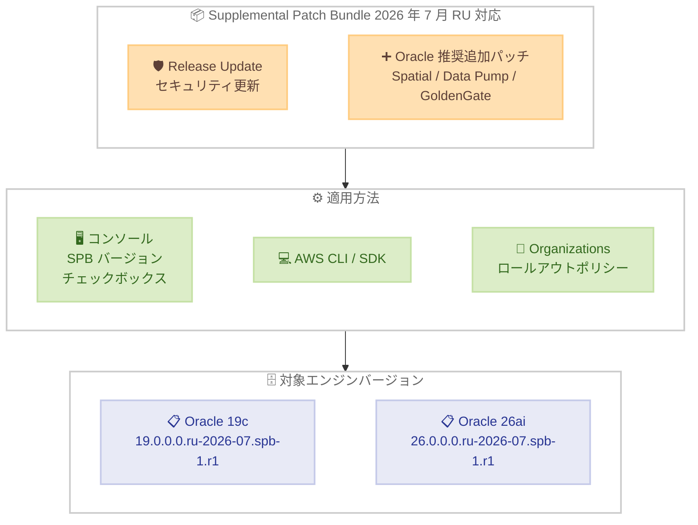

# Amazon RDS for Oracle - 2026 年 7 月 Release Update 向け Supplemental Patch Bundle サポート

**リリース日**: 2026 年 9 月 11 日
**サービス**: Amazon RDS for Oracle
**機能**: Oracle 2026 年 7 月 Release Update (RU) 向け Supplemental Patch Bundle (SPB) のサポート

📊 [このアップデートのインフォグラフィックを見る](https://takech9203.github.io/aws-news-summary/20260911-amazon-rds-oracle-supports-spatial-patch-bundle-jul-2026-ru.html)

## 概要

Amazon RDS for Oracle が、Oracle Database 19c および 26ai 向けに 2026 年 7 月 Release Update (RU) に対応した Supplemental Patch Bundle (SPB) をサポートした。SPB には、Oracle Spatial、Oracle Data Pump、Oracle GoldenGate など特定のユースケース向けに Oracle が推奨する追加データベースパッチが含まれている。

SPB は以前「Oracle Spatial Patch Bundle」と呼ばれていたが、2026 年 4 月リリースから「Supplemental Patch Bundle (SPB)」に名称が変更されている。今回のリリースにより、エンジンバージョン `19.0.0.0.ru-2026-07.spb-1.r1` または `26.0.0.0.ru-2026-07.spb-1.r1` を指定して新規インスタンスを作成するか、既存インスタンスをアップグレードできる。AWS マネジメントコンソールでは「Supplemental Patch Bundle Engine Versions」チェックボックスを選択することで SPB エンジンバージョンを表示・選択できる。

**アップデート前の課題**

- 2026 年 7 月 RU に対応した SPB が提供されておらず、最新の RU と Spatial / Data Pump / GoldenGate 向け推奨パッチを同時に適用できなかった
- Oracle Spatial や GoldenGate などを利用する環境では、推奨パッチが未適用のままだとパフォーマンスや安定性の問題が発生する可能性があった
- 2026 年 4 月リリースまでは SPB 相当のバンドルが 19c のみを対象としており、26ai 環境向けの選択肢が限られていた

**アップデート後の改善**

- Oracle Database 19c と 26ai の両方で、2026 年 7 月 RU と Oracle 推奨の追加パッチを含む SPB エンジンバージョンを適用可能になった
- 新規インスタンスの作成と既存インスタンスのアップグレードのどちらでも SPB を利用できる
- AWS Organizations のアップグレードロールアウトポリシーと組み合わせることで、非本番環境で検証してから本番環境へ自動マイナーバージョンアップグレードを段階的に展開できる

## アーキテクチャ図



2026 年 7 月 RU と Oracle 推奨の追加パッチを含む SPB を、コンソール、CLI、Organizations ロールアウトポリシーを通じて Oracle 19c / 26ai インスタンスに適用するフローを示している。

## サービスアップデートの詳細

### 主要機能

1. **2026 年 7 月 RU 向け SPB のサポート**
   - 2026 年 7 月 Release Update に Oracle 推奨の追加パッチをバンドルしたエンジンバージョンを提供
   - Oracle Database 19c と 26ai の両方で利用可能
   - Oracle Spatial、Oracle Data Pump、Oracle GoldenGate など特定のユースケース向けパッチを含む

2. **Spatial Patch Bundle からの名称変更**
   - 2026 年 4 月リリース以降、「Oracle Spatial Patch Bundle」は「Supplemental Patch Bundle (SPB)」に名称変更
   - Spatial に限定されない幅広い用途の推奨パッチを含むバンドルであることを反映した名称

3. **新規作成と既存インスタンスのアップグレードに対応**
   - エンジンバージョン `19.0.0.0.ru-2026-07.spb-1.r1` または `26.0.0.0.ru-2026-07.spb-1.r1` を指定
   - AWS コンソールの「Supplemental Patch Bundle Engine Versions」チェックボックスで SPB バージョンを選択可能

4. **段階的ロールアウトポリシーとの連携**
   - AWS Organizations のアップグレードロールアウトポリシーで自動マイナーバージョンアップグレードを段階的に適用可能
   - 非本番環境へ先に適用して検証した後、同じ更新を本番環境へ自動適用するワークフローを実現

## 技術仕様

### サポート対象バージョン

| Oracle バージョン | SPB エンジンバージョン |
|-------------------|------------------------|
| Oracle 19c | `19.0.0.0.ru-2026-07.spb-1.r1` |
| Oracle 26ai | `26.0.0.0.ru-2026-07.spb-1.r1` |

### SPB の概要

| 項目 | 詳細 |
|------|------|
| 対象 RU | 2026 年 7 月 Release Update |
| 含まれるパッチ | RU に加え、Oracle Spatial、Oracle Data Pump、Oracle GoldenGate など向けの Oracle 推奨追加パッチ |
| 旧名称 | Oracle Spatial Patch Bundle (2026 年 4 月リリースから SPB に変更) |
| 適用対象 | 新規インスタンスの作成、既存インスタンスのアップグレード |
| コンソール表示 | 「Supplemental Patch Bundle Engine Versions」チェックボックスで選択 |

## 設定方法

### 前提条件

1. Amazon RDS for Oracle インスタンスが稼働していること (アップグレードの場合)
2. Oracle Database 19c または 26ai を使用していること
3. RDS インスタンスの作成・変更権限 (IAM) を有していること

### 手順

#### ステップ 1: 利用可能な SPB エンジンバージョンの確認 (AWS CLI)

```bash
aws rds describe-db-engine-versions \
  --engine oracle-ee \
  --query "DBEngineVersions[?contains(EngineVersion, 'spb')].EngineVersion" \
  --output table
```

Oracle Enterprise Edition で利用可能なエンジンバージョンのうち、SPB を含むバージョン文字列を一覧表示して確認する。

#### ステップ 2: 既存インスタンスへの SPB 適用 (AWS CLI)

```bash
aws rds modify-db-instance \
  --db-instance-identifier my-oracle-instance \
  --engine-version 19.0.0.0.ru-2026-07.spb-1.r1 \
  --apply-immediately
```

Oracle 19c インスタンスを 2026 年 7 月 RU 向け SPB エンジンバージョンへ即時アップグレードする。`--no-apply-immediately` に変更すると次のメンテナンスウィンドウで適用される。Oracle 26ai の場合は `26.0.0.0.ru-2026-07.spb-1.r1` を指定する。

#### ステップ 3: コンソールでの SPB バージョン選択

AWS マネジメントコンソールで RDS インスタンスを作成またはアップグレードする際、エンジンバージョン選択画面の「Supplemental Patch Bundle Engine Versions」チェックボックスを有効にすると、SPB エンジンバージョンが選択肢に表示される。

#### ステップ 4: AWS Organizations ロールアウトポリシーの活用

AWS Organizations のアップグレードロールアウトポリシーを設定すると、自動マイナーバージョンアップグレードを組織内で段階的に展開できる。非本番アカウントの環境へ先に適用して検証した後、同じ更新を本番アカウントの環境へ自動適用する運用が可能になる。詳細は [Amazon RDS for Oracle ドキュメント](https://docs.aws.amazon.com/AmazonRDS/latest/UserGuide/USER_UpgradeDBInstance.Oracle.Minor.html#oracle-minor-version-upgrade-rollout) を参照。

## メリット

### ビジネス面

- **セキュリティコンプライアンスの維持**: 最新の RU と推奨パッチを同時に適用することで、規制要件やセキュリティポリシーへの準拠を維持できる
- **運用コストの削減**: 追加パッチが RU とバンドルされたエンジンバージョンとして提供されるため、個別のパッチ管理が不要になる
- **リスクの低減**: 段階的ロールアウトにより、本番環境への影響を最小化しながらパッチレベルを最新化できる

### 技術面

- **19c と 26ai の両対応**: 従来 19c 中心だった SPB 相当のバンドルが、最新の Oracle Database 26ai でも利用可能
- **特定機能の安定性向上**: Oracle Spatial、Data Pump、GoldenGate 利用環境で Oracle 推奨のパッチが一括適用される
- **柔軟なデプロイメント**: 新規作成、即時アップグレード、メンテナンスウィンドウ適用、組織全体での段階的適用から選択可能

## デメリット・制約事項

### 制限事項

- SPB エンジンバージョンへのアップグレード時にインスタンスの再起動が発生するため、短時間のダウンタイムが必要
- SPB は特定のユースケース向け追加パッチを含むため、通常の RU バージョンとはエンジンバージョン文字列の体系が異なる
- コンソールで SPB バージョンを表示するには「Supplemental Patch Bundle Engine Versions」チェックボックスの選択が必要

### 考慮すべき点

- 2026 年 4 月リリース以降の名称変更 (Spatial Patch Bundle から SPB) に伴い、運用手順書や IaC テンプレートで参照している名称・バージョン文字列の見直しが必要になる場合がある
- Spatial、Data Pump、GoldenGate を使用していない環境では、通常の RU バージョンで十分なケースもあるため、SPB 適用の要否を検討する
- アップグレード前にスナップショットを取得し、ロールバック計画を策定することを推奨

## ユースケース

### ユースケース 1: Oracle Spatial を使用した地理空間データ処理

**シナリオ**: 物流企業で Oracle Spatial を使用したルート最適化システムを Oracle 19c 上で運用しており、最新 RU と Spatial の推奨パッチをまとめて適用したい。

**実装例**:
```bash
aws rds modify-db-instance \
  --db-instance-identifier oracle-logistics \
  --engine-version 19.0.0.0.ru-2026-07.spb-1.r1 \
  --no-apply-immediately
```

**効果**: 次のメンテナンスウィンドウで RU と Spatial 関連パッチが一括適用され、地理空間クエリの安定性とセキュリティを同時に確保できる。

### ユースケース 2: GoldenGate によるデータレプリケーション環境の最新化

**シナリオ**: オンプレミスの Oracle データベースから RDS for Oracle 26ai へのリアルタイムレプリケーションに Oracle GoldenGate を使用しており、推奨パッチを適用したい。

**実装例**:
```bash
aws rds create-db-instance \
  --db-instance-identifier oracle-26ai-replica-target \
  --engine oracle-ee \
  --engine-version 26.0.0.0.ru-2026-07.spb-1.r1 \
  --db-instance-class db.r6i.2xlarge \
  --allocated-storage 500 \
  --master-username admin \
  --manage-master-user-password
```

**効果**: GoldenGate 向け推奨パッチを含むエンジンバージョンで新規インスタンスを構築でき、レプリケーションの信頼性が向上する。

### ユースケース 3: 組織全体での段階的なパッチ展開

**シナリオ**: 複数の AWS アカウントで RDS for Oracle インスタンスを運用しており、SPB を含むマイナーバージョンアップグレードを非本番環境から本番環境へ段階的に展開したい。

**実装例**:
```bash
# 各インスタンスで自動マイナーバージョンアップグレードを有効化
aws rds modify-db-instance \
  --db-instance-identifier oracle-app01 \
  --auto-minor-version-upgrade

# AWS Organizations のアップグレードロールアウトポリシーで
# 非本番アカウント → 本番アカウントの順に段階適用を設定
```

**効果**: 非本番環境での検証後に本番環境へ同じ更新が自動適用され、組織全体で一貫したパッチレベルを維持できる。

## 料金

SPB エンジンバージョンの適用自体に追加料金は発生しない。通常の Amazon RDS for Oracle インスタンスの料金のみが適用される。

| 項目 | 料金 |
|------|------|
| SPB の適用 | 無料 |
| RDS for Oracle インスタンス | 通常のインスタンス料金 |
| Oracle ライセンス | License Included または BYOL モデルに依存 |

## 利用可能リージョン

Amazon RDS for Oracle が利用可能なすべてのリージョンで利用可能。詳細は [AWS リージョン表](https://aws.amazon.com/about-aws/global-infrastructure/regional-product-services/) を参照。

## 関連サービス・機能

- **Amazon RDS Automatic Minor Version Upgrade**: メンテナンスウィンドウ中に自動的にマイナーバージョンアップグレードを適用する機能
- **AWS Organizations**: アップグレードロールアウトポリシーによる段階的なアップグレード展開に使用
- **Amazon RDS Multi-AZ**: パッチ適用時のダウンタイムを最小化するための高可用性構成
- **Oracle GoldenGate / Oracle Data Pump / Oracle Spatial**: SPB に含まれる推奨パッチの対象となる Oracle 機能

## 参考リンク

- 📊 [インフォグラフィック](https://takech9203.github.io/aws-news-summary/20260911-amazon-rds-oracle-supports-spatial-patch-bundle-jul-2026-ru.html)
- [公式発表 (What's New)](https://aws.amazon.com/about-aws/whats-new/2026/09/amazon-rds-oracle-supports-spatial-patch-bundle-jul-2026-ru/)
- [Release updates and supplemental patch bundles (RDS for Oracle)](https://docs.aws.amazon.com/AmazonRDS/latest/UserGuide/USER_UpgradeDBInstance.Oracle.Minor.html)
- [RDS for Oracle マイナーバージョンアップグレードロールアウト](https://docs.aws.amazon.com/AmazonRDS/latest/UserGuide/USER_UpgradeDBInstance.Oracle.Minor.html#oracle-minor-version-upgrade-rollout)
- [Amazon RDS for Oracle リリースノート](https://docs.aws.amazon.com/AmazonRDS/latest/OracleReleaseNotes/Welcome.html)
- [Amazon RDS for Oracle 製品ページ](https://aws.amazon.com/rds/oracle/)
- [料金ページ](https://aws.amazon.com/rds/oracle/pricing/)

## まとめ

Amazon RDS for Oracle が 2026 年 7 月 RU に対応した Supplemental Patch Bundle をサポートし、Oracle Database 19c と 26ai の両方で RU と Oracle 推奨の追加パッチを一括適用できるようになった。特に Oracle Spatial、Data Pump、GoldenGate を使用している環境では、`19.0.0.0.ru-2026-07.spb-1.r1` または `26.0.0.0.ru-2026-07.spb-1.r1` への適用を検討すべきである。あわせて、AWS Organizations のアップグレードロールアウトポリシーを活用し、非本番環境で検証してから本番環境へ段階的に自動適用する運用の整備を推奨する。
