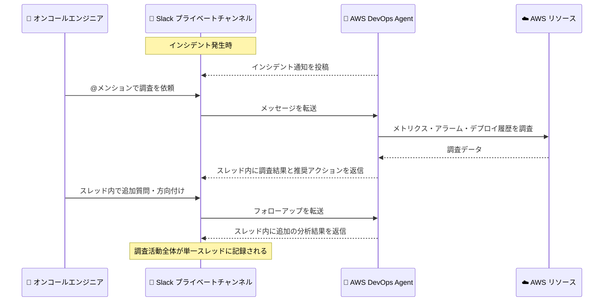

# AWS DevOps Agent - Slack 双方向コミュニケーション対応

**リリース日**: 2026 年 9 月 11 日
**サービス**: AWS DevOps Agent
**機能**: Slack 双方向コミュニケーション (Bidirectional Slack Communication)

📊 [このアップデートのインフォグラフィックを見る](https://takech9203.github.io/aws-news-summary/20260911-aws-devops-agent-bidirectional-slack-communication.html)

## 概要

AWS DevOps Agent が Slack との双方向コミュニケーションに対応しました。エンジニアは AWS、マルチクラウド、オンプレミス環境にまたがる本番運用において、調査のライフサイクル全体を Slack 内で完結できるようになります。接続済みの Slack プライベートチャンネルで AWS DevOps Agent を @メンションするだけで、調査の開始や方向付けが可能です。

チームメンバーが提供したコンテキスト、エージェントの調査結果、推奨アクションといったすべての調査アクティビティは、単一の Slack スレッド内に記録されます。AWS リソース、システムメトリクス、アラーム状態、デプロイ履歴、インシデントパターンについて自然言語で質問できるため、重大インシデント対応時の認知負荷を軽減できます。

このアップデートは、オンコールエンジニアやインシデント対応チームなど、Slack を主要なコミュニケーション基盤として利用している運用チームに特に有用です。

**アップデート前の課題**

これまで、重大度の高いインシデント対応において、オンコールエンジニアは分断されたワークフローに直面していました。

- コミュニケーションプラットフォーム (Slack) と調査プラットフォーム (AWS コンソールなど) の間でコンテキストスイッチが必要だった
- Slack 連携は一方向の通知のみで、Slack から DevOps Agent に指示や質問を送ることができなかった
- 調査の経緯やチームの判断が複数のツールに散在し、後から追跡することが困難だった

**アップデート後の改善**

- Slack プライベートチャンネルで AWS DevOps Agent を @メンションするだけで、調査の開始・方向付けが可能になった
- チームのコンテキスト、エージェントの調査結果、推奨アクションが単一のスレッドに集約されるようになった
- AWS リソース、メトリクス、アラーム状態、デプロイ履歴、インシデントパターンについて Slack 上で直接質問できるようになった
- ツール間の切り替えが不要になり、インシデント対応中の認知負荷が軽減された

## アーキテクチャ図



Slack プライベートチャンネルでエージェントを @メンションすると、DevOps Agent が AWS 環境を調査し、結果を同一スレッドに返信します。調査のライフサイクル全体が Slack 内で完結します。

## サービスアップデートの詳細

### 主要機能

1. **@メンションによる調査の開始と方向付け**
   - 接続済みの Slack プライベートチャンネルで AWS DevOps Agent を @メンションして会話を開始
   - エージェントは元のメッセージ配下のスレッドに返信し、同一スレッド内でフォローアップの会話を継続可能
   - インシデントや運用上の問題に対する調査の開始、閲覧、方向付けに対応

2. **単一スレッドへの調査アクティビティの集約**
   - チームメンバーが提供したコンテキスト、エージェントの調査結果、推奨アクションをすべて単一スレッド内に記録
   - 調査の経緯が時系列で残るため、事後のふりかえりやポストモーテムに活用可能

3. **自然言語による運用情報の照会**
   - AWS リソース、システムメトリクス、ログ、トポロジーの探索
   - アラーム状態、デプロイ履歴、インシデントパターンに関する質問
   - 予防的な推奨事項の確認と対応
   - サポートされているリリース管理・テストワークフローの実行

4. **一方向通知と双方向モードの切り替え**
   - 既存の一方向通知 (調査結果、根本原因分析、緩和策の投稿) に加えて、双方向モードを選択可能
   - 双方向モードはプライベートチャンネルのみで有効化可能 (パブリックチャンネルは一方向通知のみ)
   - コンソールからいつでも双方向モードの有効化・無効化を変更可能

## 技術仕様

### Slack 連携の仕様

| 項目 | 詳細 |
|------|------|
| 双方向モード対応チャンネル | プライベートチャンネルのみ |
| 一方向通知対応チャンネル | パブリック・プライベート両方 |
| Slack アプリ | リージョンごとに専用の AWS DevOps Agent アプリを Slack Marketplace から導入 |
| IAM ロール | 双方向通信には AIDevOpsChannelAccessPolicy 管理ポリシーが付与されたロールが必要 |
| 会話の形式 | @メンションで開始し、スレッド内で継続 (返信でも @メンションが必要) |
| ワークスペース共有 | 1 つの Slack ワークスペースを複数の AWS アカウント・Agent Space で共有可能 |

### IAM ロール設定オプション

双方向コミュニケーションの有効化時に、以下のいずれかの方法で IAM ロールを設定します。

| オプション | 説明 |
|-----------|------|
| 新規ロールの自動作成 | コンソールが AIDevOpsChannelAccessPolicy 管理ポリシー付きのロールを作成 |
| 既存ロールの指定 | ロール ARN を指定し、DevOps Agent が検証 |
| ポリシーテンプレートから作成 | 提供されるテンプレートを使用して IAM コンソールで手動作成 |

## 設定方法

### 前提条件

1. サードパーティアプリケーションのインストール・承認権限を持つ Slack ワークスペースへのアクセス
2. AWS DevOps Agent でケイパビリティプロバイダーとコミュニケーション統合を設定する権限
3. AWS DevOps Agent コンソールから IAM ロールを作成する権限 (双方向通信に必要)
4. 関連付ける各 Slack チャンネルのチャンネル ID

### 手順

#### ステップ 1: Slack の登録とチャンネルの関連付け

1. AWS DevOps Agent コンソールで Agent Space を開き、[Capabilities] タブを選択
2. [Communications] で [Add integration] を選択し、Slack を検索して [Register] を選択
3. Slack の認可ページでワークスペースを選択し、権限を確認して [Allow] を選択
4. 関連付けるプライベートチャンネルのチャンネル ID を入力

チャンネル ID は、Slack でチャンネル名を選択し、チャンネル詳細パネルからコピーできます。

#### ステップ 2: 双方向モードの有効化とアプリの招待

1. [Bidirectional communication] で [Bidirectional mode] をオンにする
2. IAM ロール設定オプション (自動作成・既存ロール指定・テンプレートから作成) を選択
3. Slack のプライベートチャンネルで以下のコマンドを実行し、リージョン別アプリを招待

```
/invite @AWS DevOps Agent - <Region>
```

`<Region>` にはアプリ名に表示されるリージョンサフィックス (例: `US East (N. Virginia)`) を指定します。招待後、コンソールに戻り [Add] を選択して関連付けを完了します。

#### ステップ 3: チャンネルバインディングのセットアップと会話の開始

関連付けたプライベートチャンネルで、以下のセットアップコマンドをトップレベルメッセージとして送信します。

```
@AWS DevOps Agent - <Region> setup
```

バインディングが構成されると確認メッセージが投稿されます。その後、@メンションで会話を開始できます。

```
@AWS DevOps Agent - <Region> What can you do?
```

エージェントはメッセージ配下のスレッドに返信します。スレッド内の返信でも毎回 @メンションが必要です。

## メリット

### ビジネス面

- **MTTR の短縮**: ツール間のコンテキストスイッチが不要になり、インシデントの調査開始から解決までの時間を短縮できる
- **インシデント対応の透明性向上**: 調査アクティビティ全体が単一スレッドに記録され、チーム全体で状況を共有できる
- **ポストモーテムの効率化**: 調査の経緯、チームの判断、エージェントの分析結果が時系列で残るため、事後分析が容易になる

### 技術面

- **調査ライフサイクルの一元化**: 調査の開始、コンテキスト提供、結果確認、推奨アクションの確認までを Slack 内で完結できる
- **自然言語インターフェース**: AWS リソース、メトリクス、アラーム、デプロイ履歴を自然言語で照会でき、専用ツールの操作知識が不要
- **柔軟な権限管理**: IAM ロールにより、Slack 経由でエージェントが実行できる操作の範囲を制御できる

## デメリット・制約事項

### 制限事項

- 双方向コミュニケーションはプライベートチャンネルのみで有効化可能 (パブリックチャンネルは一方向通知のみ)
- 会話の開始およびスレッド内の返信ごとに、リージョン別アプリの @メンションが必要
- Slack アプリはリージョンごとに分かれており、Agent Space のリージョンに一致するアプリを使用する必要がある
- Slack Enterprise Grid を使用する場合、アプリは組織単位ではなくワークスペース単位でインストールする必要がある

### 考慮すべき点

- Slack で利用できる応答とアクションは、関連付けられた Agent Space の設定と権限に依存する
- 調査結果や推奨アクションは大規模言語モデルにより生成されるため、不正確または不完全な場合がある。実行前に内容の検証が必要
- チャットメッセージや調査ジャーナルなどのデータは Agent Space に保持される。データ削除には Agent Space の削除が必要
- Slack ワークスペースから AWS DevOps Agent アプリをアンインストールすると再インストールできなくなる可能性があるため、チャンネルの利用を停止する場合はコンソールから関連付けを削除する

## ユースケース

### ユースケース 1: 重大インシデントの初動対応

**シナリオ**: 深夜にアラームが発報し、オンコールエンジニアがインシデント対応用の Slack チャンネルに招集された。原因の切り分けを迅速に行いたい。

**実装例**:
```
@AWS DevOps Agent - US East (N. Virginia) 直近 1 時間で発報したアラームと関連するデプロイを調査してください
```

**効果**: AWS コンソールを開くことなく、Slack 上でアラーム状態とデプロイ履歴の相関を確認でき、初動対応の時間を短縮できる。

### ユースケース 2: チームコンテキストを反映した調査の方向付け

**シナリオ**: エージェントの初期調査結果に対して、チームメンバーが「昨日データベースのパラメータを変更した」という追加情報を持っている。この情報を調査に反映したい。

**実装例**:
```
@AWS DevOps Agent - EU (Frankfurt) 昨日 RDS のパラメータグループを変更しました。この変更との関連を調査してください
```

**効果**: 人間が持つコンテキストをスレッド内で共有するだけで調査に反映され、エージェントと人間の協働による精度の高い原因分析ができる。

### ユースケース 3: 過去のインシデントパターンの照会

**シナリオ**: 発生中の事象が過去のインシデントと類似しているように見える。過去の対応履歴を確認して再発かどうかを判断したい。

**実装例**:
```
@AWS DevOps Agent - US East (N. Virginia) この Lambda のエラーと類似した過去のインシデントパターンはありますか
```

**効果**: 過去のインシデントパターンとの照合により再発の可能性を素早く判断でき、過去の対応で有効だった緩和策を再利用できる。

## 料金

今回の発表では、この機能に関する追加料金の情報は記載されていません。AWS DevOps Agent の料金体系については、公式の料金ページを確認してください。

## 利用可能リージョン

AWS DevOps Agent が現在サポートされているすべての商用 AWS リージョンで利用可能です。サポートリージョンの一覧は [AWS DevOps Agent supported Regions](https://docs.aws.amazon.com/devopsagent/latest/userguide/about-aws-devops-agent-supported-regions.html) を参照してください。

なお、Slack アプリはリージョンごとに提供されており、Agent Space のリージョンに対応するアプリを Slack Marketplace から導入する必要があります。

## 関連サービス・機能

- **Amazon CloudWatch**: DevOps Agent が調査に使用するメトリクスとアラームの基盤。Slack から自然言語でアラーム状態やメトリクスを照会できる
- **AWS IAM**: 双方向通信に必要なロールと AIDevOpsChannelAccessPolicy 管理ポリシーにより、Slack 経由の操作権限を制御する
- **AWS Chatbot (Amazon Q Developer in chat applications)**: 従来から提供されている AWS の Slack 連携機能。DevOps Agent の双方向通信は、調査ライフサイクル全体をエージェントが主導する点で異なる

## 参考リンク

- 📊 [インフォグラフィック](https://takech9203.github.io/aws-news-summary/20260911-aws-devops-agent-bidirectional-slack-communication.html)
- [公式発表 (What's New)](https://aws.amazon.com/about-aws/whats-new/2026/09/aws-devops-agent-bidirectional-slack-communication)
- [ドキュメント: Connecting Slack](https://docs.aws.amazon.com/devopsagent/latest/userguide/connecting-to-ticketing-and-chat-connecting-slack.html)
- [ドキュメント: サポートリージョン](https://docs.aws.amazon.com/devopsagent/latest/userguide/about-aws-devops-agent-supported-regions.html)
- [ドキュメント: リリース履歴](https://docs.aws.amazon.com/devopsagent/latest/userguide/whats-new.html)

## まとめ

AWS DevOps Agent の Slack 双方向コミュニケーション対応により、インシデント調査のライフサイクル全体を Slack 内で完結できるようになりました。コミュニケーションと調査のプラットフォームが統合されることで、重大インシデント対応時のコンテキストスイッチと認知負荷が大幅に軽減されます。Slack を運用の中心に据えているチームは、プライベートチャンネルでの双方向モードの有効化を検討することを推奨します。
