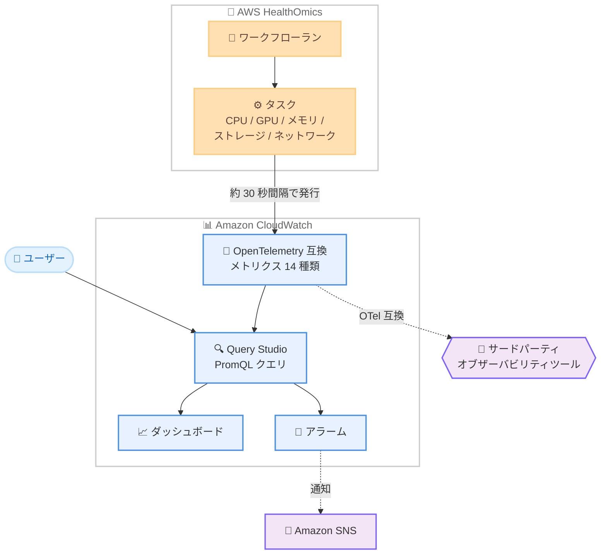

# AWS HealthOmics - Amazon CloudWatch へのリアルタイムランメトリクス発行

**リリース日**: 2026 年 9 月 11 日
**サービス**: AWS HealthOmics
**機能**: Amazon CloudWatch へのリアルタイムランメトリクス発行

📊 [このアップデートのインフォグラフィックを見る](https://takech9203.github.io/aws-news-summary/20260911-aws-healthomics-realtime-run-metrics.html)

## 概要

AWS HealthOmics が、ワークフロー実行中のリソース使用状況をほぼリアルタイムで Amazon CloudWatch に発行する機能を発表しました。CPU / GPU 使用率、メモリ使用量、ファイルシステム使用量と I/O、ネットワークスループット、エフェメラルストレージ使用量にわたる 14 種類の新しいランメトリクスが提供されます。

ヘルスケア・ライフサイエンス分野のお客様は、ゲノム解析などの大規模ワークフローを実行中に、CPU / GPU のボトルネックの特定、タスク失敗前のメモリやストレージの枯渇の検出、ファイルシステムスループットの追跡が可能になります。実際の使用量と割り当てリソースを比較することで、ワークフローのコンピュートとストレージの適正サイズ化にも活用できます。

メトリクスは Amazon CloudWatch の OpenTelemetry (OTel) 互換メトリクス標準で発行されるため、CloudWatch ネイティブのダッシュボードやアラームに加えて、OTel 互換のサードパーティオブザーバビリティツールとも統合できます。データの参照・分析には PromQL (Prometheus Query Language) を使用します。

**アップデート前の課題**

- ワークフロー実行中のリソース使用状況をリアルタイムに把握する手段がなく、ボトルネックの特定が困難だった
- メモリやスクラッチストレージの枯渇によるタスク失敗を、事前に検知できなかった
- リソース使用状況の詳細な調査には、サポートケースの起票が必要になる場合があった
- 実際の使用量と割り当てリソースの比較が難しく、適正サイズ化の判断材料が不足していた

**アップデート後の改善**

- 実行中のランとタスクのリソース使用状況を約 30 秒間隔でほぼリアルタイムに可視化できるようになった
- CloudWatch アラームにより、メモリ・ストレージ枯渇などの兆候をタスク失敗前に検知できるようになった
- OpenTelemetry 標準での発行により、サードパーティのオブザーバビリティツールとの統合が可能になった
- 実使用量と割り当て量の比較 (usage / limit メトリクス) により、コンピュートとストレージの適正サイズ化が容易になった

## アーキテクチャ図



HealthOmics のランとタスクが約 30 秒間隔でリソース使用状況メトリクスを CloudWatch に OpenTelemetry 標準で発行し、ユーザーは PromQL クエリでの分析、ダッシュボードでの可視化、アラームによる通知、サードパーティツールとの統合が可能になります。

## サービスアップデートの詳細

### 主要機能

1. **14 種類のリアルタイムランメトリクス**
   - ラン単位のメトリクス: 共有ファイルシステムの使用量と容量
   - タスク単位のメトリクス: CPU / メモリの使用量と上限、ネットワーク I/O、ファイルシステム I/O とオペレーション数、スクラッチストレージの使用量と上限
   - GPU メトリクス: GPU 使用率、GPU メモリの使用量と上限 (アクセラレーター使用タスクのみ)
   - 多くのメトリクスは 30 秒間隔で発行され、タスクが `RUNNING` になってから `COMPLETED` になるまで発行される

2. **OpenTelemetry 互換のメトリクス標準**
   - CloudWatch の OTel 互換メトリクス標準 (`cloudwatch.aws/omics` スコープ) で発行
   - PromQL でクエリ可能で、CloudWatch Query Studio やダッシュボード、アラームで利用できる
   - OTel 互換のサードパーティオブザーバビリティツールとも統合可能
   - ランの ARN、ワークフロー ID、ラン ID、タスク ID などの共通リソースラベルが付与される

3. **プロアクティブな問題検出と適正サイズ化**
   - 実行中に CPU / GPU ボトルネックを特定できる
   - タスクが失敗する前にメモリ不足やスクラッチストレージの枯渇を検出できる
   - usage / limit メトリクスの比較により、コンピュートとストレージの適正サイズ化が可能

4. **HealthOmics MCP サーバーとの連携**
   - HealthOmics Model Context Protocol (MCP) サーバー経由でランメトリクスを取得し、AI モデルの支援を受けながらラン失敗を調査できる
   - Kiro CLI、Claude Code などの MCP 互換エージェントクライアントから利用可能

## 技術仕様

### 提供されるメトリクス一覧

| メトリクス名 | 説明 | 単位 | 発行間隔 | 対象 |
|------|------|------|------|------|
| aws.omics.run.filesystem.usage | ランの共有ファイルシステム使用量 | バイト | 30 秒 | すべてのラン |
| aws.omics.run.filesystem.limit | ランの共有ファイルシステム総容量 | バイト | 30 秒 | STATIC ストレージタイプのランのみ |
| aws.omics.task.cpu.usage | タスクが使用中の vCPU 数 | vCPU | 30 秒 | すべてのタスク |
| aws.omics.task.cpu.limit | タスクに予約された vCPU 数 | vCPU | 30 秒 | すべてのタスク |
| aws.omics.task.memory.usage | タスクが使用中のメモリ | バイト | 30 秒 | すべてのタスク |
| aws.omics.task.memory.limit | タスクに予約されたメモリ | バイト | 30 秒 | すべてのタスク |
| aws.omics.task.network.io | タスクの送受信バイト数 | バイト | 30 秒 | すべてのタスク |
| aws.omics.task.filesystem.io | タスクのファイルシステム転送バイト数 | バイト | 30 秒 | すべてのタスク |
| aws.omics.task.filesystem.operations | タスクのファイルシステムオペレーション数 | オペレーション | 30 秒 | すべてのタスク |
| aws.omics.task.filesystem.scratch.storage.usage | タスクのスクラッチストレージ使用量 | バイト | 30 秒 (LOCAL) / 20 分 (SHARED) | すべてのタスク |
| aws.omics.task.filesystem.scratch.storage.limit | タスクのスクラッチストレージ総容量 | バイト | 30 秒 | scratchStorageMode が LOCAL のタスク |
| aws.omics.task.gpu.utilization | タスクの GPU 使用率 (GPU ごと) | % | 30 秒 | アクセラレーター使用タスクのみ |
| aws.omics.task.gpu.memory.usage | タスクの GPU メモリ使用量 (GPU ごと) | バイト | 30 秒 | アクセラレーター使用タスクのみ |
| aws.omics.task.gpu.memory.limit | タスクの GPU メモリ容量 (GPU ごと) | バイト | 30 秒 | アクセラレーター使用タスクのみ |

### メトリクスの発行に必要な IAM 権限

メトリクスを発行するには、ランに使用する IAM サービスロールに CloudWatch へのメトリクス書き込み権限を追加します。

```json
{
  "Version": "2012-10-17",
  "Statement": [
    {
      "Effect": "Allow",
      "Action": "cloudwatch:PutMetricData",
      "Resource": "*"
    }
  ]
}
```

なお、メトリクスの発行を停止 (オプトアウト) したい場合は、サービスロールからこの権限を除外するか、明示的な Deny をロールに追加します。

## 設定方法

### 前提条件

1. AWS HealthOmics のプライベートワークフローまたは共有ワークフローを使用していること
2. ランのサービスロールに `cloudwatch:PutMetricData` 権限が付与されていること
3. 対応リージョンでランを実行すること

### 手順

#### ステップ 1: サービスロールに権限を追加

```bash
aws iam put-role-policy \
  --role-name HealthOmicsRunRole \
  --policy-name AllowPutMetricData \
  --policy-document '{
    "Version": "2012-10-17",
    "Statement": [
      {
        "Effect": "Allow",
        "Action": "cloudwatch:PutMetricData",
        "Resource": "*"
      }
    ]
  }'
```

HealthOmics のラン用サービスロールに、CloudWatch へメトリクスを書き込むためのインラインポリシーを追加します。この権限があると、HealthOmics はデフォルトでランメトリクスを発行します。

#### ステップ 2: ランを開始

```bash
aws omics start-run \
  --workflow-id 1122334 \
  --role-arn arn:aws:iam::123456789012:role/HealthOmicsRunRole \
  --output-uri s3://my-bucket/outputs/ \
  --name my-run
```

権限を付与したサービスロールを指定してランを開始します。タスクが `RUNNING` 状態になると、約 30 秒後から最初のデータポイントが CloudWatch に発行されます。

#### ステップ 3: CloudWatch Query Studio でメトリクスを確認

CloudWatch コンソールのナビゲーションペインで [Query Studio] を選択し、クエリエディタで [PromQL] を選択します。以下のクエリ例は、指定したランの各タスクが使用中の vCPU 数を返します。

```
{"aws.omics.task.cpu.usage", "@resource.aws.omics.run.id"="1234567"}
```

結果は時系列グラフとして表示され、[Create alarm] からアラームの作成、[Add to dashboard] からダッシュボードへの追加が可能です。

## メリット

### ビジネス面

- **コスト最適化**: 実使用量と割り当て量の比較により、過剰なリソース割り当てを特定してワークフローのコンピュートとストレージを適正サイズ化できる
- **運用効率の向上**: リソース使用状況の調査にサポートケースを起票する必要がなくなり、自己解決までの時間が短縮される
- **ワークフローの信頼性向上**: メモリやストレージの枯渇をタスク失敗前に検知することで、長時間のゲノム解析ジョブのやり直しコストを削減できる

### 技術面

- **ほぼリアルタイムの可視性**: 約 30 秒間隔のメトリクスで、実行中のワークフローの CPU / GPU / メモリ / ストレージ / ネットワークの状況を把握できる
- **OpenTelemetry 標準への準拠**: OTel 互換の形式で発行されるため、既存のサードパーティオブザーバビリティスタックにそのまま統合できる
- **PromQL による柔軟な分析**: Query Studio や Prometheus 互換 API から PromQL でクエリでき、ラン ID やタスク ID、GPU ID などのラベルでフィルタリングできる
- **AI エージェントとの連携**: HealthOmics MCP サーバー経由でメトリクスを取得し、AI モデルの支援によるラン失敗の調査が可能

## デメリット・制約事項

### 制限事項

- 実行時間が 30 秒未満のタスクはメトリクスが記録されない場合がある
- ランのストレージタイプが `DYNAMIC` の場合、`aws.omics.run.filesystem.usage` は 30 分以上遅延することがあり、30 分未満のランでは利用できない場合がある
- `scratchStorageMode` が `SHARED` のタスクで一時ファイル数が非常に多い場合、スクラッチストレージ使用量メトリクスが取得できないことがある
- ランメトリクスは、サービスロールを所有しランを開始した AWS アカウントでのみ利用できる
- HealthOmics がサポートするリージョンのうち、イスラエル (テルアビブ) リージョンでは利用できない

### 考慮すべき点

- CloudWatch へのメトリクスデータ取り込み量に応じた料金が発生する。不要な場合はサービスロールから `cloudwatch:PutMetricData` 権限を除外することでオプトアウトできる
- サービスロールに `cloudwatch:PutMetricData` 権限があると、デフォルトでメトリクスが発行される点に注意が必要
- CPU / メモリのメトリクスは測定スコープの違いにより、ランマニフェストの値と異なる場合がある (ランメトリクスの方が実際の消費量に近い)
- タスクが `RUNNING` になってから `COMPLETED` になるまでの期間のみ発行され、最初のデータポイントには約 30 秒の遅延がある

## ユースケース

### ユースケース 1: GPU を使用する機械学習ワークフローのボトルネック特定

**シナリオ**: タンパク質構造予測など GPU を使用するワークフローで、想定より処理時間が長い。GPU が有効活用されているかを実行中に確認したい。

**実装例**:
```
{"aws.omics.task.gpu.utilization", "@resource.aws.omics.run.id"="1234567"}
```

**効果**: GPU ごとの使用率をリアルタイムに確認し、GPU がボトルネックなのか、データ転送や CPU 処理がボトルネックなのかを特定できる。GPU 使用率が低い場合はインスタンスタイプやタスクの並列度を見直すことで、コストと実行時間を最適化できる。

### ユースケース 2: メモリ枯渇によるタスク失敗の事前検知

**シナリオ**: 大規模なゲノムデータを扱うタスクがメモリ不足で失敗することがあり、長時間実行後の失敗によるやり直しコストが問題になっている。

**実装例**:
```
Query Studio で以下の PromQL クエリを作成し、[Create alarm] でアラームを設定
{"aws.omics.task.memory.usage", "@resource.aws.omics.run.id"="1234567"}
しきい値: aws.omics.task.memory.limit の 90% 相当の値
通知先: Amazon SNS トピック
```

**効果**: メモリ使用量が上限に近づいた時点で SNS 経由の通知を受け取れる。タスク失敗前に介入したり、次回のラン以降でワークフロー定義のメモリ割り当てを増やすなどの対策を事前に講じられる。

### ユースケース 3: 実使用量に基づくワークフローの適正サイズ化

**シナリオ**: ワークフロー定義の CPU / メモリ割り当てが経験則で設定されており、過剰割り当てによるコスト増が疑われる。

**実装例**:
```
usage と limit を比較する PromQL クエリを実行
{"aws.omics.task.cpu.usage", "@resource.aws.omics.run.id"="1234567"}
{"aws.omics.task.cpu.limit", "@resource.aws.omics.run.id"="1234567"}
結果をダッシュボードのウィジェットとして追加し、タスクごとに継続的にモニタリング
```

**効果**: タスクごとの実使用量と割り当て量の乖離を定量的に把握し、ワークフロー定義のリソース指定を実態に合わせて削減できる。過剰割り当ての解消によりラン実行コストを削減できる。

## 料金

AWS HealthOmics 自体にはランメトリクスの追加料金はありません。メトリクスはお客様のアカウントの Amazon CloudWatch に発行され、取り込まれたメトリクスデータ量に基づいて CloudWatch から直接課金されます。

### 課金の内訳

| アクティビティ | 課金方法 |
|--------|------------------|
| OpenTelemetry メトリクスの発行 | 取り込みデータ量 (GB) ごと。15 か月分の保存を含み、保存やユニークなメトリクス系列数への追加課金はなし |
| CloudWatch コンソールでの PromQL クエリ実行 (Query Studio、ダッシュボード含む) | 無料 |
| CloudWatch API での PromQL クエリ実行 | スキャンしたサンプル 100 万件ごと |
| PromQL クエリを評価するアラーム | 標準のアラーム料金に加えて、評価ごとにスキャンしたサンプルのクエリ料金 |

リージョンごとの具体的な料金は [Amazon CloudWatch 料金ページ](https://aws.amazon.com/cloudwatch/pricing/) を参照してください。

## 利用可能リージョン

以下のリージョンで利用可能です。

- 米国東部 (バージニア北部、オハイオ)
- 米国西部 (オレゴン)
- 欧州 (フランクフルト、アイルランド、ロンドン)
- アジアパシフィック (シンガポール、ソウル、東京)

## 関連サービス・機能

- **Amazon CloudWatch**: メトリクスの保存先。Query Studio での PromQL クエリ、ダッシュボード、アラームによる可視化と通知を提供する
- **Amazon SNS**: CloudWatch アラームの通知先として使用し、しきい値超過時の通知を受け取れる
- **AWS IAM**: ランのサービスロールに `cloudwatch:PutMetricData` 権限を付与することでメトリクス発行を制御する
- **AWS HealthOmics MCP サーバー**: MCP 互換のエージェントクライアントからランメトリクスを取得し、AI 支援によるラン失敗の調査に活用できる

## 参考リンク

- 📊 [インフォグラフィック](https://takech9203.github.io/aws-news-summary/20260911-aws-healthomics-realtime-run-metrics.html)
- [公式発表 (What's New)](https://aws.amazon.com/about-aws/whats-new/2026/09/aws-healthomics-realtime-run-metrics/)
- [ドキュメント: Run metrics for Private Workflows](https://docs.aws.amazon.com/omics/latest/dev/monitoring-run-metrics.html)
- [ドキュメント: CloudWatch OpenTelemetry metrics](https://docs.aws.amazon.com/AmazonCloudWatch/latest/monitoring/metrics-otel-overview.html)
- [AWS HealthOmics サービスページ](https://aws.amazon.com/healthomics/)
- [Amazon CloudWatch 料金ページ](https://aws.amazon.com/cloudwatch/pricing/)

## まとめ

AWS HealthOmics のワークフロー実行中のリソース使用状況が、14 種類のメトリクスとして Amazon CloudWatch でほぼリアルタイムに可視化できるようになりました。ボトルネックの特定、タスク失敗の事前検知、リソースの適正サイズ化に直結する重要なアップデートです。HealthOmics を利用中のお客様は、まずランのサービスロールに `cloudwatch:PutMetricData` 権限を追加し、Query Studio でメトリクスを確認したうえで、重要なワークフローにはアラームの設定を検討することを推奨します。
